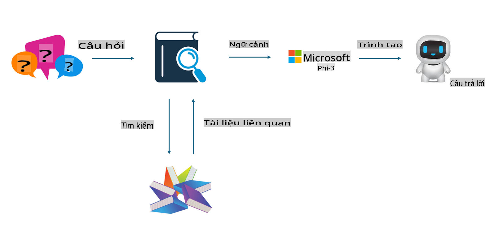

## Tinh chỉnh so với RAG

## Retrieval Augmented Generation

RAG là sự kết hợp giữa truy xuất dữ liệu và tạo văn bản. Dữ liệu có cấu trúc và không có cấu trúc của doanh nghiệp được lưu trữ trong cơ sở dữ liệu vector. Khi tìm kiếm nội dung liên quan, các tóm tắt và nội dung liên quan sẽ được tìm thấy để tạo thành một ngữ cảnh, sau đó kết hợp với khả năng hoàn thiện văn bản của LLM/SLM để tạo ra nội dung.

## Quy trình RAG

## Tinh chỉnh
Tinh chỉnh là việc cải tiến dựa trên một mô hình cụ thể. Không cần bắt đầu từ thuật toán của mô hình, nhưng cần tích lũy dữ liệu liên tục. Nếu bạn muốn có thuật ngữ chính xác hơn và cách diễn đạt ngôn ngữ phù hợp trong các ứng dụng ngành, tinh chỉnh sẽ là lựa chọn tốt hơn. Tuy nhiên, nếu dữ liệu của bạn thay đổi thường xuyên, tinh chỉnh có thể trở nên phức tạp.

## Cách lựa chọn
Nếu câu trả lời của chúng ta cần sử dụng dữ liệu bên ngoài, RAG là lựa chọn tốt nhất.

Nếu bạn cần xuất ra kiến thức ngành ổn định và chính xác, tinh chỉnh sẽ là một lựa chọn tốt. RAG ưu tiên truy xuất nội dung liên quan nhưng có thể không luôn nắm bắt được những chi tiết chuyên biệt.

Tinh chỉnh yêu cầu một tập dữ liệu chất lượng cao, và nếu chỉ có một phạm vi dữ liệu nhỏ, nó sẽ không tạo ra sự khác biệt lớn. RAG linh hoạt hơn.  
Tinh chỉnh giống như một "hộp đen", một điều khó hiểu, và rất khó để hiểu được cơ chế bên trong. Nhưng RAG có thể giúp dễ dàng xác định nguồn dữ liệu, từ đó hiệu quả điều chỉnh các lỗi nội dung hoặc "ảo giác" và cung cấp tính minh bạch tốt hơn.

**Tuyên bố miễn trừ trách nhiệm**:  
Tài liệu này đã được dịch bằng các dịch vụ dịch thuật AI tự động. Mặc dù chúng tôi cố gắng đảm bảo độ chính xác, xin lưu ý rằng các bản dịch tự động có thể chứa lỗi hoặc không chính xác. Tài liệu gốc bằng ngôn ngữ bản địa nên được coi là nguồn thông tin đáng tin cậy nhất. Đối với các thông tin quan trọng, nên sử dụng dịch vụ dịch thuật chuyên nghiệp từ con người. Chúng tôi không chịu trách nhiệm về bất kỳ sự hiểu lầm hoặc diễn giải sai nào phát sinh từ việc sử dụng bản dịch này.