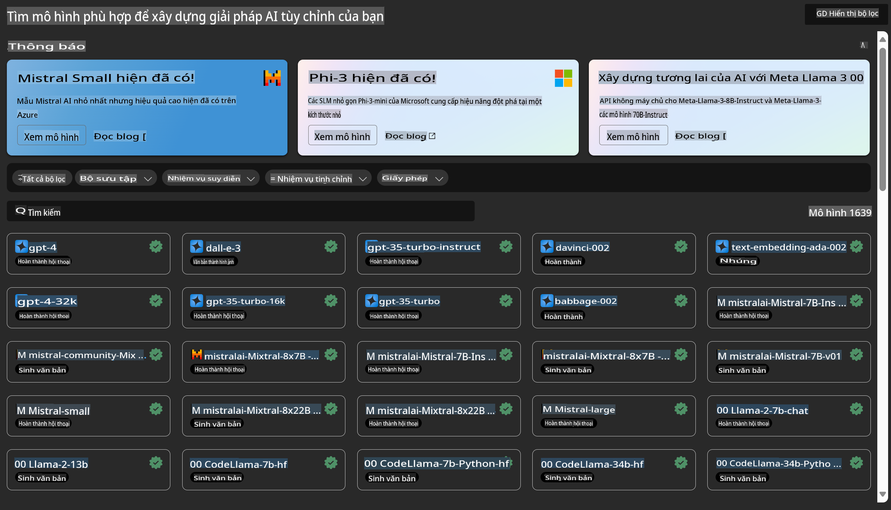

# **Giới thiệu Dịch vụ Azure Machine Learning**

[Azure Machine Learning](https://ml.azure.com?WT.mc_id=aiml-138114-kinfeylo) là một dịch vụ đám mây giúp tăng tốc và quản lý vòng đời dự án học máy (ML).

Các chuyên gia ML, nhà khoa học dữ liệu, và kỹ sư có thể sử dụng nó trong quy trình công việc hàng ngày để:

- Huấn luyện và triển khai mô hình.  
Quản lý các hoạt động học máy (MLOps).  
- Bạn có thể tạo mô hình trong Azure Machine Learning hoặc sử dụng mô hình được xây dựng từ các nền tảng mã nguồn mở như PyTorch, TensorFlow, hoặc scikit-learn.  
- Các công cụ MLOps giúp bạn theo dõi, huấn luyện lại và triển khai lại các mô hình.

## Azure Machine Learning dành cho ai?

**Nhà Khoa học Dữ liệu và Kỹ sư ML**

Họ có thể sử dụng các công cụ để tăng tốc và tự động hóa quy trình công việc hàng ngày.  
Azure ML cung cấp các tính năng về tính công bằng, khả năng giải thích, theo dõi, và kiểm toán.  

**Nhà Phát triển Ứng dụng**

Họ có thể tích hợp các mô hình vào ứng dụng hoặc dịch vụ một cách liền mạch.  

**Nhà Phát triển Nền tảng**

Họ có quyền truy cập vào một bộ công cụ mạnh mẽ được hỗ trợ bởi API Azure Resource Manager bền vững.  
Những công cụ này cho phép xây dựng các công cụ ML tiên tiến.  

**Doanh nghiệp**

Hoạt động trên nền tảng đám mây Microsoft Azure, các doanh nghiệp được hưởng lợi từ các tính năng bảo mật quen thuộc và kiểm soát truy cập dựa trên vai trò.  
Thiết lập các dự án để kiểm soát quyền truy cập vào dữ liệu được bảo vệ và các thao tác cụ thể.

## Năng suất cho mọi thành viên trong nhóm

Các dự án ML thường yêu cầu một nhóm với các kỹ năng đa dạng để xây dựng và duy trì.

Azure ML cung cấp các công cụ cho phép bạn:  
- Cộng tác với nhóm của mình thông qua sổ tay dùng chung, tài nguyên tính toán, tính toán không máy chủ, dữ liệu, và môi trường.  
- Phát triển các mô hình với tính công bằng, khả năng giải thích, theo dõi, và kiểm toán để đáp ứng các yêu cầu tuân thủ về nguồn gốc và kiểm toán.  
- Triển khai các mô hình ML nhanh chóng và dễ dàng ở quy mô lớn, đồng thời quản lý và giám sát chúng hiệu quả với MLOps.  
- Chạy các khối lượng công việc học máy ở bất kỳ đâu với các tính năng quản trị, bảo mật, và tuân thủ tích hợp sẵn.  

## Công cụ nền tảng tương thích đa dạng

Bất kỳ ai trong nhóm ML đều có thể sử dụng các công cụ ưa thích của mình để hoàn thành công việc.  
Dù bạn đang chạy thử nghiệm nhanh, tinh chỉnh siêu tham số, xây dựng pipeline, hay quản lý suy luận, bạn đều có thể sử dụng các giao diện quen thuộc bao gồm:  
- Azure Machine Learning Studio  
- Python SDK (v2)  
- Azure CLI (v2)  
- Azure Resource Manager REST APIs  

Khi bạn tinh chỉnh mô hình và cộng tác trong suốt vòng đời phát triển, bạn có thể chia sẻ và tìm kiếm tài sản, tài nguyên, và số liệu trong giao diện Azure Machine Learning studio.

## **LLM/SLM trong Azure ML**

Azure ML đã bổ sung nhiều chức năng liên quan đến LLM/SLM, kết hợp LLMOps và SLMOps để tạo ra một nền tảng công nghệ trí tuệ nhân tạo tạo sinh cấp doanh nghiệp.

### **Danh mục Mô hình**

Người dùng doanh nghiệp có thể triển khai các mô hình khác nhau dựa trên các kịch bản kinh doanh khác nhau thông qua Danh mục Mô hình và cung cấp dịch vụ dưới dạng Model as Service để các nhà phát triển hoặc người dùng doanh nghiệp truy cập.

Danh mục Mô hình trong Azure Machine Learning studio là trung tâm để khám phá và sử dụng nhiều loại mô hình, cho phép bạn xây dựng các ứng dụng AI tạo sinh. Danh mục mô hình bao gồm hàng trăm mô hình từ các nhà cung cấp mô hình như Azure OpenAI service, Mistral, Meta, Cohere, Nvidia, Hugging Face, bao gồm cả các mô hình được Microsoft đào tạo. Các mô hình từ các nhà cung cấp khác ngoài Microsoft là Sản phẩm Không phải của Microsoft, như được định nghĩa trong Điều khoản Sản phẩm của Microsoft, và tuân theo các điều khoản được cung cấp kèm theo mô hình.

### **Pipeline Công việc**

Cốt lõi của một pipeline học máy là chia một nhiệm vụ học máy hoàn chỉnh thành một quy trình nhiều bước. Mỗi bước là một thành phần có thể quản lý được, có thể được phát triển, tối ưu hóa, cấu hình, và tự động hóa riêng lẻ. Các bước được kết nối thông qua các giao diện được định nghĩa rõ ràng. Dịch vụ pipeline của Azure Machine Learning tự động điều phối tất cả các phụ thuộc giữa các bước trong pipeline.

Trong việc tinh chỉnh SLM / LLM, chúng ta có thể quản lý dữ liệu, quy trình huấn luyện, và quy trình tạo sinh thông qua Pipeline.

### **Prompt flow**

**Lợi ích khi sử dụng Azure Machine Learning prompt flow**  
Azure Machine Learning prompt flow mang lại nhiều lợi ích, giúp người dùng chuyển từ ý tưởng sang thử nghiệm và cuối cùng là các ứng dụng LLM sẵn sàng cho sản xuất:

**Tính linh hoạt trong thiết kế prompt**

- Trải nghiệm soạn thảo tương tác: Azure Machine Learning prompt flow cung cấp biểu diễn trực quan cấu trúc của flow, giúp người dùng dễ dàng hiểu và điều hướng dự án của họ. Nó cũng mang lại trải nghiệm mã hóa giống như sổ tay để phát triển và gỡ lỗi flow hiệu quả.  
- Các biến thể để tinh chỉnh prompt: Người dùng có thể tạo và so sánh nhiều biến thể prompt, tạo điều kiện cho quá trình tinh chỉnh lặp đi lặp lại.  
- Đánh giá: Các flow đánh giá tích hợp sẵn cho phép người dùng đánh giá chất lượng và hiệu quả của các prompt và flow.  
- Tài nguyên toàn diện: Azure Machine Learning prompt flow bao gồm thư viện các công cụ, mẫu, và ví dụ tích hợp sẵn, cung cấp điểm khởi đầu cho phát triển, khơi nguồn sáng tạo và tăng tốc quá trình.  

**Sẵn sàng cho ứng dụng LLM cấp doanh nghiệp**

- Cộng tác: Azure Machine Learning prompt flow hỗ trợ cộng tác nhóm, cho phép nhiều người dùng làm việc cùng nhau trên các dự án thiết kế prompt, chia sẻ kiến thức và duy trì kiểm soát phiên bản.  
- Nền tảng tất cả trong một: Azure Machine Learning prompt flow hợp lý hóa toàn bộ quy trình thiết kế prompt, từ phát triển và đánh giá đến triển khai và giám sát. Người dùng có thể dễ dàng triển khai các flow của mình dưới dạng các endpoint Azure Machine Learning và giám sát hiệu suất của chúng theo thời gian thực, đảm bảo hoạt động tối ưu và cải tiến liên tục.  
- Giải pháp sẵn sàng cho doanh nghiệp của Azure Machine Learning: Prompt flow tận dụng các giải pháp sẵn sàng cho doanh nghiệp mạnh mẽ của Azure Machine Learning, cung cấp nền tảng an toàn, có khả năng mở rộng và đáng tin cậy cho việc phát triển, thử nghiệm và triển khai các flow.

Với Azure Machine Learning prompt flow, người dùng có thể phát huy tính linh hoạt trong thiết kế prompt, cộng tác hiệu quả và tận dụng các giải pháp cấp doanh nghiệp để phát triển và triển khai thành công các ứng dụng dựa trên LLM.

Kết hợp sức mạnh tính toán, dữ liệu, và các thành phần khác của Azure ML, các nhà phát triển doanh nghiệp có thể dễ dàng xây dựng ứng dụng trí tuệ nhân tạo của riêng mình.  

**Tuyên bố miễn trừ trách nhiệm**:  
Tài liệu này đã được dịch bằng các dịch vụ dịch thuật AI tự động. Mặc dù chúng tôi cố gắng đảm bảo độ chính xác, xin lưu ý rằng các bản dịch tự động có thể chứa lỗi hoặc không chính xác. Tài liệu gốc bằng ngôn ngữ ban đầu nên được coi là nguồn thông tin đáng tin cậy nhất. Đối với các thông tin quan trọng, chúng tôi khuyến nghị sử dụng dịch vụ dịch thuật chuyên nghiệp từ con người. Chúng tôi không chịu trách nhiệm về bất kỳ sự hiểu lầm hoặc diễn giải sai nào phát sinh từ việc sử dụng bản dịch này.