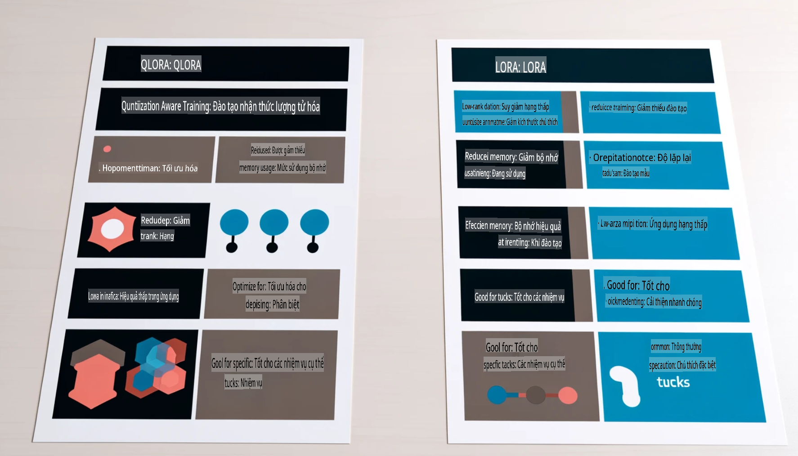

# **Để Phi-3 trở thành chuyên gia trong ngành**

Để đưa mô hình Phi-3 vào một ngành cụ thể, bạn cần thêm dữ liệu kinh doanh ngành vào mô hình Phi-3. Chúng ta có hai lựa chọn khác nhau, đầu tiên là RAG (Retrieval Augmented Generation) và thứ hai là Fine-tuning.

## **RAG và Fine-tuning**

### **Retrieval Augmented Generation**

RAG là sự kết hợp giữa truy xuất dữ liệu và sinh văn bản. Dữ liệu có cấu trúc và không có cấu trúc của doanh nghiệp được lưu trữ trong cơ sở dữ liệu vector. Khi tìm kiếm nội dung liên quan, tóm tắt và nội dung phù hợp sẽ được tìm thấy để tạo thành một ngữ cảnh, sau đó kết hợp với khả năng hoàn thành văn bản của LLM/SLM để tạo ra nội dung.

### **Fine-tuning**

Fine-tuning dựa trên việc cải tiến một mô hình nhất định. Bạn không cần bắt đầu từ thuật toán của mô hình, nhưng cần tích lũy dữ liệu liên tục. Nếu bạn muốn có thuật ngữ và cách diễn đạt ngôn ngữ chính xác hơn trong các ứng dụng ngành, Fine-tuning là lựa chọn tốt hơn. Nhưng nếu dữ liệu của bạn thay đổi thường xuyên, Fine-tuning có thể trở nên phức tạp.

### **Cách lựa chọn**

1. Nếu câu trả lời của chúng ta yêu cầu giới thiệu dữ liệu bên ngoài, RAG là lựa chọn tốt nhất.

2. Nếu bạn cần xuất ra kiến thức ngành ổn định và chính xác, Fine-tuning sẽ là lựa chọn tốt. RAG ưu tiên kéo nội dung liên quan nhưng có thể không luôn chính xác với các chi tiết chuyên môn.

3. Fine-tuning yêu cầu một tập dữ liệu chất lượng cao, và nếu chỉ có một phạm vi dữ liệu nhỏ, nó sẽ không tạo ra nhiều khác biệt. RAG linh hoạt hơn.

4. Fine-tuning là một "hộp đen", một loại hình siêu hình học, và khó để hiểu cơ chế bên trong. Nhưng RAG có thể làm cho việc tìm kiếm nguồn dữ liệu dễ dàng hơn, từ đó hiệu quả trong việc điều chỉnh các lỗi hoặc ảo tưởng nội dung và cung cấp tính minh bạch tốt hơn.

### **Tình huống áp dụng**

1. Các ngành dọc yêu cầu từ vựng và cách diễn đạt chuyên nghiệp cụ thể, ***Fine-tuning*** sẽ là lựa chọn tốt nhất.

2. Hệ thống hỏi đáp, liên quan đến việc tổng hợp các điểm kiến thức khác nhau, ***RAG*** sẽ là lựa chọn tốt nhất.

3. Kết hợp quy trình kinh doanh tự động ***RAG + Fine-tuning*** là lựa chọn tốt nhất.

## **Cách sử dụng RAG**

Cơ sở dữ liệu vector là một tập hợp dữ liệu được lưu trữ dưới dạng toán học. Cơ sở dữ liệu vector giúp các mô hình học máy dễ dàng ghi nhớ các đầu vào trước đó, cho phép học máy được sử dụng để hỗ trợ các trường hợp sử dụng như tìm kiếm, đề xuất và sinh văn bản. Dữ liệu có thể được xác định dựa trên các chỉ số tương tự thay vì các khớp chính xác, cho phép các mô hình máy tính hiểu được ngữ cảnh của dữ liệu.

Cơ sở dữ liệu vector là chìa khóa để thực hiện RAG. Chúng ta có thể chuyển đổi dữ liệu thành lưu trữ vector thông qua các mô hình vector như text-embedding-3, jina-ai-embedding, v.v.

Tìm hiểu thêm về cách tạo ứng dụng RAG [https://github.com/microsoft/Phi-3CookBook](https://github.com/microsoft/Phi-3CookBook?WT.mc_id=aiml-138114-kinfeylo)

## **Cách sử dụng Fine-tuning**

Các thuật toán thường được sử dụng trong Fine-tuning là Lora và QLora. Làm thế nào để lựa chọn?
- [Tìm hiểu thêm với sổ tay mẫu này](../../../../code/04.Finetuning/Phi_3_Inference_Finetuning.ipynb)
- [Ví dụ Python FineTuning mẫu](../../../../code/04.Finetuning/FineTrainingScript.py)

### **Lora và QLora**

LoRA (Low-Rank Adaptation) và QLoRA (Quantized Low-Rank Adaptation) đều là các kỹ thuật được sử dụng để fine-tune các mô hình ngôn ngữ lớn (LLMs) bằng cách sử dụng Fine-tuning hiệu quả tham số (PEFT). Các kỹ thuật PEFT được thiết kế để huấn luyện mô hình hiệu quả hơn so với các phương pháp truyền thống.  
LoRA là một kỹ thuật fine-tuning độc lập, giảm mức sử dụng bộ nhớ bằng cách áp dụng xấp xỉ bậc thấp vào ma trận cập nhật trọng số. Nó cung cấp thời gian huấn luyện nhanh và duy trì hiệu suất gần với các phương pháp fine-tuning truyền thống.  

QLoRA là phiên bản mở rộng của LoRA kết hợp các kỹ thuật lượng tử hóa để giảm thêm mức sử dụng bộ nhớ. QLoRA lượng tử hóa độ chính xác của các tham số trọng số trong LLM đã được huấn luyện trước xuống độ chính xác 4-bit, giúp tiết kiệm bộ nhớ hơn so với LoRA. Tuy nhiên, quá trình huấn luyện QLoRA chậm hơn khoảng 30% so với LoRA do các bước lượng tử hóa và giải lượng tử hóa bổ sung.  

QLoRA sử dụng LoRA như một phụ kiện để sửa các lỗi phát sinh trong quá trình lượng tử hóa. QLoRA cho phép fine-tuning các mô hình lớn với hàng tỷ tham số trên các GPU nhỏ, dễ tiếp cận. Ví dụ, QLoRA có thể fine-tune một mô hình 70B tham số yêu cầu 36 GPU chỉ với 2 GPU.

**Tuyên bố miễn trừ trách nhiệm**:  
Tài liệu này đã được dịch bằng các dịch vụ dịch thuật AI tự động. Mặc dù chúng tôi cố gắng đảm bảo độ chính xác, xin lưu ý rằng các bản dịch tự động có thể chứa lỗi hoặc không chính xác. Tài liệu gốc bằng ngôn ngữ ban đầu nên được coi là nguồn thông tin chính thức. Đối với các thông tin quan trọng, nên sử dụng dịch vụ dịch thuật chuyên nghiệp từ con người. Chúng tôi không chịu trách nhiệm về bất kỳ sự hiểu lầm hoặc diễn giải sai nào phát sinh từ việc sử dụng bản dịch này.