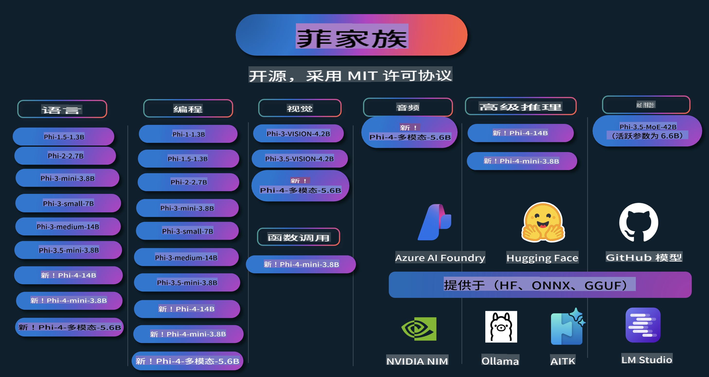

# Phi Cookbook: 使用微软Phi模型的实践指南

  

  
  
  

  
  

Phi 是微软开发的一系列开源AI模型。

Phi 目前是最强大且性价比最高的小型语言模型（SLM），在多语言、推理、文本/聊天生成、代码、图像、音频等场景中表现优异。

您可以将 Phi 部署到云端或边缘设备，并能够在有限的计算资源下轻松构建生成式AI应用程序。

按照以下步骤开始使用这些资源：
1. **Fork 仓库**：点击   
2. **克隆仓库**：`git clone https://github.com/microsoft/PhiCookBook.git`  
3. [**加入微软AI Discord社区，与专家和开发者交流**](https://discord.com/invite/ByRwuEEgH4?WT.mc_id=aiml-137032-kinfeylo)

## 目录

- 介绍
  - [欢迎加入 Phi 家族](./md/01.Introduction/01/01.PhiFamily.md)
  - [设置您的开发环境](./md/01.Introduction/01/01.EnvironmentSetup.md)
  - [了解关键技术](./md/01.Introduction/01/01.Understandingtech.md)
  - [Phi 模型的 AI 安全性](./md/01.Introduction/01/01.AISafety.md)
  - [Phi 的硬件支持](./md/01.Introduction/01/01.Hardwaresupport.md)
  - [Phi 模型及其跨平台可用性](./md/01.Introduction/01/01.Edgeandcloud.md)
  - [使用 Guidance-ai 和 Phi](./md/01.Introduction/01/01.Guidance.md)
  - [GitHub Marketplace 模型](https://github.com/marketplace/models)
  - [Azure AI 模型目录](https://ai.azure.com)

- 在不同环境中推理 Phi
  - [Hugging Face](./md/01.Introduction/02/01.HF.md)
  - [GitHub 模型](./md/01.Introduction/02/02.GitHubModel.md)
  - [Azure AI Foundry 模型目录](./md/01.Introduction/02/03.AzureAIFoundry.md)
  - [Ollama](./md/01.Introduction/02/04.Ollama.md)
  - [AI 工具包 VSCode (AITK)](./md/01.Introduction/02/05.AITK.md)
  - [NVIDIA NIM](./md/01.Introduction/02/06.NVIDIA.md)

- Phi 家族推理
  - [在 iOS 上推理 Phi](./md/01.Introduction/03/iOS_Inference.md)
  - [在 Android 上推理 Phi](./md/01.Introduction/03/Android_Inference.md)
- [在 Jetson 上推理 Phi](./md/01.Introduction/03/Jetson_Inference.md)
    - [在 AI PC 上推理 Phi](./md/01.Introduction/03/AIPC_Inference.md)
    - [使用 Apple MLX 框架推理 Phi](./md/01.Introduction/03/MLX_Inference.md)
    - [在本地服务器上推理 Phi](./md/01.Introduction/03/Local_Server_Inference.md)
    - [使用 AI 工具包在远程服务器上推理 Phi](./md/01.Introduction/03/Remote_Interence.md)
    - [使用 Rust 推理 Phi](./md/01.Introduction/03/Rust_Inference.md)
    - [在本地推理 Phi--Vision](./md/01.Introduction/03/Vision_Inference.md)
    - [使用 Kaito AKS 和 Azure Containers（官方支持）推理 Phi](./md/01.Introduction/03/Kaito_Inference.md)
- [量化 Phi 系列](./md/01.Introduction/04/QuantifyingPhi.md)
    - [使用 llama.cpp 量化 Phi-3.5 / 4](./md/01.Introduction/04/UsingLlamacppQuantifyingPhi.md)
    - [使用 ONNX Runtime 的生成式 AI 扩展量化 Phi-3.5 / 4](./md/01.Introduction/04/UsingORTGenAIQuantifyingPhi.md)
    - [使用 Intel OpenVINO 量化 Phi-3.5 / 4](./md/01.Introduction/04/UsingIntelOpenVINOQuantifyingPhi.md)
    - [使用 Apple MLX 框架量化 Phi-3.5 / 4](./md/01.Introduction/04/UsingAppleMLXQuantifyingPhi.md)

- 评估 Phi
    - [负责任的 AI](./md/01.Introduction/05/ResponsibleAI.md)
    - [使用 Azure AI Foundry 进行评估](./md/01.Introduction/05/AIFoundry.md)
    - [使用 Promptflow 进行评估](./md/01.Introduction/05/Promptflow.md)

- 使用 Azure AI Search 的 RAG
    - [如何在 Azure AI Search 中使用 Phi-4-mini 和 Phi-4-multimodal（RAG）](https://github.com/microsoft/PhiCookBook/blob/main/code/06.E2E/E2E_Phi-4-RAG-Azure-AI-Search.ipynb)

- Phi 应用开发示例
  - 文本与聊天应用
    - Phi-4 示例 🆕
      - [📓] [使用 Phi-4-mini ONNX 模型聊天](./md/02.Application/01.TextAndChat/Phi4/ChatWithPhi4ONNX/README.md)
      - [使用 Phi-4 本地 ONNX 模型的 .NET 聊天应用](../../md/04.HOL/dotnet/src/LabsPhi4-Chat-01OnnxRuntime)
      - [基于语义内核的 Phi-4 ONNX 聊天 .NET 控制台应用](../../md/04.HOL/dotnet/src/LabsPhi4-Chat-02SK)
    - Phi-3 / 3.5 示例
      - [使用 Phi3、ONNX Runtime Web 和 WebGPU 在浏览器中构建本地聊天机器人](https://github.com/microsoft/onnxruntime-inference-examples/tree/main/js/chat)
      - [OpenVino 聊天](./md/02.Application/01.TextAndChat/Phi3/E2E_OpenVino_Chat.md)
      - [多模型 - 交互式 Phi-3-mini 和 OpenAI Whisper](./md/02.Application/01.TextAndChat/Phi3/E2E_Phi-3-mini_with_whisper.md)
      - [MLFlow - 构建包装器并使用 Phi-3 与 MLFlow 集成](./md//02.Application/01.TextAndChat/Phi3/E2E_Phi-3-MLflow.md)
      - [模型优化 - 如何使用 Olive 为 ONNX Runtime Web 优化 Phi-3-mini 模型](https://github.com/microsoft/Olive/tree/main/examples/phi3)
      - [使用 Phi-3 mini-4k-instruct-onnx 的 WinUI3 应用](https://github.com/microsoft/Phi3-Chat-WinUI3-Sample/)
      - [WinUI3 多模型 AI 驱动的笔记应用示例](https://github.com/microsoft/ai-powered-notes-winui3-sample)
      - [微调并集成自定义 Phi-3 模型与 Promptflow](./md/02.Application/01.TextAndChat/Phi3/E2E_Phi-3-FineTuning_PromptFlow_Integration.md)
      - [在 Azure AI Foundry 中微调并集成自定义 Phi-3 模型与 Promptflow](./md/02.Application/01.TextAndChat/Phi3/E2E_Phi-3-FineTuning_PromptFlow_Integration_AIFoundry.md)
      - [在 Azure AI Foundry 中评估微调的 Phi-3 / Phi-3.5 模型，聚焦微软的负责任 AI 原则](./md/02.Application/01.TextAndChat/Phi3/E2E_Phi-3-Evaluation_AIFoundry.md)
- [📓] [Phi-3.5-mini-instruct 语言预测示例（中/英）](../../md/02.Application/01.TextAndChat/Phi3/phi3-instruct-demo.ipynb)
      - [Phi-3.5-Instruct WebGPU RAG 聊天机器人](./md/02.Application/01.TextAndChat/Phi3/WebGPUWithPhi35Readme.md)
      - [使用 Windows GPU 和 Phi-3.5-Instruct ONNX 创建 Prompt Flow 解决方案](./md/02.Application/01.TextAndChat/Phi3/UsingPromptFlowWithONNX.md)
      - [使用 Microsoft Phi-3.5 tflite 创建安卓应用](./md/02.Application/01.TextAndChat/Phi3/UsingPhi35TFLiteCreateAndroidApp.md)
      - [使用 Microsoft.ML.OnnxRuntime 的本地 ONNX Phi-3 模型进行问答 .NET 示例](../../md/04.HOL/dotnet/src/LabsPhi301)
      - [使用 Semantic Kernel 和 Phi-3 的控制台聊天 .NET 应用](../../md/04.HOL/dotnet/src/LabsPhi302)

  - Azure AI 推理 SDK 基于代码的示例
    - Phi-4 示例 🆕
      - [📓] [使用 Phi-4-multimodal 生成项目代码](./md/02.Application/02.Code/Phi4/GenProjectCode/README.md)
    - Phi-3 / 3.5 示例
      - [构建你自己的 Visual Studio Code GitHub Copilot 聊天工具，基于 Microsoft Phi-3 系列](./md/02.Application/02.Code/Phi3/VSCodeExt/README.md)
      - [使用 GitHub 模型和 Phi-3.5 创建你自己的 Visual Studio Code 聊天助手](./md/02.Application/02.Code/Phi3/CreateVSCodeChatAgentWithGitHubModels.md)

  - 高级推理示例
    - Phi-4 示例 🆕
      - [📓] [Phi-4-mini 推理示例](./md/02.Application/03.AdvancedReasoning/Phi4/AdvancedResoningPhi4mini/README.md)
  
  - 演示
      - [托管于 Hugging Face Spaces 的 Phi-4-mini 演示](https://huggingface.co/spaces/microsoft/phi-4-mini?WT.mc_id=aiml-137032-kinfeylo)
      - [托管于 Hugging Face Spaces 的 Phi-4-multimodal 演示](https://huggingface.co/spaces/microsoft/phi-4-multimodal?WT.mc_id=aiml-137032-kinfeylo)
  - 视觉示例
    - Phi-4 示例 🆕
      - [📓] [使用 Phi-4-multimodal 读取图像并生成代码](./md/02.Application/04.Vision/Phi4/CreateFrontend/README.md) 
    - Phi-3 / 3.5 示例
      - [📓][Phi-3-vision-图像文本到文本](../../md/02.Application/04.Vision/Phi3/E2E_Phi-3-vision-image-text-to-text-online-endpoint.ipynb)
      - [Phi-3-vision-ONNX](https://onnxruntime.ai/docs/genai/tutorials/phi3-v.html)
      - [📓][Phi-3-vision CLIP 嵌入](../../md/02.Application/04.Vision/Phi3/E2E_Phi-3-vision-image-text-to-text-online-endpoint.ipynb)
      - [演示：Phi-3 回收](https://github.com/jennifermarsman/PhiRecycling/)
      - [Phi-3-vision - 可视化语言助手 - 使用 Phi3-Vision 和 OpenVINO](https://docs.openvino.ai/nightly/notebooks/phi-3-vision-with-output.html)
      - [Phi-3 Vision Nvidia NIM](./md/02.Application/04.Vision/Phi3/E2E_Nvidia_NIM_Vision.md)
      - [Phi-3 Vision OpenVino](./md/02.Application/04.Vision/Phi3/E2E_OpenVino_Phi3Vision.md)
      - [📓][Phi-3.5 Vision 多帧或多图像示例](../../md/02.Application/04.Vision/Phi3/phi3-vision-demo.ipynb)
      - [使用 Microsoft.ML.OnnxRuntime .NET 的本地 ONNX 模型 Phi-3 Vision](../../md/04.HOL/dotnet/src/LabsPhi303)
      - [基于菜单的 Microsoft.ML.OnnxRuntime .NET 本地 ONNX 模型 Phi-3 Vision](../../md/04.HOL/dotnet/src/LabsPhi304)

  - 音频示例
    - Phi-4 示例 🆕
      - [📓] [使用 Phi-4-multimodal 提取音频转录](./md/02.Application/05.Audio/Phi4/Transciption/README.md)
      - [📓] [Phi-4-multimodal 音频示例](../../md/02.Application/05.Audio/Phi4/Siri/demo.ipynb)
      - [📓] [Phi-4-multimodal 语音翻译示例](../../md/02.Application/05.Audio/Phi4/Translate/demo.ipynb)
      - [.NET 控制台应用程序，使用 Phi-4-multimodal 音频分析音频文件并生成转录](../../md/04.HOL/dotnet/src/LabsPhi4-MultiModal-02Audio)

  - MOE 示例
    - Phi-3 / 3.5 示例
      - [📓] [Phi-3.5 专家混合模型 (MoEs) 社交媒体示例](../../md/02.Application/06.MoE/Phi3/phi3_moe_demo.ipynb)
      - [📓] [构建基于 NVIDIA NIM Phi-3 MOE、Azure AI Search 和 LlamaIndex 的检索增强生成 (RAG) 管道](../../md/02.Application/06.MoE/Phi3/azure-ai-search-nvidia-rag.ipynb)
  - 函数调用示例
    - Phi-4 示例 🆕
      - [📓] [使用 Phi-4-mini 进行函数调用](./md/02.Application/07.FunctionCalling/Phi4/FunctionCallingBasic/README.md)
  - 多模态混合示例
    - Phi-4 示例 🆕
-  [📓] [作为科技记者使用 Phi-4-multimodal](../../md/02.Application/08.Multimodel/Phi4/TechJournalist/phi_4_mm_audio_text_publish_news.ipynb)
      - [.NET 控制台应用程序使用 Phi-4-multimodal 分析图像](../../md/04.HOL/dotnet/src/LabsPhi4-MultiModal-01Images)

- 微调 Phi 示例
  - [微调场景](./md/03.FineTuning/FineTuning_Scenarios.md)
  - [微调与 RAG 对比](./md/03.FineTuning/FineTuning_vs_RAG.md)
  - [微调让 Phi-3 成为行业专家](./md/03.FineTuning/LetPhi3gotoIndustriy.md)
  - [使用 VS Code 的 AI 工具包微调 Phi-3](./md/03.FineTuning/Finetuning_VSCodeaitoolkit.md)
  - [使用 Azure 机器学习服务微调 Phi-3](./md/03.FineTuning/Introduce_AzureML.md)
  - [使用 Lora 微调 Phi-3](./md/03.FineTuning/FineTuning_Lora.md)
  - [使用 QLora 微调 Phi-3](./md/03.FineTuning/FineTuning_Qlora.md)
  - [使用 Azure AI Foundry 微调 Phi-3](./md/03.FineTuning/FineTuning_AIFoundry.md)
  - [使用 Azure ML CLI/SDK 微调 Phi-3](./md/03.FineTuning/FineTuning_MLSDK.md)
  - [使用 Microsoft Olive 微调](./md/03.FineTuning/FineTuning_MicrosoftOlive.md)
  - [Microsoft Olive 微调实践实验](./md/03.FineTuning/olive-lab/readme.md)
  - [使用 Weights and Bias 微调 Phi-3-vision](./md/03.FineTuning/FineTuning_Phi-3-visionWandB.md)
  - [使用 Apple MLX 框架微调 Phi-3](./md/03.FineTuning/FineTuning_MLX.md)
  - [微调 Phi-3-vision（官方支持）](./md/03.FineTuning/FineTuning_Vision.md)
  - [使用 Kaito AKS 和 Azure 容器微调 Phi-3（官方支持）](./md/03.FineTuning/FineTuning_Kaito.md)
  - [微调 Phi-3 和 3.5 Vision](https://github.com/2U1/Phi3-Vision-Finetune)

- 实践实验
  - [探索前沿模型：LLM、SLM、本地开发等](https://github.com/microsoft/aitour-exploring-cutting-edge-models)
  - [释放 NLP 潜力：使用 Microsoft Olive 进行微调](https://github.com/azure/Ignite_FineTuning_workshop)

- 学术研究论文与出版物
  - [《教科书是你所需的一切 II》：phi-1.5 技术报告](https://arxiv.org/abs/2309.05463)
  - [Phi-3 技术报告：在手机上运行的高能力语言模型](https://arxiv.org/abs/2404.14219)
  - [Phi-4 技术报告](https://arxiv.org/abs/2412.08905)
  - [优化小型语言模型以实现车载功能调用](https://arxiv.org/abs/2501.02342)
  - [(WhyPHI) 微调 PHI-3 用于多选题回答：方法、结果与挑战](https://arxiv.org/abs/2501.01588)

## 使用 Phi 模型

### Phi 在 Azure AI Foundry 上

你可以学习如何使用 Microsoft Phi 并在不同的硬件设备上构建端到端解决方案。要亲身体验 Phi，可以通过[Azure AI Foundry Azure AI 模型目录](https://aka.ms/phi3-azure-ai)探索模型并根据你的场景自定义 Phi。你可以在[Azure AI Foundry 快速入门](/md/02.QuickStart/AzureAIFoundry_QuickStart.md)中了解更多。

**体验平台**
每个模型都有专属的体验平台用于测试：[Azure AI Playground](https://aka.ms/try-phi3)。

### Phi 在 GitHub 模型上

你可以学习如何使用 Microsoft Phi 并在不同的硬件设备上构建端到端解决方案。要亲身体验 Phi，可以通过[GitHub 模型目录](https://github.com/marketplace/models?WT.mc_id=aiml-137032-kinfeylo)探索模型并根据你的场景自定义 Phi。你可以在[GitHub 模型目录快速入门](/md/02.QuickStart/GitHubModel_QuickStart.md)中了解更多。

**体验平台**
每个模型都有一个专属的[模型测试平台](/md/02.QuickStart/GitHubModel_QuickStart.md)。

### Hugging Face 上的 Phi

你也可以在 [Hugging Face](https://huggingface.co/microsoft) 上找到该模型。

**测试平台**  
[Hugging Chat 测试平台](https://huggingface.co/chat/models/microsoft/Phi-3-mini-4k-instruct)

## 负责任的 AI

微软致力于帮助客户负责任地使用我们的 AI 产品，分享我们的经验，并通过透明度说明和影响评估等工具构建基于信任的合作伙伴关系。许多相关资源可以在 [https://aka.ms/RAI](https://aka.ms/RAI) 找到。  
微软的负责任 AI 方法基于我们的 AI 原则：公平性、可靠性与安全性、隐私与安全性、包容性、透明性和问责制。

大规模的自然语言、图像和语音模型（如本示例中使用的模型）可能会以不公平、不可靠或冒犯的方式运行，从而造成伤害。请参考 [Azure OpenAI 服务透明度说明](https://learn.microsoft.com/legal/cognitive-services/openai/transparency-note?tabs=text)，了解相关风险和限制。

减轻这些风险的推荐方法是在您的架构中包含一个安全系统，用于检测和防止有害行为。[Azure AI 内容安全](https://learn.microsoft.com/azure/ai-services/content-safety/overview) 提供了一个独立的保护层，可以检测应用程序和服务中用户生成和 AI 生成的有害内容。Azure AI 内容安全包括文本和图像 API，能够检测有害材料。在 Azure AI Foundry 中，内容安全服务允许您查看、探索并试用检测不同模态有害内容的示例代码。以下[快速入门文档](https://learn.microsoft.com/azure/ai-services/content-safety/quickstart-text?tabs=visual-studio%2Clinux&pivots=programming-language-rest)将指导您如何向该服务发送请求。

另一个需要考虑的方面是整体应用程序性能。对于多模态和多模型应用程序，性能意味着系统表现符合您和用户的期望，包括不生成有害输出。评估整体应用程序性能时，可以使用 [性能和质量及风险与安全评估工具](https://learn.microsoft.com/azure/ai-studio/concepts/evaluation-metrics-built-in)。此外，您还可以创建和评估[自定义评估工具](https://learn.microsoft.com/azure/ai-studio/how-to/develop/evaluate-sdk#custom-evaluators)。

您可以在开发环境中使用 [Azure AI Evaluation SDK](https://microsoft.github.io/promptflow/index.html) 评估您的 AI 应用程序。通过测试数据集或目标，您的生成式 AI 应用程序的生成结果可以通过内置评估工具或您选择的自定义评估工具进行定量测量。要开始使用 Azure AI Evaluation SDK 评估您的系统，可以参考[快速入门指南](https://learn.microsoft.com/azure/ai-studio/how-to/develop/flow-evaluate-sdk)。完成评估运行后，您可以[在 Azure AI Foundry 中可视化结果](https://learn.microsoft.com/azure/ai-studio/how-to/evaluate-flow-results)。

## 商标

本项目可能包含项目、产品或服务的商标或标志。经授权使用微软商标或标志需遵守并符合[微软商标和品牌指南](https://www.microsoft.com/legal/intellectualproperty/trademarks/usage/general)。  
在修改版本的项目中使用微软商标或标志不得引起混淆或暗示微软的赞助。任何第三方商标或标志的使用需遵守该第三方的相关政策。

**免责声明**：  
本文件是使用基于机器的人工智能翻译服务翻译的。尽管我们努力确保翻译的准确性，但请注意，自动翻译可能包含错误或不准确之处。应以原文的母语版本作为权威来源。对于关键信息，建议寻求专业人工翻译。对于因使用本翻译而引起的任何误解或误读，我们概不负责。