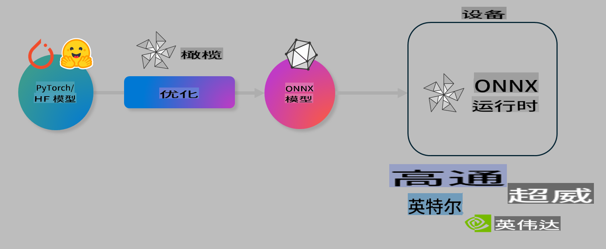

# 实验：优化 AI 模型以适应设备端推理

## 简介

> [!IMPORTANT]  
> 本实验需要一块 **Nvidia A10 或 A100 GPU**，并安装相关驱动程序和 CUDA 工具包（版本 12 及以上）。

> [!NOTE]  
> 这是一个 **35 分钟** 的实验，将通过实践向您介绍如何使用 OLIVE 优化模型以适应设备端推理的核心概念。

## 学习目标

完成本实验后，您将能够使用 OLIVE 来：

- 使用 AWQ 量化方法对 AI 模型进行量化。
- 为特定任务微调 AI 模型。
- 生成 LoRA 适配器（微调模型），以便在 ONNX Runtime 上实现高效的设备端推理。

### 什么是 Olive

Olive (*O*NNX *live*) 是一个模型优化工具包，附带 CLI，可帮助您为 ONNX Runtime +++https://onnxruntime.ai+++ 部署高质量和高性能的模型。



Olive 的输入通常是一个 PyTorch 或 Hugging Face 模型，输出是一个优化后的 ONNX 模型，该模型将在运行 ONNX Runtime 的设备（部署目标）上执行。Olive 会针对硬件供应商（如 Qualcomm、AMD、Nvidia 或 Intel）提供的部署目标的 AI 加速器（NPU、GPU、CPU）优化模型。

Olive 执行一个 *工作流*，即一系列有序的模型优化任务，称为 *passes*。例如，模型压缩、图捕获、量化、图优化等都是 pass。每个 pass 都有一组参数，可以调整以实现最佳的指标（如准确性和延迟），这些指标由相应的评估器评估。Olive 使用搜索算法来自动调整每个 pass 或多个 pass 的组合，以实现最佳性能。

#### Olive 的优势

- **减少挫折感和时间**：通过自动化搜索替代手动尝试各种图优化、压缩和量化技术的反复试验。您只需定义质量和性能约束，Olive 会为您自动找到最佳模型。
- **40 多种内置模型优化组件**：涵盖量化、压缩、图优化和微调的前沿技术。
- **易用的 CLI**：适用于常见的模型优化任务。例如，`olive quantize`、`olive auto-opt`、`olive finetune`。
- 内置模型打包和部署功能。
- 支持生成用于 **多 LoRA 服务** 的模型。
- 使用 YAML/JSON 构建工作流，以协调模型优化和部署任务。
- 与 **Hugging Face** 和 **Azure AI** 集成。
- 内置 **缓存** 机制以 **节省成本**。

## 实验说明

> [!NOTE]  
> 请确保您已按照实验 1 的要求，配置了 Azure AI Hub 和项目，并设置了 A100 计算资源。

### 第 0 步：连接到 Azure AI 计算实例

您将通过 **VS Code** 的远程功能连接到 Azure AI 计算实例。

1. 打开 **VS Code** 桌面应用程序：
2. 使用 **Shift+Ctrl+P** 打开 **命令面板**。
3. 在命令面板中搜索 **AzureML - remote: Connect to compute instance in New Window**。
4. 按照屏幕上的说明连接到计算实例。这包括选择您的 Azure 订阅、资源组、项目和在实验 1 中设置的计算名称。
5. 一旦连接到 Azure ML 计算节点，您将在 **VS Code 左下角** 看到连接状态 `><Azure ML: Compute Name`。

### 第 1 步：克隆此代码库

在 VS Code 中，您可以使用 **Ctrl+J** 打开一个新终端并克隆此代码库：

在终端中，您应该看到提示：

```
azureuser@computername:~/cloudfiles/code$ 
```  
克隆解决方案：

```bash
cd ~/localfiles
git clone https://github.com/microsoft/phi-3cookbook.git
```  

### 第 2 步：在 VS Code 中打开文件夹

要在相关文件夹中打开 VS Code，请在终端中执行以下命令，这将打开一个新窗口：

```bash
code phi-3cookbook/code/04.Finetuning/Olive-lab
```  

或者，您也可以通过选择 **文件** > **打开文件夹** 来打开文件夹。

### 第 3 步：安装依赖项

在 Azure AI 计算实例的 VS Code 中打开一个终端窗口（提示：**Ctrl+J**），并执行以下命令安装依赖项：

```bash
conda create -n olive-ai python=3.11 -y
conda activate olive-ai
pip install -r requirements.txt
az extension remove -n azure-cli-ml
az extension add -n ml
```  

> [!NOTE]  
> 安装所有依赖项大约需要 5 分钟。

在此实验中，您将从 Azure AI 模型目录下载和上传模型。为了访问模型目录，您需要使用以下命令登录 Azure：

```bash
az login
```  

> [!NOTE]  
> 登录时系统会要求您选择订阅。请确保选择实验提供的订阅。

### 第 4 步：执行 Olive 命令

在 Azure AI 计算实例的 VS Code 中打开一个终端窗口（提示：**Ctrl+J**），并确保已激活 `olive-ai` conda 环境：

```bash
conda activate olive-ai
```  

接下来，在命令行中执行以下 Olive 命令。

1. **检查数据：** 在此示例中，您将微调 Phi-3.5-Mini 模型，使其专注于回答与旅行相关的问题。以下代码显示数据集的前几条记录，这些记录是 JSON 行格式：

    ```bash
    head data/data_sample_travel.jsonl
    ```  

2. **量化模型：** 在训练模型之前，您需要使用以下命令进行量化，该命令采用了一种称为 Active Aware Quantization (AWQ) 的技术 +++https://arxiv.org/abs/2306.00978+++。AWQ 根据推理过程中生成的激活值对模型的权重进行量化。这意味着量化过程考虑了激活中的实际数据分布，与传统的权重量化方法相比，能够更好地保持模型的准确性。

    ```bash
    olive quantize \
       --model_name_or_path microsoft/Phi-3.5-mini-instruct \
       --trust_remote_code \
       --algorithm awq \
       --output_path models/phi/awq \
       --log_level 1
    ```  

    完成 AWQ 量化大约需要 **8 分钟**，这将 **将模型大小从约 7.5GB 减少到约 2.5GB**。

    在本实验中，我们将向您展示如何从 Hugging Face 导入模型（例如：`microsoft/Phi-3.5-mini-instruct`). However, Olive also allows you to input models from the Azure AI catalog by updating the `model_name_or_path` argument to an Azure AI asset ID (for example:  `azureml://registries/azureml/models/Phi-3.5-mini-instruct/versions/4`). 

1. **Train the model:** Next, the `olive finetune` 命令微调量化后的模型。在量化后而非之前进行微调，可以通过微调过程恢复部分量化损失，从而获得更好的准确性。

    ```bash
    olive finetune \
        --method lora \
        --model_name_or_path models/phi/awq \
        --data_files "data/data_sample_travel.jsonl" \
        --data_name "json" \
        --text_template "<|user|>\n{prompt}<|end|>\n<|assistant|>\n{response}<|end|>" \
        --max_steps 100 \
        --output_path ./models/phi/ft \
        --log_level 1
    ```  

    微调大约需要 **6 分钟**（100 步）。

3. **优化模型：** 在模型训练完成后，您可以使用 Olive 的 `auto-opt` command, which will capture the ONNX graph and automatically perform a number of optimizations to improve the model performance for CPU by compressing the model and doing fusions. It should be noted, that you can also optimize for other devices such as NPU or GPU by just updating the `--device` and `--provider` 参数优化模型。但在本实验中，我们将使用 CPU。

    ```bash
    olive auto-opt \
       --model_name_or_path models/phi/ft/model \
       --adapter_path models/phi/ft/adapter \
       --device cpu \
       --provider CPUExecutionProvider \
       --use_ort_genai \
       --output_path models/phi/onnx-ao \
       --log_level 1
    ```  

    优化大约需要 **5 分钟**。

### 第 5 步：快速测试模型推理

要测试模型推理，请在文件夹中创建一个名为 **app.py** 的 Python 文件，并复制粘贴以下代码：

```python
import onnxruntime_genai as og
import numpy as np

print("loading model and adapters...", end="", flush=True)
model = og.Model("models/phi/onnx-ao/model")
adapters = og.Adapters(model)
adapters.load("models/phi/onnx-ao/model/adapter_weights.onnx_adapter", "travel")
print("DONE!")

tokenizer = og.Tokenizer(model)
tokenizer_stream = tokenizer.create_stream()

params = og.GeneratorParams(model)
params.set_search_options(max_length=100, past_present_share_buffer=False)
user_input = "what is the best thing to see in chicago"
params.input_ids = tokenizer.encode(f"<|user|>\n{user_input}<|end|>\n<|assistant|>\n")

generator = og.Generator(model, params)

generator.set_active_adapter(adapters, "travel")

print(f"{user_input}")

while not generator.is_done():
    generator.compute_logits()
    generator.generate_next_token()

    new_token = generator.get_next_tokens()[0]
    print(tokenizer_stream.decode(new_token), end='', flush=True)

print("\n")
```  

使用以下命令执行代码：

```bash
python app.py
```  

### 第 6 步：将模型上传到 Azure AI

将模型上传到 Azure AI 模型库可以使团队中的其他成员共享模型，同时也便于模型的版本控制。要上传模型，请运行以下命令：

> [!NOTE]  
> 更新 `{}` placeholders with the name of your resource group and Azure AI Project Name. 

To find your resource group `"resourceGroup"` 和 Azure AI 项目名称，然后运行以下命令：

```
az ml workspace show
```  

或者，您也可以访问 +++ai.azure.com+++，选择 **管理中心** > **项目** > **概览**。

更新 `{}` 占位符为您的资源组名称和 Azure AI 项目名称。

```bash
az ml model create \
    --name ft-for-travel \
    --version 1 \
    --path ./models/phi/onnx-ao \
    --resource-group {RESOURCE_GROUP_NAME} \
    --workspace-name {PROJECT_NAME}
```  
然后，您可以在 https://ml.azure.com/model/list 查看已上传的模型并进行部署。

**免责声明**：  
本文件使用基于机器的人工智能翻译服务翻译而成。尽管我们努力确保翻译的准确性，但请注意，自动翻译可能包含错误或不准确之处。应以原始语言的文件作为权威来源。对于关键信息，建议使用专业人工翻译。因使用本翻译而导致的任何误解或误读，我们概不负责。