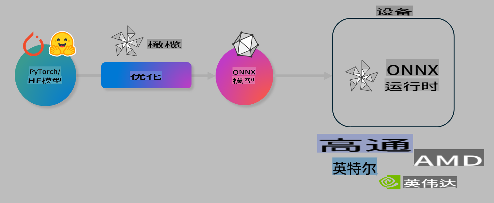

# 实验. 优化AI模型以进行设备上的推理

## 介绍

> [!IMPORTANT]
> 本实验需要安装带有相关驱动程序和CUDA工具包（版本12+）的**Nvidia A10或A100 GPU**。

> [!NOTE]
> 这是一个**35分钟**的实验，将通过实践介绍使用OLIVE优化设备上推理模型的核心概念。

## 学习目标

通过本实验，您将能够使用OLIVE：

- 使用AWQ量化方法对AI模型进行量化。
- 针对特定任务微调AI模型。
- 生成LoRA适配器（微调模型），以便在ONNX Runtime上进行高效的设备推理。

### 什么是Olive

Olive (*O*NNX *live*) 是一个模型优化工具包，配有CLI，使您能够为ONNX runtime +++https://onnxruntime.ai+++ 提供高质量和高性能的模型。



Olive的输入通常是一个PyTorch或Hugging Face模型，输出是一个在运行ONNX runtime的设备（部署目标）上执行的优化ONNX模型。Olive会根据硬件供应商（如Qualcomm、AMD、Nvidia或Intel）提供的AI加速器（NPU、GPU、CPU）来优化模型。

Olive执行一个*工作流*，这是一个按顺序排列的单个模型优化任务的序列，称为*passes* - 示例passes包括：模型压缩、图捕获、量化、图优化。每个pass都有一组参数，可以调整以达到最佳的指标，例如准确性和延迟，由相应的评估器评估。Olive使用搜索策略，通过搜索算法自动调整每个pass或一组passes。

#### Olive的好处

- **减少**通过不同技术进行图优化、压缩和量化的**试错实验的挫败感和时间**。定义您的质量和性能约束，让Olive自动为您找到最佳模型。
- **40多个内置模型优化组件**，涵盖量化、压缩、图优化和微调的前沿技术。
- **易于使用的CLI**，用于常见的模型优化任务。例如，olive quantize, olive auto-opt, olive finetune。
- 内置模型打包和部署。
- 支持生成用于**多LoRA服务**的模型。
- 使用YAML/JSON构建工作流，以协调模型优化和部署任务。
- **Hugging Face**和**Azure AI**集成。
- 内置**缓存**机制以**节省成本**。

## 实验说明
> [!NOTE]
> 请确保您已按照实验1的要求，配置了Azure AI Hub和项目，并设置了A100计算。

### 第0步：连接到您的Azure AI计算

您将使用**VS Code**中的远程功能连接到Azure AI计算。

1. 打开您的**VS Code**桌面应用程序：
1. 使用**Shift+Ctrl+P**打开**命令面板**
1. 在命令面板中搜索**AzureML - remote: Connect to compute instance in New Window**。
1. 按照屏幕上的说明连接到计算。这将涉及选择您在实验1中设置的Azure订阅、资源组、项目和计算名称。
1. 连接到Azure ML计算节点后，这将在**Visual Code的左下角**显示 `><Azure ML: Compute Name`

### 第1步：克隆此存储库

在VS Code中，您可以使用**Ctrl+J**打开一个新终端并克隆此存储库：

在终端中您应该看到提示

```
azureuser@computername:~/cloudfiles/code$ 
```
克隆解决方案

```bash
cd ~/localfiles
git clone https://github.com/microsoft/phi-3cookbook.git
```

### 第2步：在VS Code中打开文件夹

要在相关文件夹中打开VS Code，请在终端中执行以下命令，这将打开一个新窗口：

```bash
code phi-3cookbook/code/04.Finetuning/Olive-lab
```

或者，您可以通过选择**文件** > **打开文件夹**来打开文件夹。

### 第3步：依赖项

在VS Code中的Azure AI计算实例中打开一个终端窗口（提示：**Ctrl+J**），并执行以下命令以安装依赖项：

```bash
conda create -n olive-ai python=3.11 -y
conda activate olive-ai
pip install -r requirements.txt
az extension remove -n azure-cli-ml
az extension add -n ml
```

> [!NOTE]
> 安装所有依赖项大约需要5分钟。

在本实验中，您将下载和上传模型到Azure AI模型目录。为了访问模型目录，您需要使用以下命令登录Azure：

```bash
az login
```

> [!NOTE]
> 在登录时，您将被要求选择您的订阅。请确保将订阅设置为本实验提供的订阅。

### 第4步：执行Olive命令

在VS Code中的Azure AI计算实例中打开一个终端窗口（提示：**Ctrl+J**），并确保激活`olive-ai` conda环境：

```bash
conda activate olive-ai
```

接下来，在命令行中执行以下Olive命令。

1. **检查数据：** 在此示例中，您将微调Phi-3.5-Mini模型，使其专门回答与旅行相关的问题。以下代码显示数据集的前几条记录，这些记录是JSON行格式：
   
    ```bash
    head data/data_sample_travel.jsonl
    ```
1. **量化模型：** 在训练模型之前，您首先使用一种称为主动感知量化（AWQ）的技术进行量化 +++https://arxiv.org/abs/2306.00978+++. AWQ通过考虑推理期间产生的激活来量化模型的权重。这意味着量化过程会考虑激活中的实际数据分布，与传统的权重量化方法相比，能更好地保留模型的准确性。
    
    ```bash
    olive quantize \
       --model_name_or_path microsoft/Phi-3.5-mini-instruct \
       --trust_remote_code \
       --algorithm awq \
       --output_path models/phi/awq \
       --log_level 1
    ```
    
    完成AWQ量化大约需要8分钟，这将**将模型大小从约7.5GB减少到约2.5GB**。
   
    在本实验中，我们向您展示如何从Hugging Face输入模型（例如：`microsoft/Phi-3.5-mini-instruct`). However, Olive also allows you to input models from the Azure AI catalog by updating the `model_name_or_path` argument to an Azure AI asset ID (for example:  `azureml://registries/azureml/models/Phi-3.5-mini-instruct/versions/4`). 

1. **Train the model:** Next, the `olive finetune`命令微调量化模型。量化模型*之前*的微调而不是之后，可以获得更好的准确性，因为微调过程可以恢复一些量化带来的损失。
    
    ```bash
    olive finetune \
        --method lora \
        --model_name_or_path models/phi/awq \
        --data_files "data/data_sample_travel.jsonl" \
        --data_name "json" \
        --text_template "<|user|>\n{prompt}<|end|>\n<|assistant|>\n{response}<|end|>" \
        --max_steps 100 \
        --output_path ./models/phi/ft \
        --log_level 1
    ```
    
    完成微调（100步）大约需要6分钟。

1. **优化：** 训练好模型后，您现在使用Olive的`auto-opt` command, which will capture the ONNX graph and automatically perform a number of optimizations to improve the model performance for CPU by compressing the model and doing fusions. It should be noted, that you can also optimize for other devices such as NPU or GPU by just updating the `--device` and `--provider`参数优化模型 - 但为了本实验的目的，我们将使用CPU。

    ```bash
    olive auto-opt \
       --model_name_or_path models/phi/ft/model \
       --adapter_path models/phi/ft/adapter \
       --device cpu \
       --provider CPUExecutionProvider \
       --use_ort_genai \
       --output_path models/phi/onnx-ao \
       --log_level 1
    ```
    
    完成优化大约需要5分钟。

### 第5步：模型推理快速测试

要测试模型的推理，请在您的文件夹中创建一个名为**app.py**的Python文件，并复制粘贴以下代码：

```python
import onnxruntime_genai as og
import numpy as np

print("loading model and adapters...", end="", flush=True)
model = og.Model("models/phi/onnx-ao/model")
adapters = og.Adapters(model)
adapters.load("models/phi/onnx-ao/model/adapter_weights.onnx_adapter", "travel")
print("DONE!")

tokenizer = og.Tokenizer(model)
tokenizer_stream = tokenizer.create_stream()

params = og.GeneratorParams(model)
params.set_search_options(max_length=100, past_present_share_buffer=False)
user_input = "what is the best thing to see in chicago"
params.input_ids = tokenizer.encode(f"<|user|>\n{user_input}<|end|>\n<|assistant|>\n")

generator = og.Generator(model, params)

generator.set_active_adapter(adapters, "travel")

print(f"{user_input}")

while not generator.is_done():
    generator.compute_logits()
    generator.generate_next_token()

    new_token = generator.get_next_tokens()[0]
    print(tokenizer_stream.decode(new_token), end='', flush=True)

print("\n")
```

使用以下命令执行代码：

```bash
python app.py
```

### 第6步：将模型上传到Azure AI

将模型上传到Azure AI模型存储库，使得开发团队的其他成员可以共享模型，并且还可以处理模型的版本控制。要上传模型，请运行以下命令：

> [!NOTE]
> 更新`{}` placeholders with the name of your resource group and Azure AI Project Name. 

To find your resource group `"resourceGroup"和Azure AI项目名称，运行以下命令

```
az ml workspace show
```

或者，您可以访问+++ai.azure.com+++，选择**管理中心** **项目** **概览**

用您的资源组名称和Azure AI项目名称更新`{}`占位符。

```bash
az ml model create \
    --name ft-for-travel \
    --version 1 \
    --path ./models/phi/onnx-ao \
    --resource-group {RESOURCE_GROUP_NAME} \
    --workspace-name {PROJECT_NAME}
```
然后，您可以在https://ml.azure.com/model/list 查看上传的模型并部署您的模型。

**免责声明**:
本文档已使用基于机器的AI翻译服务进行翻译。虽然我们努力确保准确性，但请注意，自动翻译可能包含错误或不准确之处。应将原始文档的母语版本视为权威来源。对于关键信息，建议使用专业的人类翻译。我们不对因使用此翻译而产生的任何误解或误读承担责任。