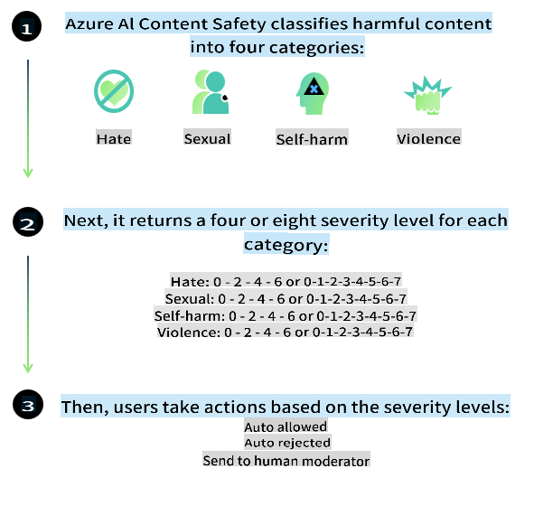
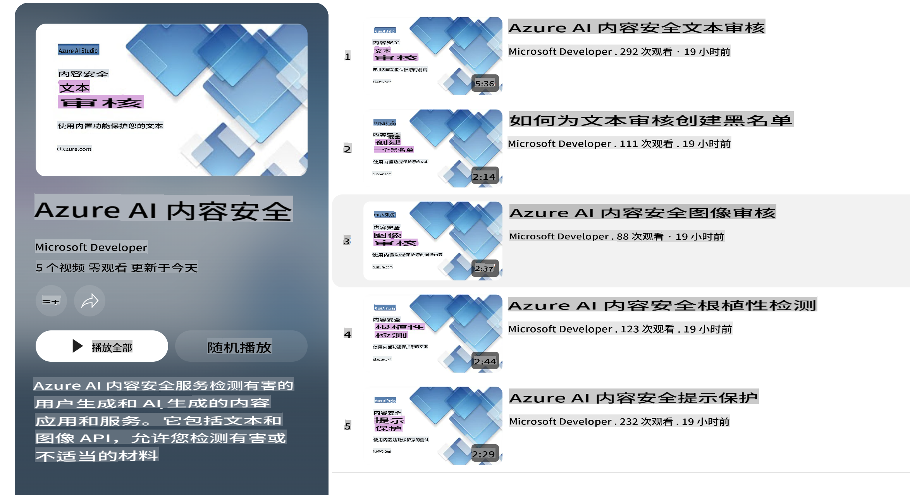

# Phi-3 模型的 AI 安全性
Phi-3 系列模型依据 [Microsoft Responsible AI Standard](https://query.prod.cms.rt.microsoft.com/cms/api/am/binary/RE5cmFl) 开发，该标准是基于以下六项原则的公司范围内的要求：问责、透明、公平、可靠与安全、隐私与安全以及包容性，这些原则构成了 [Microsoft 的负责任 AI 原则](https://www.microsoft.com/ai/responsible-ai)。

与之前的 Phi-3 模型一样，采用了多方面的安全评估和安全后训练方法，并采取了额外措施来考虑此次发布的多语言能力。我们的安全训练和评估方法，包括跨多种语言和风险类别的测试，详见 [Phi-3 Safety Post-Training Paper](https://arxiv.org/abs/2407.13833)。虽然 Phi-3 模型受益于这种方法，开发人员仍应应用负责任的 AI 最佳实践，包括映射、测量和缓解与其特定使用案例及文化和语言背景相关的风险。

## 最佳实践

与其他模型一样，Phi 系列模型可能会表现出不公平、不可靠或冒犯性的行为。

需要注意的一些 SLM 和 LLM 限制行为包括：

- **服务质量:** Phi 模型主要在英文文本上进行训练。非英文语言的表现会较差，训练数据中代表性较少的英语变体的表现可能比标准美式英语差。
- **伤害表现和刻板印象的延续:** 这些模型可能会过度或不足地代表某些人群，抹去某些群体的代表性，或强化贬低或负面的刻板印象。尽管进行了安全后训练，由于不同群体的代表性水平不同或训练数据中反映现实模式和社会偏见的负面刻板印象实例的普遍性，这些限制可能仍然存在。
- **不适当或冒犯性内容:** 这些模型可能会生成其他类型的不适当或冒犯性内容，这可能使其在没有针对具体使用案例的额外缓解措施的情况下不适合用于敏感环境。
- **信息可靠性:** 语言模型可能会生成无意义的内容或捏造听起来合理但实际上不准确或过时的内容。
- **代码的有限范围:** Phi-3 的大部分训练数据基于 Python，并使用常见的包如 "typing, math, random, collections, datetime, itertools"。如果模型生成的 Python 脚本使用了其他包或其他语言的脚本，我们强烈建议用户手动验证所有 API 使用情况。

开发人员应应用负责任的 AI 最佳实践，并确保特定使用案例符合相关法律法规（如隐私、贸易等）。

## 负责任的 AI 考虑

与其他语言模型一样，Phi 系列模型可能会表现出不公平、不可靠或冒犯性的行为。需要注意的一些限制行为包括：

**服务质量:** Phi 模型主要在英文文本上进行训练。非英文语言的表现会较差，训练数据中代表性较少的英语变体的表现可能比标准美式英语差。

**伤害表现和刻板印象的延续:** 这些模型可能会过度或不足地代表某些人群，抹去某些群体的代表性，或强化贬低或负面的刻板印象。尽管进行了安全后训练，由于不同群体的代表性水平不同或训练数据中反映现实模式和社会偏见的负面刻板印象实例的普遍性，这些限制可能仍然存在。

**不适当或冒犯性内容:** 这些模型可能会生成其他类型的不适当或冒犯性内容，这可能使其在没有针对具体使用案例的额外缓解措施的情况下不适合用于敏感环境。
信息可靠性: 语言模型可能会生成无意义的内容或捏造听起来合理但实际上不准确或过时的内容。

**代码的有限范围:** Phi-3 的大部分训练数据基于 Python，并使用常见的包如 "typing, math, random, collections, datetime, itertools"。如果模型生成的 Python 脚本使用了其他包或其他语言的脚本，我们强烈建议用户手动验证所有 API 使用情况。

开发人员应应用负责任的 AI 最佳实践，并确保特定使用案例符合相关法律法规（如隐私、贸易等）。重要的考虑领域包括：

**分配:** 模型可能不适用于可能对法律地位或资源或生活机会的分配（如住房、就业、信贷等）产生重要影响的场景，除非进行了进一步评估和额外的去偏技术。

**高风险场景:** 开发人员应评估在高风险场景中使用模型的适用性，其中不公平、不可靠或冒犯性的输出可能会带来极高的成本或导致伤害。这包括在敏感或专业领域提供建议的场景，其中准确性和可靠性至关重要（如法律或健康建议）。应根据部署上下文在应用层面实施额外的保障措施。

**错误信息:** 模型可能会生成不准确的信息。开发人员应遵循透明度最佳实践，并告知最终用户他们正在与 AI 系统互动。在应用层面，开发人员可以构建反馈机制和管道，将响应建立在特定使用案例的上下文信息上，这是一种称为检索增强生成（RAG）的技术。

**有害内容的生成:** 开发人员应根据其上下文评估输出，并使用适合其使用案例的可用安全分类器或定制解决方案。

**滥用:** 其他形式的滥用如欺诈、垃圾邮件或恶意软件生成可能会发生，开发人员应确保其应用程序不违反适用的法律法规。

### 微调和 AI 内容安全

在对模型进行微调后，我们强烈建议利用 [Azure AI Content Safety](https://learn.microsoft.com/azure/ai-services/content-safety/overview) 措施来监控模型生成的内容，识别并阻止潜在的风险、威胁和质量问题。

[Azure AI Content Safety](https://learn.microsoft.com/azure/ai-services/content-safety/overview) 支持文本和图像内容。它可以部署在云端、断开连接的容器和边缘/嵌入式设备上。

## Azure AI 内容安全概述

Azure AI Content Safety 不是一刀切的解决方案；它可以根据企业的具体政策进行定制。此外，其多语言模型使其能够同时理解多种语言。

- **Azure AI Content Safety**
- **Microsoft Developer**
- **5 videos**

Azure AI 内容安全服务检测应用程序和服务中用户生成和 AI 生成的有害内容。它包括文本和图像 API，允许您检测有害或不适当的材料。

[AI Content Safety 播放列表](https://www.youtube.com/playlist?list=PLlrxD0HtieHjaQ9bJjyp1T7FeCbmVcPkQ)

免责声明：此翻译由AI模型从原文翻译而来，可能不够完美。请审核输出内容并进行必要的修改。