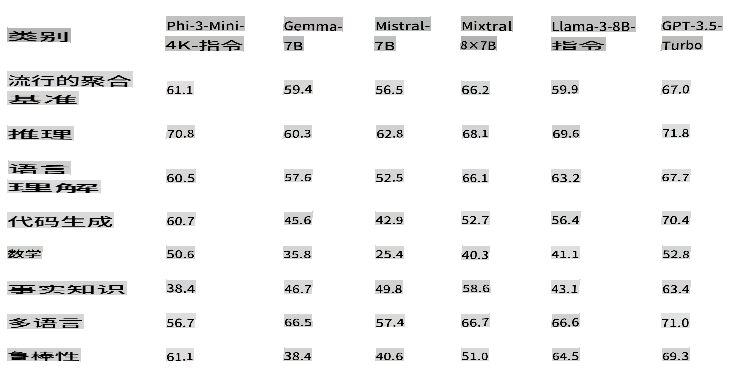
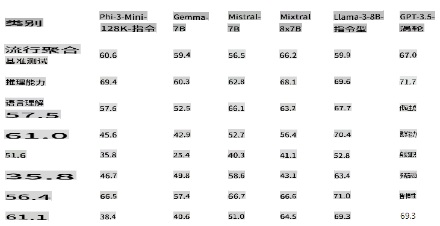
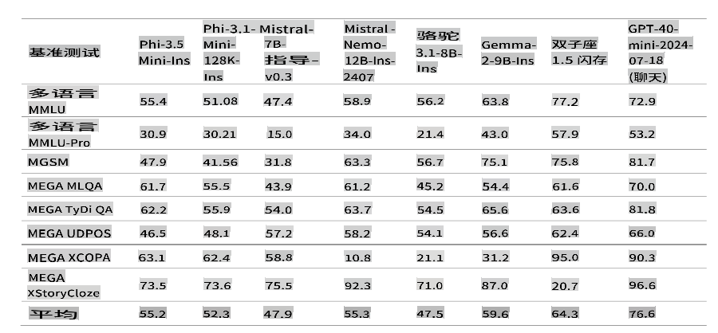
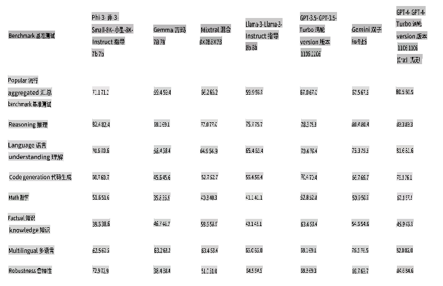
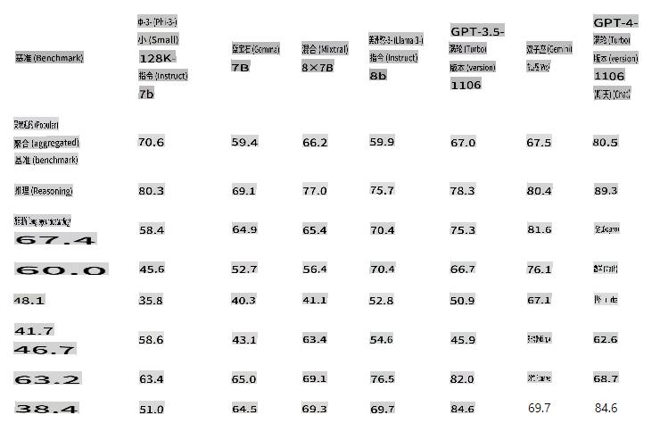
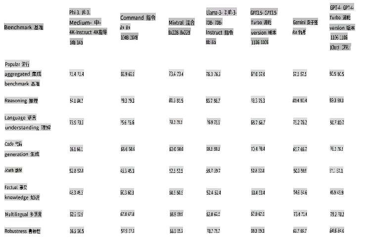
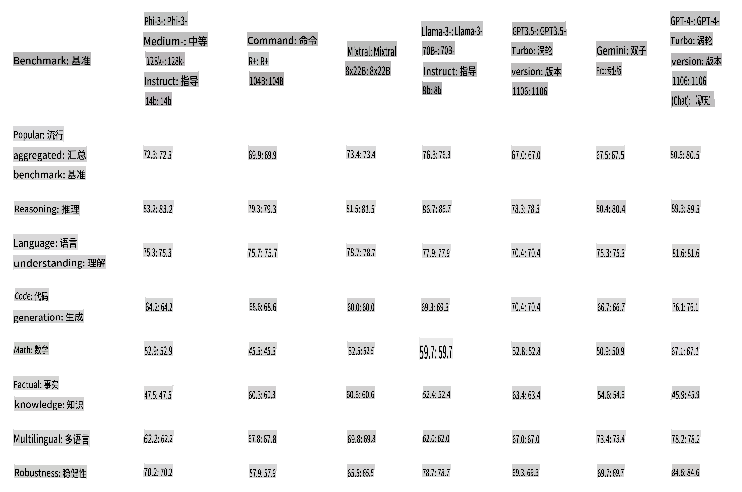
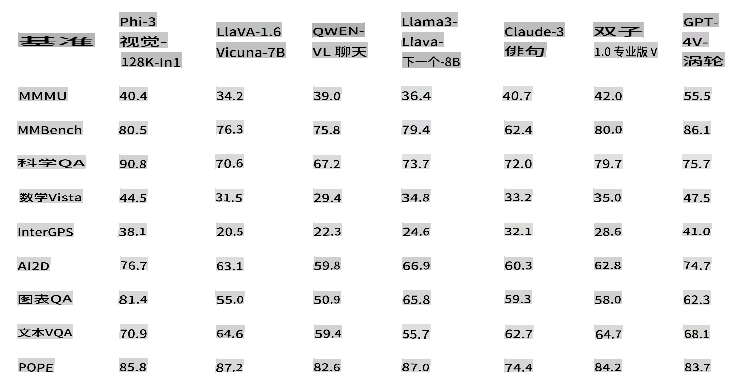
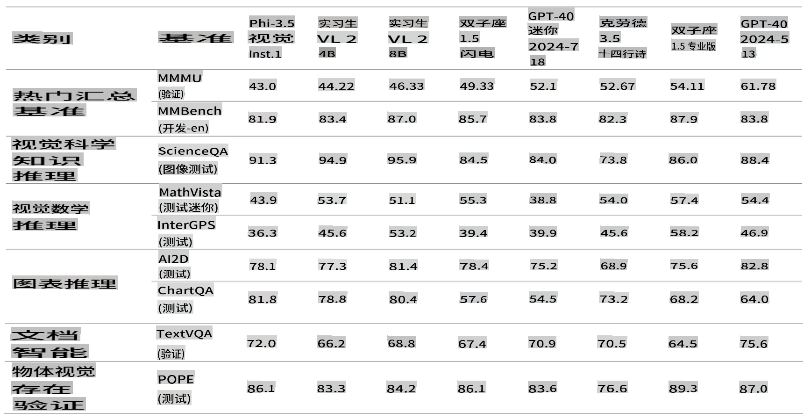
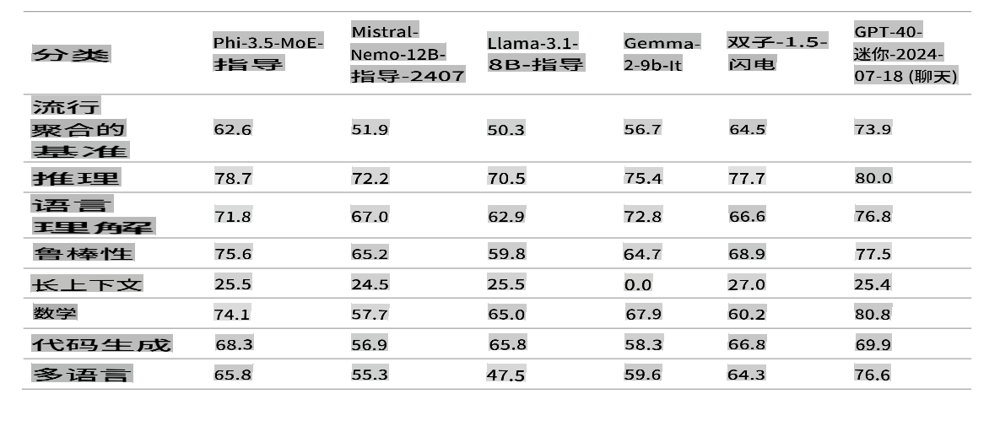

# 微软的 Phi-3 系列

Phi-3 模型是目前最强大且性价比最高的小型语言模型（SLMs），在各种语言、推理、编码和数学基准测试中，表现优于同尺寸和更大尺寸的模型。本次发布扩展了高质量模型的选择，为客户提供了更多构建生成式 AI 应用的实用选择。

Phi-3 系列包括 mini、小型、中型和视觉版本，基于不同参数量进行训练，以服务于各种应用场景。每个模型都经过指令调优，并按照微软的负责任 AI、安全和保障标准开发，确保可以直接使用。Phi-3-mini 的性能超过了其两倍大小的模型，而 Phi-3-small 和 Phi-3-medium 则超过了包括 GPT-3.5T 在内的更大模型。

## Phi-3 任务示例

| | |
|-|-|
|任务|Phi-3|
|语言任务|是|
|数学与推理|是|
|编码|是|
|函数调用|否|
|自我编排（助手）|否|
|专用嵌入模型|否|

## Phi-3-mini

Phi-3-mini 是一个拥有 38 亿参数的语言模型，可在 [Microsoft Azure AI Studio](https://ai.azure.com/explore/models?selectedCollection=phi)、[Hugging Face](https://huggingface.co/collections/microsoft/phi-3-6626e15e9585a200d2d761e3) 和 [Ollama](https://ollama.com/library/phi3) 上使用。它提供两种上下文长度：[128K](https://ai.azure.com/explore/models/Phi-3-mini-128k-instruct/version/9/registry/azureml) 和 [4K](https://ai.azure.com/explore/models/Phi-3-mini-4k-instruct/version/9/registry/azureml)。

Phi-3-mini 是一个基于 Transformer 的语言模型，拥有 38 亿参数。它使用高质量数据进行训练，这些数据包含教育性信息，并通过新数据源进行增强，这些数据源包括各种 NLP 合成文本，以及内部和外部的聊天数据集，这显著提高了聊天能力。此外，Phi-3-mini 在预训练后通过监督微调（SFT）和直接偏好优化（DPO）进行了聊天微调。经过这种后期训练，Phi-3-mini 在多项能力上表现出显著提升，特别是在对齐性、鲁棒性和安全性方面。该模型是 Phi-3 系列的一部分，并有两种版本，4K 和 128K，代表它可以支持的上下文长度（以 token 为单位）。

## Phi-3.5-mini-instruct 

[Phi-3.5 mini](https://ai.azure.com/explore/models/Phi-3.5-mini-instruct/version/1/registry/azureml) 是一个轻量级的、最先进的开源模型，基于用于 Phi-3 的数据集构建——包括合成数据和经过筛选的公开网站——重点关注高质量、推理密集的数据。该模型属于 Phi-3 模型家族，支持 128K token 的上下文长度。该模型经过严格的增强过程，结合了监督微调、近端策略优化和直接偏好优化，以确保精确的指令遵循和强大的安全措施。

Phi-3.5 Mini 拥有 38 亿参数，是一个仅包含解码器的 Transformer 模型，使用与 Phi-3 Mini 相同的分词器。

总体而言，尽管模型只有 38 亿参数，但它在多语言理解和推理能力方面达到了与更大模型相似的水平。然而，在某些任务上，它仍然受限于其规模。模型没有足够的容量存储太多事实知识，因此用户可能会遇到事实错误。不过，我们相信通过在 RAG 设置下使用搜索引擎增强 Phi-3.5，可以解决这一弱点。

### 语言支持 

下表展示了 Phi-3 在多语言 MMLU、MEGA 和多语言 MMLU-pro 数据集上的多语言能力。总体而言，我们观察到，即使只有 38 亿活跃参数，该模型在多语言任务上的竞争力也相当强，与其他具有更大活跃参数的模型相比不遑多让。

## Phi-3-small

Phi-3-small 是一个拥有 70 亿参数的语言模型，提供两种上下文长度 [128K](https://ai.azure.com/explore/models/Phi-3-small-128k-instruct/version/2/registry/azureml) 和 [8K](https://ai.azure.com/explore/models/Phi-3-small-8k-instruct/version/2/registry/azureml)，在各种语言、推理、编码和数学基准测试中表现优于 GPT-3.5T。

Phi-3-small 是一个基于 Transformer 的语言模型，拥有 70 亿参数。它使用高质量数据进行训练，这些数据包含教育性信息，并通过新数据源进行增强，这些数据源包括各种 NLP 合成文本，以及内部和外部的聊天数据集，这显著提高了聊天能力。此外，Phi-3-small 在预训练后通过监督微调（SFT）和直接偏好优化（DPO）进行了聊天微调。经过这种后期训练，Phi-3-small 在多项能力上表现出显著提升，特别是在对齐性、鲁棒性和安全性方面。与 Phi-3-Mini 相比，Phi-3-small 还在多语言数据集上进行了更深入的训练。该模型家族提供两种版本，8K 和 128K，代表它可以支持的上下文长度（以 token 为单位）。

## Phi-3-medium

Phi-3-medium 是一个拥有 140 亿参数的语言模型，提供两种上下文长度 [128K](https://ai.azure.com/explore/models/Phi-3-medium-128k-instruct/version/2/registry/azureml) 和 [4K](https://ai.azure.com/explore/models/Phi-3-medium-4k-instruct/version/2/registry/azureml)，继续了超越 Gemini 1.0 Pro 的趋势。

Phi-3-medium 是一个基于 Transformer 的语言模型，拥有 140 亿参数。它使用高质量数据进行训练，这些数据包含教育性信息，并通过新数据源进行增强，这些数据源包括各种 NLP 合成文本，以及内部和外部的聊天数据集，这显著提高了聊天能力。此外，Phi-3-medium 在预训练后通过监督微调（SFT）和直接偏好优化（DPO）进行了聊天微调。经过这种后期训练，Phi-3-medium 在多项能力上表现出显著提升，特别是在对齐性、鲁棒性和安全性方面。该模型家族提供两种版本，4K 和 128K，代表它可以支持的上下文长度（以 token 为单位）。

[!NOTE]
我们建议将 Phi-3-medium 升级为 Phi-3.5-MoE，因为 MoE 模型更好且性价比更高。

## Phi-3-vision

[Phi-3-vision](https://ai.azure.com/explore/models/Phi-3-vision-128k-instruct/version/2/registry/azureml)，一个拥有 42 亿参数的多模态模型，具备语言和视觉能力，在一般视觉推理、OCR 以及表格和图表理解任务上超越了更大的模型如 Claude-3 Haiku 和 Gemini 1.0 Pro V。

Phi-3-vision 是 Phi-3 系列中的第一个多模态模型，结合了文本和图像。Phi-3-vision 可以用于对真实世界图像进行推理，并从图像中提取和推理文本。它还针对图表和图表理解进行了优化，可以用于生成见解和回答问题。Phi-3-vision 建立在 Phi-3-mini 的语言能力基础上，继续在小体积中保持强大的语言和图像推理质量。

## Phi-3.5-vision
[Phi-3.5 Vision](https://ai.azure.com/explore/models/Phi-3.5-vision-instruct/version/1/registry/azureml) 是一个轻量级的、最先进的开源多模态模型，基于包括合成数据和经过筛选的公开网站在内的数据集构建，重点关注高质量、推理密集的文本和视觉数据。该模型属于 Phi-3 模型家族，多模态版本支持 128K 的上下文长度（以 token 为单位）。该模型经过严格的增强过程，结合了监督微调和直接偏好优化，以确保精确的指令遵循和强大的安全措施。

Phi-3.5 Vision 拥有 42 亿参数，包含图像编码器、连接器、投影器和 Phi-3 Mini 语言模型。

该模型旨在用于广泛的商业和研究用途，特别是在英语环境中。该模型提供以下用途：
1) 内存/计算受限环境。
2) 延迟受限场景。
3) 一般图像理解。
4) OCR。
5) 图表和表格理解。
6) 多图像比较。
7) 多图像或视频片段总结。

Phi-3.5-vision 模型旨在加速高效语言和多模态模型的研究，用作生成式 AI 功能的构建模块。

## Phi-3.5-MoE

[Phi-3.5 MoE](https://ai.azure.com/explore/models/Phi-3.5-MoE-instruct/version/1/registry/azureml) 是一个轻量级的、最先进的开源模型，基于用于 Phi-3 的数据集构建——包括合成数据和经过筛选的公开文档——重点关注高质量、推理密集的数据。该模型支持多语言，并支持 128K 的上下文长度（以 token 为单位）。该模型经过严格的增强过程，结合了监督微调、近端策略优化和直接偏好优化，以确保精确的指令遵循和强大的安全措施。

Phi-3 MoE 拥有 16x38 亿参数，当使用 2 个专家时，有 66 亿活跃参数。该模型是一个仅包含解码器的专家混合 Transformer 模型，使用词汇量为 32,064 的分词器。

该模型旨在用于广泛的商业和研究用途，特别是在英语环境中。该模型提供以下用途：
1) 内存/计算受限环境。
2) 延迟受限场景。
3) 强大的推理能力（尤其是数学和逻辑）。

MoE 模型旨在加速语言和多模态模型的研究，用作生成式 AI 功能的构建模块，并需要额外的计算资源。

> [!NOTE]
>
> Phi-3 模型在事实知识基准测试（如 TriviaQA）中的表现不如其他模型，因为较小的模型尺寸导致其存储事实的能力较弱。

## Phi silica

我们推出了 Phi Silica，它基于 Phi 系列模型构建，专为 Copilot+ 电脑中的 NPU 设计。Windows 是第一个拥有为 NPU 定制并内置的小型语言模型（SLM）的平台。Phi Silica API 以及 OCR、Studio Effects、Live Captions 和 Recall User Activity APIs 将于 6 月在 Windows Copilot Library 中提供。更多 API 如 Vector Embedding、RAG API 和 Text Summarization 将在稍后推出。

## **查找所有 Phi-3 模型** 

- [Azure AI](https://ai.azure.com/explore/models?selectedCollection=phi)
- [Hugging Face](https://huggingface.co/collections/microsoft/phi-3-6626e15e9585a200d2d761e3) 

## ONNX 模型

两个 ONNX 模型，“cpu-int4-rtn-block-32”和“cpu-int4-rtn-block-32-acc-level-4”之间的主要区别是准确性水平。带有“acc-level-4”的模型旨在平衡延迟与准确性，在准确性上做出微小的妥协以获得更好的性能，这可能特别适合移动设备。

## 模型选择示例

| | | | |
|-|-|-|-|
|客户需求|任务|起始模型|更多细节|
|需要一个简单总结消息线程的模型|对话总结|Phi-3 文本模型|决定因素是客户有一个明确且直接的语言任务|
|一个免费的儿童数学辅导应用|数学和推理|Phi-3 文本模型|因为应用是免费的，客户希望解决方案不需要持续费用|
|自我巡逻车载摄像头|视觉分析|Phi-Vision|需要一个可以在无网络环境下工作的解决方案|
|希望构建一个基于 AI 的旅行预订代理|需要复杂的规划、函数调用和编排|GPT 模型|需要能够规划、调用 API 以收集信息并执行|
|希望为员工构建一个助手|RAG、多领域、复杂和开放式|GPT 模型|开放式场景，需要更广泛的世界知识，因此更大的模型更合适|

免责声明：此翻译由AI模型从原文翻译而来，可能并不完美。请审阅输出并进行必要的修改。