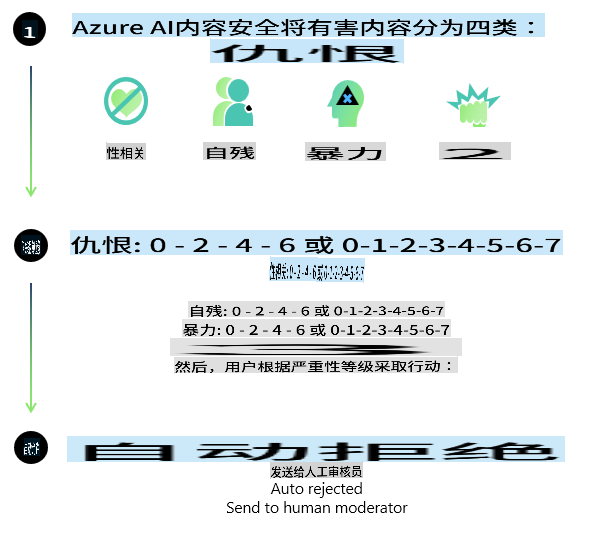
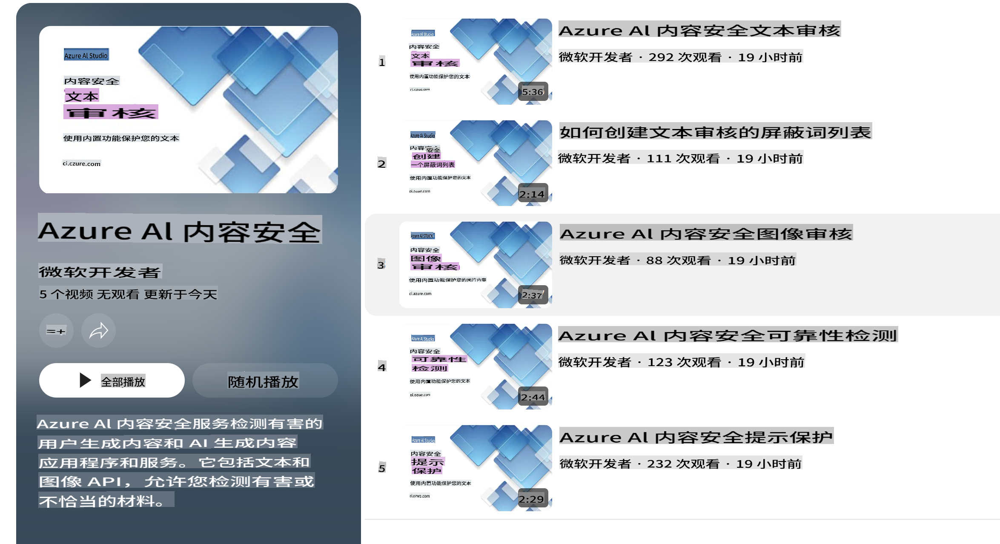

# Phi 模型的 AI 安全性
Phi 系列模型是根据 [Microsoft Responsible AI Standard](https://query.prod.cms.rt.microsoft.com/cms/api/am/binary/RE5cmFl) 开发的。这是一套基于以下六大原则的公司级要求：责任、透明性、公平性、可靠性与安全性、隐私与安全性，以及包容性，这些原则构成了 [Microsoft 的负责任 AI 原则](https://www.microsoft.com/ai/responsible-ai)。

与之前的 Phi 模型一样，本次发布采用了多方面的安全评估和安全后训练方法，并针对其多语言能力采取了额外措施。我们的安全训练和评估方法，包括在多种语言和风险类别上的测试，已在 [Phi Safety Post-Training Paper](https://arxiv.org/abs/2407.13833) 中详细说明。尽管 Phi 模型受益于这些方法，开发者仍需应用负责任的 AI 最佳实践，包括针对特定用例及文化和语言环境进行风险映射、测量和缓解。

## 最佳实践

与其他模型一样，Phi 系列模型可能表现出不公平、不可靠或冒犯性的行为。

需要注意的一些 SLM 和 LLM 限制行为包括：

- **服务质量：** Phi 模型主要基于英文文本训练。非英语语言的性能会较差，而训练数据中代表性较低的英语变体，其性能可能不如标准美式英语。
- **伤害表现与刻板印象的延续：** 这些模型可能会过度或不足地表现某些群体，抹去某些群体的存在，或强化贬低或负面的刻板印象。尽管进行了安全后训练，但由于不同群体的代表性不同或训练数据中反映现实模式和社会偏见的负面刻板印象示例的普遍性，这些局限性可能仍然存在。
- **不适当或冒犯性内容：** 这些模型可能生成其他类型的不适当或冒犯性内容，因此在敏感环境中使用时，需针对具体用例采取额外的缓解措施。
- **信息可靠性：** 语言模型可能生成无意义的内容，或捏造听起来合理但实际上不准确或过时的内容。
- **代码范围有限：** Phi-3 的大部分训练数据基于 Python，使用了常见的包，例如 "typing, math, random, collections, datetime, itertools"。如果模型生成的 Python 脚本使用了其他包或使用了其他语言的脚本，我们强烈建议用户手动验证所有 API 的使用。

开发者应应用负责任的 AI 最佳实践，并负责确保特定用例符合相关法律法规（例如隐私、贸易等）。

## 负责任 AI 的考量

与其他语言模型类似，Phi 系列模型可能表现出不公平、不可靠或冒犯性的行为。需要注意的一些局限性包括：

**服务质量：** Phi 模型主要基于英文文本训练。非英语语言的性能会较差，而训练数据中代表性较低的英语变体，其性能可能不如标准美式英语。

**伤害表现与刻板印象的延续：** 这些模型可能会过度或不足地表现某些群体，抹去某些群体的存在，或强化贬低或负面的刻板印象。尽管进行了安全后训练，但由于不同群体的代表性不同或训练数据中反映现实模式和社会偏见的负面刻板印象示例的普遍性，这些局限性可能仍然存在。

**不适当或冒犯性内容：** 这些模型可能生成其他类型的不适当或冒犯性内容，因此在敏感环境中使用时，需针对具体用例采取额外的缓解措施。

**信息可靠性：** 语言模型可能生成无意义的内容，或捏造听起来合理但实际上不准确或过时的内容。

**代码范围有限：** Phi-3 的大部分训练数据基于 Python，使用了常见的包，例如 "typing, math, random, collections, datetime, itertools"。如果模型生成的 Python 脚本使用了其他包或使用了其他语言的脚本，我们强烈建议用户手动验证所有 API 的使用。

开发者应应用负责任的 AI 最佳实践，并负责确保特定用例符合相关法律法规（例如隐私、贸易等）。需要重点考虑的领域包括：

**分配：** 在可能对法律地位或资源分配及生活机会（如住房、就业、信贷等）产生重要影响的场景中，模型可能并不适合使用，除非进行了进一步评估和额外的去偏技术。

**高风险场景：** 开发者应评估在高风险场景中使用模型的适用性，其中不公平、不可靠或冒犯性的输出可能会造成极高的成本或带来伤害。这包括在敏感或专业领域提供建议（如法律或健康建议），这些领域对准确性和可靠性要求极高。应根据部署环境在应用层面实施额外的保护措施。

**错误信息：** 模型可能生成不准确的信息。开发者应遵循透明性最佳实践，告知终端用户他们正在与 AI 系统交互。在应用层面，开发者可以构建反馈机制和管道，通过一种称为检索增强生成 (RAG) 的技术，将响应与特定用例的上下文信息挂钩。

**有害内容生成：** 开发者应根据上下文评估输出，并使用适合其用例的可用安全分类器或定制解决方案。

**滥用：** 其他形式的滥用，例如欺诈、垃圾邮件或恶意软件生成是可能的，开发者应确保其应用程序不违反适用的法律法规。

### 微调和 AI 内容安全

在对模型进行微调后，我们强烈建议利用 [Azure AI 内容安全](https://learn.microsoft.com/azure/ai-services/content-safety/overview) 措施来监控模型生成的内容，识别并阻止潜在的风险、威胁和质量问题。

[Azure AI 内容安全](https://learn.microsoft.com/azure/ai-services/content-safety/overview) 支持文本和图像内容。它可以部署在云端、离线容器以及边缘/嵌入式设备上。

## Azure AI 内容安全概览

Azure AI 内容安全并非一刀切的解决方案；它可以根据企业的具体政策进行定制。此外，其多语言模型使其能够同时理解多种语言。

- **Azure AI 内容安全**
- **Microsoft 开发者**
- **5 个视频**

Azure AI 内容安全服务可以检测应用程序和服务中的用户生成和 AI 生成的有害内容。它包括文本和图像 API，能够检测有害或不适当的材料。

[AI 内容安全播放列表](https://www.youtube.com/playlist?list=PLlrxD0HtieHjaQ9bJjyp1T7FeCbmVcPkQ)

**免责声明**：  
本文件使用基于机器的人工智能翻译服务进行翻译。尽管我们努力确保翻译的准确性，但请注意，自动翻译可能包含错误或不准确之处。应以原文的母语版本作为权威来源。对于关键信息，建议使用专业人工翻译。我们对于因使用本翻译而引起的任何误解或误读不承担责任。