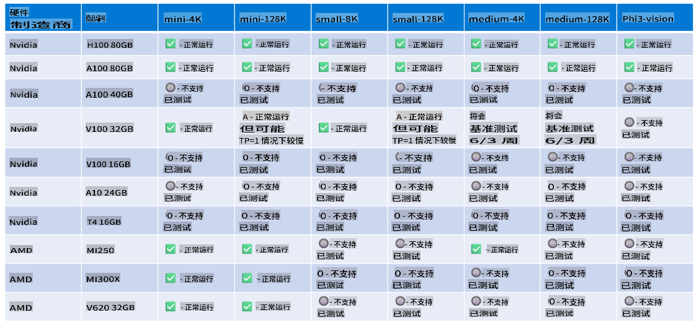

# Phi 硬件支持

Microsoft Phi 已针对 ONNX Runtime 进行了优化，并支持 Windows DirectML。它在多种硬件类型上表现良好，包括 GPU、CPU，甚至移动设备。

## 设备硬件
具体支持的硬件包括：

- GPU 型号：RTX 4090 (DirectML)
- GPU 型号：1 A100 80GB (CUDA)
- CPU 型号：Standard F64s v2 (64 vCPUs, 128 GiB 内存)

## 移动设备型号

- 安卓设备 - 三星 Galaxy S21
- 苹果 iPhone 14 或更高版本，A16/A17 处理器

## Phi 硬件规格

- 最低配置要求。
- Windows: 支持 DirectX 12 的 GPU，且至少有 4GB 的总内存

CUDA: NVIDIA GPU，计算能力 >= 7.02



## 在多 GPU 上运行 onnxruntime

目前可用的 Phi ONNX 模型仅支持单 GPU。Phi 模型支持多 GPU 是可能的，但使用 ORT 配置两个 GPU 不一定能比运行两个 ORT 实例提供更高的吞吐量。请参阅 [ONNX Runtime](https://onnxruntime.ai/) 了解最新动态。

在 [Build 2024 的 GenAI ONNX 团队](https://youtu.be/WLW4SE8M9i8?si=EtG04UwDvcjunyfC) 宣布，他们为 Phi 模型启用了多实例支持，而非多 GPU。

目前，这使您可以通过如下方式使用 CUDA_VISIBLE_DEVICES 环境变量运行一个 onnxruntime 或 onnxruntime-genai 实例。

```Python
CUDA_VISIBLE_DEVICES=0 python infer.py
CUDA_VISIBLE_DEVICES=1 python infer.py
```

欢迎在 [Azure AI Foundry](https://ai.azure.com) 中进一步探索 Phi。

**免责声明**：  
本文件通过基于机器的人工智能翻译服务翻译而成。尽管我们努力确保翻译的准确性，但请注意，自动翻译可能包含错误或不准确之处。应以原文的母语版本作为权威来源。对于关键信息，建议寻求专业人工翻译服务。我们对于因使用此翻译而导致的任何误解或错误解释概不负责。