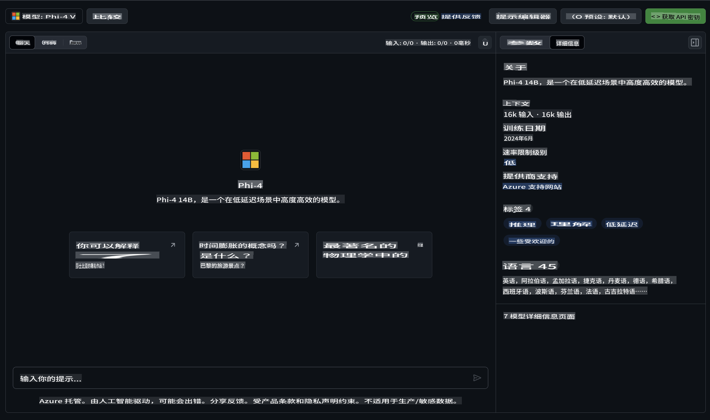

## GitHub 模型中的 Phi 系列

欢迎来到 [GitHub Models](https://github.com/marketplace/models)！我们已经为您准备好一切，快来探索托管在 Azure AI 上的 AI 模型吧。


有关 GitHub Models 上可用模型的更多信息，请访问 [GitHub Model Marketplace](https://github.com/marketplace/models)。

## 可用模型

每个模型都有专属的 playground 和示例代码。



### GitHub 模型目录中的 Phi 系列

- [Phi-4](https://github.com/marketplace/models/azureml/Phi-4)

- [Phi-3.5-MoE instruct (128k)](https://github.com/marketplace/models/azureml/Phi-3-5-MoE-instruct)

- [Phi-3.5-vision instruct (128k)](https://github.com/marketplace/models/azureml/Phi-3-5-vision-instruct)

- [Phi-3.5-mini instruct (128k)](https://github.com/marketplace/models/azureml/Phi-3-5-mini-instruct)

- [Phi-3-Medium-128k-Instruct](https://github.com/marketplace/models/azureml/Phi-3-medium-128k-instruct)

- [Phi-3-medium-4k-instruct](https://github.com/marketplace/models/azureml/Phi-3-medium-4k-instruct)

- [Phi-3-mini-128k-instruct](https://github.com/marketplace/models/azureml/Phi-3-mini-128k-instruct)

- [Phi-3-mini-4k-instruct](https://github.com/marketplace/models/azureml/Phi-3-mini-4k-instruct)

- [Phi-3-small-128k-instruct](https://github.com/marketplace/models/azureml/Phi-3-small-128k-instruct)

- [Phi-3-small-8k-instruct](https://github.com/marketplace/models/azureml/Phi-3-small-8k-instruct)

## 入门指南

我们提供了一些简单的示例，您可以直接运行。您可以在 samples 目录中找到它们。如果您希望直接跳到您喜欢的编程语言，可以在以下语言中找到示例：

- Python
- JavaScript
- C#
- Java
- cURL

此外，还有一个专门用于运行示例和模型的 Codespaces 环境。


## 示例代码

以下是一些用例的代码示例。有关 Azure AI Inference SDK 的更多信息，请参阅完整的文档和示例。

## 设置

1. 创建一个个人访问令牌  
您不需要为该令牌赋予任何权限。请注意，该令牌将被发送到 Microsoft 服务。

要使用以下代码片段，请创建一个环境变量，将令牌设置为客户端代码的密钥。

如果您使用的是 bash：
```
export GITHUB_TOKEN="<your-github-token-goes-here>"
```  
如果您使用的是 powershell：

```
$Env:GITHUB_TOKEN="<your-github-token-goes-here>"
```  

如果您使用的是 Windows 命令提示符：

```
set GITHUB_TOKEN=<your-github-token-goes-here>
```  

## Python 示例

### 安装依赖项  
使用 pip 安装 Azure AI Inference SDK（要求：Python >=3.8）：  

```
pip install azure-ai-inference
```  

### 运行基础代码示例  

此示例展示了如何基本调用 chat completion API。它利用了 GitHub AI 模型推理端点和您的 GitHub 令牌。调用是同步的。

```python
import os
from azure.ai.inference import ChatCompletionsClient
from azure.ai.inference.models import SystemMessage, UserMessage
from azure.core.credentials import AzureKeyCredential

endpoint = "https://models.inference.ai.azure.com"
model_name = "Phi-4"
token = os.environ["GITHUB_TOKEN"]

client = ChatCompletionsClient(
    endpoint=endpoint,
    credential=AzureKeyCredential(token),
)

response = client.complete(
    messages=[
        UserMessage(content="I have $20,000 in my savings account, where I receive a 4% profit per year and payments twice a year. Can you please tell me how long it will take for me to become a millionaire? Also, can you please explain the math step by step as if you were explaining it to an uneducated person?"),
    ],
    temperature=0.4,
    top_p=1.0,
    max_tokens=2048,
    model=model_name
)

print(response.choices[0].message.content)
```  

### 运行多轮对话  

此示例展示了如何使用 chat completion API 进行多轮对话。当将模型用于聊天应用时，您需要管理对话的历史记录，并将最新消息发送给模型。

```
import os
from azure.ai.inference import ChatCompletionsClient
from azure.ai.inference.models import AssistantMessage, SystemMessage, UserMessage
from azure.core.credentials import AzureKeyCredential

token = os.environ["GITHUB_TOKEN"]
endpoint = "https://models.inference.ai.azure.com"
# Replace Model_Name
model_name = "Phi-4"

client = ChatCompletionsClient(
    endpoint=endpoint,
    credential=AzureKeyCredential(token),
)

messages = [
    SystemMessage(content="You are a helpful assistant."),
    UserMessage(content="What is the capital of France?"),
    AssistantMessage(content="The capital of France is Paris."),
    UserMessage(content="What about Spain?"),
]

response = client.complete(messages=messages, model=model_name)

print(response.choices[0].message.content)
```  

### 流式输出  

为了提供更好的用户体验，您可能希望流式传输模型的响应，这样第一个 token 能够更早显示，从而避免长时间等待响应。

```
import os
from azure.ai.inference import ChatCompletionsClient
from azure.ai.inference.models import SystemMessage, UserMessage
from azure.core.credentials import AzureKeyCredential

token = os.environ["GITHUB_TOKEN"]
endpoint = "https://models.inference.ai.azure.com"
# Replace Model_Name
model_name = "Phi-4"

client = ChatCompletionsClient(
    endpoint=endpoint,
    credential=AzureKeyCredential(token),
)

response = client.complete(
    stream=True,
    messages=[
        SystemMessage(content="You are a helpful assistant."),
        UserMessage(content="Give me 5 good reasons why I should exercise every day."),
    ],
    model=model_name,
)

for update in response:
    if update.choices:
        print(update.choices[0].delta.content or "", end="")

client.close()
```  

## GitHub 模型的免费使用和速率限制  


[playground 和免费 API 使用的速率限制](https://docs.github.com/en/github-models/prototyping-with-ai-models#rate-limits) 旨在帮助您实验模型并原型化您的 AI 应用程序。超出这些限制的使用，以及将您的应用扩展至生产规模，您需要通过 Azure 账户配置资源，并从那里进行身份验证，而不是使用您的 GitHub 个人访问令牌。您无需更改代码中的其他内容。使用此链接了解如何超越 Azure AI 中的免费层限制。

### 声明  

请记住，当与模型交互时，您正在实验 AI，因此可能会出现内容错误。

此功能受到各种限制（包括每分钟请求数、每天请求数、每次请求的 token 数和并发请求数）的约束，并不适用于生产用例。

GitHub Models 使用 Azure AI 内容安全。这些过滤器在 GitHub Models 体验中无法关闭。如果您决定通过付费服务使用模型，请根据您的需求配置内容过滤器。

此服务受 GitHub 的预发布条款约束。

**免责声明**：  
本文件使用基于机器的人工智能翻译服务进行翻译。尽管我们努力确保准确性，但请注意，自动翻译可能包含错误或不准确之处。应以原文档的母语版本作为权威来源。对于关键信息，建议使用专业人工翻译。因使用本翻译而引起的任何误解或误读，我们概不负责。