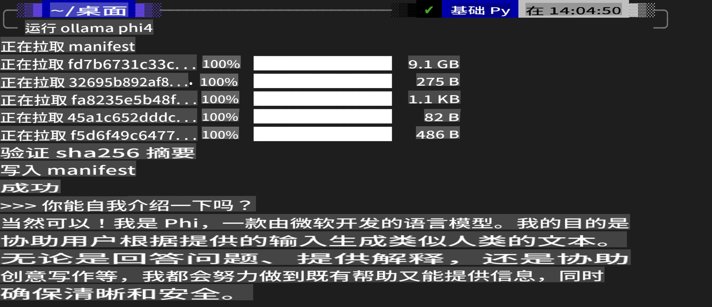
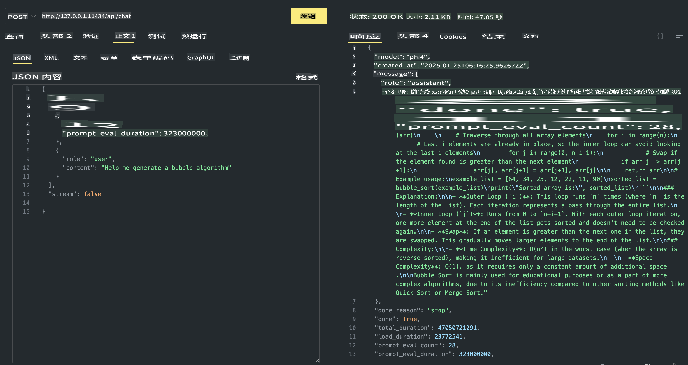

## Phi 系列在 Ollama 中的应用

[Ollama](https://ollama.com) 通过简单的脚本让更多人可以直接部署开源的 LLM 或 SLM，还可以构建 API 来支持本地的 Copilot 应用场景。

## **1. 安装**

Ollama 支持在 Windows、macOS 和 Linux 上运行。你可以通过以下链接安装 Ollama：[https://ollama.com/download](https://ollama.com/download)。安装成功后，你可以直接通过终端窗口使用 Ollama 脚本调用 Phi-3。你可以查看 Ollama 中的[所有可用库](https://ollama.com/library)。如果你在 Codespace 中打开此存储库，Ollama 已经预安装好了。

```bash

ollama run phi4

```

> [!NOTE]
> 第一次运行时会先下载模型。当然，你也可以直接指定已下载的 Phi-4 模型。以下以 WSL 为例运行命令。模型下载成功后，你可以直接在终端中交互。



## **2. 从 Ollama 调用 phi-4 API**

如果你想调用 Ollama 生成的 Phi-4 API，可以在终端中使用以下命令启动 Ollama 服务器。

```bash

ollama serve

```

> [!NOTE]
> 如果在 macOS 或 Linux 上运行，请注意可能会遇到以下错误 **"Error: listen tcp 127.0.0.1:11434: bind: address already in use"**。运行命令时可能会出现此错误。这通常表示服务器已在运行，你可以忽略此错误，或者停止并重新启动 Ollama：

**macOS**

```bash

brew services restart ollama

```

**Linux**

```bash

sudo systemctl stop ollama

```

Ollama 支持两个 API：generate 和 chat。你可以根据需要，通过向运行在 11434 端口的本地服务发送请求，调用 Ollama 提供的模型 API。

**Chat**

```bash

curl http://127.0.0.1:11434/api/chat -d '{
  "model": "phi3",
  "messages": [
    {
      "role": "system",
      "content": "Your are a python developer."
    },
    {
      "role": "user",
      "content": "Help me generate a bubble algorithm"
    }
  ],
  "stream": false
  
}'

This is the result in Postman



## Additional Resources

Check the list of available models in Ollama in [their library](https://ollama.com/library).

Pull your model from the Ollama server using this command

```bash
ollama pull phi4
```

Run the model using this command

```bash
ollama run phi4
```

***Note:*** Visit this link [https://github.com/ollama/ollama/blob/main/docs/api.md](https://github.com/ollama/ollama/blob/main/docs/api.md) to learn more

## Calling Ollama from Python

You can use `requests` or `urllib3` to make requests to the local server endpoints used above. However, a popular way to use Ollama in Python is via the [openai](https://pypi.org/project/openai/) SDK, since Ollama provides OpenAI-compatible server endpoints as well.

Here is an example for phi3-mini:

```python
import openai

client = openai.OpenAI(
    base_url="http://localhost:11434/v1",
    api_key="nokeyneeded",
)

response = client.chat.completions.create(
    model="phi4",
    temperature=0.7,
    n=1,
    messages=[
        {"role": "system", "content": "You are a helpful assistant."},
        {"role": "user", "content": "Write a haiku about a hungry cat"},
    ],
)

print("Response:")
print(response.choices[0].message.content)
```

## Calling Ollama from JavaScript 

```javascript
// 使用 Phi-4 总结文件的示例
script({
    model: "ollama:phi4",
    title: "使用 Phi-4 总结",
    system: ["system"],
})

// 总结示例
const file = def("FILE", env.files)
$`用一个段落总结 ${file}。`
```

## Calling Ollama from C#

Create a new C# Console application and add the following NuGet package:

```bash
dotnet add package Microsoft.SemanticKernel --version 1.34.0
```

Then replace this code in the `Program.cs` file

```csharp
using Microsoft.SemanticKernel;
using Microsoft.SemanticKernel.ChatCompletion;

// 使用本地 Ollama 服务器端点添加聊天补全服务
#pragma warning disable SKEXP0001, SKEXP0003, SKEXP0010, SKEXP0011, SKEXP0050, SKEXP0052
builder.AddOpenAIChatCompletion(
    modelId: "phi4",
    endpoint: new Uri("http://localhost:11434/"),
    apiKey: "non required");

// 向聊天服务发送一个简单的提示
string prompt = "Write a joke about kittens";
var response = await kernel.InvokePromptAsync(prompt);
Console.WriteLine(response.GetValue<string>());
```

Run the app with the command:

```bash
dotnet run

**免责声明**：  
本文档通过基于机器的人工智能翻译服务翻译而成。尽管我们努力确保准确性，但请注意，自动翻译可能包含错误或不准确之处。应以原始语言的文档作为权威来源。对于关键信息，建议寻求专业人工翻译服务。因使用本翻译而导致的任何误解或误读，我们概不负责。