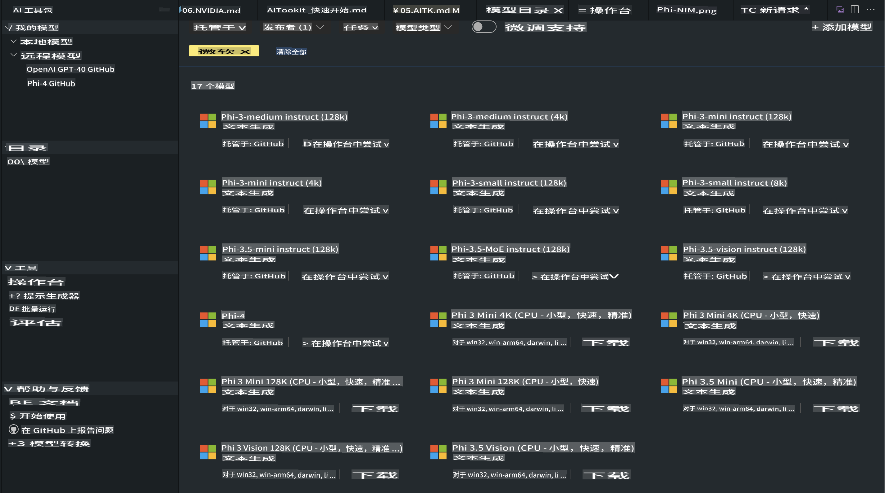
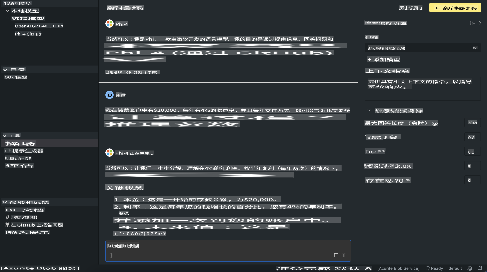

# AITK中的Phi系列

[适用于VS Code的AI工具包](https://marketplace.visualstudio.com/items?itemName=ms-windows-ai-studio.windows-ai-studio)通过整合来自Azure AI Foundry Catalog和类似Hugging Face等目录的尖端AI开发工具和模型，简化了生成式AI应用程序的开发。您可以浏览由GitHub模型和Azure AI Foundry模型目录支持的AI模型目录，将它们下载到本地或远程，进行微调、测试并在您的应用程序中使用。

AI工具包预览版将在本地运行。无论是本地推理还是微调，都取决于您选择的模型，可能需要NVIDIA CUDA GPU等GPU支持。您也可以直接使用AITK运行GitHub模型。

## 入门指南

[了解如何安装Windows子系统Linux](https://learn.microsoft.com/windows/wsl/install?WT.mc_id=aiml-137032-kinfeylo)

以及[更改默认的Linux发行版](https://learn.microsoft.com/windows/wsl/install#change-the-default-linux-distribution-installed)。

[AI工具包GitHub仓库](https://github.com/microsoft/vscode-ai-toolkit/)

- 支持Windows、Linux、macOS
  
- 若要在Windows和Linux上进行微调，您需要NVIDIA GPU。此外，**Windows**需要安装Ubuntu 18.4或更高版本的Linux子系统。[了解如何安装Windows子系统Linux](https://learn.microsoft.com/windows/wsl/install)以及[更改默认的Linux发行版](https://learn.microsoft.com/windows/wsl/install#change-the-default-linux-distribution-installed)。

### 安装AI工具包

AI工具包作为[Visual Studio Code扩展](https://code.visualstudio.com/docs/setup/additional-components#_vs-code-extensions)提供，因此您需要先安装[VS Code](https://code.visualstudio.com/docs/setup/windows?WT.mc_id=aiml-137032-kinfeylo)，然后从[VS Marketplace](https://marketplace.visualstudio.com/items?itemName=ms-windows-ai-studio.windows-ai-studio)下载AI工具包。
[AI工具包可在Visual Studio Marketplace中找到](https://marketplace.visualstudio.com/items?itemName=ms-windows-ai-studio.windows-ai-studio)，并可像其他VS Code扩展一样安装。

如果您不熟悉安装VS Code扩展，请按照以下步骤操作：

### 登录

1. 在VS Code的活动栏中选择**扩展**
2. 在扩展搜索栏中输入“AI Toolkit”
3. 选择“适用于Visual Studio Code的AI工具包”
4. 点击**安装**

现在，您已准备好使用该扩展！

系统会提示您登录GitHub，请点击“允许”以继续。您将被重定向到GitHub登录页面。

请登录并按照流程步骤操作。完成后，您将被重定向回VS Code。

安装扩展后，您将在活动栏中看到AI工具包图标。

让我们来探索可用的操作！

### 可用操作

AI工具包的主侧边栏分为以下几部分：

- **模型**
- **资源**
- **游乐场**  
- **微调**
- **评估**

这些功能均可在资源部分中找到。要开始，请选择**模型目录**。

### 从目录下载模型

从VS Code侧边栏启动AI工具包后，您可以选择以下选项：



- 从**模型目录**中找到支持的模型并下载到本地
- 在**模型游乐场**中测试模型推理
- 在**模型微调**中本地或远程微调模型
- 通过AI工具包的命令面板将微调后的模型部署到云端
- 评估模型

> [!NOTE]
>
> **GPU与CPU**
>
> 您会注意到模型卡片显示了模型大小、平台和加速器类型（CPU、GPU）。对于**具有至少一块GPU的Windows设备**，请选择仅针对Windows的模型版本以获得优化性能。
>
> 这将确保您拥有针对DirectML加速器优化的模型。
>
> 模型名称的格式为：
>
> - `{model_name}-{accelerator}-{quantization}-{format}`。
>
>要检查您的Windows设备是否有GPU，请打开**任务管理器**，然后选择**性能**选项卡。如果有GPU，它们会以“GPU 0”或“GPU 1”等名称列出。

### 在游乐场中运行模型

设置好所有参数后，点击**生成项目**。

模型下载完成后，在目录中的模型卡片上选择**加载到游乐场**：

- 开始模型下载
- 安装所有必要的前提条件和依赖项
- 创建VS Code工作区



### 在应用程序中使用REST API 

AI工具包附带一个本地REST API Web服务器，**监听端口5272**，使用[OpenAI聊天完成格式](https://platform.openai.com/docs/api-reference/chat/create)。

这使您能够在本地测试应用程序，而无需依赖云端AI模型服务。例如，以下JSON文件展示了如何配置请求体：

```json
{
    "model": "Phi-4",
    "messages": [
        {
            "role": "user",
            "content": "what is the golden ratio?"
        }
    ],
    "temperature": 0.7,
    "top_p": 1,
    "top_k": 10,
    "max_tokens": 100,
    "stream": true
}
```

您可以使用（例如）[Postman](https://www.postman.com/)或CURL（客户端URL）工具测试REST API：

```bash
curl -vX POST http://127.0.0.1:5272/v1/chat/completions -H 'Content-Type: application/json' -d @body.json
```

### 使用OpenAI的Python客户端库

```python
from openai import OpenAI

client = OpenAI(
    base_url="http://127.0.0.1:5272/v1/", 
    api_key="x" # required for the API but not used
)

chat_completion = client.chat.completions.create(
    messages=[
        {
            "role": "user",
            "content": "what is the golden ratio?",
        }
    ],
    model="Phi-4",
)

print(chat_completion.choices[0].message.content)
```

### 使用Azure OpenAI的.NET客户端库

通过NuGet将[Azure OpenAI的.NET客户端库](https://www.nuget.org/packages/Azure.AI.OpenAI/)添加到您的项目中：

```bash
dotnet add {project_name} package Azure.AI.OpenAI --version 1.0.0-beta.17
```

在您的项目中添加一个名为**OverridePolicy.cs**的C#文件，并粘贴以下代码：

```csharp
// OverridePolicy.cs
using Azure.Core.Pipeline;
using Azure.Core;

internal partial class OverrideRequestUriPolicy(Uri overrideUri)
    : HttpPipelineSynchronousPolicy
{
    private readonly Uri _overrideUri = overrideUri;

    public override void OnSendingRequest(HttpMessage message)
    {
        message.Request.Uri.Reset(_overrideUri);
    }
}
```

接下来，将以下代码粘贴到您的**Program.cs**文件中：

```csharp
// Program.cs
using Azure.AI.OpenAI;

Uri localhostUri = new("http://localhost:5272/v1/chat/completions");

OpenAIClientOptions clientOptions = new();
clientOptions.AddPolicy(
    new OverrideRequestUriPolicy(localhostUri),
    Azure.Core.HttpPipelinePosition.BeforeTransport);
OpenAIClient client = new(openAIApiKey: "unused", clientOptions);

ChatCompletionsOptions options = new()
{
    DeploymentName = "Phi-4",
    Messages =
    {
        new ChatRequestSystemMessage("You are a helpful assistant. Be brief and succinct."),
        new ChatRequestUserMessage("What is the golden ratio?"),
    }
};

StreamingResponse<StreamingChatCompletionsUpdate> streamingChatResponse
    = await client.GetChatCompletionsStreamingAsync(options);

await foreach (StreamingChatCompletionsUpdate chatChunk in streamingChatResponse)
{
    Console.Write(chatChunk.ContentUpdate);
}
```

## 使用AI工具包进行微调

- 从模型发现和游乐场开始。
- 使用本地计算资源进行模型微调和推理。
- 使用Azure资源进行远程微调和推理。

[使用AI工具包进行微调](../../03.FineTuning/Finetuning_VSCodeaitoolkit.md)

## AI工具包Q&A资源

请参考我们的[Q&A页面](https://github.com/microsoft/vscode-ai-toolkit/blob/main/archive/QA.md)，了解最常见问题和解决方法。

**免责声明**：  
本文件通过基于机器的AI翻译服务进行翻译。尽管我们努力确保准确性，但请注意，自动翻译可能包含错误或不准确之处。应以原文的原始语言版本作为权威来源。对于关键信息，建议使用专业人工翻译。因使用本翻译而引起的任何误解或误读，我们概不负责。