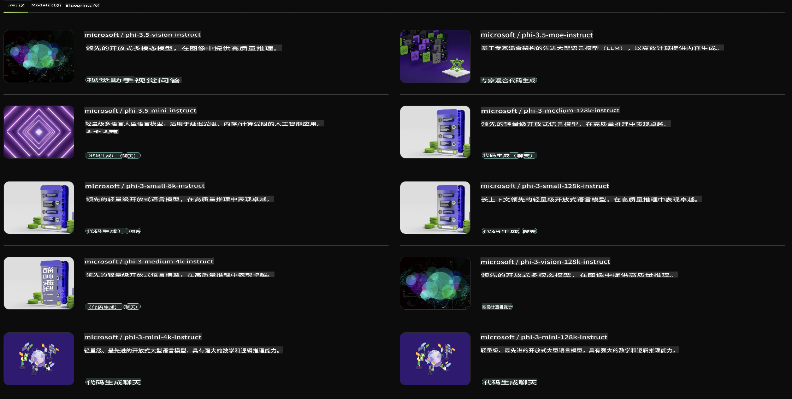

## NVIDIA NIM 中的 Phi 家族

NVIDIA NIM 是一组易于使用的微服务，旨在加速生成式 AI 模型在云端、数据中心和工作站中的部署。NIM 按模型家族和具体模型进行分类。例如，NVIDIA NIM 针对大型语言模型 (LLMs) 提供了尖端 LLM 的强大功能，能够为企业应用带来无与伦比的自然语言处理和理解能力。

NIM 让 IT 和 DevOps 团队可以在自有的管理环境中轻松托管大型语言模型 (LLMs)，同时为开发者提供行业标准的 API，使他们能够构建强大的协作助手、聊天机器人和 AI 助手，从而变革业务。借助 NVIDIA 最先进的 GPU 加速和可扩展部署能力，NIM 提供了以无与伦比的性能实现推理的最快路径。

您可以使用 NVIDIA NIM 推理 Phi 家族模型。



### **示例 - NVIDIA NIM 中的 Phi-3-Vision**

假设您有一张图片 (`demo.png`)，并希望生成 Python 代码来处理这张图片并保存一个新版本 (`phi-3-vision.jpg`)。

上述代码通过以下方式自动完成此过程：

1. 设置环境和必要的配置。
2. 创建一个提示，指示模型生成所需的 Python 代码。
3. 将提示发送给模型并收集生成的代码。
4. 提取并运行生成的代码。
5. 显示原始图片和处理后的图片。

这种方法利用 AI 的强大功能来自动化图像处理任务，使您更轻松快捷地实现目标。

[示例代码解决方案](../../../../../code/06.E2E/E2E_Nvidia_NIM_Phi3_Vision.ipynb)

让我们逐步分解整个代码的功能：

1. **安装所需的包**：
    ```python
    !pip install langchain_nvidia_ai_endpoints -U
    ```
    该命令安装了 `langchain_nvidia_ai_endpoints` 包，并确保是最新版本。

2. **导入必要模块**：
    ```python
    from langchain_nvidia_ai_endpoints import ChatNVIDIA
    import getpass
    import os
    import base64
    ```
    这些导入语句引入了与 NVIDIA AI 端点交互、密码安全处理、操作系统交互以及以 base64 格式编码/解码数据所需的模块。

3. **设置 API 密钥**：
    ```python
    if not os.getenv("NVIDIA_API_KEY"):
        os.environ["NVIDIA_API_KEY"] = getpass.getpass("Enter your NVIDIA API key: ")
    ```
    此代码检查是否已设置 `NVIDIA_API_KEY` 环境变量。如果未设置，它会提示用户安全地输入 API 密钥。

4. **定义模型和图片路径**：
    ```python
    model = 'microsoft/phi-3-vision-128k-instruct'
    chat = ChatNVIDIA(model=model)
    img_path = './imgs/demo.png'
    ```
    该部分指定了使用的模型，创建了一个指定模型的 `ChatNVIDIA` 实例，并定义了图片文件的路径。

5. **创建文本提示**：
    ```python
    text = "Please create Python code for image, and use plt to save the new picture under imgs/ and name it phi-3-vision.jpg."
    ```
    该部分定义了一个文本提示，指示模型生成用于处理图片的 Python 代码。

6. **将图片编码为 Base64**：
    ```python
    with open(img_path, "rb") as f:
        image_b64 = base64.b64encode(f.read()).decode()
    image = f''
    ```
    该代码读取图片文件，将其编码为 base64，并创建一个包含编码数据的 HTML 图片标签。

7. **将文本和图片合并到提示中**：
    ```python
    prompt = f"{text} {image}"
    ```
    该部分将文本提示和 HTML 图片标签合并为一个字符串。

8. **使用 ChatNVIDIA 生成代码**：
    ```python
    code = ""
    for chunk in chat.stream(prompt):
        print(chunk.content, end="")
        code += chunk.content
    ```
    此代码将提示发送给 `ChatNVIDIA` model and collects the generated code in chunks, printing and appending each chunk to the `code` 字符串。

9. **从生成内容中提取 Python 代码**：
    ```python
    begin = code.index('```python') + 9
    code = code[begin:]
    end = code.index('```')
    code = code[:end]
    ```
    该部分通过去除 markdown 格式从生成内容中提取实际的 Python 代码。

10. **运行生成的代码**：
    ```python
    import subprocess
    result = subprocess.run(["python", "-c", code], capture_output=True)
    ```
    该部分以子进程方式运行提取的 Python 代码并捕获其输出。

11. **显示图片**：
    ```python
    from IPython.display import Image, display
    display(Image(filename='./imgs/phi-3-vision.jpg'))
    display(Image(filename='./imgs/demo.png'))
    ```
    这些代码行使用 `IPython.display` 模块显示图片。

**免责声明**：  
本文件通过机器翻译服务翻译而成。尽管我们努力确保准确性，但请注意，自动翻译可能包含错误或不准确之处。应以原始语言的文件作为权威来源。对于关键信息，建议寻求专业人工翻译。我们对于因使用此翻译而导致的任何误解或误读不承担责任。