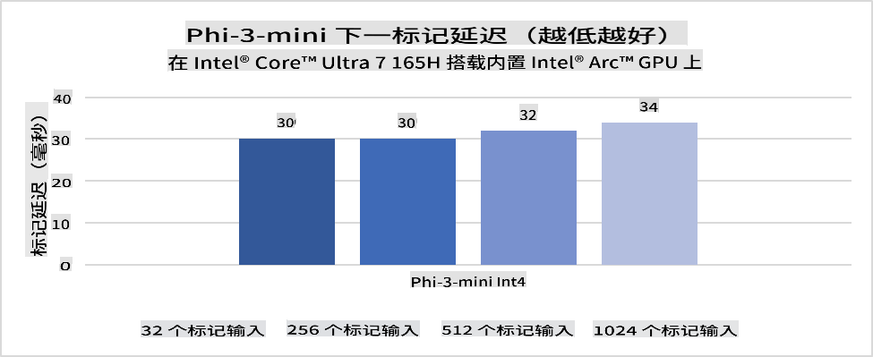
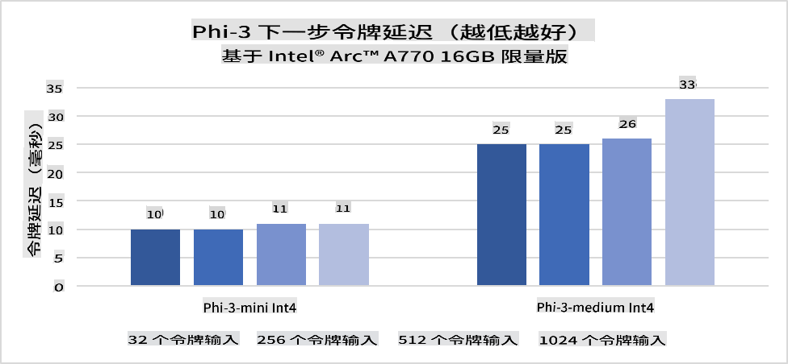
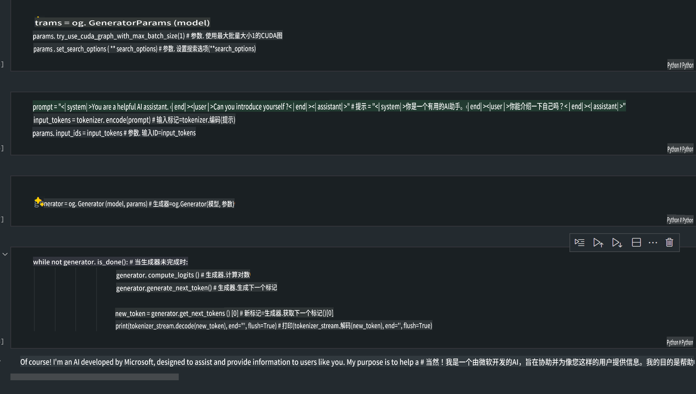
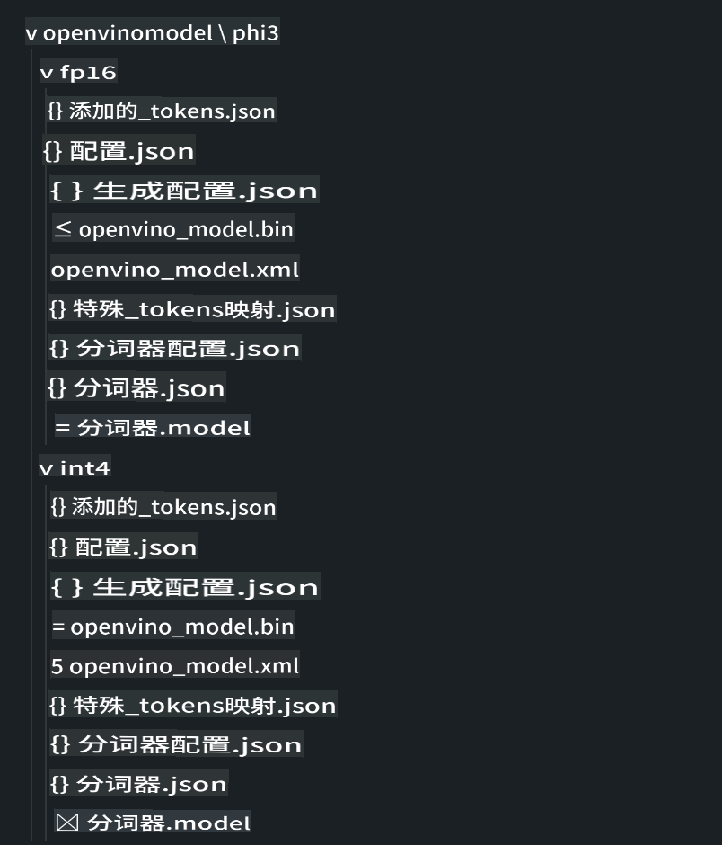
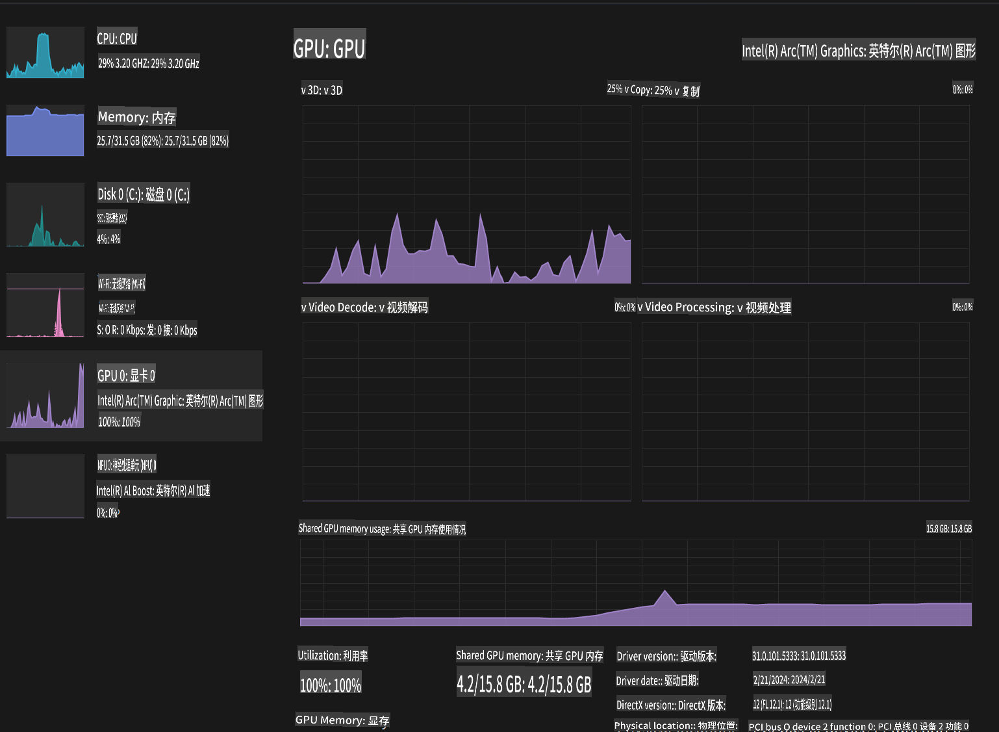

# **在 AI PC 上运行 Phi-3 推理**

随着生成式 AI 的发展以及边缘设备硬件能力的提升，越来越多的生成式 AI 模型现在可以集成到用户的自带设备（BYOD）中。AI PC 是这些模型中的一种。从 2024 年开始，Intel、AMD 和 Qualcomm 已与 PC 制造商合作，通过硬件改进推出支持本地化生成式 AI 模型部署的 AI PC。在本文中，我们将重点关注 Intel AI PC，并探讨如何在 Intel AI PC 上部署 Phi-3。

### 什么是 NPU

NPU（神经处理单元）是一种专门设计用于加速神经网络操作和 AI 任务的处理器或更大 SoC 上的处理单元。与通用 CPU 和 GPU 不同，NPU 针对数据驱动的并行计算进行了优化，使其在处理大量多媒体数据（如视频和图像）以及神经网络数据时非常高效。它们尤其擅长处理与 AI 相关的任务，例如语音识别、视频通话中的背景虚化以及对象检测等照片或视频编辑过程。

## NPU 与 GPU 的区别

虽然许多 AI 和机器学习工作负载运行在 GPU 上，但 GPU 和 NPU 之间存在关键差异。
GPU 以其并行计算能力著称，但并非所有 GPU 在处理图形之外的任务时都同样高效。而 NPU 是专为神经网络操作中涉及的复杂计算而设计的，使其在 AI 任务中表现非常出色。

总之，NPU 就像数学高手，为 AI 计算提供强劲动力，在 AI PC 的新兴时代中扮演了关键角色！

***此示例基于 Intel 最新的 Intel Core Ultra 处理器***

## **1. 使用 NPU 运行 Phi-3 模型**

Intel® NPU 设备是集成在 Intel 客户端 CPU 中的 AI 推理加速器，从 Intel® Core™ Ultra 系列 CPU（以前称为 Meteor Lake）开始提供支持。它能够高效执行人工神经网络任务。





**Intel NPU 加速库**

Intel NPU 加速库 [https://github.com/intel/intel-npu-acceleration-library](https://github.com/intel/intel-npu-acceleration-library) 是一个 Python 库，旨在通过利用 Intel 神经处理单元 (NPU) 的强大功能，在兼容硬件上执行高速计算，从而提高应用程序的效率。

以下是基于 Intel® Core™ Ultra 处理器的 AI PC 上运行 Phi-3-mini 的示例。


通过 pip 安装 Python 库

```bash

   pip install intel-npu-acceleration-library

```

***注意*** 该项目仍在开发中，但参考模型已经非常完整。

### **使用 Intel NPU 加速库运行 Phi-3**

使用 Intel NPU 加速时，该库不会影响传统的编码过程。您只需使用此库对原始 Phi-3 模型进行量化，例如 FP16、INT8、INT4 等。

```python
from transformers import AutoTokenizer, pipeline,TextStreamer
from intel_npu_acceleration_library import NPUModelForCausalLM, int4
from intel_npu_acceleration_library.compiler import CompilerConfig
import warnings

model_id = "microsoft/Phi-3-mini-4k-instruct"

compiler_conf = CompilerConfig(dtype=int4)
model = NPUModelForCausalLM.from_pretrained(
    model_id, use_cache=True, config=compiler_conf, attn_implementation="sdpa"
).eval()

tokenizer = AutoTokenizer.from_pretrained(model_id)

text_streamer = TextStreamer(tokenizer, skip_prompt=True)
```

量化成功后，继续执行调用 NPU 运行 Phi-3 模型。

```python
generation_args = {
   "max_new_tokens": 1024,
   "return_full_text": False,
   "temperature": 0.3,
   "do_sample": False,
   "streamer": text_streamer,
}

pipe = pipeline(
   "text-generation",
   model=model,
   tokenizer=tokenizer,
)

query = "<|system|>You are a helpful AI assistant.<|end|><|user|>Can you introduce yourself?<|end|><|assistant|>"

with warnings.catch_warnings():
    warnings.simplefilter("ignore")
    pipe(query, **generation_args)
```

执行代码时，我们可以通过任务管理器查看 NPU 的运行状态。


***示例*** : [AIPC_NPU_DEMO.ipynb](../../../../../code/03.Inference/AIPC/AIPC_NPU_DEMO.ipynb)

## **2. 使用 DirectML + ONNX Runtime 运行 Phi-3 模型**

### **什么是 DirectML**

[DirectML](https://github.com/microsoft/DirectML) 是一个高性能的硬件加速 DirectX 12 机器学习库。DirectML 为常见的机器学习任务提供 GPU 加速，支持包括 AMD、Intel、NVIDIA 和 Qualcomm 等供应商的所有支持 DirectX 12 的 GPU 硬件和驱动。

当单独使用时，DirectML API 是一个低级别的 DirectX 12 库，适用于高性能、低延迟的应用程序，例如框架、游戏和其他实时应用程序。DirectML 与 Direct3D 12 的无缝互操作性以及其低开销和硬件一致性，使其成为在需要高性能且对硬件结果的可靠性和可预测性要求较高时，加速机器学习的理想选择。

***注意*** : 最新的 DirectML 已支持 NPU (https://devblogs.microsoft.com/directx/introducing-neural-processor-unit-npu-support-in-directml-developer-preview/)

### DirectML 和 CUDA 的功能与性能比较

**DirectML** 是微软开发的机器学习库，旨在加速 Windows 设备（包括台式机、笔记本和边缘设备）上的机器学习工作负载。
- 基于 DX12：DirectML 构建在 DirectX 12 (DX12) 之上，支持范围广泛的 GPU 硬件，包括 NVIDIA 和 AMD。
- 更广的支持：由于利用 DX12，DirectML 可以在任何支持 DX12 的 GPU 上运行，包括集成 GPU。
- 图像处理：DirectML 使用神经网络处理图像和其他数据，适用于图像识别、对象检测等任务。
- 易于设置：设置 DirectML 非常简单，无需特定 GPU 制造商的 SDK 或库。
- 性能：在某些情况下，DirectML 表现良好，甚至可能比 CUDA 更快，尤其是针对某些工作负载。
- 局限性：但在处理 float16 大批量任务时，DirectML 可能较慢。

**CUDA** 是 NVIDIA 的并行计算平台和编程模型，允许开发者利用 NVIDIA GPU 的强大性能进行通用计算，包括机器学习和科学模拟。
- 专为 NVIDIA：CUDA 与 NVIDIA GPU 紧密集成，专为其设计。
- 高度优化：在使用 NVIDIA GPU 时，为 GPU 加速任务提供卓越性能。
- 广泛使用：许多机器学习框架和库（如 TensorFlow 和 PyTorch）都支持 CUDA。
- 自定义：开发者可以为特定任务微调 CUDA 设置，从而实现最佳性能。
- 局限性：但 CUDA 对 NVIDIA 硬件的依赖可能会限制其在不同 GPU 上的兼容性。

### 选择 DirectML 或 CUDA

选择 DirectML 或 CUDA 取决于具体的用例、硬件可用性和偏好。
如果您希望更广泛的兼容性和简单的设置，DirectML 可能是一个不错的选择。然而，如果您拥有 NVIDIA GPU 并需要高度优化的性能，CUDA 是一个强有力的竞争者。总之，DirectML 和 CUDA 各有优劣，请根据您的需求和可用硬件做出选择。

### **使用 ONNX Runtime 的生成式 AI**

在 AI 时代，AI 模型的可移植性非常重要。ONNX Runtime 可以轻松将训练好的模型部署到不同设备上。开发者无需关注推理框架，只需使用统一的 API 完成模型推理。在生成式 AI 时代，ONNX Runtime 还进行了代码优化（https://onnxruntime.ai/docs/genai/）。通过优化后的 ONNX Runtime，量化后的生成式 AI 模型可以在不同终端上进行推理。在使用 ONNX Runtime 的生成式 AI 中，您可以通过 Python、C#、C/C++ 调用 AI 模型 API。当然，在 iPhone 上部署时也可以利用 C++ 的 ONNX Runtime API。

[示例代码](https://github.com/Azure-Samples/Phi-3MiniSamples/tree/main/onnx)

***编译生成式 AI 的 ONNX Runtime 库***

```bash

winget install --id=Kitware.CMake  -e

git clone https://github.com/microsoft/onnxruntime.git

cd .\onnxruntime\

./build.bat --build_shared_lib --skip_tests --parallel --use_dml --config Release

cd ../

git clone https://github.com/microsoft/onnxruntime-genai.git

cd .\onnxruntime-genai\

mkdir ort

cd ort

mkdir include

mkdir lib

copy ..\onnxruntime\include\onnxruntime\core\providers\dml\dml_provider_factory.h ort\include

copy ..\onnxruntime\include\onnxruntime\core\session\onnxruntime_c_api.h ort\include

copy ..\onnxruntime\build\Windows\Release\Release\*.dll ort\lib

copy ..\onnxruntime\build\Windows\Release\Release\onnxruntime.lib ort\lib

python build.py --use_dml


```

**安装库**

```bash

pip install .\onnxruntime_genai_directml-0.3.0.dev0-cp310-cp310-win_amd64.whl

```

运行结果如下：



***示例*** : [AIPC_DirectML_DEMO.ipynb](../../../../../code/03.Inference/AIPC/AIPC_DirectML_DEMO.ipynb)

## **3. 使用 Intel OpenVino 运行 Phi-3 模型**

### **什么是 OpenVINO**

[OpenVINO](https://github.com/openvinotoolkit/openvino) 是一个用于优化和部署深度学习模型的开源工具包。它为来自 TensorFlow、PyTorch 等流行框架的视觉、音频和语言模型提供增强的深度学习性能。通过 OpenVINO 可以快速入门，并结合 CPU 和 GPU 运行 Phi-3 模型。

***注意***: 目前 OpenVINO 暂不支持 NPU。

### **安装 OpenVINO 库**

```bash

 pip install git+https://github.com/huggingface/optimum-intel.git

 pip install git+https://github.com/openvinotoolkit/nncf.git

 pip install openvino-nightly

```

### **使用 OpenVINO 运行 Phi-3**

与 NPU 类似，OpenVINO 通过运行量化模型完成生成式 AI 模型的调用。我们需要先对 Phi-3 模型进行量化，并通过命令行使用 optimum-cli 完成模型量化。

**INT4**

```bash

optimum-cli export openvino --model "microsoft/Phi-3-mini-4k-instruct" --task text-generation-with-past --weight-format int4 --group-size 128 --ratio 0.6  --sym  --trust-remote-code ./openvinomodel/phi3/int4

```

**FP16**

```bash

optimum-cli export openvino --model "microsoft/Phi-3-mini-4k-instruct" --task text-generation-with-past --weight-format fp16 --trust-remote-code ./openvinomodel/phi3/fp16

```

转换后的格式如下：



通过 OVModelForCausalLM 加载模型路径 (model_dir)、相关配置 (ov_config = {"PERFORMANCE_HINT": "LATENCY", "NUM_STREAMS": "1", "CACHE_DIR": ""}) 和硬件加速设备 (GPU.0)。

```python

ov_model = OVModelForCausalLM.from_pretrained(
     model_dir,
     device='GPU.0',
     ov_config=ov_config,
     config=AutoConfig.from_pretrained(model_dir, trust_remote_code=True),
     trust_remote_code=True,
)

```

执行代码时，我们可以通过任务管理器查看 GPU 的运行状态。



***示例*** : [AIPC_OpenVino_Demo.ipynb](../../../../../code/03.Inference/AIPC/AIPC_OpenVino_Demo.ipynb)

### ***注意*** : 上述三种方法各有优劣，但建议在 AI PC 推理中使用 NPU 加速。

**免责声明**：  
本文件使用基于机器的人工智能翻译服务进行翻译。尽管我们努力确保准确性，但请注意，自动翻译可能包含错误或不准确之处。应以原始语言的文件作为权威来源。对于关键信息，建议使用专业人工翻译。因使用本翻译而引起的任何误解或误读，我们概不负责。