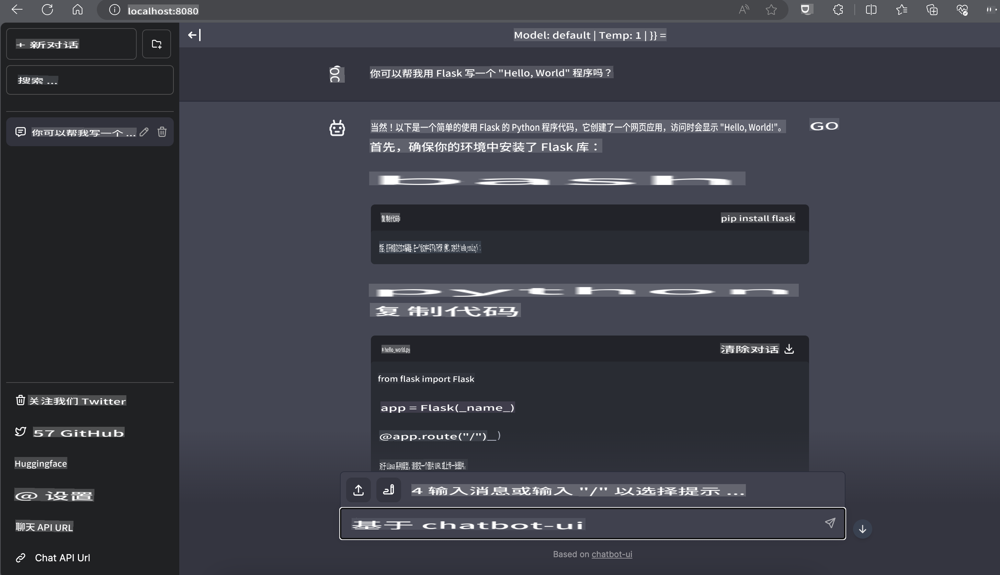

# **在 Nvidia Jetson 上运行推理 Phi-3**

Nvidia Jetson 是 Nvidia 推出的一系列嵌入式计算板。Jetson TK1、TX1 和 TX2 型号均搭载 Nvidia 的 Tegra 处理器（或 SoC），该处理器集成了基于 ARM 架构的中央处理单元（CPU）。Jetson 是一个低功耗系统，专为加速机器学习应用而设计。Nvidia Jetson 被专业开发者用于开发各行业的突破性 AI 产品，同时也被学生和爱好者用于动手学习 AI 和制作出色的项目。SLM 部署在诸如 Jetson 这样的边缘设备上，这将推动工业生成式 AI 应用场景的更好实现。

## 在 NVIDIA Jetson 上的部署：
从事自主机器人和嵌入式设备开发的开发者可以利用 Phi-3 Mini。Phi-3 的相对小巧体积使其非常适合边缘部署。训练过程中参数经过精心调校，确保了响应的高准确性。

### TensorRT-LLM 优化：
NVIDIA 的 [TensorRT-LLM 库](https://github.com/NVIDIA/TensorRT-LLM?WT.mc_id=aiml-138114-kinfeylo) 优化了大型语言模型的推理。它支持 Phi-3 Mini 的长上下文窗口，提升了吞吐量和延迟表现。优化包括 LongRoPE、FP8 和并行批处理等技术。

### 可用性和部署：
开发者可以通过 [NVIDIA's AI](https://www.nvidia.com/en-us/ai-data-science/generative-ai/) 探索 Phi-3 Mini 的 128K 上下文窗口。它被打包为 NVIDIA NIM，一种具有标准 API 的微服务，可部署到任何地方。此外，还可以参考 [GitHub 上的 TensorRT-LLM 实现](https://github.com/NVIDIA/TensorRT-LLM)。

## **1. 准备工作**

a. Jetson Orin NX / Jetson NX

b. JetPack 5.1.2+
   
c. Cuda 11.8
   
d. Python 3.8+

## **2. 在 Jetson 上运行 Phi-3**

我们可以选择 [Ollama](https://ollama.com) 或 [LlamaEdge](https://llamaedge.com)。

如果您希望在云端和边缘设备上同时使用 gguf，LlamaEdge 可以理解为 WasmEdge（WasmEdge 是一种轻量级、高性能、可扩展的 WebAssembly 运行时，适用于云原生、边缘和去中心化应用。它支持无服务器应用、嵌入式功能、微服务、智能合约和物联网设备）。通过 LlamaEdge，您可以将 gguf 的量化模型部署到边缘设备和云端。


以下是使用步骤：

1. 安装并下载相关库和文件

```bash

curl -sSf https://raw.githubusercontent.com/WasmEdge/WasmEdge/master/utils/install.sh | bash -s -- --plugin wasi_nn-ggml

curl -LO https://github.com/LlamaEdge/LlamaEdge/releases/latest/download/llama-api-server.wasm

curl -LO https://github.com/LlamaEdge/chatbot-ui/releases/latest/download/chatbot-ui.tar.gz

tar xzf chatbot-ui.tar.gz

```

**注意**: llama-api-server.wasm 和 chatbot-ui 需要放在同一目录下

2. 在终端运行脚本

```bash

wasmedge --dir .:. --nn-preload default:GGML:AUTO:{Your gguf path} llama-api-server.wasm -p phi-3-chat

```

以下是运行结果：



***示例代码*** [Phi-3 mini WASM Notebook Sample](https://github.com/Azure-Samples/Phi-3MiniSamples/tree/main/wasm)

总之，Phi-3 Mini 代表了语言建模的一个重大进步，结合了效率、上下文感知能力和 NVIDIA 的优化技术。不论您是在构建机器人还是边缘应用，Phi-3 Mini 都是一个值得关注的强大工具。

**免责声明**：  
本文件使用基于机器的人工智能翻译服务进行翻译。尽管我们努力确保准确性，但请注意，自动翻译可能包含错误或不准确之处。应将原文档的母语版本视为权威来源。对于关键信息，建议使用专业的人类翻译服务。我们对因使用本翻译而产生的任何误解或误读概不负责。