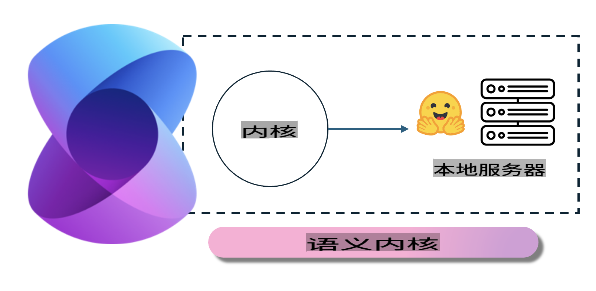

# **在本地服务器上推理 Phi-3**

我们可以在本地服务器上部署 Phi-3。用户可以选择 [Ollama](https://ollama.com) 或 [LM Studio](https://llamaedge.com) 解决方案，也可以编写自己的代码。您可以通过 [Semantic Kernel](https://github.com/microsoft/semantic-kernel?WT.mc_id=aiml-138114-kinfeylo) 或 [Langchain](https://www.langchain.com/) 连接 Phi-3 的本地服务，以构建 Copilot 应用程序。

## **使用 Semantic Kernel 访问 Phi-3-mini**

在 Copilot 应用程序中，我们通过 Semantic Kernel / LangChain 创建应用程序。这种应用程序框架通常兼容 Azure OpenAI Service / OpenAI 模型，也可以支持 Hugging Face 的开源模型和本地模型。如果我们想使用 Semantic Kernel 访问 Phi-3-mini，该怎么办？以 .NET 为例，我们可以将其与 Semantic Kernel 中的 Hugging Face Connector 结合使用。默认情况下，它可以对应 Hugging Face 上的模型 ID（首次使用时，模型会从 Hugging Face 下载，耗时较长）。您也可以连接到自建的本地服务。相比之下，我们推荐使用后者，因为它在企业应用中具有更高的自主性。

从图中可以看到，通过 Semantic Kernel 访问本地服务，可以轻松连接自建的 Phi-3-mini 模型服务器。以下是运行结果：

***示例代码*** https://github.com/kinfey/Phi3MiniSamples/tree/main/semantickernel

**免责声明**：  
本文件使用基于机器的人工智能翻译服务进行翻译。尽管我们尽力确保翻译的准确性，但请注意，自动翻译可能包含错误或不准确之处。应以原文的本国语言版本作为权威来源。对于关键信息，建议寻求专业的人类翻译服务。我们不对因使用本翻译而引起的任何误解或误读承担责任。