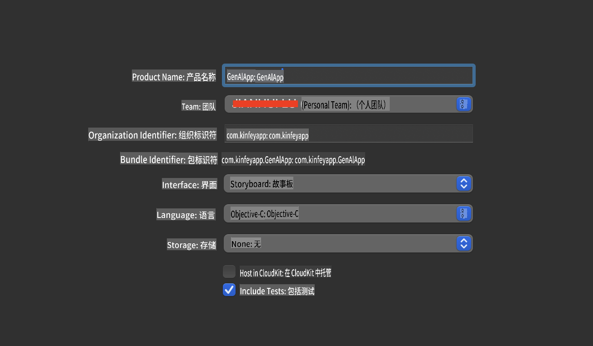
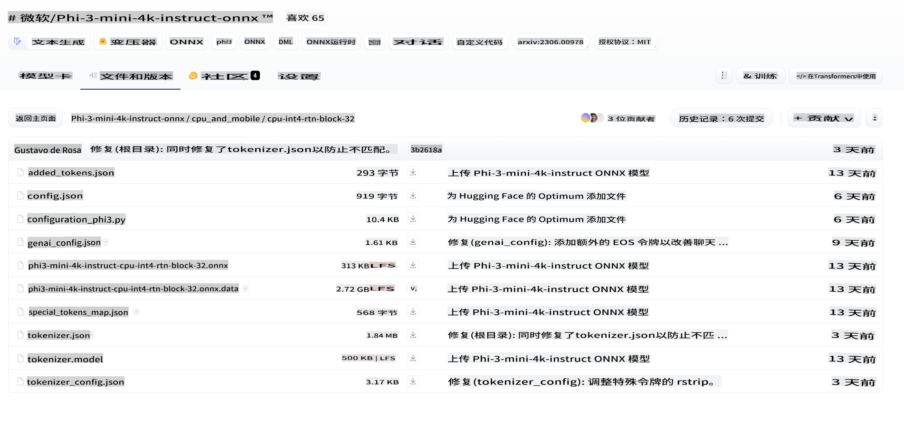
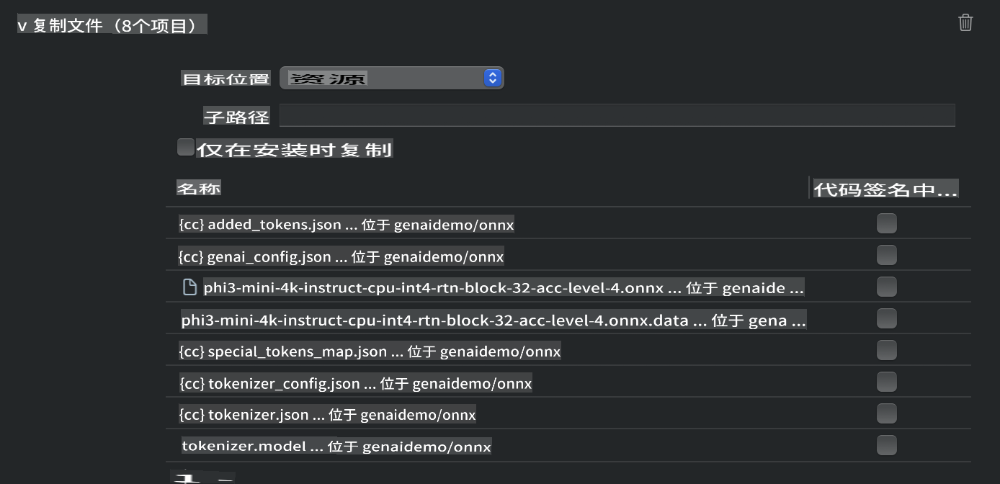
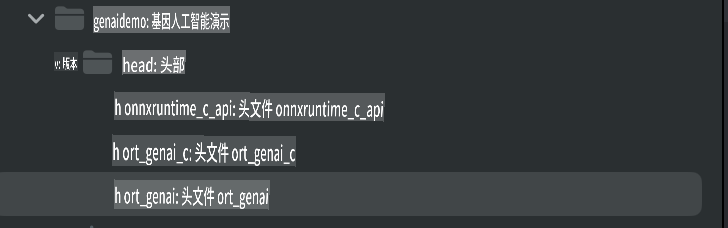
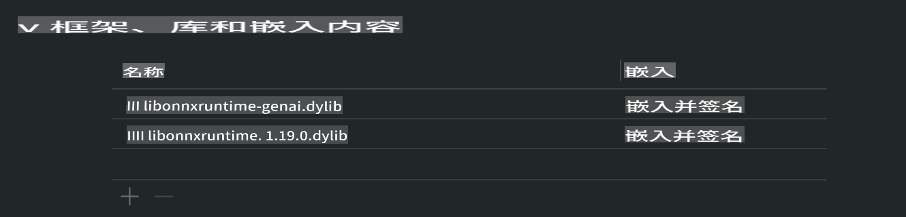
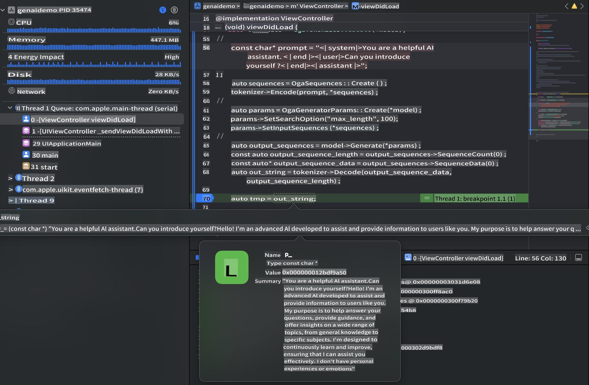

# **在 iOS 上推理 Phi-3**

Phi-3-mini 是微软推出的一系列新模型，可以在边缘设备和物联网设备上部署大型语言模型（LLMs）。Phi-3-mini 支持在 iOS、Android 和边缘设备上部署，使生成式 AI 能够在 BYOD 环境中使用。以下示例展示了如何在 iOS 上部署 Phi-3-mini。

## **1. 准备工作**

- **a.** macOS 14+
- **b.** Xcode 15+
- **c.** iOS SDK 17.x（iPhone 14 A16 或更高版本）
- **d.** 安装 Python 3.10+（推荐使用 Conda）
- **e.** 安装 Python 库：`python-flatbuffers`
- **f.** 安装 CMake

### Semantic Kernel 和推理

Semantic Kernel 是一个应用框架，允许您创建与 Azure OpenAI 服务、OpenAI 模型以及本地模型兼容的应用程序。通过 Semantic Kernel 访问本地服务，可以轻松集成自托管的 Phi-3-mini 模型服务器。

### 使用 Ollama 或 LlamaEdge 调用量化模型

许多用户倾向于使用量化模型来在本地运行模型。[Ollama](https://ollama.com) 和 [LlamaEdge](https://llamaedge.com) 允许用户调用不同的量化模型：

#### **Ollama**

您可以直接运行 `ollama run phi3` 或在离线模式下配置。创建一个 Modelfile 并指定 `gguf` 文件的路径。以下是运行 Phi-3-mini 量化模型的示例代码：

```gguf
FROM {Add your gguf file path}
TEMPLATE \"\"\"<|user|> .Prompt<|end|> <|assistant|>\"\"\"
PARAMETER stop <|end|>
PARAMETER num_ctx 4096
```

#### **LlamaEdge**

如果您希望同时在云端和边缘设备上使用 `gguf`，LlamaEdge 是一个不错的选择。

## **2. 为 iOS 编译 ONNX Runtime**

```bash

git clone https://github.com/microsoft/onnxruntime.git

cd onnxruntime

./build.sh --build_shared_lib --ios --skip_tests --parallel --build_dir ./build_ios --ios --apple_sysroot iphoneos --osx_arch arm64 --apple_deploy_target 17.5 --cmake_generator Xcode --config Release

cd ../

```

### **注意事项**

- **a.** 在编译之前，确保 Xcode 已正确配置，并在终端中将其设置为活动开发者目录：

    ```bash
    sudo xcode-select -switch /Applications/Xcode.app/Contents/Developer
    ```

- **b.** ONNX Runtime 需要为不同的平台进行编译。对于 iOS，可以编译为 `arm64` or `x86_64`。

- **c.** 推荐使用最新的 iOS SDK 进行编译。不过，如果需要兼容旧版本的 SDK，也可以使用较旧的版本。

## **3. 使用 ONNX Runtime 为 iOS 编译生成式 AI**

> **注意：** 由于基于 ONNX Runtime 的生成式 AI 仍处于预览阶段，请注意可能存在的变更。

```bash

git clone https://github.com/microsoft/onnxruntime-genai
 
cd onnxruntime-genai
 
mkdir ort
 
cd ort
 
mkdir include
 
mkdir lib
 
cd ../
 
cp ../onnxruntime/include/onnxruntime/core/session/onnxruntime_c_api.h ort/include
 
cp ../onnxruntime/build_ios/Release/Release-iphoneos/libonnxruntime*.dylib* ort/lib
 
export OPENCV_SKIP_XCODEBUILD_FORCE_TRYCOMPILE_DEBUG=1
 
python3 build.py --parallel --build_dir ./build_ios --ios --ios_sysroot iphoneos --ios_arch arm64 --ios_deployment_target 17.5 --cmake_generator Xcode --cmake_extra_defines CMAKE_XCODE_ATTRIBUTE_CODE_SIGNING_ALLOWED=NO

```

## **4. 在 Xcode 中创建 App 应用程序**

我选择使用 Objective-C 作为 App 的开发方式，因为在使用基于 ONNX Runtime 的 C++ API 时，Objective-C 的兼容性更好。当然，您也可以通过 Swift bridging 完成相关调用。



## **5. 将 ONNX 量化的 INT4 模型复制到 App 应用程序项目中**

我们需要导入 ONNX 格式的 INT4 量化模型，首先需要下载该模型。



下载完成后，需要将其添加到 Xcode 项目的 Resources 目录中。



## **6. 在 ViewControllers 中添加 C++ API**

> **注意：**

- **a.** 将对应的 C++ 头文件添加到项目中。

  

- **b.** 包含 `onnxruntime-genai` dynamic library in Xcode.

  

- **c.** Use the C Samples code for testing. You can also add additional features like ChatUI for more functionality.

- **d.** Since you need to use C++ in your project, rename `ViewController.m` to `ViewController.mm` 以启用 Objective-C++ 支持。

```objc

    NSString *llmPath = [[NSBundle mainBundle] resourcePath];
    char const *modelPath = llmPath.cString;

    auto model =  OgaModel::Create(modelPath);

    auto tokenizer = OgaTokenizer::Create(*model);

    const char* prompt = "<|system|>You are a helpful AI assistant.<|end|><|user|>Can you introduce yourself?<|end|><|assistant|>";

    auto sequences = OgaSequences::Create();
    tokenizer->Encode(prompt, *sequences);

    auto params = OgaGeneratorParams::Create(*model);
    params->SetSearchOption("max_length", 100);
    params->SetInputSequences(*sequences);

    auto output_sequences = model->Generate(*params);
    const auto output_sequence_length = output_sequences->SequenceCount(0);
    const auto* output_sequence_data = output_sequences->SequenceData(0);
    auto out_string = tokenizer->Decode(output_sequence_data, output_sequence_length);
    
    auto tmp = out_string;

```

## **7. 运行应用程序**

设置完成后，您可以运行应用程序，查看 Phi-3-mini 模型推理的结果。



有关更多示例代码和详细说明，请访问 [Phi-3 Mini Samples 仓库](https://github.com/Azure-Samples/Phi-3MiniSamples/tree/main/ios)。

**免责声明**:  
本文档使用基于机器的人工智能翻译服务进行翻译。尽管我们尽力确保准确性，但请注意，自动翻译可能包含错误或不准确之处。应以原始语言的文档作为权威来源。对于关键信息，建议寻求专业人工翻译。我们不对因使用本翻译而引起的任何误解或误读承担责任。