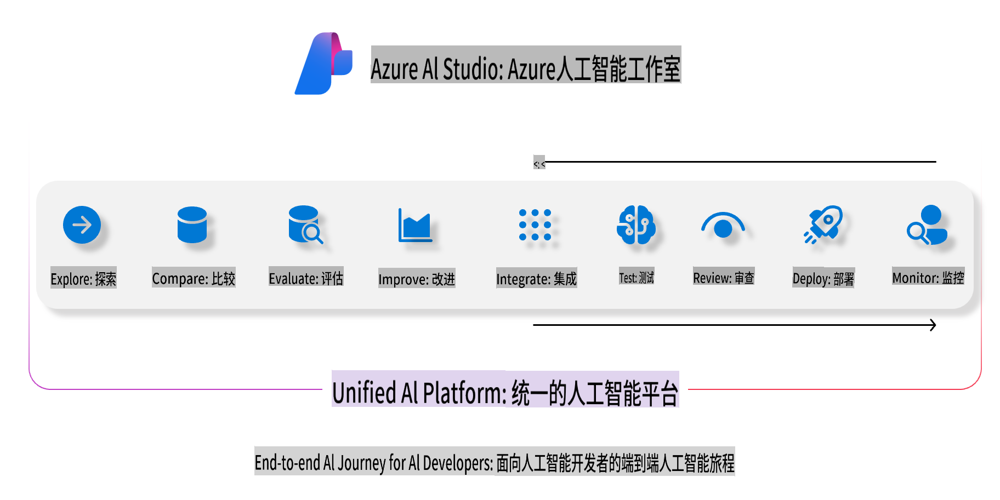
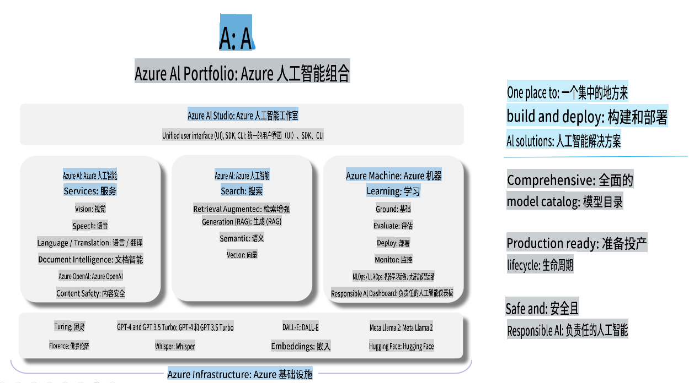

# **使用 Azure AI Foundry 进行评估**

如何使用 [Azure AI Foundry](https://ai.azure.com?WT.mc_id=aiml-138114-kinfeylo) 评估您的生成式 AI 应用程序。无论是单轮对话还是多轮对话，Azure AI Foundry 都提供了评估模型性能和安全性的工具。

## 如何使用 Azure AI Foundry 评估生成式 AI 应用程序
有关详细说明，请参阅 [Azure AI Foundry 文档](https://learn.microsoft.com/azure/ai-studio/how-to/evaluate-generative-ai-app?WT.mc_id=aiml-138114-kinfeylo)。

以下是开始的步骤：

## 在 Azure AI Foundry 中评估生成式 AI 模型

**先决条件**

- 一个以 CSV 或 JSON 格式存储的测试数据集。
- 一个已部署的生成式 AI 模型（如 Phi-3、GPT 3.5、GPT 4 或 Davinci 模型）。
- 一个具有计算实例的运行时环境，用于运行评估。

## 内置评估指标

Azure AI Foundry 允许您评估单轮对话和复杂的多轮对话。
对于基于检索增强生成（RAG）场景的模型，可以使用内置评估指标来评估性能。
此外，您还可以评估一般的单轮问答场景（非 RAG）。

## 创建评估运行

从 Azure AI Foundry 的用户界面，导航到“评估”页面或“Prompt Flow”页面。
按照评估创建向导设置评估运行。可以为评估提供一个可选的名称。
选择与您的应用目标一致的场景。
选择一个或多个评估指标来评估模型输出。

## 自定义评估流程（可选）

如果需要更大的灵活性，您可以建立一个自定义评估流程。根据您的具体需求定制评估过程。

## 查看结果

在运行评估后，您可以记录、查看并分析 Azure AI Foundry 中的详细评估指标。深入了解您的应用程序的能力和局限性。

**注意** Azure AI Foundry 当前处于公开预览阶段，因此建议将其用于实验和开发目的。对于生产工作负载，请考虑其他选项。有关更多详细信息和分步说明，请查看官方 [AI Foundry 文档](https://learn.microsoft.com/azure/ai-studio/?WT.mc_id=aiml-138114-kinfeylo)。

**免责声明**：  
本文件通过基于机器的AI翻译服务翻译而成。尽管我们努力确保准确性，但请注意，自动翻译可能包含错误或不准确之处。应以原文的母语版本作为权威来源。对于关键信息，建议寻求专业人工翻译服务。因使用本翻译而引起的任何误解或误读，我们概不负责。