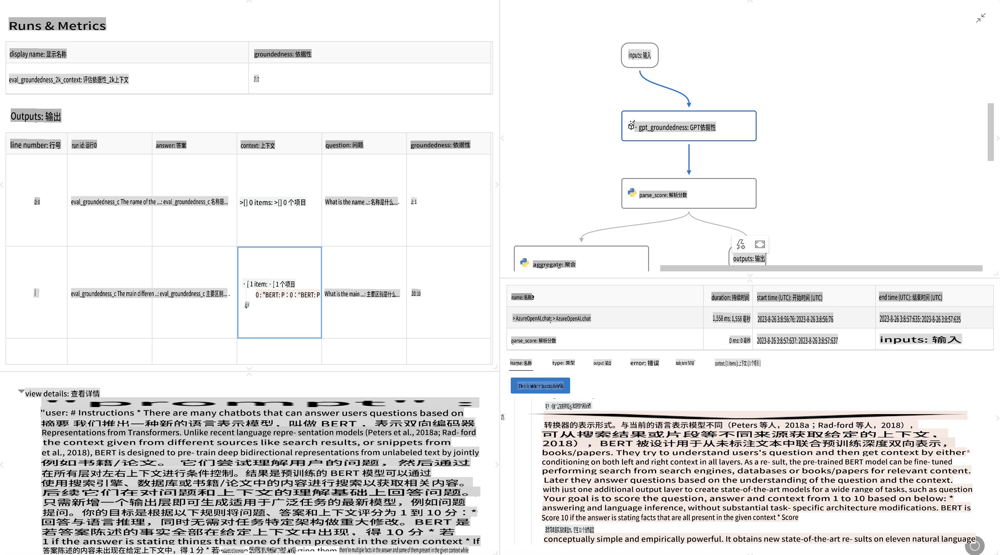

# **介绍 Promptflow**

[Microsoft Prompt Flow](https://microsoft.github.io/promptflow/index.html?WT.mc_id=aiml-138114-kinfeylo) 是一个可视化的工作流自动化工具，允许用户通过预构建模板和自定义连接器创建自动化工作流。它旨在帮助开发人员和业务分析师快速构建数据管理、协作和流程优化等任务的自动化流程。借助 Prompt Flow，用户可以轻松连接不同的服务、应用程序和系统，自动化复杂的业务流程。

Microsoft Prompt Flow 专为简化基于大型语言模型 (LLMs) 的 AI 应用开发全周期而设计。无论是构思、原型设计、测试、评估还是部署基于 LLM 的应用程序，Prompt Flow 都能简化流程，帮助您构建具有生产质量的 LLM 应用。

## 以下是使用 Microsoft Prompt Flow 的主要功能和优势：

**交互式创作体验**

Prompt Flow 提供了工作流结构的可视化表示，使您能够轻松理解和导航项目。
它还提供了类似笔记本的编码体验，以提高工作流开发和调试的效率。

**提示变体与优化**

创建和比较多个提示变体，以便进行迭代优化过程。评估不同提示的性能并选择最有效的提示。

**内置评估流程**

利用内置评估工具评估提示和工作流的质量与效果。
了解基于 LLM 的应用程序的性能表现。

**丰富的资源库**

Prompt Flow 包含内置工具、示例和模板库。这些资源既是开发的起点，又能激发创意并加速开发过程。

**协作与企业级准备**

支持团队协作，允许多个用户共同参与提示工程项目。
维护版本控制并高效共享知识。优化从开发、评估到部署和监控的整个提示工程流程。

## 在 Prompt Flow 中的评估

在 Microsoft Prompt Flow 中，评估是衡量 AI 模型性能的重要环节。让我们来看看如何在 Prompt Flow 中自定义评估流程和指标：

**理解 Prompt Flow 中的评估**

在 Prompt Flow 中，工作流表示处理输入并生成输出的一系列节点。评估流程是一种特殊类型的工作流，旨在根据特定的标准和目标评估运行的性能。

**评估流程的关键特性**

它们通常在被测试的工作流之后运行，利用其输出。它们计算分数或指标来衡量被测试工作流的性能。指标可以包括准确率、相关性评分或其他相关衡量标准。

### 自定义评估流程

**定义输入**

评估流程需要接收被测试运行的输出。定义输入的方式与标准工作流类似。
例如，如果您正在评估一个问答工作流，可以将输入命名为“answer”。如果评估一个分类工作流，可以将输入命名为“category”。还可能需要提供真实标签输入（例如实际标签）。

**输出与指标**

评估流程生成测量被测试工作流性能的结果。可以使用 Python 或 LLM（大型语言模型）计算指标。使用 log_metric() 函数记录相关指标。

**使用自定义评估流程**

根据您的具体任务和目标开发自己的评估流程。根据评估目标自定义指标。
将此自定义评估流程应用于批量运行以进行大规模测试。

## 内置评估方法

Prompt Flow 还提供了内置的评估方法。
您可以提交批量运行，并使用这些方法评估工作流在大型数据集上的表现。
查看评估结果，比较指标，并根据需要进行迭代。
请记住，评估对于确保您的 AI 模型满足预期标准和目标至关重要。查阅官方文档，了解在 Microsoft Prompt Flow 中开发和使用评估流程的详细说明。

总之，Microsoft Prompt Flow 通过简化提示工程和提供强大的开发环境，帮助开发人员创建高质量的 LLM 应用程序。如果您正在使用 LLM，Prompt Flow 是一个值得探索的工具。查阅 [Prompt Flow 评估文档](https://learn.microsoft.com/azure/machine-learning/prompt-flow/how-to-develop-an-evaluation-flow?view=azureml-api-2?WT.mc_id=aiml-138114-kinfeylo)，了解在 Microsoft Prompt Flow 中开发和使用评估流程的详细说明。

**免责声明**：  
本文件是使用基于机器的人工智能翻译服务翻译的。尽管我们努力确保翻译的准确性，但请注意，自动翻译可能包含错误或不准确之处。应以原始语言的文件为权威来源。对于关键信息，建议使用专业人工翻译。我们对于因使用本翻译而产生的任何误解或误读不承担责任。