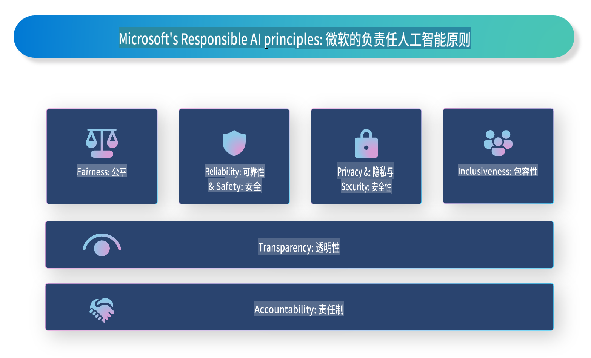

# **介绍负责任的人工智能**

[Microsoft Responsible AI](https://www.microsoft.com/ai/responsible-ai?WT.mc_id=aiml-138114-kinfeylo) 是一项旨在帮助开发者和组织构建透明、可信和负责任的人工智能系统的倡议。该倡议为开发符合隐私、公平性和透明性等伦理原则的负责任AI解决方案提供了指导和资源。我们还将探讨构建负责任AI系统所面临的一些挑战以及最佳实践。

## Microsoft负责任AI概述

**伦理原则**

Microsoft负责任AI以一系列伦理原则为指导，例如隐私、公平性、透明性、责任和安全性。这些原则旨在确保AI系统以伦理和负责任的方式开发。

**透明的AI**

Microsoft负责任AI强调AI系统透明性的重要性。这包括提供清晰的AI模型工作原理解释，以及确保数据来源和算法公开可用。

**负责任的AI**

[Microsoft Responsible AI](https://www.microsoft.com/ai/responsible-ai?WT.mc_id=aiml-138114-kinfeylo) 推动开发能够对AI模型决策提供洞见的负责任AI系统。这有助于用户理解并信任AI系统的输出。

**包容性**

AI系统应设计为惠及所有人。Microsoft致力于创建考虑多元化视角并避免偏见或歧视的包容性AI。

**可靠性和安全性**

确保AI系统的可靠性和安全性至关重要。Microsoft专注于构建性能稳定且避免产生有害结果的强大模型。

**AI中的公平性**

Microsoft负责任AI认识到，若AI系统基于有偏数据或算法进行训练，可能会延续偏见。该倡议为开发不因种族、性别或年龄等因素而歧视的公平AI系统提供指导。

**隐私与安全**

Microsoft负责任AI强调保护AI系统中用户隐私和数据安全的重要性。这包括实施强大的数据加密和访问控制，以及定期审计AI系统的漏洞。

**责任与担当**

Microsoft负责任AI提倡在AI开发和部署中体现责任和担当。这包括确保开发者和组织意识到AI系统的潜在风险，并采取措施加以缓解。

## 构建负责任AI系统的最佳实践

**使用多样化数据集开发AI模型**

为避免AI系统中的偏见，使用能够代表多种视角和经验的多样化数据集非常重要。

**采用可解释的AI技术**

可解释的AI技术可以帮助用户理解AI模型如何做出决策，从而增加对系统的信任。

**定期审计AI系统的漏洞**

定期审计AI系统有助于识别需要解决的潜在风险和漏洞。

**实施强大的数据加密和访问控制**

数据加密和访问控制有助于保护AI系统中的用户隐私和安全。

**在AI开发中遵循伦理原则**

遵循公平性、透明性和责任等伦理原则，有助于建立对AI系统的信任，并确保其以负责任的方式开发。

## 使用AI Foundry实现负责任AI

[Azure AI Foundry](https://ai.azure.com?WT.mc_id=aiml-138114-kinfeylo) 是一个强大的平台，允许开发者和组织快速创建智能、尖端、面向市场且负责任的应用程序。以下是Azure AI Foundry的一些关键功能和能力：

**现成的API和模型**

Azure AI Foundry 提供预构建和可定制的API和模型。这些覆盖了广泛的AI任务，包括生成式AI、自然语言处理、搜索、监控、翻译、语音、视觉和决策。

**Prompt Flow**

Azure AI Foundry中的Prompt Flow让您能够创建对话式AI体验。它允许您设计和管理对话流，从而更容易构建聊天机器人、虚拟助手和其他交互式应用。

**检索增强生成 (RAG)**

RAG是一种结合检索式和生成式方法的技术。通过利用现有知识（检索）和创造性生成（生成），它提高了生成响应的质量。

**生成式AI的评估和监控指标**

Azure AI Foundry 提供用于评估和监控生成式AI模型的工具。您可以评估其性能、公平性等关键指标，以确保负责任的部署。此外，如果您创建了仪表板，可以使用Azure Machine Learning Studio中的无代码UI，基于[Responsible AI Toolbox](https://responsibleaitoolbox.ai/?WT.mc_id=aiml-138114-kinfeylo) Python库自定义并生成负责任AI仪表板及相关评分卡。该评分卡帮助您与技术和非技术利益相关者分享与公平性、特征重要性等负责任部署相关的关键洞见。

使用AI Foundry实现负责任AI时，您可以遵循以下最佳实践：

**定义AI系统的问题和目标**

在开发过程开始前，明确定义您的AI系统旨在解决的问题或目标。这将帮助您确定构建有效模型所需的数据、算法和资源。

**收集和预处理相关数据**

用于训练AI系统的数据质量和数量对其性能有显著影响。因此，重要的是收集相关数据，对其进行清理和预处理，并确保其能够代表您试图解决的人群或问题。

**选择适当的评估算法**

有多种评估算法可用。根据您的数据和问题选择最适合的算法非常重要。

**评估和解释模型**

构建AI模型后，使用适当的指标评估其性能，并以透明的方式解释结果。这将帮助您识别模型中的任何偏差或局限性，并在必要时进行改进。

**确保透明性和可解释性**

AI系统应具有透明性和可解释性，以便用户理解其工作原理和决策方式。这对于对人类生活有重大影响的应用（如医疗、金融和法律系统）尤为重要。

**监控和更新模型**

AI系统应持续监控和更新，以确保其长期保持准确性和有效性。这需要对模型进行持续的维护、测试和重新训练。

总之，Microsoft负责任AI是一项旨在帮助开发者和组织构建透明、可信和负责任AI系统的倡议。请记住，负责任AI的实施至关重要，而Azure AI Foundry致力于使其对组织变得实用。通过遵循伦理原则和最佳实践，我们可以确保AI系统以负责任的方式开发和部署，从而惠及整个社会。

**免责声明**：  
本文档使用基于机器的AI翻译服务进行翻译。尽管我们尽力确保准确性，但请注意，自动翻译可能包含错误或不准确之处。应以原始语言的文档为权威来源。对于关键信息，建议寻求专业人工翻译。对于因使用本翻译而引起的任何误解或误读，我们概不负责。