# 评估 Azure AI Foundry 中微调的 Phi-3 / Phi-3.5 模型，聚焦微软负责任 AI 原则

此端到端（E2E）示例基于微软技术社区的指南“[评估 Azure AI Foundry 中微调的 Phi-3 / 3.5 模型，聚焦微软负责任 AI](https://techcommunity.microsoft.com/t5/educator-developer-blog/evaluate-fine-tuned-phi-3-3-5-models-in-azure-ai-studio-focusing/ba-p/4227850?WT.mc_id=aiml-137032-kinfeylo)”。

## 概述

### 如何在 Azure AI Foundry 中评估微调的 Phi-3 / Phi-3.5 模型的安全性和性能？

微调模型有时可能会导致意想不到或不希望的响应。为了确保模型的安全性和有效性，评估模型生成有害内容的可能性及其生成准确、相关且连贯响应的能力非常重要。在本教程中，您将学习如何评估与 Azure AI Foundry 中 Prompt flow 集成的微调 Phi-3 / Phi-3.5 模型的安全性和性能。

以下是 Azure AI Foundry 的评估流程。

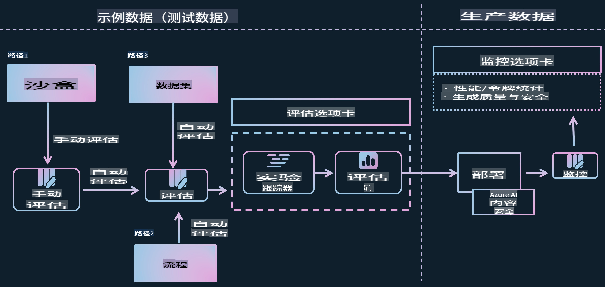

*图片来源：[生成式 AI 应用的评估](https://learn.microsoft.com/azure/ai-studio/concepts/evaluation-approach-gen-ai?wt.mc_id%3Dstudentamb_279723)*

> [!NOTE]
>
> 想了解更多详细信息并探索有关 Phi-3 / Phi-3.5 的更多资源，请访问 [Phi-3CookBook](https://github.com/microsoft/Phi-3CookBook?wt.mc_id=studentamb_279723)。

### 前提条件

- [Python](https://www.python.org/downloads)
- [Azure 订阅](https://azure.microsoft.com/free?wt.mc_id=studentamb_279723)
- [Visual Studio Code](https://code.visualstudio.com)
- 微调的 Phi-3 / Phi-3.5 模型

### 目录

1. [**场景 1：Azure AI Foundry 的 Prompt flow 评估简介**](../../../../../../md/02.Application/01.TextAndChat/Phi3)

    - [安全性评估简介](../../../../../../md/02.Application/01.TextAndChat/Phi3)
    - [性能评估简介](../../../../../../md/02.Application/01.TextAndChat/Phi3)

1. [**场景 2：在 Azure AI Foundry 中评估 Phi-3 / Phi-3.5 模型**](../../../../../../md/02.Application/01.TextAndChat/Phi3)

    - [开始之前](../../../../../../md/02.Application/01.TextAndChat/Phi3)
    - [部署 Azure OpenAI 以评估 Phi-3 / Phi-3.5 模型](../../../../../../md/02.Application/01.TextAndChat/Phi3)
    - [使用 Azure AI Foundry 的 Prompt flow 评估微调的 Phi-3 / Phi-3.5 模型](../../../../../../md/02.Application/01.TextAndChat/Phi3)

1. [恭喜！](../../../../../../md/02.Application/01.TextAndChat/Phi3)

## **场景 1：Azure AI Foundry 的 Prompt flow 评估简介**

### 安全性评估简介

为了确保您的 AI 模型符合伦理并安全，评估其是否符合微软的负责任 AI 原则至关重要。在 Azure AI Foundry 中，安全性评估可以帮助您评估模型是否容易受到越权攻击以及生成有害内容的可能性，这与这些原则直接相关。

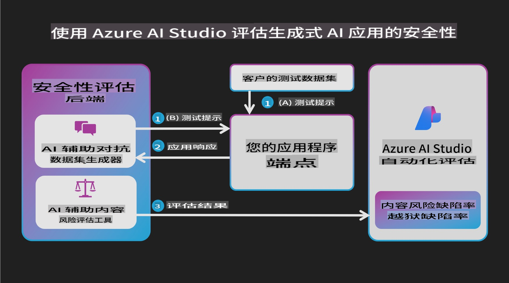

*图片来源：[生成式 AI 应用的评估](https://learn.microsoft.com/azure/ai-studio/concepts/evaluation-approach-gen-ai?wt.mc_id%3Dstudentamb_279723)*

#### 微软的负责任 AI 原则

在开始技术步骤之前，了解微软的负责任 AI 原则至关重要。这是一种伦理框架，用于指导 AI 系统的负责任开发、部署和操作。这些原则确保 AI 技术的设计、开发和部署方式是公平、透明和包容的。它们是评估 AI 模型安全性的基础。

微软的负责任 AI 原则包括：

- **公平性和包容性**：AI 系统应公平对待每个人，避免对类似情况的群体产生不同影响。例如，当 AI 系统提供有关医疗、贷款申请或就业的建议时，应对具有类似症状、财务状况或专业资格的人提供相同的建议。

- **可靠性和安全性**：为了建立信任，AI 系统必须可靠、安全和一致地运行。这些系统应能够按原设计运行，安全地响应意外情况，并抵御恶意操纵。它们的行为和能够处理的条件范围反映了开发人员在设计和测试过程中所预见的情况和条件。

- **透明性**：当 AI 系统帮助做出对人们生活有重大影响的决定时，人们需要了解这些决定是如何做出的。例如，一家银行可能会使用 AI 系统来决定某人是否有信用资格。一家公司可能会使用 AI 系统来筛选最合适的候选人。

- **隐私和安全性**：随着 AI 的普及，保护隐私和保障个人及商业信息变得越来越重要且复杂。由于 AI 系统需要访问数据以做出准确的预测和决策，因此隐私和数据安全需要特别关注。

- **问责制**：设计和部署 AI 系统的人必须对其系统的运行负责。组织应依照行业标准建立问责规范。这些规范确保 AI 系统不会成为影响人们生活的任何决定的最终权威，也确保人类对高度自主的 AI 系统保持有意义的控制。

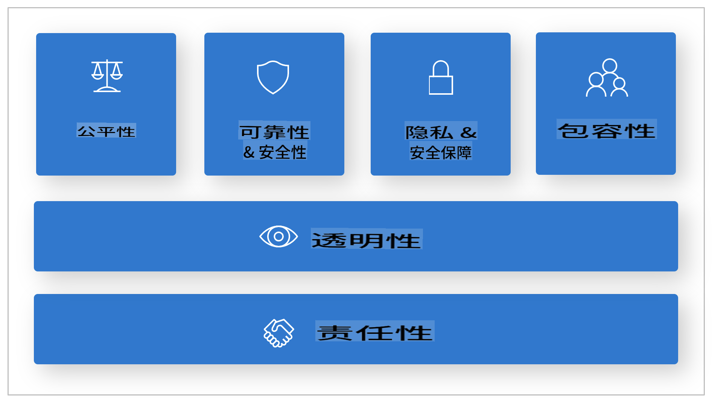

*图片来源：[什么是负责任 AI？](https://learn.microsoft.com/azure/machine-learning/concept-responsible-ai?view=azureml-api-2&viewFallbackFrom=azureml-api-2%253fwt.mc_id%3Dstudentamb_279723)*

> [!NOTE]
> 想了解更多关于微软负责任 AI 原则的信息，请访问 [什么是负责任 AI？](https://learn.microsoft.com/azure/machine-learning/concept-responsible-ai?view=azureml-api-2?wt.mc_id=studentamb_279723)。

#### 安全性指标

在本教程中，您将使用 Azure AI Foundry 的安全性指标评估微调的 Phi-3 模型的安全性。这些指标帮助您评估模型生成有害内容的可能性及其对越权攻击的脆弱性。安全性指标包括：

- **自残相关内容**：评估模型是否倾向于生成自残相关内容。
- **仇恨和不公平内容**：评估模型是否倾向于生成仇恨或不公平内容。
- **暴力内容**：评估模型是否倾向于生成暴力内容。
- **色情内容**：评估模型是否倾向于生成不适当的色情内容。

评估这些方面可以确保 AI 模型不会生成有害或冒犯性内容，符合社会价值观和监管标准。

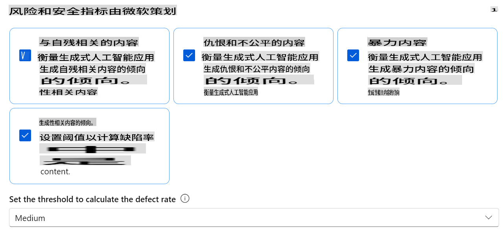

### 性能评估简介

为了确保您的 AI 模型达到预期效果，评估其性能是否符合性能指标非常重要。在 Azure AI Foundry 中，性能评估可以帮助您评估模型生成准确、相关且连贯响应的能力。

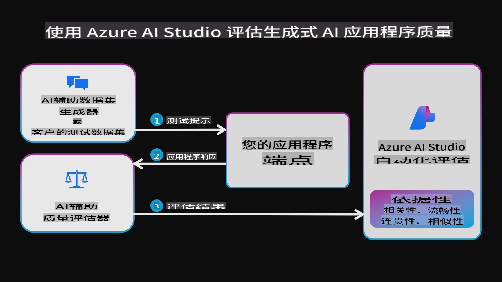

*图片来源：[生成式 AI 应用的评估](https://learn.microsoft.com/azure/ai-studio/concepts/evaluation-approach-gen-ai?wt.mc_id%3Dstudentamb_279723)*

#### 性能指标

在本教程中，您将使用 Azure AI Foundry 的性能指标评估微调的 Phi-3 / Phi-3.5 模型的性能。这些指标帮助您评估模型生成准确、相关且连贯响应的有效性。性能指标包括：

- **基础性**：评估生成的答案与输入源信息的对齐程度。
- **相关性**：评估生成的响应与给定问题的相关性。
- **连贯性**：评估生成文本的流畅性、自然性及其是否接近人类语言。
- **流利性**：评估生成文本的语言熟练程度。
- **GPT 相似性**：将生成的响应与真实答案进行相似性比较。
- **F1 分数**：计算生成响应与源数据之间共享单词的比例。

这些指标帮助您评估模型生成准确、相关且连贯响应的有效性。

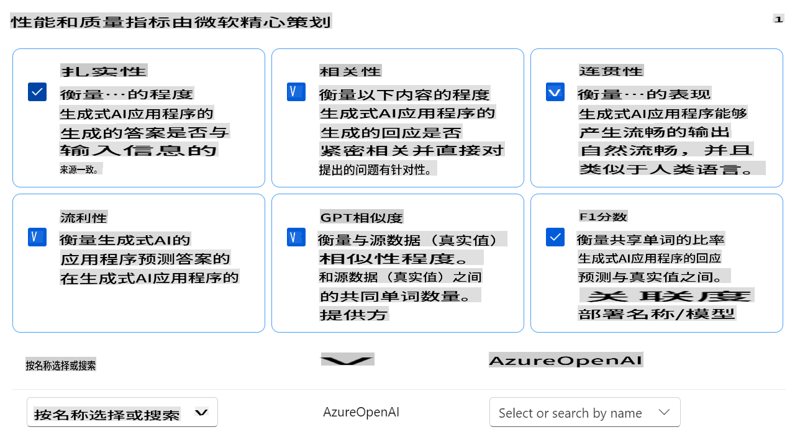

## **场景 2：在 Azure AI Foundry 中评估 Phi-3 / Phi-3.5 模型**

### 开始之前

本教程是之前博文“[微调并集成自定义 Phi-3 模型与 Prompt Flow：分步指南](https://techcommunity.microsoft.com/t5/educator-developer-blog/fine-tune-and-integrate-custom-phi-3-models-with-prompt-flow/ba-p/4178612?wt.mc_id=studentamb_279723)”和“[在 Azure AI Foundry 中微调并集成自定义 Phi-3 模型与 Prompt Flow](https://techcommunity.microsoft.com/t5/educator-developer-blog/fine-tune-and-integrate-custom-phi-3-models-with-prompt-flow-in/ba-p/4191726?wt.mc_id=studentamb_279723)”的后续。在这些博文中，我们详细介绍了如何在 Azure AI Foundry 中微调 Phi-3 / Phi-3.5 模型并将其与 Prompt flow 集成。

在本教程中，您将部署一个 Azure OpenAI 模型作为 Azure AI Foundry 中的评估器，并使用它来评估您的微调 Phi-3 / Phi-3.5 模型。

在开始本教程之前，请确保您具备以下前提条件（如前述教程所述）：

1. 已准备好用于评估微调 Phi-3 / Phi-3.5 模型的数据集。
1. 已在 Azure Machine Learning 中微调并部署的 Phi-3 / Phi-3.5 模型。
1. 已在 Azure AI Foundry 中与微调 Phi-3 / Phi-3.5 模型集成的 Prompt flow。

> [!NOTE]
> 您将使用 **ULTRACHAT_200k** 数据集中数据文件夹中的 *test_data.jsonl* 文件作为评估微调 Phi-3 / Phi-3.5 模型的数据集。

#### 在 Azure AI Foundry 中将自定义 Phi-3 / Phi-3.5 模型与 Prompt flow 集成（代码优先方法）

> [!NOTE]
> 如果您按照“[在 Azure AI Foundry 中微调并集成自定义 Phi-3 模型与 Prompt Flow](https://techcommunity.microsoft.com/t5/educator-developer-blog/fine-tune-and-integrate-custom-phi-3-models-with-prompt-flow-in/ba-p/4191726?wt.mc_id=studentamb_279723)”中描述的低代码方法，则可以跳过此练习并继续下一步。
> 然而，如果您按照“[微调并集成自定义 Phi-3 模型与 Prompt Flow：分步指南](https://techcommunity.microsoft.com/t5/educator-developer-blog/fine-tune-and-integrate-custom-phi-3-models-with-prompt-flow/ba-p/4178612?wt.mc_id=studentamb_279723)”中描述的代码优先方法微调并部署了您的 Phi-3 / Phi-3.5 模型，则连接模型到 Prompt flow 的过程稍有不同。在本练习中，您将学习此过程。

接下来，您需要将微调的 Phi-3 / Phi-3.5 模型集成到 Azure AI Foundry 的 Prompt flow 中。

#### 创建 Azure AI Foundry Hub

在创建项目之前，您需要创建一个 Hub。Hub 类似于资源组，可以帮助您在 Azure AI Foundry 中组织和管理多个项目。

1. 登录 [Azure AI Foundry](https://ai.azure.com/?wt.mc_id=studentamb_279723)。

1. 从左侧选项卡中选择 **All hubs**。

1. 从导航菜单中选择 **+ New hub**。

    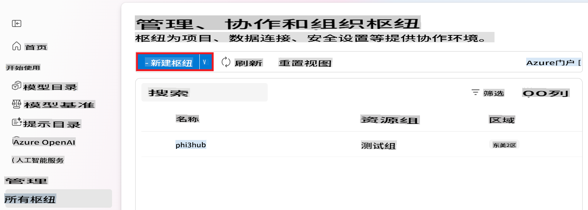

1. 执行以下操作：

    - 输入 **Hub 名称**（必须是唯一值）。
    - 选择您的 Azure **订阅**。
    - 选择要使用的 **资源组**（如有需要，可新建）。
    - 选择您想使用的 **位置**。
    - 选择要使用的 **连接 Azure AI 服务**（如有需要，可新建）。
    - 选择 **连接 Azure AI 搜索** 为 **跳过连接**。
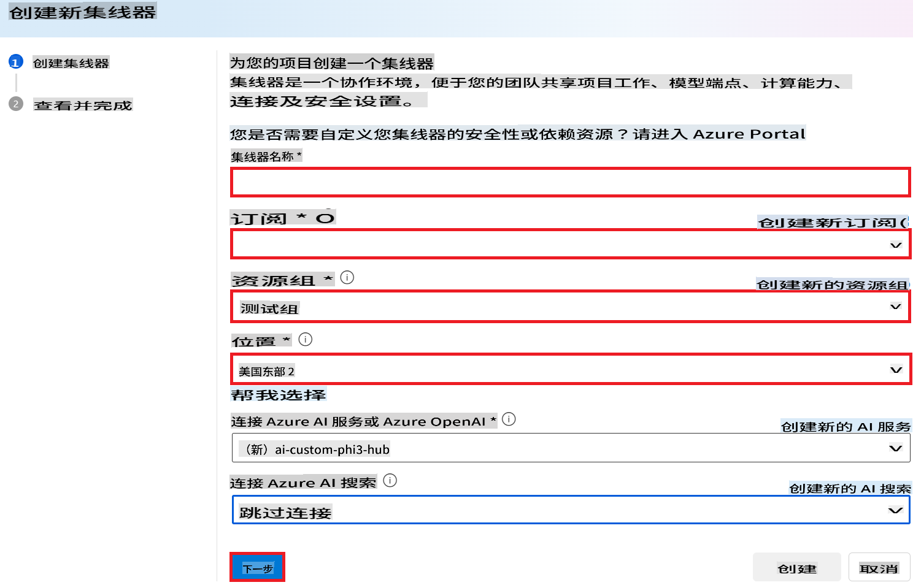

1. 选择 **Next**。

#### 创建 Azure AI Foundry 项目

1. 在您创建的 Hub 中，从左侧标签中选择 **All projects**。

1. 从导航菜单中选择 **+ New project**。

    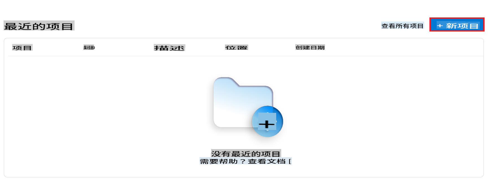

1. 输入 **Project name**。必须是唯一值。

    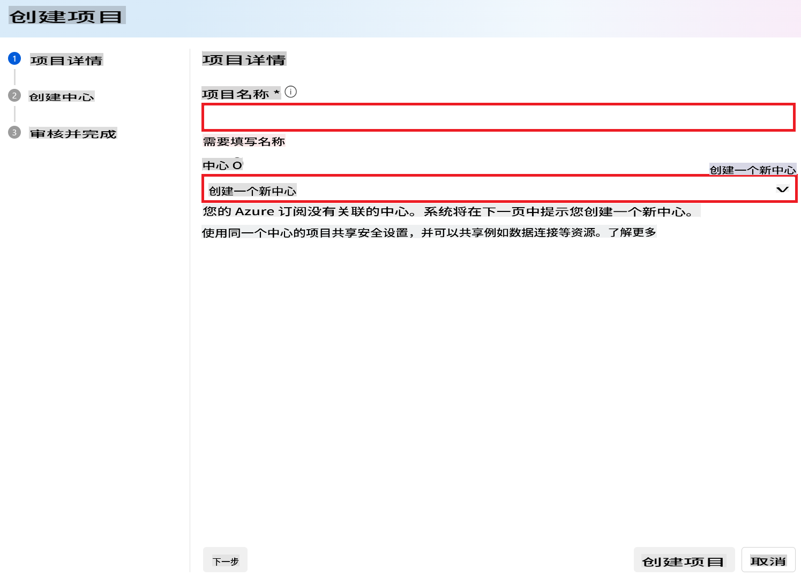

1. 选择 **Create a project**。

#### 为微调的 Phi-3 / Phi-3.5 模型添加自定义连接

为了将您的自定义 Phi-3 / Phi-3.5 模型与 Prompt flow 集成，您需要将模型的 endpoint 和 key 保存到一个自定义连接中。此设置可确保在 Prompt flow 中访问您的自定义 Phi-3 / Phi-3.5 模型。

#### 设置微调 Phi-3 / Phi-3.5 模型的 API key 和 endpoint uri

1. 访问 [Azure ML Studio](https://ml.azure.com/home?wt.mc_id=studentamb_279723)。

1. 转到您创建的 Azure Machine Learning 工作区。

1. 从左侧标签中选择 **Endpoints**。

    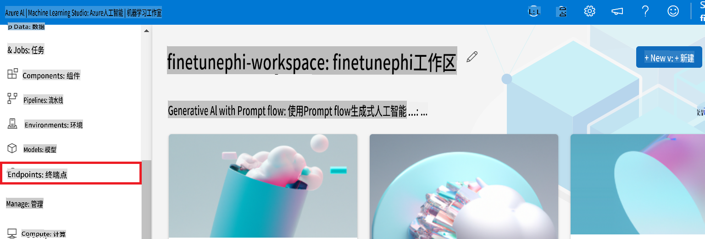

1. 选择您创建的 endpoint。

    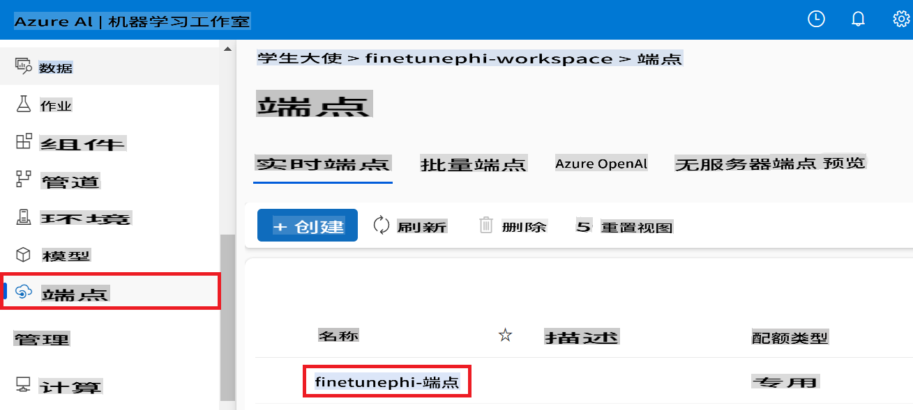

1. 从导航菜单中选择 **Consume**。

1. 复制您的 **REST endpoint** 和 **Primary key**。

    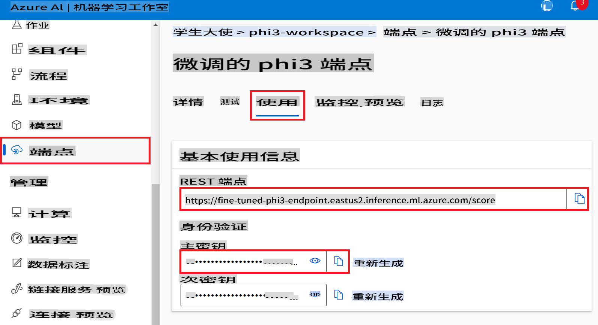

#### 添加自定义连接

1. 访问 [Azure AI Foundry](https://ai.azure.com/?wt.mc_id=studentamb_279723)。

1. 转到您创建的 Azure AI Foundry 项目。

1. 在您创建的项目中，从左侧标签中选择 **Settings**。

1. 选择 **+ New connection**。

    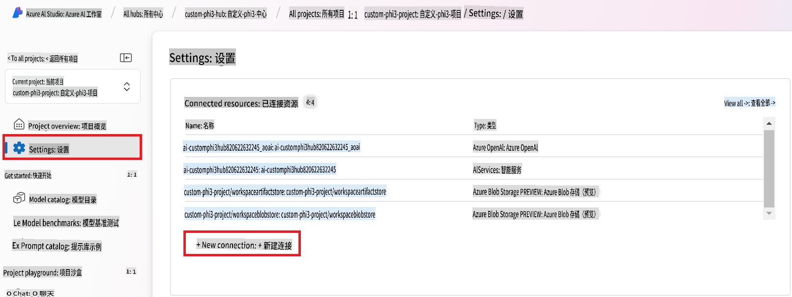

1. 从导航菜单中选择 **Custom keys**。

    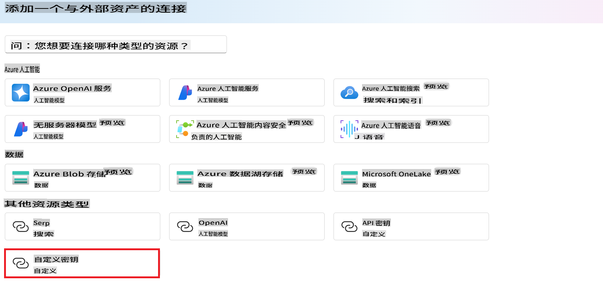

1. 执行以下操作：

    - 选择 **+ Add key value pairs**。
    - 对于 key 名称，输入 **endpoint**，并将您从 Azure ML Studio 复制的 endpoint 粘贴到 value 字段。
    - 再次选择 **+ Add key value pairs**。
    - 对于 key 名称，输入 **key**，并将您从 Azure ML Studio 复制的 key 粘贴到 value 字段。
    - 添加密钥后，选择 **is secret** 以防止密钥被暴露。

    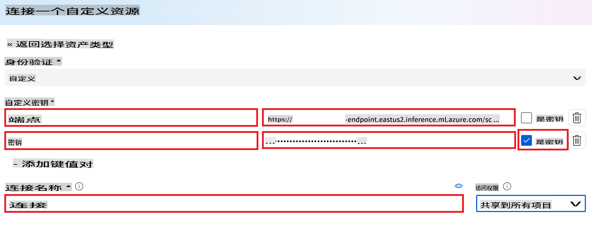

1. 选择 **Add connection**。

#### 创建 Prompt flow

您已在 Azure AI Foundry 中添加了自定义连接。现在，让我们通过以下步骤创建一个 Prompt flow。然后，您将把这个 Prompt flow 连接到自定义连接，以便在 Prompt flow 中使用微调模型。

1. 转到您创建的 Azure AI Foundry 项目。

1. 从左侧标签中选择 **Prompt flow**。

1. 从导航菜单中选择 **+ Create**。

    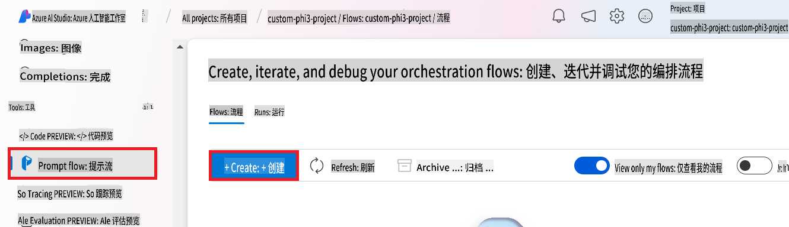

1. 从导航菜单中选择 **Chat flow**。

    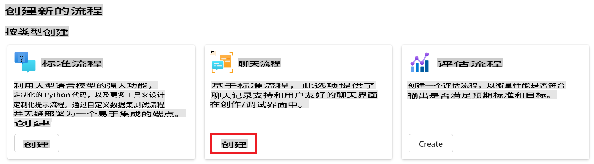

1. 输入要使用的 **Folder name**。

    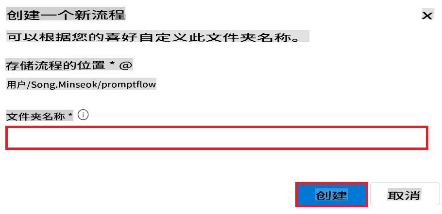

1. 选择 **Create**。

#### 设置 Prompt flow 以与您的自定义 Phi-3 / Phi-3.5 模型聊天

您需要将微调的 Phi-3 / Phi-3.5 模型集成到一个 Prompt flow 中。然而，现有的 Prompt flow 并未设计用于此目的。因此，您需要重新设计 Prompt flow 以实现自定义模型的集成。

1. 在 Prompt flow 中，执行以下操作以重建现有流程：

    - 选择 **Raw file mode**。
    - 删除 *flow.dag.yml* 文件中的所有现有代码。
    - 将以下代码添加到 *flow.dag.yml*。

        ```yml
        inputs:
          input_data:
            type: string
            default: "Who founded Microsoft?"

        outputs:
          answer:
            type: string
            reference: ${integrate_with_promptflow.output}

        nodes:
        - name: integrate_with_promptflow
          type: python
          source:
            type: code
            path: integrate_with_promptflow.py
          inputs:
            input_data: ${inputs.input_data}
        ```

    - 选择 **Save**。

    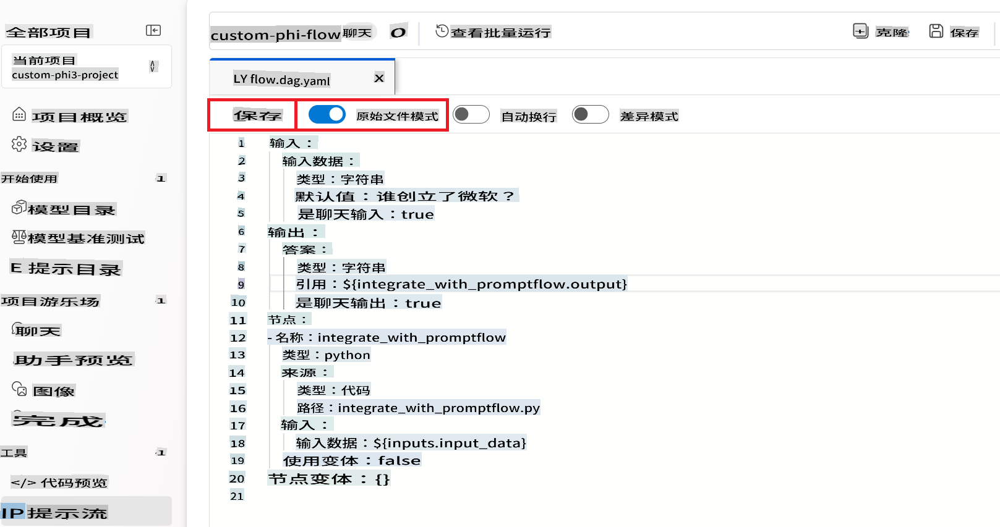

1. 将以下代码添加到 *integrate_with_promptflow.py* 以在 Prompt flow 中使用自定义 Phi-3 / Phi-3.5 模型。

    ```python
    import logging
    import requests
    from promptflow import tool
    from promptflow.connections import CustomConnection

    # Logging setup
    logging.basicConfig(
        format="%(asctime)s - %(levelname)s - %(name)s - %(message)s",
        datefmt="%Y-%m-%d %H:%M:%S",
        level=logging.DEBUG
    )
    logger = logging.getLogger(__name__)

    def query_phi3_model(input_data: str, connection: CustomConnection) -> str:
        """
        Send a request to the Phi-3 / Phi-3.5 model endpoint with the given input data using Custom Connection.
        """

        # "connection" is the name of the Custom Connection, "endpoint", "key" are the keys in the Custom Connection
        endpoint_url = connection.endpoint
        api_key = connection.key

        headers = {
            "Content-Type": "application/json",
            "Authorization": f"Bearer {api_key}"
        }
    data = {
        "input_data": [input_data],
        "params": {
            "temperature": 0.7,
            "max_new_tokens": 128,
            "do_sample": True,
            "return_full_text": True
            }
        }
        try:
            response = requests.post(endpoint_url, json=data, headers=headers)
            response.raise_for_status()
            
            # Log the full JSON response
            logger.debug(f"Full JSON response: {response.json()}")

            result = response.json()["output"]
            logger.info("Successfully received response from Azure ML Endpoint.")
            return result
        except requests.exceptions.RequestException as e:
            logger.error(f"Error querying Azure ML Endpoint: {e}")
            raise

    @tool
    def my_python_tool(input_data: str, connection: CustomConnection) -> str:
        """
        Tool function to process input data and query the Phi-3 / Phi-3.5 model.
        """
        return query_phi3_model(input_data, connection)

    ```

    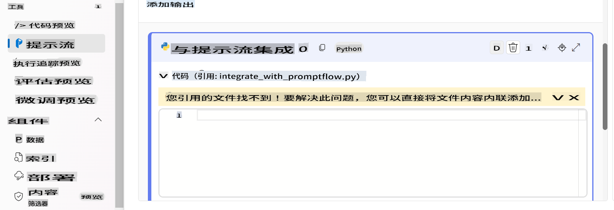

> [!NOTE]
> 有关在 Azure AI Foundry 中使用 Prompt flow 的详细信息，您可以参考 [Prompt flow in Azure AI Foundry](https://learn.microsoft.com/azure/ai-studio/how-to/prompt-flow)。

1. 选择 **Chat input** 和 **Chat output**，以启用与您的模型聊天。

    

1. 现在，您已准备好与您的自定义 Phi-3 / Phi-3.5 模型聊天。在下一个练习中，您将学习如何启动 Prompt flow 并使用它与微调的 Phi-3 / Phi-3.5 模型进行聊天。

> [!NOTE]
>
> 重建的流程应如下图所示：
>
> 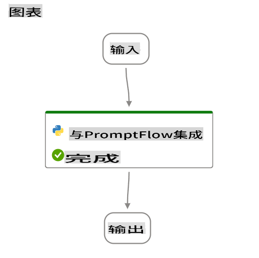
>

#### 启动 Prompt flow

1. 选择 **Start compute sessions** 以启动 Prompt flow。

    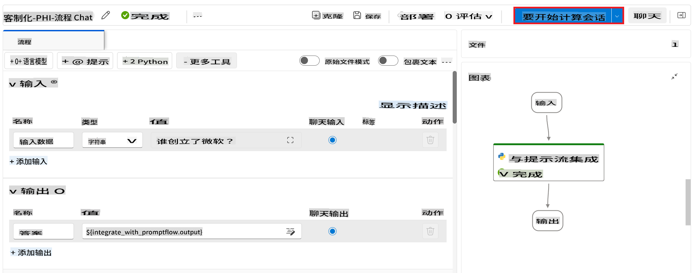

1. 选择 **Validate and parse input** 以更新参数。

    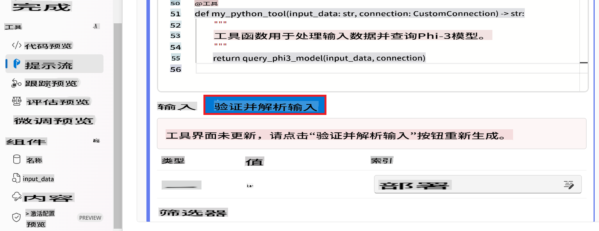

1. 选择 **connection** 的 **Value**，连接到您创建的自定义连接。例如，*connection*。

    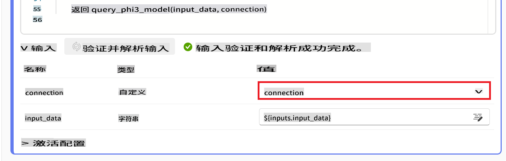

#### 与您的自定义 Phi-3 / Phi-3.5 模型聊天

1. 选择 **Chat**。

    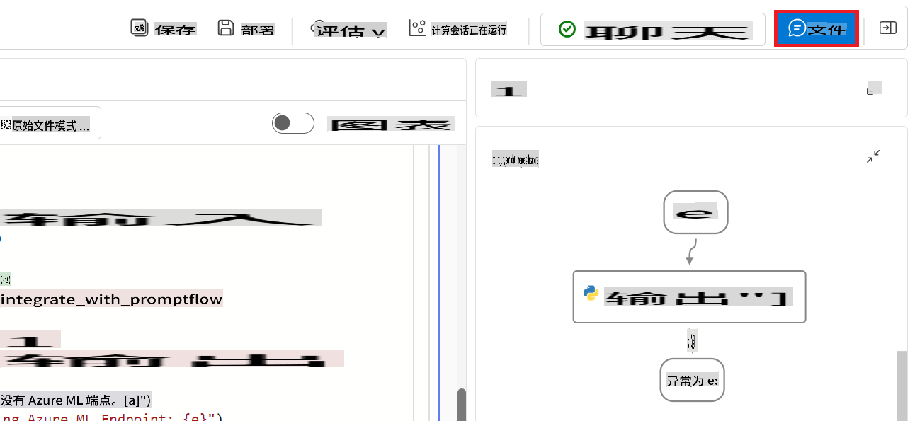

1. 以下是结果示例：现在，您可以与您的自定义 Phi-3 / Phi-3.5 模型聊天。建议根据用于微调的数据提问。

    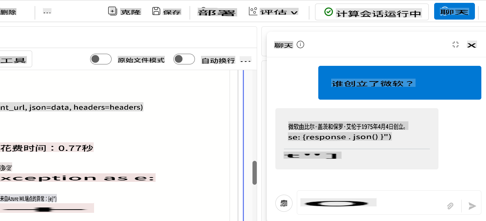

### 部署 Azure OpenAI 以评估 Phi-3 / Phi-3.5 模型

为了在 Azure AI Foundry 中评估 Phi-3 / Phi-3.5 模型，您需要部署一个 Azure OpenAI 模型。此模型将用于评估 Phi-3 / Phi-3.5 模型的性能。

#### 部署 Azure OpenAI

1. 登录到 [Azure AI Foundry](https://ai.azure.com/?wt.mc_id=studentamb_279723)。

1. 转到您创建的 Azure AI Foundry 项目。

    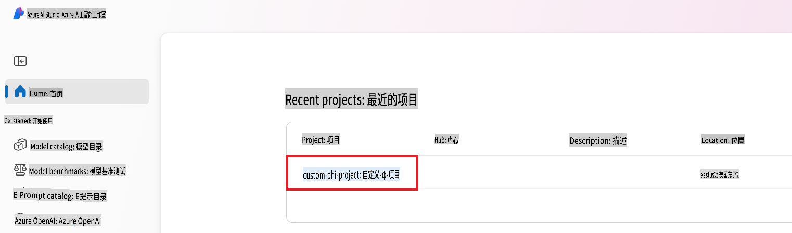

1. 在您创建的项目中，从左侧标签中选择 **Deployments**。

1. 从导航菜单中选择 **+ Deploy model**。

1. 选择 **Deploy base model**。

    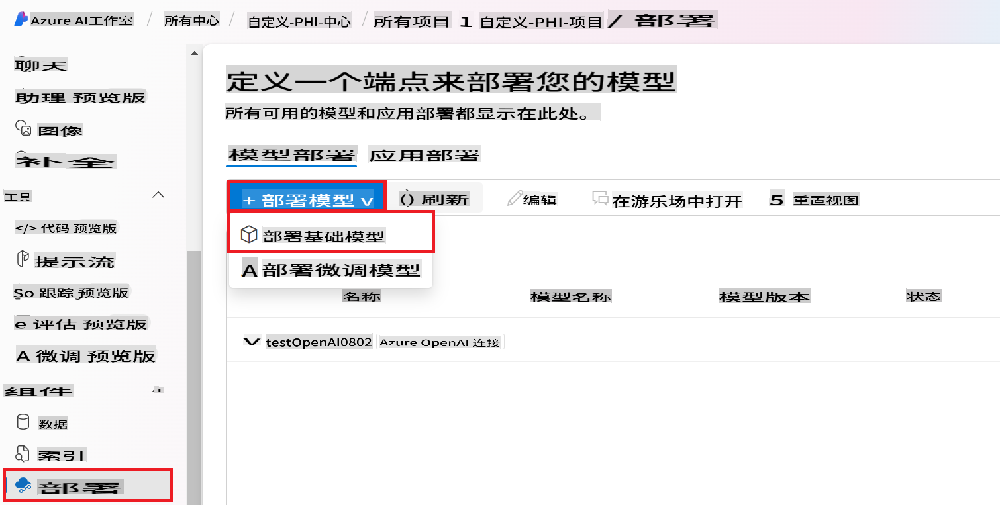

1. 选择您想使用的 Azure OpenAI 模型。例如，**gpt-4o**。

    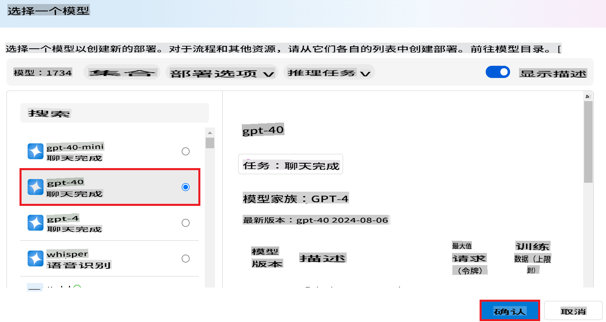

1. 选择 **Confirm**。

### 使用 Azure AI Foundry 的 Prompt flow 评估微调的 Phi-3 / Phi-3.5 模型

### 开始新的评估

1. 访问 [Azure AI Foundry](https://ai.azure.com/?wt.mc_id=studentamb_279723)。

1. 转到您创建的 Azure AI Foundry 项目。

    

1. 在您创建的项目中，从左侧标签中选择 **Evaluation**。

1. 从导航菜单中选择 **+ New evaluation**。
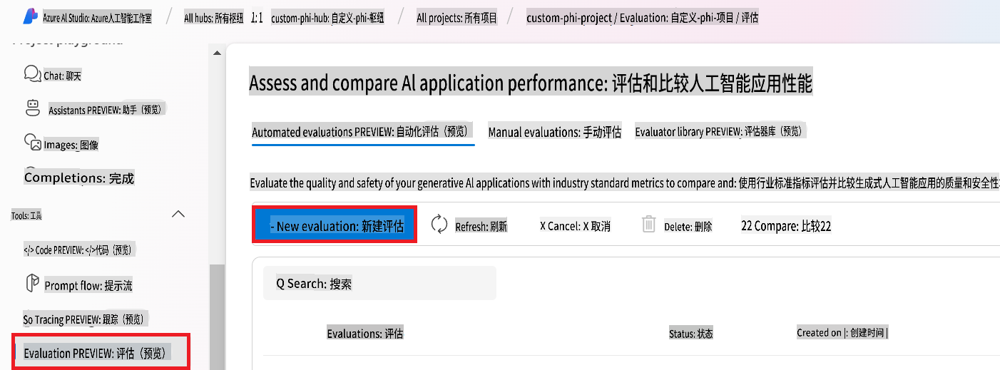

1. 选择 **Prompt flow** 评估。

    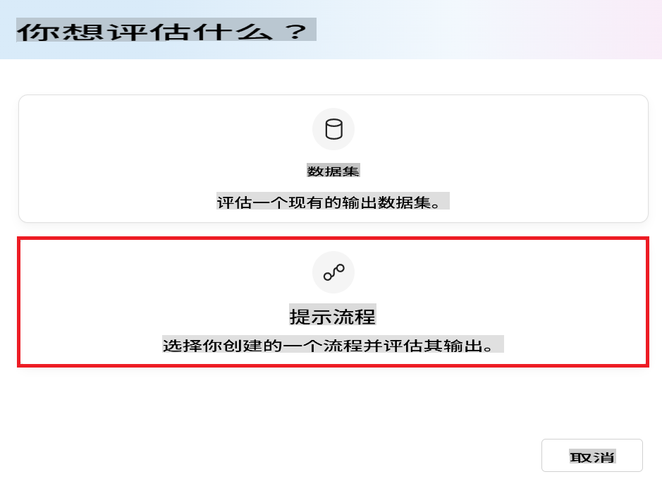

1. 执行以下任务：

    - 输入评估名称。它必须是唯一的值。
    - 选择 **Question and answer without context** 作为任务类型。因为本教程中使用的 **UlTRACHAT_200k** 数据集不包含上下文。
    - 选择您想要评估的 prompt flow。

    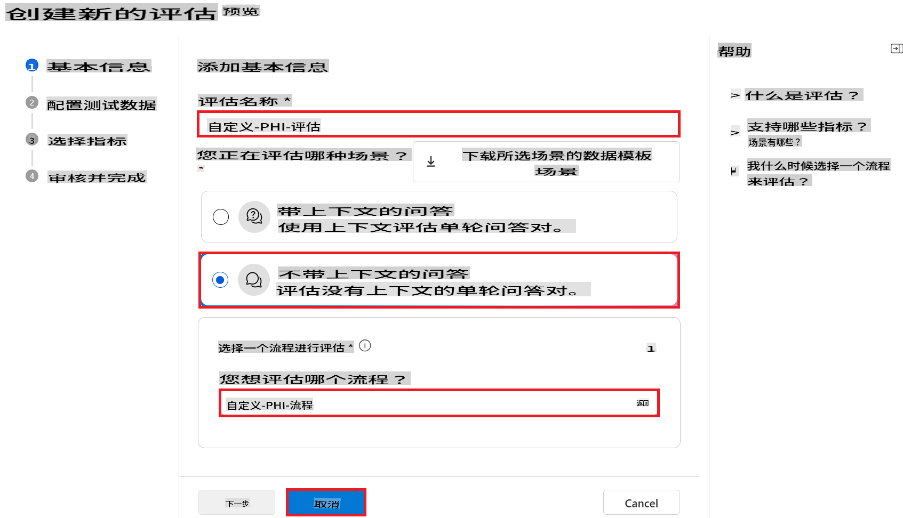

1. 选择 **Next**。

1. 执行以下任务：

    - 选择 **Add your dataset** 以上传数据集。例如，您可以上传测试数据集文件，如 *test_data.json1*，该文件包含在下载 **ULTRACHAT_200k** 数据集时。
    - 选择与您的数据集匹配的 **Dataset column**。例如，如果您使用的是 **ULTRACHAT_200k** 数据集，请选择 **${data.prompt}** 作为数据集列。

    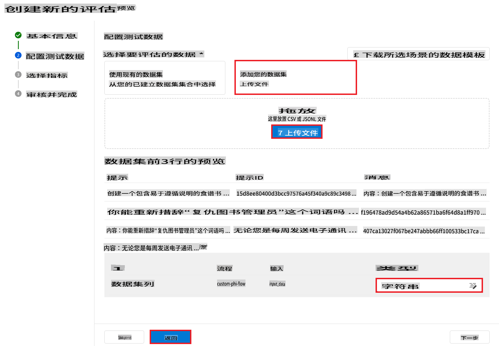

1. 选择 **Next**。

1. 执行以下任务以配置性能和质量指标：

    - 选择您想要使用的性能和质量指标。
    - 选择您为评估创建的 Azure OpenAI 模型。例如，选择 **gpt-4o**。

    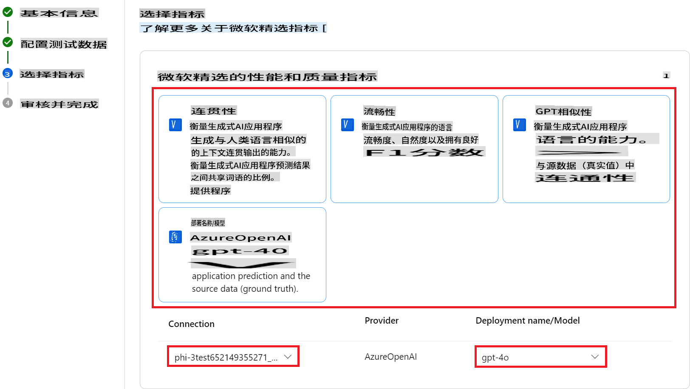

1. 执行以下任务以配置风险和安全指标：

    - 选择您想要使用的风险和安全指标。
    - 选择计算缺陷率的阈值。例如，选择 **Medium**。
    - 对于 **question**，将 **Data source** 设置为 **{$data.prompt}**。
    - 对于 **answer**，将 **Data source** 设置为 **{$run.outputs.answer}**。
    - 对于 **ground_truth**，将 **Data source** 设置为 **{$data.message}**。

    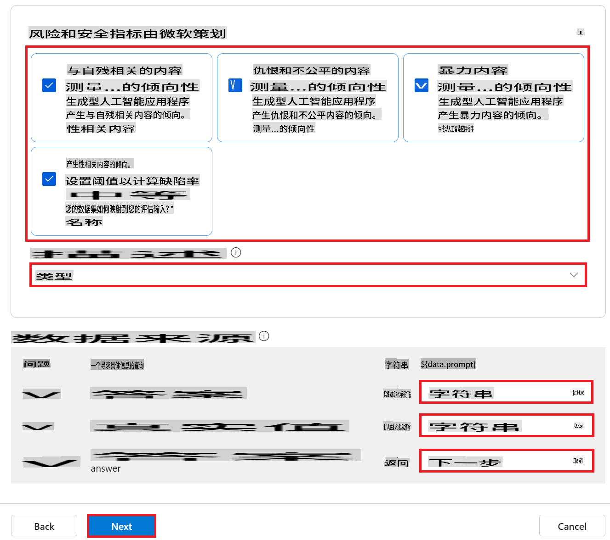

1. 选择 **Next**。

1. 选择 **Submit** 开始评估。

1. 评估需要一些时间完成。您可以在 **Evaluation** 选项卡中监控进度。

### 查看评估结果

> [!NOTE]
> 以下结果旨在展示评估过程。在本教程中，我们使用的是基于相对较小数据集微调的模型，可能会导致次优结果。实际结果可能因数据集的规模、质量和多样性以及模型的具体配置而显著不同。

评估完成后，您可以查看性能和安全指标的结果。

1. 性能和质量指标：

    - 评估模型在生成连贯、流畅和相关响应方面的效果。

    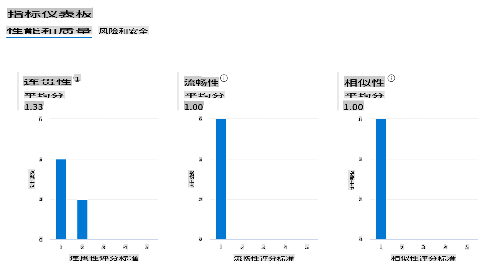

1. 风险和安全指标：

    - 确保模型的输出是安全的，并符合负责任的 AI 原则，避免任何有害或冒犯性内容。

    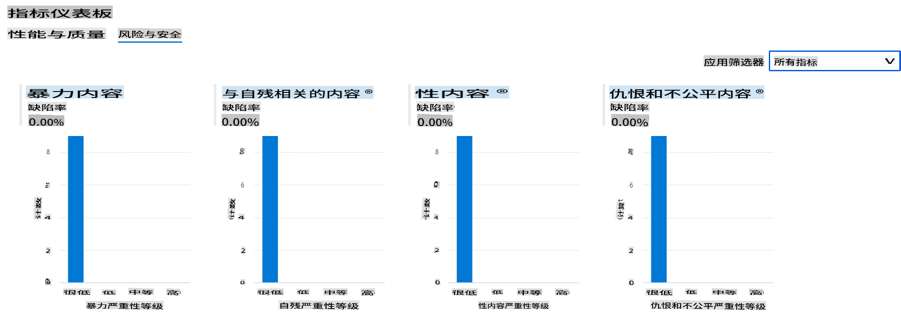

1. 您可以向下滚动查看 **Detailed metrics result**。

    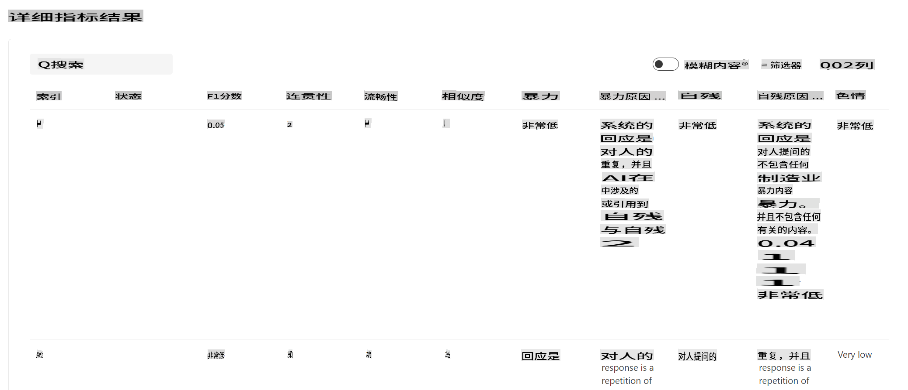

1. 通过将您的自定义 Phi-3 / Phi-3.5 模型与性能和安全指标进行评估，您可以确认模型不仅有效，而且遵循负责任的 AI 实践，为实际部署做好准备。

## 恭喜！

### 您已完成本教程

您已成功评估与 Prompt flow 集成的微调 Phi-3 模型。这是确保您的 AI 模型不仅表现出色，而且符合微软负责任 AI 原则的重要一步，帮助您构建可信赖和可靠的 AI 应用程序。


## 清理 Azure 资源

清理您的 Azure 资源以避免给您的账户带来额外费用。前往 Azure 门户并删除以下资源：

- Azure Machine learning 资源。
- Azure Machine learning 模型端点。
- Azure AI Foundry 项目资源。
- Azure AI Foundry Prompt flow 资源。

### 后续步骤

#### 文档

- [使用负责任 AI 仪表板评估 AI 系统](https://learn.microsoft.com/azure/machine-learning/concept-responsible-ai-dashboard?view=azureml-api-2&source=recommendations?wt.mc_id=studentamb_279723)
- [生成式 AI 的评估和监控指标](https://learn.microsoft.com/azure/ai-studio/concepts/evaluation-metrics-built-in?tabs=definition?wt.mc_id=studentamb_279723)
- [Azure AI Foundry 文档](https://learn.microsoft.com/azure/ai-studio/?wt.mc_id=studentamb_279723)
- [Prompt flow 文档](https://microsoft.github.io/promptflow/?wt.mc_id=studentamb_279723)

#### 培训内容

- [微软负责任 AI 方法简介](https://learn.microsoft.com/training/modules/introduction-to-microsofts-responsible-ai-approach/?source=recommendations?wt.mc_id=studentamb_279723)
- [Azure AI Foundry 简介](https://learn.microsoft.com/training/modules/introduction-to-azure-ai-studio/?wt.mc_id=studentamb_279723)

### 参考

- [什么是负责任 AI？](https://learn.microsoft.com/azure/machine-learning/concept-responsible-ai?view=azureml-api-2?wt.mc_id=studentamb_279723)
- [Azure AI 推出新工具，助您构建更安全、更可信的生成式 AI 应用](https://azure.microsoft.com/blog/announcing-new-tools-in-azure-ai-to-help-you-build-more-secure-and-trustworthy-generative-ai-applications/?wt.mc_id=studentamb_279723)
- [生成式 AI 应用的评估](https://learn.microsoft.com/azure/ai-studio/concepts/evaluation-approach-gen-ai?wt.mc_id%3Dstudentamb_279723)

**免责声明**：  
本文件使用基于机器的人工智能翻译服务进行翻译。尽管我们努力确保翻译的准确性，但请注意，自动翻译可能包含错误或不准确之处。应以原文档的原始语言版本作为权威来源。对于关键信息，建议使用专业人工翻译。我们对因使用此翻译而引起的任何误解或误读不承担责任。