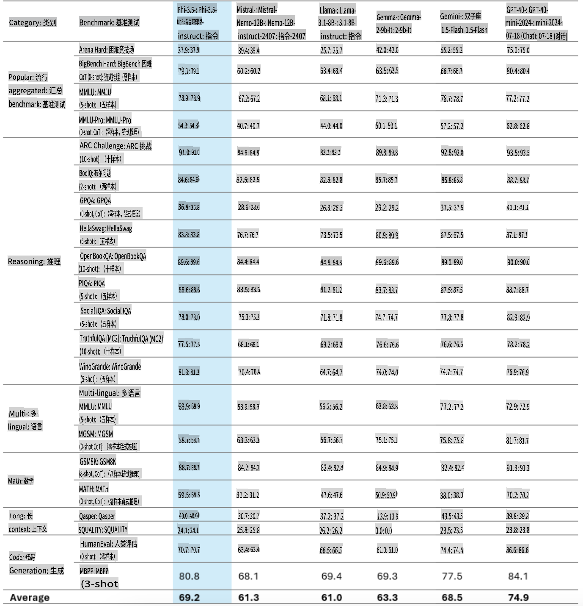
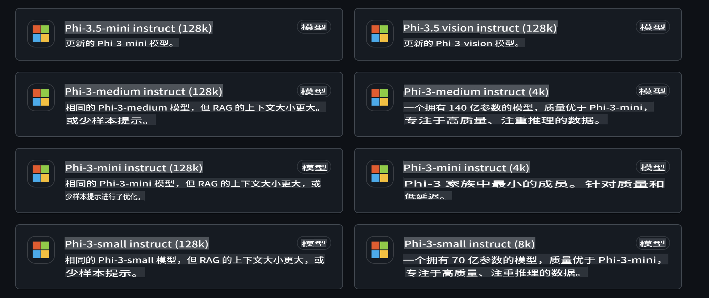
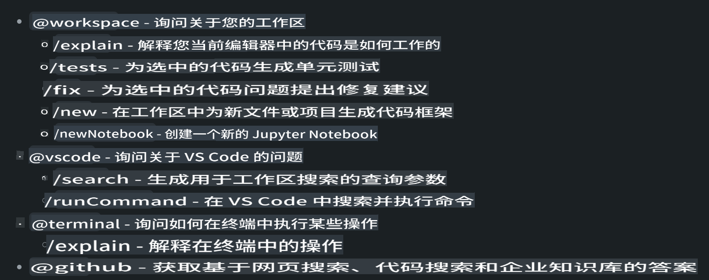
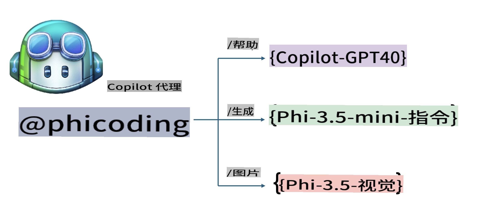
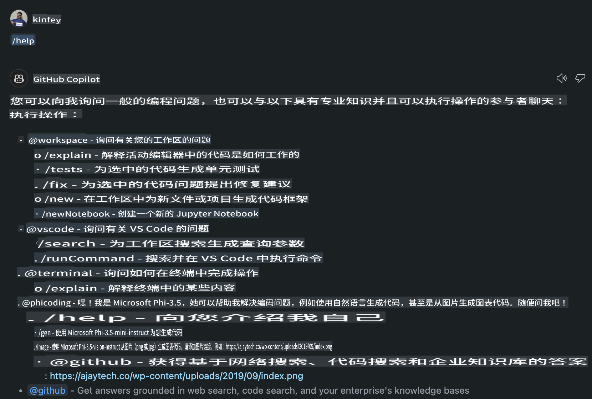
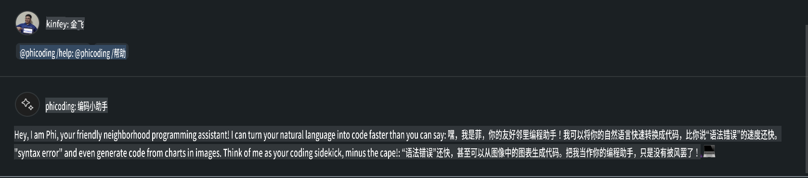
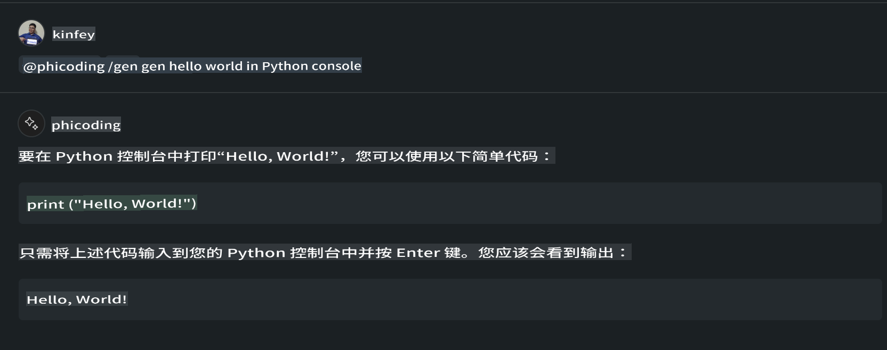
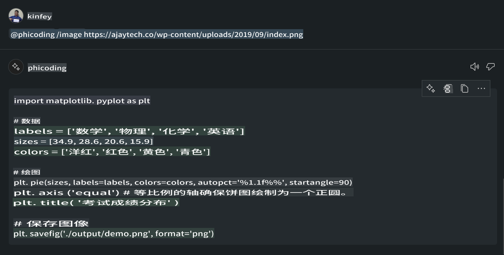

# **使用 GitHub Models 的 Phi-3.5 创建你自己的 Visual Studio Code Chat Copilot Agent**

你是否正在使用 Visual Studio Code Copilot？尤其是在 Chat 模式中，你可以通过使用不同的 Agent 来提升在 Visual Studio Code 中创建、编写和维护项目的能力。Visual Studio Code 提供了一个 API，允许公司和个人根据自身业务需求创建不同的 Agent，从而扩展在各种专有领域的能力。在本文中，我们将重点介绍 GitHub Models 的 **Phi-3.5-mini-instruct (128k)** 和 **Phi-3.5-vision-instruct (128k)**，以创建你自己的 Visual Studio Code Agent。

## **关于 GitHub Models 的 Phi-3.5**

我们知道，Phi-3/3.5-mini-instruct 在 Phi-3/3.5 系列中具有强大的代码理解和生成能力，并且在某些方面优于 Gemma-2-9b 和 Mistral-Nemo-12B-instruct-2407。



最新的 GitHub Models 已经提供了对 Phi-3.5-mini-instruct (128k) 和 Phi-3.5-vision-instruct (128k) 模型的访问。开发者可以通过 OpenAI SDK、Azure AI Inference SDK 和 REST API 进行访问。



***注意：*** 推荐使用 Azure AI Inference SDK，因为它在生产环境中可以更好地与 Azure Model Catalog 切换。

以下是 **Phi-3.5-mini-instruct (128k)** 和 **Phi-3.5-vision-instruct (128k)** 在对接 GitHub Models 后的代码生成场景中的表现，同时也为接下来的示例做准备。

**示例：GitHub Models 的 Phi-3.5-mini-instruct (128k) 根据提示生成代码** ([点击链接](../../../../../../code/09.UpdateSamples/Aug/ghmodel_phi35_instruct_demo.ipynb))

**示例：GitHub Models 的 Phi-3.5-vision-instruct (128k) 根据图片生成代码** ([点击链接](../../../../../../code/09.UpdateSamples/Aug/ghmodel_phi35_vision_demo.ipynb))

## **关于 GitHub Copilot Chat Agent**

GitHub Copilot Chat Agent 能够根据代码在不同的项目场景中完成各种任务。系统有四种 Agent：workspace、github、terminal、vscode。



通过在 Agent 名称前添加‘@’，你可以快速完成对应的工作。对于企业来说，如果将自身业务相关的内容（如需求、编码、测试规范和发布）添加到系统中，就可以基于 GitHub Copilot 拥有更强大的企业私有功能。

Visual Studio Code Chat Agent 现在已经正式发布其 API，允许企业或企业开发者基于不同的软件业务生态系统开发 Agent。基于 Visual Studio Code Extension Development 的开发方式，你可以轻松接入 Visual Studio Code Chat Agent API 的接口。我们可以按照以下流程进行开发：


开发场景支持接入第三方模型 API（如 GitHub Models、Azure Model Catalog 和基于开源模型自建的服务），还可以使用 GitHub Copilot 提供的 gpt-35-turbo、gpt-4 和 gpt-4o 模型。

## **基于 Phi-3.5 添加一个名为 @phicoding 的 Agent**

我们尝试整合 Phi-3.5 的编程能力来完成代码编写、图像生成代码等任务。围绕 Phi-3.5 构建一个名为 @PHI 的 Agent，以下是一些功能：

1. 通过 **@phicoding /help** 命令，基于 GitHub Copilot 提供的 GPT-4o 生成自我介绍。

2. 通过 **@phicoding /gen** 命令，基于 **Phi-3.5-mini-instruct (128k)** 生成不同编程语言的代码。

3. 通过 **@phicoding /image** 命令，基于 **Phi-3.5-vision-instruct (128k)** 生成代码和图像补全。



## **相关步骤**

1. 使用 npm 安装 Visual Studio Code Extension 开发支持。

```bash

npm install --global yo generator-code 

```

2. 创建一个 Visual Studio Code Extension 插件（使用 Typescript 开发模式，命名为 phiext）。

```bash

yo code 

```

3. 打开创建的项目并修改 package.json。这里包括相关的说明和配置，以及 GitHub Models 的配置。注意，你需要在此处添加你的 GitHub Models token。

```json

{
  "name": "phiext",
  "displayName": "phiext",
  "description": "",
  "version": "0.0.1",
  "engines": {
    "vscode": "^1.93.0"
  },
  "categories": [
    "AI",
    "Chat"
  ],
  "activationEvents": [],
  "enabledApiProposals": [
      "chatVariableResolver"
  ],
  "main": "./dist/extension.js",
  "contributes": {
    "chatParticipants": [
        {
            "id": "chat.phicoding",
            "name": "phicoding",
            "description": "Hey! I am Microsoft Phi-3.5, She can help me with coding problems, such as generation code with your natural language, or even generation code about chart from images. Just ask me anything!",
            "isSticky": true,
            "commands": [
                {
                    "name": "help",
                    "description": "Introduce myself to you"
                },
                {
                    "name": "gen",
                    "description": "Generate code for you with Microsoft Phi-3.5-mini-instruct"
                },
                {
                    "name": "image",
                    "description": "Generate code for chart from image(png or jpg) with Microsoft Phi-3.5-vision-instruct, please add image url like this : https://ajaytech.co/wp-content/uploads/2019/09/index.png"
                }
            ]
        }
    ],
    "commands": [
        {
            "command": "phicoding.namesInEditor",
            "title": "Use Microsoft Phi 3.5 in Editor"
        }
    ],
    "configuration": {
      "type": "object",
      "title": "githubmodels",
      "properties": {
        "githubmodels.endpoint": {
          "type": "string",
          "default": "https://models.inference.ai.azure.com",
          "description": "Your GitHub Models Endpoint",
          "order": 0
        },
        "githubmodels.api_key": {
          "type": "string",
          "default": "Your GitHub Models Token",
          "description": "Your GitHub Models Token",
          "order": 1
        },
        "githubmodels.phi35instruct": {
          "type": "string",
          "default": "Phi-3.5-mini-instruct",
          "description": "Your Phi-35-Instruct Model",
          "order": 2
        },
        "githubmodels.phi35vision": {
          "type": "string",
          "default": "Phi-3.5-vision-instruct",
          "description": "Your Phi-35-Vision Model",
          "order": 3
        }
      }
    }
  },
  "scripts": {
    "vscode:prepublish": "npm run package",
    "compile": "webpack",
    "watch": "webpack --watch",
    "package": "webpack --mode production --devtool hidden-source-map",
    "compile-tests": "tsc -p . --outDir out",
    "watch-tests": "tsc -p . -w --outDir out",
    "pretest": "npm run compile-tests && npm run compile && npm run lint",
    "lint": "eslint src",
    "test": "vscode-test"
  },
  "devDependencies": {
    "@types/vscode": "^1.93.0",
    "@types/mocha": "^10.0.7",
    "@types/node": "20.x",
    "@typescript-eslint/eslint-plugin": "^8.3.0",
    "@typescript-eslint/parser": "^8.3.0",
    "eslint": "^9.9.1",
    "typescript": "^5.5.4",
    "ts-loader": "^9.5.1",
    "webpack": "^5.94.0",
    "webpack-cli": "^5.1.4",
    "@vscode/test-cli": "^0.0.10",
    "@vscode/test-electron": "^2.4.1"
  },
  "dependencies": {
    "@types/node-fetch": "^2.6.11",
    "node-fetch": "^3.3.2",
    "@azure-rest/ai-inference": "latest",
    "@azure/core-auth": "latest",
    "@azure/core-sse": "latest"
  }
}


```

4. 修改 src/extension.ts。

```typescript

// The module 'vscode' contains the VS Code extensibility API
// Import the module and reference it with the alias vscode in your code below
import * as vscode from 'vscode';
import ModelClient from "@azure-rest/ai-inference";
import { AzureKeyCredential } from "@azure/core-auth";


interface IPhiChatResult extends vscode.ChatResult {
    metadata: {
        command: string;
    };
}


const MODEL_SELECTOR: vscode.LanguageModelChatSelector = { vendor: 'copilot', family: 'gpt-4o' };

function isValidImageUrl(url: string): boolean {
    const regex = /^(https?:\/\/.*\.(?:png|jpg))$/i;
    return regex.test(url);
}
  

// This method is called when your extension is activated
// Your extension is activated the very first time the command is executed
export function activate(context: vscode.ExtensionContext) {

    const codinghandler: vscode.ChatRequestHandler = async (request: vscode.ChatRequest, context: vscode.ChatContext, stream: vscode.ChatResponseStream, token: vscode.CancellationToken): Promise<IPhiChatResult> => {


        const config : any = vscode.workspace.getConfiguration('githubmodels');
        const endPoint: string = config.get('endpoint');
        const apiKey: string = config.get('api_key');
        const phi35instruct: string = config.get('phi35instruct');
        const phi35vision: string = config.get('phi35vision');
        
        if (request.command === 'help') {

            const content = "Welcome to Coding assistant with Microsoft Phi-3.5"; 
            stream.progress(content);


            try {
                const [model] = await vscode.lm.selectChatModels(MODEL_SELECTOR);
                if (model) {
                    const messages = [
                        vscode.LanguageModelChatMessage.User("Please help me express this content in a humorous way: I am a programming assistant who can help you convert natural language into code and generate code based on the charts in the images. output format like this : Hey I am Phi ......")
                    ];
                    const chatResponse = await model.sendRequest(messages, {}, token);
                    for await (const fragment of chatResponse.text) {
                        stream.markdown(fragment);
                    }
                }
            } catch(err) {
                console.log(err);
            }


            return { metadata: { command: 'help' } };

        }

        
        if (request.command === 'gen') {

            const content = "Welcome to use phi-3.5 to generate code";

            stream.progress(content);

            const client = new ModelClient(endPoint, new AzureKeyCredential(apiKey));

            const response = await client.path("/chat/completions").post({
              body: {
                messages: [
                  { role:"system", content: "You are a coding assistant.Help answer all code generation questions." },
                  { role:"user", content: request.prompt }
                ],
                model: phi35instruct,
                temperature: 0.4,
                max_tokens: 1000,
                top_p: 1.
              }
            });

            stream.markdown(response.body.choices[0].message.content);

            return { metadata: { command: 'gen' } };

        }


        
        if (request.command === 'image') {


            const content = "Welcome to use phi-3.5 to generate code from image(png or jpg),image url like this:https://ajaytech.co/wp-content/uploads/2019/09/index.png";

            stream.progress(content);

            if (!isValidImageUrl(request.prompt)) {
                stream.markdown('Please provide a valid image URL');
                return { metadata: { command: 'image' } };
            }
            else
            {

                const client = new ModelClient(endPoint, new AzureKeyCredential(apiKey));
    
                const response = await client.path("/chat/completions").post({
                    body: {
                      messages: [
                        { role: "system", content: "You are a helpful assistant that describes images in details." },
                        { role: "user", content: [
                            { type: "text", text: "Please generate code according to the chart in the picture according to the following requirements\n1. Keep all information in the chart, including data and text\n2. Do not generate additional information that is not included in the chart\n3. Please extract data from the picture, do not generate it from csv\n4. Please save the regenerated chart as a chart and save it to ./output/demo.png"},
                            { type: "image_url", image_url: {url: request.prompt}
                            }
                          ]
                        }
                      ],
                      model: phi35vision,
                      temperature: 0.4,
                      max_tokens: 2048,
                      top_p: 1.
                    }
                  });
    
                
                stream.markdown(response.body.choices[0].message.content);
    
                return { metadata: { command: 'image' } };
            }


        }


        return { metadata: { command: '' } };
    };


    const phi_ext = vscode.chat.createChatParticipant("chat.phicoding", codinghandler);

    phi_ext.iconPath = new vscode.ThemeIcon('sparkle');


    phi_ext.followupProvider = {
        provideFollowups(result: IPhiChatResult, context: vscode.ChatContext, token: vscode.CancellationToken) {
            return [{
                prompt: 'Let us coding with Phi-3.5 😋😋😋😋',
                label: vscode.l10n.t('Enjoy coding with Phi-3.5'),
                command: 'help'
            } satisfies vscode.ChatFollowup];
        }
    };

    context.subscriptions.push(phi_ext);
}

// This method is called when your extension is deactivated
export function deactivate() {}


```

6. 运行。

***/help***



***@phicoding /help***



***@phicoding /gen***



***@phicoding /image***



你可以下载示例代码：[点击这里](../../../../../../code/09.UpdateSamples/Aug/vscode)

## **资源**

1. 注册 GitHub Models：[https://gh.io/models](https://gh.io/models)

2. 学习 Visual Studio Code Extension 开发：[https://code.visualstudio.com/api/get-started/your-first-extension](https://code.visualstudio.com/api/get-started/your-first-extension)

3. 了解 Visual Studio Code Copilot Chat API：[https://code.visualstudio.com/api/extension-guides/chat](https://code.visualstudio.com/api/extension-guides/chat)

**免责声明**：  
本文件使用基于机器的人工智能翻译服务进行翻译。尽管我们尽力确保准确性，但请注意，自动翻译可能包含错误或不准确之处。应以原始语言的原始文件作为权威来源。对于关键信息，建议寻求专业人工翻译。因使用此翻译而导致的任何误解或误读，我们概不负责。