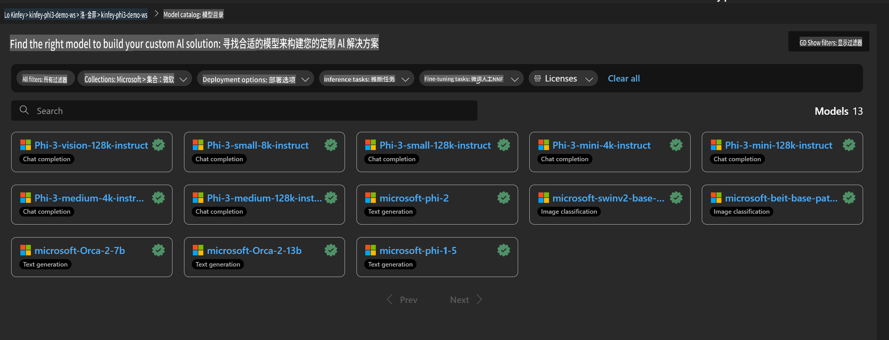
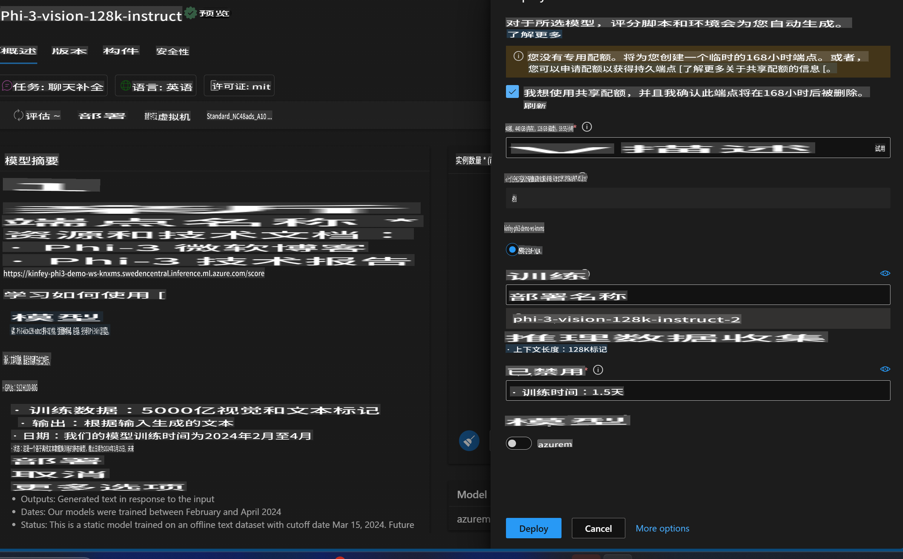
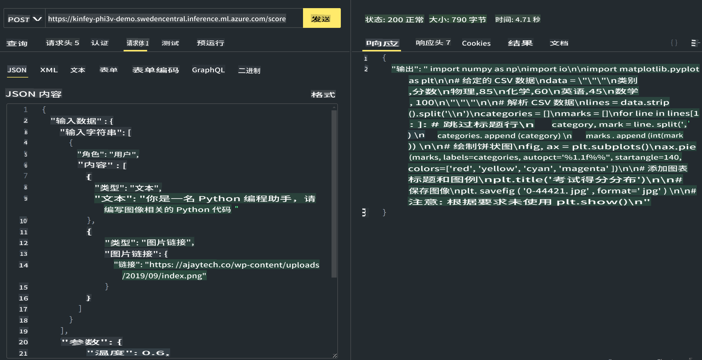

# **实验 3 - 在 Azure Machine Learning Service 上部署 Phi-3-Vision**

我们使用 NPU 完成本地代码的生产部署，然后希望通过它引入 PHI-3-VISION 的能力，实现从图片生成代码。

通过本次介绍，我们可以快速在 Azure Machine Learning Service 中构建一个 Model As Service 的 Phi-3 Vision 服务。

***注意***：Phi-3 Vision 需要计算能力以更快速度生成内容。我们需要云端计算能力来帮助实现这一目标。

### **1. 创建 Azure Machine Learning Service**

我们需要在 Azure Portal 中创建一个 Azure Machine Learning Service。如果您想了解如何操作，请访问以下链接 [https://learn.microsoft.com/azure/machine-learning/quickstart-create-resources?view=azureml-api-2](https://learn.microsoft.com/azure/machine-learning/quickstart-create-resources?view=azureml-api-2)

### **2. 在 Azure Machine Learning Service 中选择 Phi-3 Vision**



### **3. 在 Azure 中部署 Phi-3-Vision**



### **4. 在 Postman 中测试 Endpoint**



***注意***

1. 需要传递的参数必须包括 Authorization、azureml-model-deployment 和 Content-Type。您需要检查部署信息以获取这些参数。

2. 在传递参数时，Phi-3-Vision 需要传递一个图片链接。请参考 GPT-4-Vision 的方法传递参数，例如：

```json

{
  "input_data":{
    "input_string":[
      {
        "role":"user",
        "content":[ 
          {
            "type": "text",
            "text": "You are a Python coding assistant.Please create Python code for image "
          },
          {
              "type": "image_url",
              "image_url": {
                "url": "https://ajaytech.co/wp-content/uploads/2019/09/index.png"
              }
          }
        ]
      }
    ],
    "parameters":{
          "temperature": 0.6,
          "top_p": 0.9,
          "do_sample": false,
          "max_new_tokens": 2048
    }
  }
}

```

3. 使用 Post 方法调用 **/score**

**恭喜您**！您已完成快速 PHI-3-VISION 部署，并尝试了如何使用图片生成代码。接下来，我们可以结合 NPU 和云构建应用程序。

**免责声明**：  
本文件使用基于机器的人工智能翻译服务进行翻译。尽管我们努力确保准确性，但请注意，自动翻译可能包含错误或不准确之处。应以原始语言的文件作为权威来源。对于关键信息，建议使用专业的人类翻译服务。对于因使用本翻译而引起的任何误解或误读，我们概不负责。