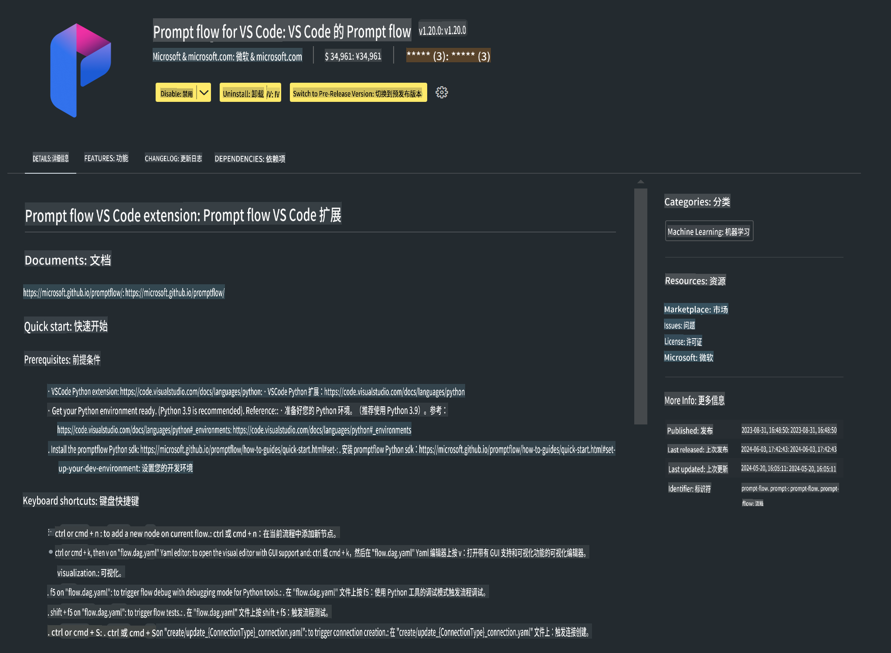

# **实验 0 - 安装**

进入实验室时，我们需要配置相关的环境：

### **1. Python 3.11+**

建议使用 miniforge 来配置您的 Python 环境。

要配置 miniforge，请参考 [https://github.com/conda-forge/miniforge](https://github.com/conda-forge/miniforge)

配置好 miniforge 后，在 Power Shell 中运行以下命令：

```bash

conda create -n pyenv python==3.11.8 -y

conda activate pyenv

```

### **2. 安装 Prompt flow SDK**

在实验 1 中，我们会使用 Prompt flow，因此需要配置 Prompt flow SDK。

```bash

pip install promptflow --upgrade

```

您可以通过以下命令检查 promptflow sdk：

```bash

pf --version

```

### **3. 安装 Visual Studio Code Prompt flow 扩展**



### **4. Apple's MLX 框架**

MLX 是由 Apple 机器学习研究团队推出的针对 Apple Silicon 的机器学习研究数组框架。您可以使用 **Apple MLX 框架** 来加速 LLM / SLM 在 Apple Silicon 上的运行。如果想了解更多信息，可以阅读 [https://github.com/microsoft/PhiCookBook/blob/main/md/01.Introduction/03/MLX_Inference.md](https://github.com/microsoft/PhiCookBook/blob/main/md/01.Introduction/03/MLX_Inference.md)。

在 bash 中安装 MLX 框架库：

```bash

pip install mlx-lm

```

### **5. 其他 Python 库**

创建 requirements.txt 文件，并添加以下内容：

```txt

notebook
numpy 
scipy 
scikit-learn 
matplotlib 
pandas 
pillow 
graphviz

```

### **6. 安装 NVM**

在 Powershell 中安装 nvm：

```bash

brew install nvm

```

安装 nodejs 18.20：

```bash

nvm install 18.20.0

nvm use 18.20.0

```

### **7. 安装 Visual Studio Code 开发支持**

```bash

npm install --global yo generator-code

```

恭喜！您已成功配置 SDK。接下来，继续进行实际操作步骤。

**免责声明**：  
本文件通过基于机器的人工智能翻译服务进行翻译。尽管我们尽力确保翻译的准确性，但请注意，自动翻译可能包含错误或不准确之处。应以原始语言的文件作为权威来源。对于关键信息，建议寻求专业的人类翻译服务。因使用本翻译导致的任何误解或曲解，我们概不负责。