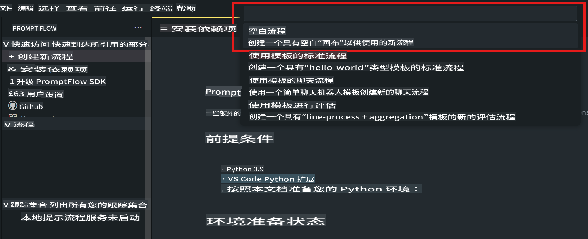
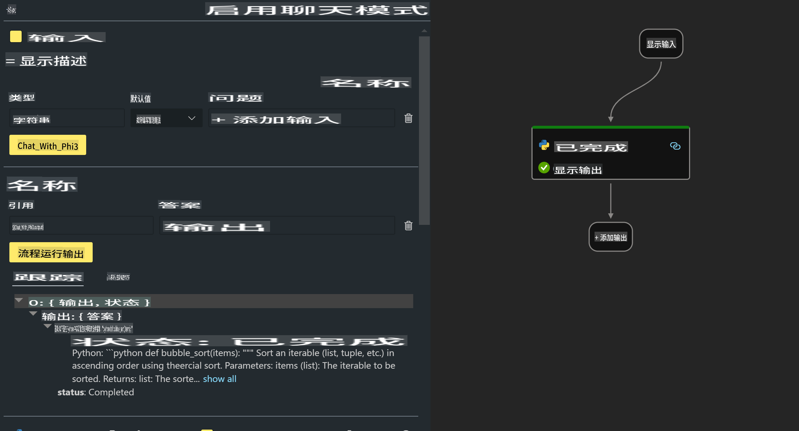

# **实验 2 - 在 AIPC 中运行 Phi-3-mini 的 Prompt flow**

## **什么是 Prompt flow**

Prompt flow 是一套开发工具，旨在简化基于 LLM 的 AI 应用程序的端到端开发周期，包括从创意构思、原型设计、测试、评估到生产部署和监控。它让提示工程更加简单，并能帮助你构建具有生产质量的 LLM 应用。

通过使用 Prompt flow，你可以：

- 创建将 LLM、提示、Python 代码以及其他工具连接在一起的可执行工作流。

- 轻松调试和迭代你的工作流，尤其是与 LLM 的交互。

- 评估你的工作流，使用更大的数据集计算质量和性能指标。

- 将测试和评估集成到你的 CI/CD 系统中，以确保工作流的质量。

- 将工作流部署到你选择的服务平台，或者轻松集成到应用程序的代码库中。

- （可选但强烈推荐）通过在 Azure AI 中利用 Prompt flow 的云版本，与团队进行协作。


## **在 Apple Silicon 上构建生成代码的工作流**

***注意***：如果尚未完成环境安装，请访问 [实验 0 - 安装](./01.Installations.md)

1. 打开 Visual Studio Code 中的 Prompt flow 扩展，并创建一个空的工作流项目。



2. 添加输入和输出参数，并添加 Python 代码作为新的工作流。



你可以参考以下结构 (flow.dag.yaml) 来构建你的工作流：

```yaml

inputs:
  prompt:
    type: string
    default: Write python code for Fibonacci serie. Please use markdown as output
outputs:
  result:
    type: string
    reference: ${gen_code_by_phi3.output}
nodes:
- name: gen_code_by_phi3
  type: python
  source:
    type: code
    path: gen_code_by_phi3.py
  inputs:
    prompt: ${inputs.prompt}


```

3. 量化 phi-3-mini

为了更好地在本地设备上运行 SLM，我们通常会对模型进行量化（INT4、FP16、FP32）。

```bash

python -m mlx_lm.convert --hf-path microsoft/Phi-3-mini-4k-instruct

```

**注意：** 默认文件夹是 mlx_model。

4. 在 ***Chat_With_Phi3.py*** 中添加代码。

```python


from promptflow import tool

from mlx_lm import load, generate


# The inputs section will change based on the arguments of the tool function, after you save the code
# Adding type to arguments and return value will help the system show the types properly
# Please update the function name/signature per need
@tool
def my_python_tool(prompt: str) -> str:

    model_id = './mlx_model_phi3_mini'

    model, tokenizer = load(model_id)

    # <|user|>\nWrite python code for Fibonacci serie. Please use markdown as output<|end|>\n<|assistant|>

    response = generate(model, tokenizer, prompt="<|user|>\n" + prompt  + "<|end|>\n<|assistant|>", max_tokens=2048, verbose=True)

    return response


```

4. 你可以通过调试或运行功能测试工作流，以检查生成代码是否正常。


5. 在终端中以开发 API 的形式运行工作流。

```

pf flow serve --source ./ --port 8080 --host localhost   

```

你可以在 Postman / Thunder Client 中测试它。


### **注意事项**

1. 第一次运行需要较长时间，建议通过 Hugging Face CLI 下载 phi-3 模型。

2. 考虑到 Intel NPU 的计算能力有限，建议使用 Phi-3-mini-4k-instruct。

3. 我们使用 Intel NPU 加速进行 INT4 转换量化，但如果重新运行服务，需要删除缓存和 nc_workshop 文件夹。


## **资源**

1. 学习 Promptflow [https://microsoft.github.io/promptflow/](https://microsoft.github.io/promptflow/)

2. 学习 Intel NPU 加速 [https://github.com/intel/intel-npu-acceleration-library](https://github.com/intel/intel-npu-acceleration-library)

3. 示例代码，下载 [本地 NPU Agent 示例代码](../../../../../../../../../code/07.Lab/01/AIPC/local-npu-agent)

**免责声明**：  
本文档是使用基于机器的人工智能翻译服务翻译的。尽管我们努力确保准确性，但请注意，自动翻译可能包含错误或不准确之处。原始语言的文档应被视为权威来源。对于关键信息，建议使用专业的人类翻译服务。因使用此翻译而引起的任何误解或误读，我们概不负责。