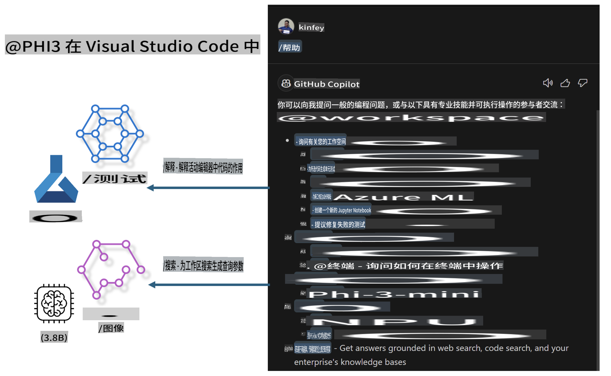

# **构建属于你的 Visual Studio Code GitHub Copilot Chat，基于 Microsoft Phi-3 系列**

你是否使用过 GitHub Copilot Chat 的工作区代理？是否想为自己的团队构建一个代码助手？本次动手实验旨在结合开源模型，打造企业级代码业务代理。

## **基础知识**

### **为什么选择 Microsoft Phi-3**

Phi-3 是一个系列家族，包含基于不同训练参数的 phi-3-mini、phi-3-small 和 phi-3-medium，用于文本生成、对话补全和代码生成。此外，还有基于视觉的 phi-3-vision。适用于企业或不同团队创建离线生成式 AI 解决方案。

推荐阅读此链接：[https://github.com/microsoft/PhiCookBook/blob/main/md/01.Introduction/01/01.PhiFamily.md](https://github.com/microsoft/PhiCookBook/blob/main/md/01.Introduction/01/01.PhiFamily.md)

### **Microsoft GitHub Copilot Chat**

GitHub Copilot Chat 扩展提供了一个聊天界面，让你可以直接在 VS Code 中与 GitHub Copilot 交互，并获取与编码相关问题的答案，而无需浏览文档或搜索在线论坛。

Copilot Chat 可能会使用语法高亮、缩进和其他格式化功能来增强生成响应的清晰度。根据用户问题的类型，结果可能包含 Copilot 用于生成响应的上下文链接，例如源代码文件或文档，或访问 VS Code 功能的按钮。

- Copilot Chat 集成到你的开发流程中，在你需要的地方提供帮助：

- 直接从编辑器或终端发起内联聊天对话，在编码时获得帮助

- 使用聊天视图，在侧边栏随时获得 AI 助手的支持

- 启动快速聊天，提出一个简单问题后迅速回到手头工作

你可以在各种场景中使用 GitHub Copilot Chat，例如：

- 回答如何最好地解决问题的编码问题

- 解释他人的代码并提出改进建议

- 提出代码修复方案

- 生成单元测试用例

- 生成代码文档

推荐阅读此链接：[https://code.visualstudio.com/docs/copilot/copilot-chat](https://code.visualstudio.com/docs/copilot/copilot-chat?WT.mc_id=aiml-137032-kinfeylo)

### **Microsoft GitHub Copilot Chat @workspace**

在 Copilot Chat 中引用 **@workspace**，可以让你就整个代码库提出问题。根据问题，Copilot 会智能地检索相关文件和符号，并在回答中以链接和代码示例的形式引用它们。

为了回答你的问题，**@workspace** 会搜索开发者在 VS Code 中浏览代码库时可能使用的相同来源：

- 工作区中的所有文件，除了被 .gitignore 文件忽略的文件

- 目录结构，包括嵌套的文件夹和文件名

- 如果工作区是一个 GitHub 仓库并被代码搜索索引，则使用 GitHub 的代码搜索索引

- 工作区中的符号和定义

- 当前选中的文本或活动编辑器中可见的文本

注意：如果你打开了一个文件或在被忽略的文件中选中了文本，.gitignore 会被绕过。

推荐阅读此链接：[https://code.visualstudio.com/docs/copilot/workspace-context](https://code.visualstudio.com/docs/copilot/workspace-context?WT.mc_id=aiml-137032-kinfeylo)

## **了解更多关于本实验的信息**

GitHub Copilot 极大地提升了企业的编程效率，每个企业都希望定制 GitHub Copilot 的相关功能。许多企业已经基于自身的业务场景和开源模型，定制了类似 GitHub Copilot 的扩展。对于企业来说，定制扩展更容易控制，但这也可能影响用户体验。毕竟，GitHub Copilot 在处理通用场景和专业性方面功能更强。如果能保持一致的体验，同时定制企业自己的扩展，那将是更好的用户体验。GitHub Copilot Chat 提供了相关的 API，让企业可以在 Chat 体验中进行扩展。保持一致的体验，同时拥有定制功能，是更好的用户体验。

本实验主要结合 Phi-3 模型、使用本地 NPU 和 Azure 混合模式，在 GitHub Copilot Chat 中构建一个自定义 Agent ***@PHI3***，帮助企业开发者完成代码生成 ***(@PHI3 /gen)*** 和基于图像生成代码 ***(@PHI3 /img)***。

### ***注意：*** 

本实验目前在 Intel CPU 和 Apple Silicon 的 AIPC 中实现。我们将持续更新 Qualcomm 版本的 NPU。

## **实验内容**

| 名称 | 描述 | AIPC | Apple |
| ------------ | ----------- | -------- |-------- |
| Lab0 - 安装(✅) | 配置并安装相关环境和工具 | [前往](./HOL/AIPC/01.Installations.md) | [前往](./HOL/Apple/01.Installations.md) |
| Lab1 - 运行 Prompt flow 和 Phi-3-mini (✅) | 结合 AIPC / Apple Silicon，使用本地 NPU 通过 Phi-3-mini 进行代码生成 | [前往](./HOL/AIPC/02.PromptflowWithNPU.md) | [前往](./HOL/Apple/02.PromptflowWithMLX.md) |
| Lab2 - 在 Azure 机器学习服务上部署 Phi-3-vision (✅) | 通过部署 Azure 机器学习服务的模型目录 - Phi-3-vision 图像生成代码 | [前往](./HOL/AIPC/03.DeployPhi3VisionOnAzure.md) | [前往](./HOL/Apple/03.DeployPhi3VisionOnAzure.md) |
| Lab3 - 在 GitHub Copilot Chat 中创建 @phi-3 Agent (✅) | 在 GitHub Copilot Chat 中创建自定义 Phi-3 Agent，完成代码生成、图生成代码、RAG 等功能 | [前往](./HOL/AIPC/04.CreatePhi3AgentInVSCode.md) | [前往](./HOL/Apple/04.CreatePhi3AgentInVSCode.md) |
| 示例代码 (✅) | 下载示例代码 | [前往](../../../../../../../code/07.Lab/01/AIPC) | [前往](../../../../../../../code/07.Lab/01/Apple) |

## **资源**

1. Phi-3 Cookbook [https://github.com/microsoft/Phi-3CookBook](https://github.com/microsoft/Phi-3CookBook)

2. 了解更多关于 GitHub Copilot 的信息 [https://learn.microsoft.com/training/paths/copilot/](https://learn.microsoft.com/training/paths/copilot/?WT.mc_id=aiml-137032-kinfeylo)

3. 了解更多关于 GitHub Copilot Chat 的信息 [https://learn.microsoft.com/training/paths/accelerate-app-development-using-github-copilot/](https://learn.microsoft.com/training/paths/accelerate-app-development-using-github-copilot/?WT.mc_id=aiml-137032-kinfeylo)

4. 了解更多关于 GitHub Copilot Chat API 的信息 [https://code.visualstudio.com/api/extension-guides/chat](https://code.visualstudio.com/api/extension-guides/chat?WT.mc_id=aiml-137032-kinfeylo)

5. 了解更多关于 Azure AI Foundry 的信息 [https://learn.microsoft.com/training/paths/create-custom-copilots-ai-studio/](https://learn.microsoft.com/training/paths/create-custom-copilots-ai-studio/?WT.mc_id=aiml-137032-kinfeylo)

6. 了解更多关于 Azure AI Foundry 的模型目录 [https://learn.microsoft.com/azure/ai-studio/how-to/model-catalog-overview](https://learn.microsoft.com/azure/ai-studio/how-to/model-catalog-overview)

**免责声明**：  
本文件使用基于机器的人工智能翻译服务进行翻译。尽管我们努力确保翻译的准确性，但请注意，自动翻译可能包含错误或不准确之处。应以原始语言的文件作为权威来源。对于关键信息，建议使用专业人工翻译。我们不对因使用此翻译而导致的任何误解或误读承担责任。