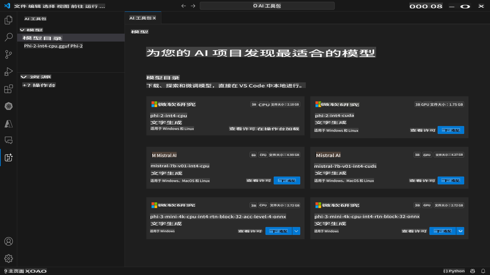
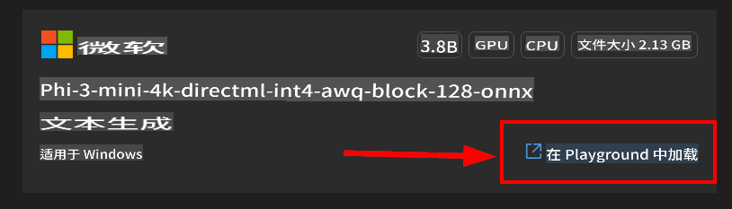

# AI Toolkit for VScode (Windows)

[AI Toolkit for VS Code](https://marketplace.visualstudio.com/items?itemName=ms-windows-ai-studio.windows-ai-studio) 通过整合来自 Azure AI Foundry Catalog 和其他目录（如 Hugging Face）的尖端 AI 开发工具和模型，简化了生成式 AI 应用程序的开发。您可以浏览由 Azure ML 和 Hugging Face 提供支持的 AI 模型目录，下载到本地，进行微调、测试，并在您的应用程序中使用它们。

AI Toolkit 预览版将在本地运行。根据您选择的模型，有些任务仅支持 Windows 和 Linux。

本地推理或微调取决于您选择的模型，可能需要具有 NVIDIA CUDA GPU 的 GPU。

如果您远程运行，云资源需要具有 GPU，请确保检查您的环境。对于在 Windows + WSL 上的本地运行，应在使用 AI Toolkit 之前安装并设置默认的 WSL Ubuntu 发行版 18.4 或更高版本。

## 入门指南

[了解如何安装 Windows 子系统](https://learn.microsoft.com/windows/wsl/install?WT.mc_id=aiml-137032-kinfeylo)

以及[更改默认发行版](https://learn.microsoft.com/windows/wsl/install#change-the-default-linux-distribution-installed)。

[AI Tooklit GitHub 仓库](https://github.com/microsoft/vscode-ai-toolkit/)

- Windows 或 Linux。
- **MacOS 支持即将推出**
- 在 Windows 和 Linux 上进行微调需要 Nvidia GPU。此外，**Windows** 需要带有 Ubuntu 发行版 18.4 或更高版本的 Linux 子系统。[了解如何安装 Windows 子系统](https://learn.microsoft.com/windows/wsl/install) 以及[更改默认发行版](https://learn.microsoft.com/windows/wsl/install#change-the-default-linux-distribution-installed)。

### 安装 AI Toolkit

AI Toolkit 作为 [Visual Studio Code 扩展](https://code.visualstudio.com/docs/setup/additional-components#_vs-code-extensions)提供，因此您需要先安装 [VS Code](https://code.visualstudio.com/docs/setup/windows?WT.mc_id=aiml-137032-kinfeylo)，然后从 [VS Marketplace](https://marketplace.visualstudio.com/items?itemName=ms-windows-ai-studio.windows-ai-studio) 下载 AI Toolkit。
[AI Toolkit 可在 Visual Studio Marketplace 中找到](https://marketplace.visualstudio.com/items?itemName=ms-windows-ai-studio.windows-ai-studio)，并可以像其他 VS Code 扩展一样安装。

如果您不熟悉安装 VS Code 扩展，请按照以下步骤操作：

### 登录

1. 在 VS Code 的活动栏中选择 **扩展**
1. 在扩展搜索栏中输入 "AI Toolkit"
1. 选择 "AI Toolkit for Visual Studio code"
1. 选择 **安装**

现在，您可以使用该扩展了！

系统将提示您登录 GitHub，请点击 "允许" 继续。您将被重定向到 GitHub 登录页面。

请登录并按照步骤操作。成功完成后，您将被重定向到 VS Code。

安装扩展后，您将在活动栏中看到 AI Toolkit 图标。

让我们探索可用的操作！

### 可用操作

AI Toolkit 的主侧边栏组织为

- **模型**
- **资源**
- **操场**
- **微调**

在资源部分可用。要开始，请选择 **模型目录**。

### 从目录中下载模型

从 VS Code 侧边栏启动 AI Toolkit 后，您可以选择以下选项：



- 从 **模型目录** 中找到支持的模型并下载到本地
- 在 **模型操场** 中测试模型推理
- 在 **模型微调** 中本地或远程微调模型
- 通过命令面板将微调后的模型部署到云端

> [!NOTE]
>
> **GPU Vs CPU**
>
> 您会注意到模型卡显示模型大小、平台和加速器类型（CPU、GPU）。对于具有至少一个 GPU 的 **Windows 设备**，请选择仅针对 Windows 的模型版本以获得优化的性能。
>
> 这可确保您拥有针对 DirectML 加速器优化的模型。
>
> 模型名称格式为
>
> - `{model_name}-{accelerator}-{quantization}-{format}`。
>
>要检查您的 Windows 设备是否具有 GPU，请打开 **任务管理器**，然后选择 **性能** 选项卡。如果有 GPU，它们将列在名称如 "GPU 0" 或 "GPU 1" 下。

### 在操场中运行模型

设置所有参数后，点击 **生成项目**。

下载模型后，在目录中的模型卡上选择 **在操场中加载**：

- 启动模型下载
- 安装所有前提条件和依赖项
- 创建 VS Code 工作区



下载模型后，您可以从 AI Toolkit 启动项目。

> ***注意*** 如果您想尝试远程推理或微调的预览功能，请按照[本指南](https://github.com/microsoft/vscode-ai-toolkit/blob/main/archive/remote-overall.md)进行操作

### Windows 优化模型

您应该看到模型响应流回给您：

AI Toolkit 提供了已经针对 Windows 优化的公开可用 AI 模型集合。模型存储在不同位置，包括 Hugging Face、GitHub 等，但您可以浏览模型，并在一个地方找到所有这些模型，准备下载并在您的 Windows 应用程序中使用。


### 模型选择

如果您的 *Windows* 设备上 **没有** 可用的 **GPU**，但您选择了

- Phi-3-mini-4k-**directml**-int4-awq-block-128-onnx 模型

模型响应将会*非常慢*。

您应该下载 CPU 优化版本：

- Phi-3-mini-4k-**cpu**-int4-rtn-block-32-acc-level-4-onnx。

也可以更改：

**上下文说明：** 帮助模型理解您请求的整体背景。这可以是背景信息、您想要的示例/演示或解释任务的目的。

**推理参数：**

- *最大响应长度*：模型返回的最大标记数。
- *温度*：模型温度是控制语言模型输出随机性的参数。温度越高，模型越冒险，给您提供多样化的词汇。相反，温度较低，模型则更保守，提供更集中和可预测的响应。
- *Top P*：也称为核采样，是控制语言模型在预测下一个词时考虑多少可能词汇或短语的设置。
- *频率惩罚*：此参数影响模型在输出中重复词汇或短语的频率。值越高（接近 1.0），模型越倾向于*避免*重复词汇或短语。
- *存在惩罚*：此参数用于生成式 AI 模型，以鼓励生成文本的多样性和特异性。值越高（接近 1.0），模型越倾向于包含更多新颖和多样的标记。值较低时，模型更可能生成常见或陈词滥调的短语。

### 在您的应用程序中使用 REST API

AI Toolkit 附带一个使用 [OpenAI 聊天完成格式](https://platform.openai.com/docs/api-reference/chat/create) 的本地 REST API 网络服务器 **在端口 5272**。

这使您可以在本地测试应用程序，而无需依赖云 AI 模型服务。例如，以下 JSON 文件显示如何配置请求的主体：

```json
{
    "model": "Phi-3-mini-4k-directml-int4-awq-block-128-onnx",
    "messages": [
        {
            "role": "user",
            "content": "what is the golden ratio?"
        }
    ],
    "temperature": 0.7,
    "top_p": 1,
    "top_k": 10,
    "max_tokens": 100,
    "stream": true
}
```

您可以使用（例如）[Postman](https://www.postman.com/) 或 CURL（客户端 URL）工具测试 REST API：

```bash
curl -vX POST http://127.0.0.1:5272/v1/chat/completions -H 'Content-Type: application/json' -d @body.json
```

### 使用 OpenAI 客户端库进行 Python 编程

```python
from openai import OpenAI

client = OpenAI(
    base_url="http://127.0.0.1:5272/v1/", 
    api_key="x" # required for the API but not used
)

chat_completion = client.chat.completions.create(
    messages=[
        {
            "role": "user",
            "content": "what is the golden ratio?",
        }
    ],
    model="Phi-3-mini-4k-cuda-int4-onnx",
)

print(chat_completion.choices[0].message.content)
```

### 使用 Azure OpenAI 客户端库进行 .NET 编程

使用 NuGet 将 [Azure OpenAI 客户端库 for .NET](https://www.nuget.org/packages/Azure.AI.OpenAI/) 添加到您的项目中：

```bash
dotnet add {project_name} package Azure.AI.OpenAI --version 1.0.0-beta.17
```

向您的项目添加一个名为 **OverridePolicy.cs** 的 C# 文件，并粘贴以下代码：

```csharp
// OverridePolicy.cs
using Azure.Core.Pipeline;
using Azure.Core;

internal partial class OverrideRequestUriPolicy(Uri overrideUri)
    : HttpPipelineSynchronousPolicy
{
    private readonly Uri _overrideUri = overrideUri;

    public override void OnSendingRequest(HttpMessage message)
    {
        message.Request.Uri.Reset(_overrideUri);
    }
}
```

接下来，将以下代码粘贴到您的 **Program.cs** 文件中：

```csharp
// Program.cs
using Azure.AI.OpenAI;

Uri localhostUri = new("http://localhost:5272/v1/chat/completions");

OpenAIClientOptions clientOptions = new();
clientOptions.AddPolicy(
    new OverrideRequestUriPolicy(localhostUri),
    Azure.Core.HttpPipelinePosition.BeforeTransport);
OpenAIClient client = new(openAIApiKey: "unused", clientOptions);

ChatCompletionsOptions options = new()
{
    DeploymentName = "Phi-3-mini-4k-directml-int4-awq-block-128-onnx",
    Messages =
    {
        new ChatRequestSystemMessage("You are a helpful assistant. Be brief and succinct."),
        new ChatRequestUserMessage("What is the golden ratio?"),
    }
};

StreamingResponse<StreamingChatCompletionsUpdate> streamingChatResponse
    = await client.GetChatCompletionsStreamingAsync(options);

await foreach (StreamingChatCompletionsUpdate chatChunk in streamingChatResponse)
{
    Console.Write(chatChunk.ContentUpdate);
}
```

## 使用 AI Toolkit 进行微调

- 从模型发现和操场开始。
- 使用本地计算资源进行模型微调和推理。
- 使用 Azure 资源进行远程微调和推理

[使用 AI Toolkit 进行微调](../04.Fine-tuning/Finetuning_VSCodeaitoolkit.md)

## AI Toolkit 问答资源

请参考我们的 [问答页面](https://github.com/microsoft/vscode-ai-toolkit/blob/main/archive/QA.md) 以获取最常见的问题和解决方案。

**免责声明**：
本文件使用基于机器的AI翻译服务进行翻译。尽管我们力求准确，但请注意，自动翻译可能包含错误或不准确之处。应将原始语言的文件视为权威来源。对于关键信息，建议使用专业人工翻译。对于因使用本翻译而引起的任何误解或误读，我们不承担责任。