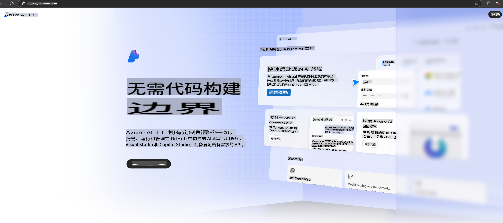

# **在 Azure AI Foundry 中使用 Phi-3**

随着生成式 AI 的发展，我们希望使用一个统一的平台来管理不同的 LLM 和 SLM、企业数据集成、微调/RAG 操作，以及在整合 LLM 和 SLM 后对不同企业业务的评估等，从而更好地实现生成式 AI 的智能应用。[Azure AI Foundry](https://ai.azure.com) 是一个企业级生成式 AI 应用平台。

通过 Azure AI Foundry，您可以评估大型语言模型（LLM）的响应，并使用 Prompt Flow 编排提示应用组件以提升性能。该平台支持从概念验证向全面生产的轻松扩展。持续监控和优化支持长期成功。

我们可以通过简单的步骤快速在 Azure AI Foundry 上部署 Phi-3 模型，然后利用 Azure AI Foundry 完成与 Phi-3 相关的 Playground/Chat、微调、评估等相关工作。

## **1. 准备工作**

如果您的设备上已经安装了 [Azure Developer CLI](https://learn.microsoft.com/azure/developer/azure-developer-cli/overview?WT.mc_id=aiml-138114-kinfeylo)，只需在一个新目录中运行以下命令即可使用此模板。

## 手动创建

创建一个 Microsoft Azure AI Foundry 项目和 Hub 是组织和管理您的 AI 工作的绝佳方式。以下是帮助您入门的分步指南：

### 在 Azure AI Foundry 中创建项目

1. **访问 Azure AI Foundry**：登录 Azure AI Foundry 门户。
2. **创建项目**：
   - 如果您已经在一个项目中，请选择页面左上角的 "Azure AI Foundry"，进入主页。
   - 选择 "+ 创建项目"。
   - 输入项目名称。
   - 如果您已有一个 Hub，它会被默认选中。如果您有多个 Hub 的访问权限，可以从下拉列表中选择一个不同的 Hub。如果您想创建一个新的 Hub，选择 "创建新 Hub"，并提供名称。
   - 点击 "创建"。

### 在 Azure AI Foundry 中创建 Hub

1. **访问 Azure AI Foundry**：使用您的 Azure 账户登录。
2. **创建 Hub**：
   - 从左侧菜单中选择管理中心。
   - 选择 "所有资源"，然后点击 "+ 新项目" 旁边的下拉箭头，选择 "+ 新建 Hub"。
   - 在 "创建新 Hub" 对话框中，输入 Hub 的名称（例如，contoso-hub），并根据需要修改其他字段。
   - 点击 "下一步"，检查信息后选择 "创建"。

有关更详细的说明，您可以参考官方 [Microsoft 文档](https://learn.microsoft.com/azure/ai-studio/how-to/create-projects)。

创建成功后，您可以通过 [ai.azure.com](https://ai.azure.com/) 访问您创建的 Studio。

一个 AI Foundry 上可以有多个项目。在 AI Foundry 中创建一个项目作为准备工作。

创建 Azure AI Foundry [快速入门](https://learn.microsoft.com/azure/ai-studio/quickstarts/get-started-code)

## **2. 在 Azure AI Foundry 中部署 Phi 模型**

点击项目的 Explore 选项，进入模型目录并选择 Phi-3。

选择 Phi-3-mini-4k-instruct。

点击 "Deploy" 部署 Phi-3-mini-4k-instruct 模型。

> [!NOTE]
>
> 部署时可以选择计算能力。

## **3. 在 Azure AI Foundry 的 Playground 中聊天 Phi**

进入部署页面，选择 Playground，与 Azure AI Foundry 的 Phi-3 进行聊天。

## **4. 从 Azure AI Foundry 部署模型**

从 Azure 模型目录部署模型的步骤如下：

- 登录 Azure AI Foundry。
- 从 Azure AI Foundry 模型目录中选择您要部署的模型。
- 在模型的详情页，选择 Deploy，然后选择带有 Azure AI Content Safety 的 Serverless API。
- 选择您想部署模型的项目。要使用 Serverless API，您的工作区必须位于 East US 2 或 Sweden Central 区域。您可以自定义部署名称。
- 在部署向导中，选择 Pricing 和 Terms 了解价格和使用条款。
- 点击 Deploy。等待部署完成后，您将被重定向到部署页面。
- 选择 "Open in playground" 开始与模型交互。
- 您可以返回部署页面，选择部署，并记录端点的目标 URL 和密钥（Secret Key），这些可用于调用部署并生成结果。
- 您随时可以通过导航到 Build 标签，选择组件部分的 Deployments 来查看端点的详细信息、URL 和访问密钥。

> [!NOTE]
> 请注意，您的账户必须在资源组上具有 Azure AI Developer 角色权限才能执行这些步骤。

## **5. 在 Azure AI Foundry 中使用 Phi API**

您可以通过 Postman 使用 GET 请求访问 https://{Your project name}.region.inference.ml.azure.com/swagger.json，并结合密钥了解提供的接口。

您可以非常方便地获取请求参数以及响应参数。

**免责声明**：  
本文件通过基于机器的人工智能翻译服务翻译而成。尽管我们努力确保翻译的准确性，但请注意，自动翻译可能包含错误或不准确之处。应以原文的母语版本作为权威来源。对于关键信息，建议使用专业的人类翻译服务。我们对因使用本翻译而产生的任何误解或误读不承担责任。