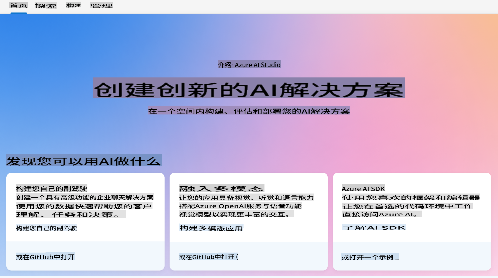
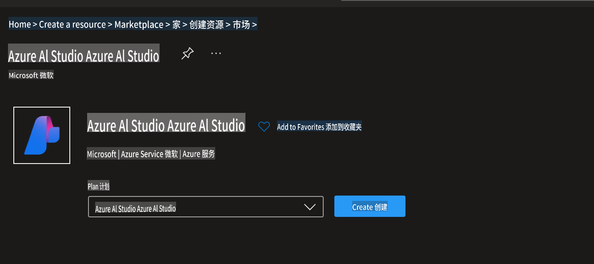
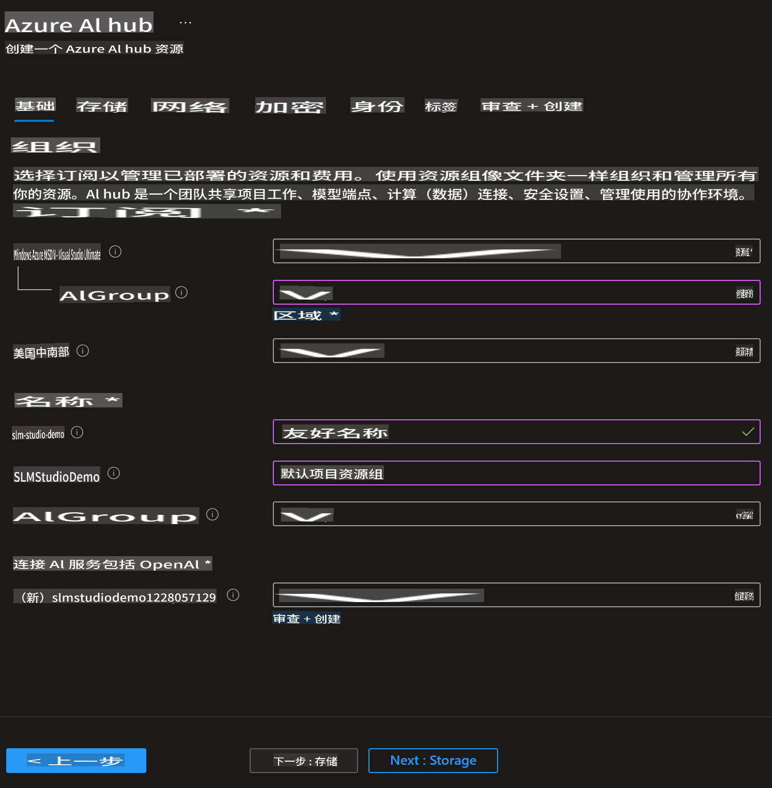
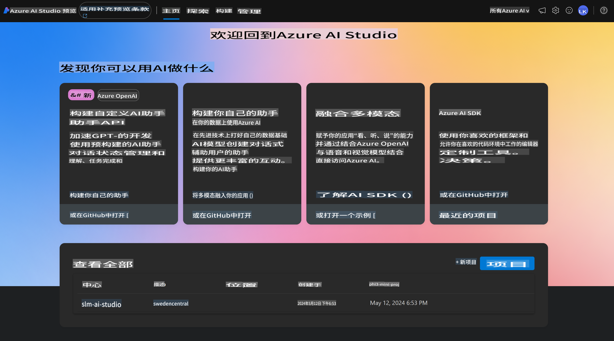
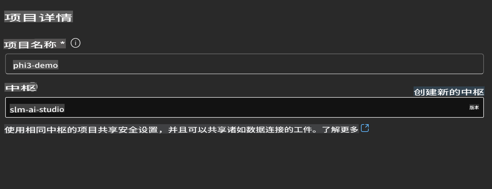
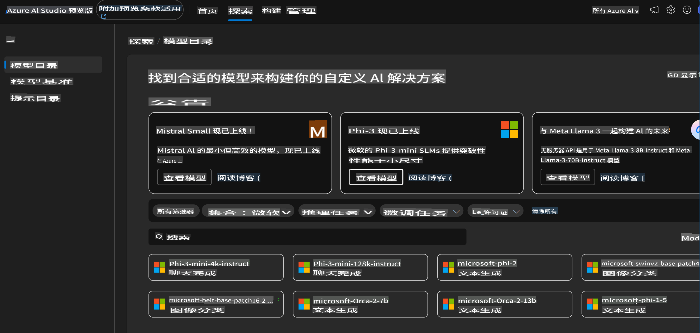
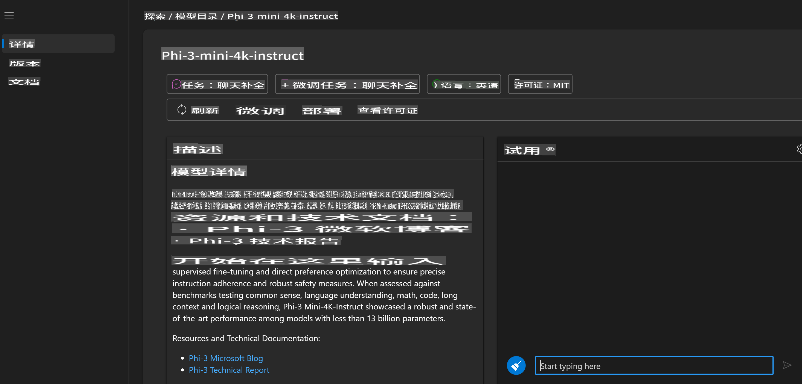
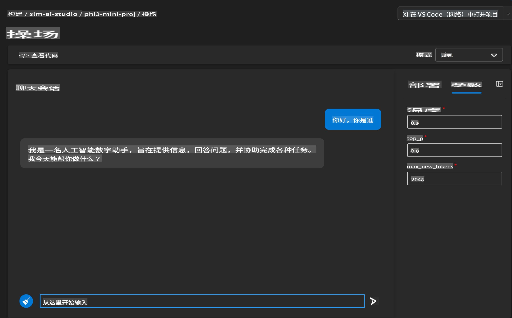
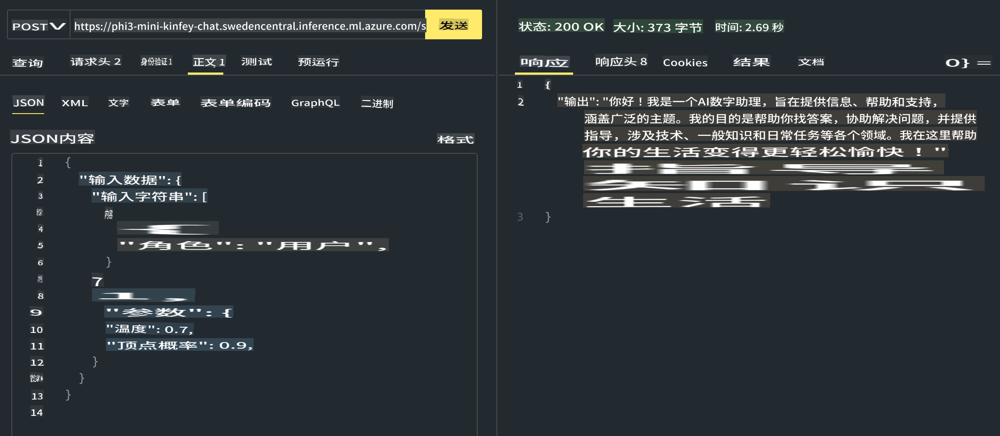

# **在 Azure AI Foundry 中使用 Phi-3**

随着生成式 AI 的发展，我们希望使用一个统一的平台来管理不同的 LLM 和 SLM，企业数据集成，微调/RAG 操作，以及在集成 LLM 和 SLM 后对不同企业业务的评估等，从而更好地实现生成式 AI 的智能应用。[Azure AI Foundry](https://ai.azure.com) 是一个企业级的生成式 AI 应用平台。



通过 Azure AI Foundry，您可以评估大语言模型（LLM）的响应，并通过提示流协调提示应用组件以获得更好的性能。该平台有助于将概念验证转变为全面生产的可扩展性。持续的监控和优化支持长期成功。

我们可以通过简单的步骤在 Azure AI Foundry 上快速部署 Phi-3 模型，然后使用 Azure AI Foundry 完成与 Phi-3 相关的 Playground/Chat、微调、评估等相关工作。

## **1. 准备工作**

## [AZD AI Foundry 入门模板](https://azure.github.io/awesome-azd/?name=AI+Studio)

### Azure AI Foundry 入门

这是一个 Bicep 模板，可以部署开始使用 Azure AI Foundry 所需的一切。包括带有依赖资源的 AI Hub、AI 项目、AI 服务和一个在线端点。

### 快速使用

如果您的机器上已经安装了 [Azure Developer CLI](https://learn.microsoft.com/azure/developer/azure-developer-cli/overview?WT.mc_id=aiml-138114-kinfeylo)，那么使用此模板就像在新目录中运行这个命令一样简单。

### 终端命令

```bash
azd init -t azd-aistudio-starter
```

或者
如果使用 azd VS Code 扩展，您可以在 VS Code 命令终端中粘贴此 URL。

### 终端 URL

```bash
azd-aistudio-starter
```

## 手动创建

在 [Azure Portal](https://portal.azure.com?WT.mc_id=aiml-138114-kinfeylo) 上创建 Azure AI Foundry



完成工作室命名和区域设置后，您可以创建它



创建成功后，您可以通过 [ai.azure.com](https://ai.azure.com/) 访问您创建的工作室



一个 AI Foundry 上可以有多个项目。在 AI Foundry 中创建一个项目以进行准备。



## **2. 在 Azure AI Foundry 中部署 Phi-3 模型**

点击项目的 Explore 选项进入 Model Catalog 并选择 Phi-3



选择 Phi-3-mini-4k-instruct



点击 'Deploy' 部署 Phi-3-mini-4k-instruct 模型

> [!NOTE]
>
> 部署时可以选择计算能力

## **3. 在 Azure AI Foundry 中使用 Playground Chat Phi-3**

前往部署页面，选择 Playground，并与 Azure AI Foundry 的 Phi-3 聊天



## **4. 从 Azure AI Foundry 部署模型**

要从 Azure 模型目录中部署模型，您可以按照以下步骤操作：

- 登录 Azure AI Foundry。
- 从 Azure AI Foundry 模型目录中选择您要部署的模型。
- 在模型的详情页面上，选择 Deploy，然后选择带有 Azure AI 内容安全的无服务器 API。
- 选择您要部署模型的项目。要使用无服务器 API 服务，您的工作区必须属于 East US 2 或 Sweden Central 区域。您可以自定义部署名称。
- 在部署向导中，选择定价和条款以了解定价和使用条款。
- 选择 Deploy。等待部署完成并重定向到部署页面。
- 选择 Open in playground 开始与模型交互。
- 您可以返回部署页面，选择部署，并记下端点的目标 URL 和密钥，这些可以用来调用部署并生成完成。
- 您可以随时通过导航到 Build 选项卡并从组件部分选择 Deployments 找到端点的详细信息、URL 和访问密钥。

> [!NOTE]
> 请注意，您的帐户必须在资源组上具有 Azure AI Developer 角色权限才能执行这些步骤。

## **5. 在 Azure AI Foundry 中使用 Phi-3 API**

您可以通过 Postman GET 访问 https://{Your project name}.region.inference.ml.azure.com/swagger.json 并结合密钥了解提供的接口


例如访问 score api 


您可以非常方便地获取请求参数以及响应参数。这是 Postman 的结果



**免责声明**：
本文档使用基于机器的人工智能翻译服务进行翻译。尽管我们努力确保准确性，但请注意，自动翻译可能包含错误或不准确之处。应将原文档的母语版本视为权威来源。对于关键信息，建议使用专业人工翻译。对于因使用此翻译而产生的任何误解或误读，我们不承担责任。