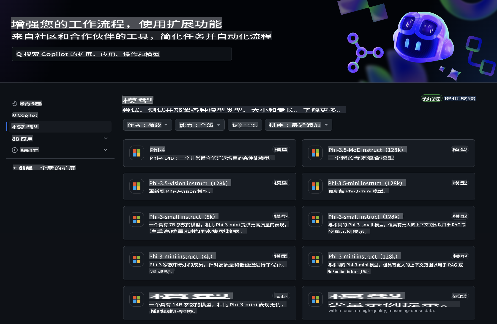
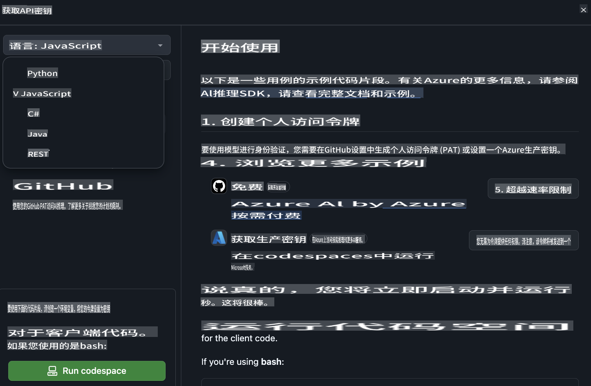
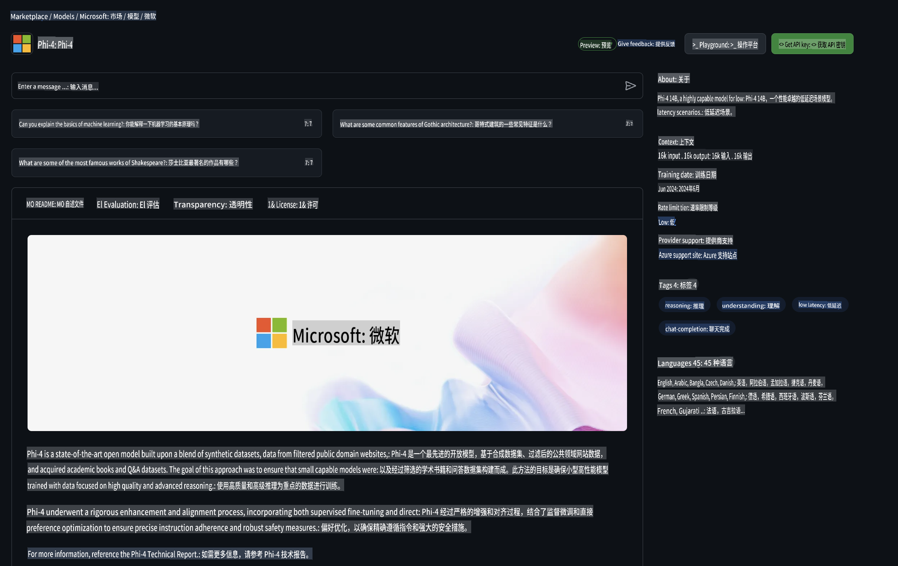

## GitHub 模型 - 公共测试版

欢迎来到 [GitHub 模型](https://github.com/marketplace/models)！我们已经为您准备好了一切，快来探索托管在 Azure AI 上的 AI 模型吧。



有关 GitHub 模型中可用模型的更多信息，请访问 [GitHub 模型市场](https://github.com/marketplace/models)。

## 可用模型

每个模型都配有专属的 Playground 和示例代码。


### GitHub 模型目录中的 Phi-3 模型

[Phi-3-Medium-128k-Instruct](https://github.com/marketplace/models/azureml/Phi-3-medium-128k-instruct)

[Phi-3-medium-4k-instruct](https://github.com/marketplace/models/azureml/Phi-3-medium-4k-instruct)

[Phi-3-mini-128k-instruct](https://github.com/marketplace/models/azureml/Phi-3-mini-128k-instruct)

[Phi-3-mini-4k-instruct](https://github.com/marketplace/models/azureml/Phi-3-mini-4k-instruct)

[Phi-3-small-128k-instruct](https://github.com/marketplace/models/azureml/Phi-3-small-128k-instruct)

[Phi-3-small-8k-instruct](https://github.com/marketplace/models/azureml/Phi-3-small-8k-instruct)

## 入门指南

我们为您准备了一些基本示例，可以立即运行。您可以在 samples 目录中找到它们。如果您想直接使用自己喜欢的编程语言，可以在以下语言中找到示例：

- Python
- JavaScript
- cURL

此外，还有一个专门的 Codespaces 环境，用于运行示例和模型。



## 示例代码

以下是一些用例的代码示例片段。有关 Azure AI Inference SDK 的更多信息，请参阅完整的文档和示例。

## 设置

1. 创建个人访问令牌  
您不需要为令牌赋予任何权限。请注意，该令牌将被发送到 Microsoft 服务。

要使用以下代码片段，请创建一个环境变量，将令牌设置为客户端代码的密钥。

如果您使用的是 bash：  
```
export GITHUB_TOKEN="<your-github-token-goes-here>"
```  
如果您使用的是 PowerShell：  
```
$Env:GITHUB_TOKEN="<your-github-token-goes-here>"
```  

如果您使用的是 Windows 命令提示符：  
```
set GITHUB_TOKEN=<your-github-token-goes-here>
```  

## Python 示例

### 安装依赖项  
使用 pip 安装 Azure AI Inference SDK（要求：Python >=3.8）：  
```
pip install azure-ai-inference
```  

### 运行基础代码示例  
该示例演示了对聊天完成 API 的基本调用。它利用了 GitHub AI 模型推理端点和您的 GitHub 令牌。调用是同步的。  
```
import os
from azure.ai.inference import ChatCompletionsClient
from azure.ai.inference.models import SystemMessage, UserMessage
from azure.core.credentials import AzureKeyCredential

endpoint = "https://models.inference.ai.azure.com"
# Replace Model_Name 
model_name = "Phi-3-small-8k-instruct"
token = os.environ["GITHUB_TOKEN"]

client = ChatCompletionsClient(
    endpoint=endpoint,
    credential=AzureKeyCredential(token),
)

response = client.complete(
    messages=[
        SystemMessage(content="You are a helpful assistant."),
        UserMessage(content="What is the capital of France?"),
    ],
    model=model_name,
    temperature=1.,
    max_tokens=1000,
    top_p=1.
)

print(response.choices[0].message.content)
```  

### 运行多轮对话  
该示例演示了与聊天完成 API 的多轮对话。当在聊天应用程序中使用模型时，您需要管理对话历史记录，并将最新的消息发送给模型。  
```
import os
from azure.ai.inference import ChatCompletionsClient
from azure.ai.inference.models import AssistantMessage, SystemMessage, UserMessage
from azure.core.credentials import AzureKeyCredential

token = os.environ["GITHUB_TOKEN"]
endpoint = "https://models.inference.ai.azure.com"
# Replace Model_Name
model_name = "Phi-3-small-8k-instruct"

client = ChatCompletionsClient(
    endpoint=endpoint,
    credential=AzureKeyCredential(token),
)

messages = [
    SystemMessage(content="You are a helpful assistant."),
    UserMessage(content="What is the capital of France?"),
    AssistantMessage(content="The capital of France is Paris."),
    UserMessage(content="What about Spain?"),
]

response = client.complete(messages=messages, model=model_name)

print(response.choices[0].message.content)
```  

### 流式输出  
为了更好的用户体验，您可能希望流式传输模型的响应，这样第一个 token 可以尽早显示，避免长时间等待响应。  
```
import os
from azure.ai.inference import ChatCompletionsClient
from azure.ai.inference.models import SystemMessage, UserMessage
from azure.core.credentials import AzureKeyCredential

token = os.environ["GITHUB_TOKEN"]
endpoint = "https://models.inference.ai.azure.com"
# Replace Model_Name
model_name = "Phi-3-small-8k-instruct"

client = ChatCompletionsClient(
    endpoint=endpoint,
    credential=AzureKeyCredential(token),
)

response = client.complete(
    stream=True,
    messages=[
        SystemMessage(content="You are a helpful assistant."),
        UserMessage(content="Give me 5 good reasons why I should exercise every day."),
    ],
    model=model_name,
)

for update in response:
    if update.choices:
        print(update.choices[0].delta.content or "", end="")

client.close()
```  

## JavaScript

### 安装依赖项  
安装 Node.js。

将以下文本复制并保存为 package.json 文件，放在您的文件夹中。  
```
{
  "type": "module",
  "dependencies": {
    "@azure-rest/ai-inference": "latest",
    "@azure/core-auth": "latest",
    "@azure/core-sse": "latest"
  }
}
```  

注意：@azure/core-sse 仅在您流式传输聊天完成响应时需要。

在此文件夹中打开终端窗口并运行 npm install。

对于以下每个代码片段，将内容复制到 sample.js 文件中，并使用 node sample.js 运行。

### 运行基础代码示例  
该示例演示了对聊天完成 API 的基本调用。它利用了 GitHub AI 模型推理端点和您的 GitHub 令牌。调用是同步的。  
```
import ModelClient from "@azure-rest/ai-inference";
import { AzureKeyCredential } from "@azure/core-auth";

const token = process.env["GITHUB_TOKEN"];
const endpoint = "https://models.inference.ai.azure.com";
// Update your modelname
const modelName = "Phi-3-small-8k-instruct";

export async function main() {

  const client = new ModelClient(endpoint, new AzureKeyCredential(token));

  const response = await client.path("/chat/completions").post({
    body: {
      messages: [
        { role:"system", content: "You are a helpful assistant." },
        { role:"user", content: "What is the capital of France?" }
      ],
      model: modelName,
      temperature: 1.,
      max_tokens: 1000,
      top_p: 1.
    }
  });

  if (response.status !== "200") {
    throw response.body.error;
  }
  console.log(response.body.choices[0].message.content);
}

main().catch((err) => {
  console.error("The sample encountered an error:", err);
});
```  

### 运行多轮对话  
该示例演示了与聊天完成 API 的多轮对话。当在聊天应用程序中使用模型时，您需要管理对话历史记录，并将最新的消息发送给模型。  
```
import ModelClient from "@azure-rest/ai-inference";
import { AzureKeyCredential } from "@azure/core-auth";

const token = process.env["GITHUB_TOKEN"];
const endpoint = "https://models.inference.ai.azure.com";
// Update your modelname
const modelName = "Phi-3-small-8k-instruct";

export async function main() {

  const client = new ModelClient(endpoint, new AzureKeyCredential(token));

  const response = await client.path("/chat/completions").post({
    body: {
      messages: [
        { role: "system", content: "You are a helpful assistant." },
        { role: "user", content: "What is the capital of France?" },
        { role: "assistant", content: "The capital of France is Paris." },
        { role: "user", content: "What about Spain?" },
      ],
      model: modelName,
    }
  });

  if (response.status !== "200") {
    throw response.body.error;
  }

  for (const choice of response.body.choices) {
    console.log(choice.message.content);
  }
}

main().catch((err) => {
  console.error("The sample encountered an error:", err);
});
```  

### 流式输出  
为了更好的用户体验，您可能希望流式传输模型的响应，这样第一个 token 可以尽早显示，避免长时间等待响应。  
```
import ModelClient from "@azure-rest/ai-inference";
import { AzureKeyCredential } from "@azure/core-auth";
import { createSseStream } from "@azure/core-sse";

const token = process.env["GITHUB_TOKEN"];
const endpoint = "https://models.inference.ai.azure.com";
// Update your modelname
const modelName = "Phi-3-small-8k-instruct";

export async function main() {

  const client = new ModelClient(endpoint, new AzureKeyCredential(token));

  const response = await client.path("/chat/completions").post({
    body: {
      messages: [
        { role: "system", content: "You are a helpful assistant." },
        { role: "user", content: "Give me 5 good reasons why I should exercise every day." },
      ],
      model: modelName,
      stream: true
    }
  }).asNodeStream();

  const stream = response.body;
  if (!stream) {
    throw new Error("The response stream is undefined");
  }

  if (response.status !== "200") {
    stream.destroy();
    throw new Error(`Failed to get chat completions, http operation failed with ${response.status} code`);
  }

  const sseStream = createSseStream(stream);

  for await (const event of sseStream) {
    if (event.data === "[DONE]") {
      return;
    }
    for (const choice of (JSON.parse(event.data)).choices) {
        process.stdout.write(choice.delta?.content ?? ``);
    }
  }
}

main().catch((err) => {
  console.error("The sample encountered an error:", err);
});
```  

## REST

### 运行基础代码示例  
将以下内容粘贴到 shell 中：  
```
curl -X POST "https://models.inference.ai.azure.com/chat/completions" \
    -H "Content-Type: application/json" \
    -H "Authorization: Bearer $GITHUB_TOKEN" \
    -d '{
        "messages": [
            {
                "role": "system",
                "content": "You are a helpful assistant."
            },
            {
                "role": "user",
                "content": "What is the capital of France?"
            }
        ],
        "model": "Phi-3-small-8k-instruct"
    }'
```  

### 运行多轮对话  
调用聊天完成 API 并传递聊天历史记录：  
```
curl -X POST "https://models.inference.ai.azure.com/chat/completions" \
    -H "Content-Type: application/json" \
    -H "Authorization: Bearer $GITHUB_TOKEN" \
    -d '{
        "messages": [
            {
                "role": "system",
                "content": "You are a helpful assistant."
            },
            {
                "role": "user",
                "content": "What is the capital of France?"
            },
            {
                "role": "assistant",
                "content": "The capital of France is Paris."
            },
            {
                "role": "user",
                "content": "What about Spain?"
            }
        ],
        "model": "Phi-3-small-8k-instruct"
    }'
```  

### 流式输出  
以下是调用端点并流式传输响应的示例。  
```
curl -X POST "https://models.inference.ai.azure.com/chat/completions" \
    -H "Content-Type: application/json" \
    -H "Authorization: Bearer $GITHUB_TOKEN" \
    -d '{
        "messages": [
            {
                "role": "system",
                "content": "You are a helpful assistant."
            },
            {
                "role": "user",
                "content": "Give me 5 good reasons why I should exercise every day."
            }
        ],
        "stream": true,
        "model": "Phi-3-small-8k-instruct"
    }'
```  

## GitHub 模型的免费使用和速率限制



[Playground 和免费 API 使用的速率限制](https://docs.github.com/en/github-models/prototyping-with-ai-models#rate-limits) 旨在帮助您实验模型并构建 AI 应用的原型。若需超出这些限制的使用，并将您的应用扩展到生产规模，您必须从 Azure 账户中配置资源，并从那里进行身份验证，而不是使用 GitHub 个人访问令牌。您无需更改代码中的其他内容。使用此链接了解如何超越 Azure AI 的免费层限制。

### 声明

请记住，与模型交互时，您是在实验 AI，因此可能会出现内容错误。

此功能受各种限制（包括每分钟请求数、每天请求数、每次请求的 token 数和并发请求数）的约束，并不适用于生产用例。

GitHub 模型使用 Azure AI 内容安全。这些过滤器在 GitHub 模型体验中无法关闭。如果您决定通过付费服务使用模型，请根据您的需求配置内容过滤器。

此服务适用于 GitHub 的预发布条款。

**免责声明**：  
本文件通过机器翻译服务进行翻译。尽管我们努力确保准确性，但请注意，自动翻译可能包含错误或不准确之处。应以原始语言的文件作为权威来源。对于关键信息，建议使用专业人工翻译。我们对因使用此翻译而引起的任何误解或误读不承担责任。