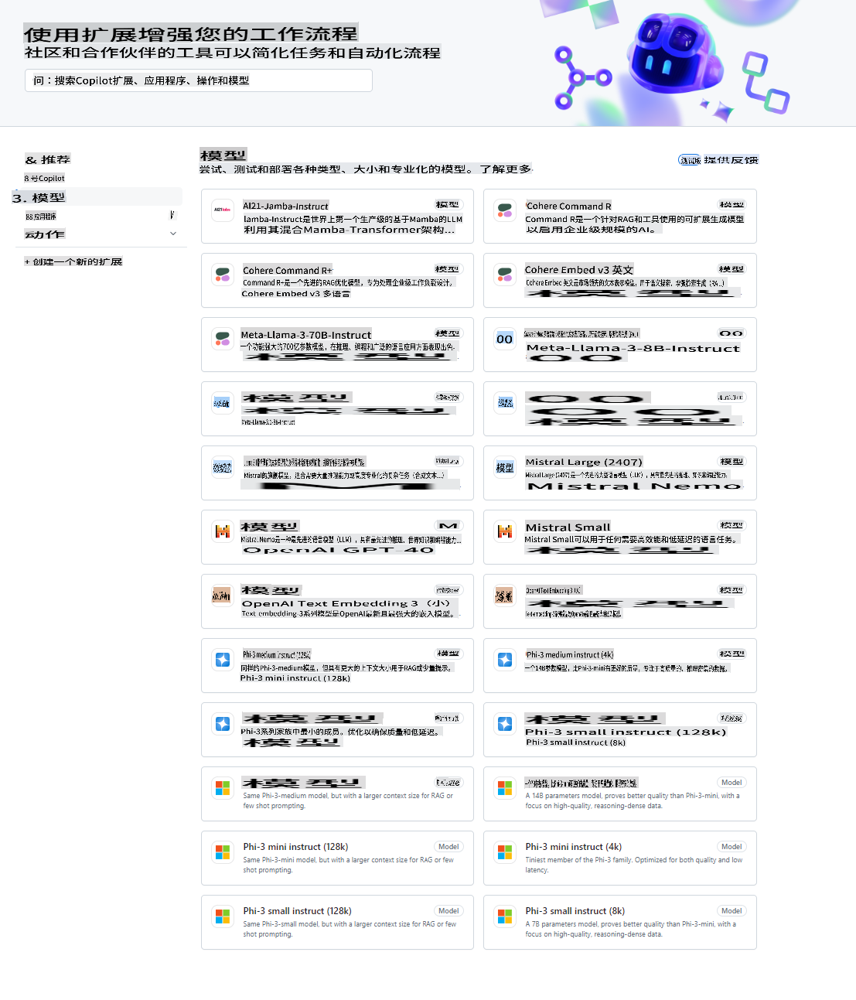
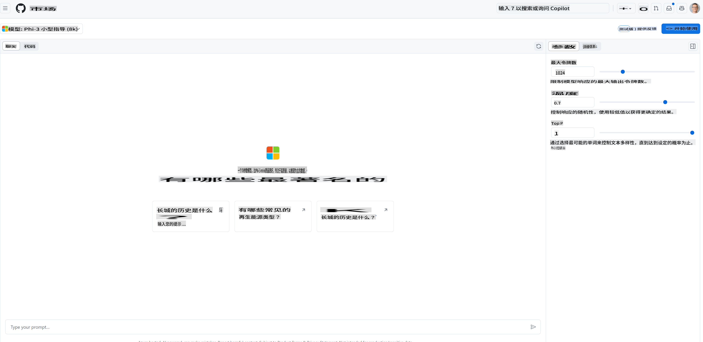
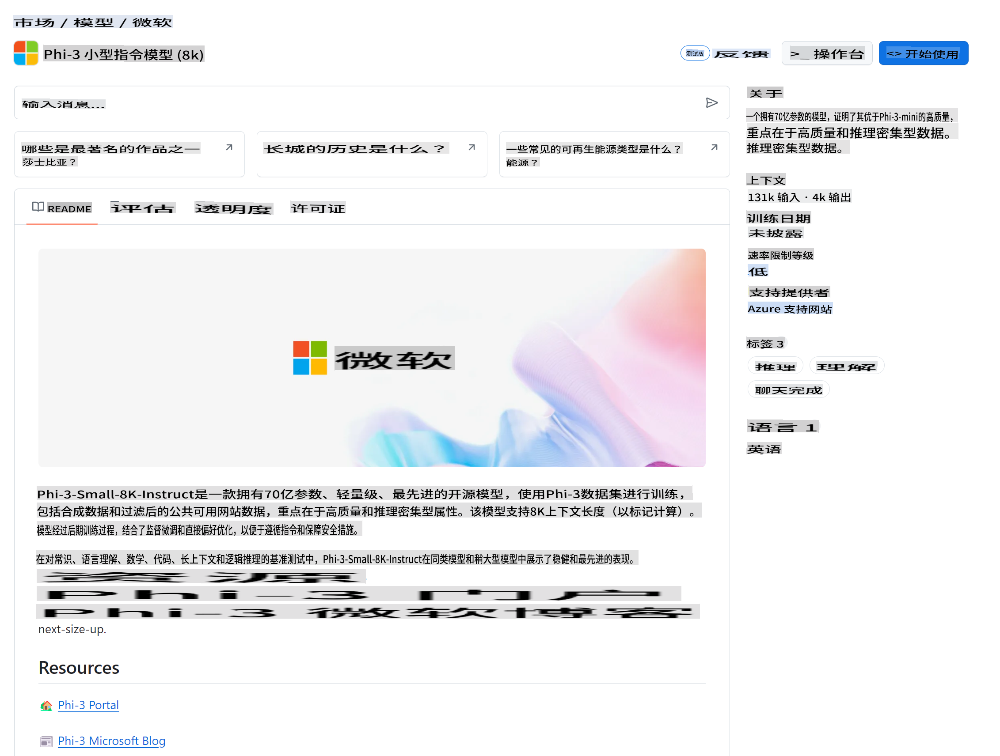

## GitHub 模型 - 限量公开测试

欢迎使用 [GitHub Models](https://github.com/marketplace/models)! 我们已经为您准备好了在 Azure AI 上托管的 AI 模型，供您探索。



关于 GitHub Models 上可用模型的更多信息，请查看 [GitHub Model Marketplace](https://github.com/marketplace/models)。

## 可用模型

每个模型都有专门的试验区和示例代码



### GitHub 模型目录中的 Phi-3 模型

[Phi-3-Medium-128k-Instruct](https://github.com/marketplace/models/azureml/Phi-3-medium-128k-instruct)

[Phi-3-medium-4k-instruct](https://github.com/marketplace/models/azureml/Phi-3-medium-4k-instruct)

[Phi-3-mini-128k-instruct](https://github.com/marketplace/models/azureml/Phi-3-mini-128k-instruct)

[Phi-3-mini-4k-instruct](https://github.com/marketplace/models/azureml/Phi-3-mini-4k-instruct)

[Phi-3-small-128k-instruct](https://github.com/marketplace/models/azureml/Phi-3-small-128k-instruct)

[Phi-3-small-8k-instruct](https://github.com/marketplace/models/azureml/Phi-3-small-8k-instruct)

## 快速开始

我们已经为您准备了一些基本的示例，您可以在 samples 目录中找到它们。如果您想直接使用自己喜欢的语言，可以在以下语言中找到相应的示例：

- Python
- JavaScript
- cURL

我们还为运行示例和模型提供了专用的 Codespaces 环境。


## 示例代码

以下是一些用例的示例代码片段。关于 Azure AI Inference SDK 的更多信息，请参阅完整的文档和示例。

## 设置

1. 创建个人访问令牌
您不需要为令牌授予任何权限。请注意，令牌将发送到 Microsoft 服务。

要使用下面的代码片段，请创建一个环境变量，将您的令牌设置为客户端代码的密钥。

如果您使用的是 bash：
```
export GITHUB_TOKEN="<your-github-token-goes-here>"
```
如果您使用的是 powershell：

```
$Env:GITHUB_TOKEN="<your-github-token-goes-here>"
```

如果您使用的是 Windows 命令提示符：

```
set GITHUB_TOKEN=<your-github-token-goes-here>
```

## Python 示例

### 安装依赖
使用 pip 安装 Azure AI Inference SDK（要求：Python >=3.8）：

```
pip install azure-ai-inference
```
### 运行基本代码示例

此示例演示了对聊天完成 API 的基本调用。它利用了 GitHub AI 模型推理端点和您的 GitHub 令牌。调用是同步的。

```
import os
from azure.ai.inference import ChatCompletionsClient
from azure.ai.inference.models import SystemMessage, UserMessage
from azure.core.credentials import AzureKeyCredential

endpoint = "https://models.inference.ai.azure.com"
# 替换 Model_Name
model_name = "Phi-3-small-8k-instruct"
token = os.environ["GITHUB_TOKEN"]

client = ChatCompletionsClient(
    endpoint=endpoint,
    credential=AzureKeyCredential(token),
)

response = client.complete(
    messages=[
        SystemMessage(content="You are a helpful assistant."),
        UserMessage(content="What is the capital of France?"),
    ],
    model=model_name,
    temperature=1.,
    max_tokens=1000,
    top_p=1.
)

print(response.choices[0].message.content)
```

### 运行多轮对话

此示例演示了使用聊天完成 API 进行多轮对话。当您在聊天应用程序中使用该模型时，您需要管理对话的历史记录并将最新的消息发送给模型。

```
import os
from azure.ai.inference import ChatCompletionsClient
from azure.ai.inference.models import AssistantMessage, SystemMessage, UserMessage
from azure.core.credentials import AzureKeyCredential

token = os.environ["GITHUB_TOKEN"]
endpoint = "https://models.inference.ai.azure.com"
# 替换 Model_Name
model_name = "Phi-3-small-8k-instruct"

client = ChatCompletionsClient(
    endpoint=endpoint,
    credential=AzureKeyCredential(token),
)

messages = [
    SystemMessage(content="You are a helpful assistant."),
    UserMessage(content="What is the capital of France?"),
    AssistantMessage(content="The capital of France is Paris."),
    UserMessage(content="What about Spain?"),
]

response = client.complete(messages=messages, model=model_name)

print(response.choices[0].message.content)
```

### 流式输出

为了更好的用户体验，您可能希望流式传输模型的响应，以便第一个令牌尽早显示，避免等待长时间的响应。

```
import os
from azure.ai.inference import ChatCompletionsClient
from azure.ai.inference.models import SystemMessage, UserMessage
from azure.core.credentials import AzureKeyCredential

token = os.environ["GITHUB_TOKEN"]
endpoint = "https://models.inference.ai.azure.com"
# 替换 Model_Name
model_name = "Phi-3-small-8k-instruct"

client = ChatCompletionsClient(
    endpoint=endpoint,
    credential=AzureKeyCredential(token),
)

response = client.complete(
    stream=True,
    messages=[
        SystemMessage(content="You are a helpful assistant."),
        UserMessage(content="Give me 5 good reasons why I should exercise every day."),
    ],
    model=model_name,
)

for update in response:
    if update.choices:
        print(update.choices[0].delta.content or "", end="")

client.close()
```
## JavaScript

### 安装依赖

安装 Node.js。

复制以下内容并将其保存为文件 package.json 到您的文件夹中。

```
{
  "type": "module",
  "dependencies": {
    "@azure-rest/ai-inference": "latest",
    "@azure/core-auth": "latest",
    "@azure/core-sse": "latest"
  }
}
```

注意：@azure/core-sse 仅在您流式传输聊天完成响应时需要。

在此文件夹中打开终端窗口并运行 npm install。

对于下面的每个代码片段，将内容复制到文件 sample.js 中并使用 node sample.js 运行。

### 运行基本代码示例

此示例演示了对聊天完成 API 的基本调用。它利用了 GitHub AI 模型推理端点和您的 GitHub 令牌。调用是同步的。

```
import ModelClient from "@azure-rest/ai-inference";
import { AzureKeyCredential } from "@azure/core-auth";

const token = process.env["GITHUB_TOKEN"];
const endpoint = "https://models.inference.ai.azure.com";
// 更新您的 modelname
const modelName = "Phi-3-small-8k-instruct";

export async function main() {

  const client = new ModelClient(endpoint, new AzureKeyCredential(token));

  const response = await client.path("/chat/completions").post({
    body: {
      messages: [
        { role:"system", content: "You are a helpful assistant." },
        { role:"user", content: "What is the capital of France?" }
      ],
      model: modelName,
      temperature: 1.,
      max_tokens: 1000,
      top_p: 1.
    }
  });

  if (response.status !== "200") {
    throw response.body.error;
  }
  console.log(response.body.choices[0].message.content);
}

main().catch((err) => {
  console.error("The sample encountered an error:", err);
});
```

### 运行多轮对话

此示例演示了使用聊天完成 API 进行多轮对话。当您在聊天应用程序中使用该模型时，您需要管理对话的历史记录并将最新的消息发送给模型。

```
import ModelClient from "@azure-rest/ai-inference";
import { AzureKeyCredential } from "@azure/core-auth";

const token = process.env["GITHUB_TOKEN"];
const endpoint = "https://models.inference.ai.azure.com";
// 更新您的 modelname
const modelName = "Phi-3-small-8k-instruct";

export async function main() {

  const client = new ModelClient(endpoint, new AzureKeyCredential(token));

  const response = await client.path("/chat/completions").post({
    body: {
      messages: [
        { role: "system", content: "You are a helpful assistant." },
        { role: "user", content: "What is the capital of France?" },
        { role: "assistant", content: "The capital of France is Paris." },
        { role: "user", content: "What about Spain?" },
      ],
      model: modelName,
    }
  });

  if (response.status !== "200") {
    throw response.body.error;
  }

  for (const choice of response.body.choices) {
    console.log(choice.message.content);
  }
}

main().catch((err) => {
  console.error("The sample encountered an error:", err);
});
```

### 流式输出
为了更好的用户体验，您可能希望流式传输模型的响应，以便第一个令牌尽早显示，避免等待长时间的响应。

```
import ModelClient from "@azure-rest/ai-inference";
import { AzureKeyCredential } from "@azure/core-auth";
import { createSseStream } from "@azure/core-sse";

const token = process.env["GITHUB_TOKEN"];
const endpoint = "https://models.inference.ai.azure.com";
// 更新您的 modelname
const modelName = "Phi-3-small-8k-instruct";

export async function main() {

  const client = new ModelClient(endpoint, new AzureKeyCredential(token));

  const response = await client.path("/chat/completions").post({
    body: {
      messages: [
        { role: "system", content: "You are a helpful assistant." },
        { role: "user", content: "Give me 5 good reasons why I should exercise every day." },
      ],
      model: modelName,
      stream: true
    }
  }).asNodeStream();

  const stream = response.body;
  if (!stream) {
    throw new Error("The response stream is undefined");
  }

  if (response.status !== "200") {
    stream.destroy();
    throw new Error(`Failed to get chat completions, http operation failed with ${response.status} code`);
  }

  const sseStream = createSseStream(stream);

  for await (const event of sseStream) {
    if (event.data === "[DONE]") {
      return;
    }
    for (const choice of (JSON.parse(event.data)).choices) {
        process.stdout.write(choice.delta?.content ?? ``);
    }
  }
}

main().catch((err) => {
  console.error("The sample encountered an error:", err);
});
```

## REST

### 运行基本代码示例

将以下内容粘贴到 shell 中：

```
curl -X POST "https://models.inference.ai.azure.com/chat/completions" \
    -H "Content-Type: application/json" \
    -H "Authorization: Bearer $GITHUB_TOKEN" \
    -d '{
        "messages": [
            {
                "role": "system",
                "content": "You are a helpful assistant."
            },
            {
                "role": "user",
                "content": "What is the capital of France?"
            }
        ],
        "model": "Phi-3-small-8k-instruct"
    }'
```
### 运行多轮对话

调用聊天完成 API 并传递聊天历史记录：

```
curl -X POST "https://models.inference.ai.azure.com/chat/completions" \
    -H "Content-Type: application/json" \
    -H "Authorization: Bearer $GITHUB_TOKEN" \
    -d '{
        "messages": [
            {
                "role": "system",
                "content": "You are a helpful assistant."
            },
            {
                "role": "user",
                "content": "What is the capital of France?"
            },
            {
                "role": "assistant",
                "content": "The capital of France is Paris."
            },
            {
                "role": "user",
                "content": "What about Spain?"
            }
        ],
        "model": "Phi-3-small-8k-instruct"
    }'
```
### 流式输出

这是调用端点并流式传输响应的示例。

```
curl -X POST "https://models.inference.ai.azure.com/chat/completions" \
    -H "Content-Type: application/json" \
    -H "Authorization: Bearer $GITHUB_TOKEN" \
    -d '{
        "messages": [
            {
                "role": "system",
                "content": "You are a helpful assistant."
            },
            {
                "role": "user",
                "content": "Give me 5 good reasons why I should exercise every day."
            }
        ],
        "stream": true,
        "model": "Phi-3-small-8k-instruct"
    }'
```

## GitHub 模型的免费使用和速率限制



[试验区和免费 API 使用的速率限制](https://docs.github.com/en/github-models/prototyping-with-ai-models#rate-limits)旨在帮助您试验模型并原型化您的 AI 应用程序。要超出这些限制并将您的应用程序扩展到生产规模，您必须从 Azure 账户中配置资源，并从那里进行身份验证，而不是使用您的 GitHub 个人访问令牌。您不需要在代码中更改任何其他内容。使用此链接了解如何超越 Azure AI 的免费层限制。

### 声明

请记住，在与模型交互时，您是在试验 AI，因此可能会出现内容错误。

该功能受各种限制（包括每分钟请求数、每天请求数、每次请求的令牌数和并发请求数）限制，并且不适用于生产用例。

GitHub Models 使用 Azure AI 内容安全。这些过滤器不能在 GitHub Models 体验中关闭。如果您决定通过付费服务使用模型，请配置您的内容过滤器以满足您的要求。

此服务受 GitHub 的预发布条款约束。

免责声明：该翻译由AI模型从原文翻译而来，可能不够完美。请审阅输出内容并进行必要的修改。