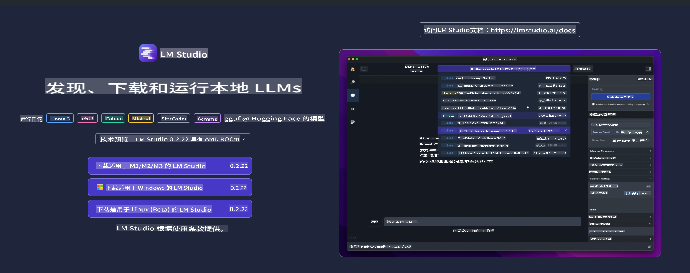
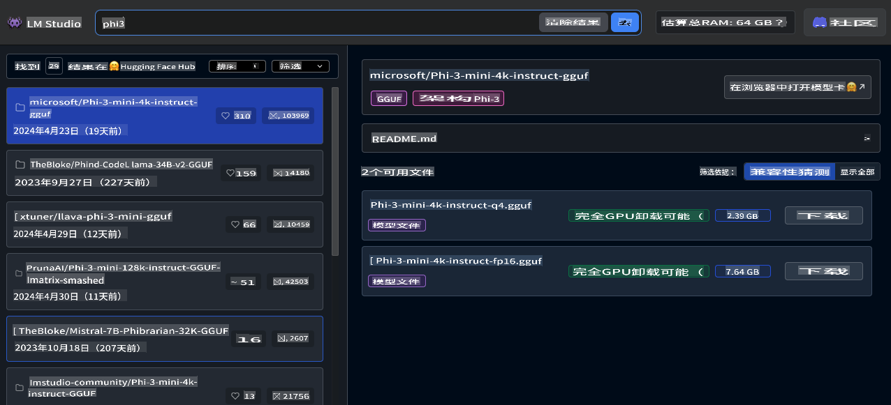
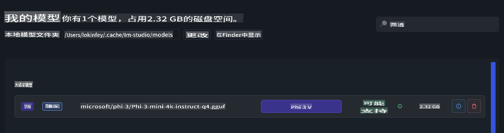
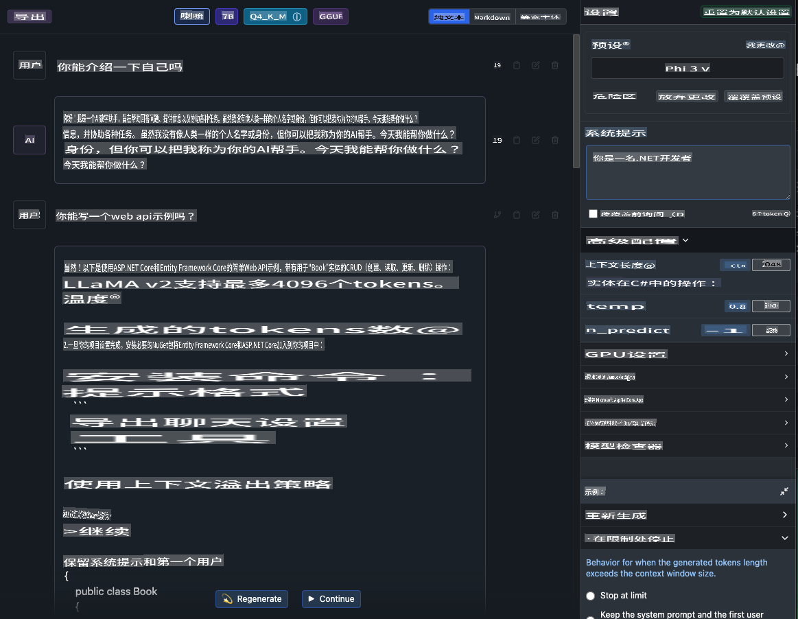
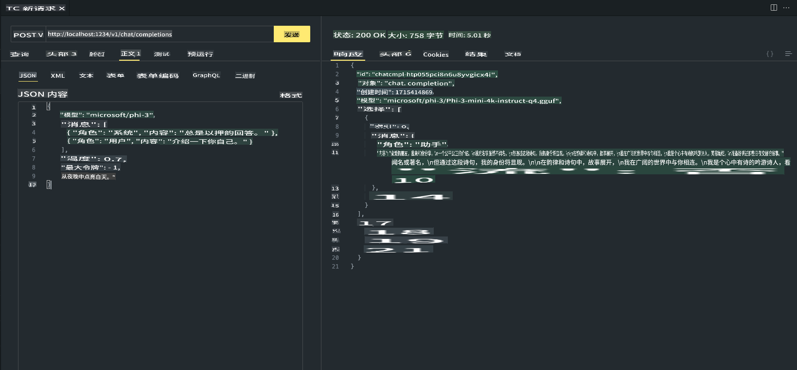

# **在 LM Studio 中使用 Phi-3**

[LM Studio](https://lmstudio.ai) 是一个在本地桌面应用程序中调用 SLM 和 LLM 的应用。它允许用户轻松使用不同的模型，并支持通过 NVIDIA/AMD GPU/Apple Silicon 进行加速计算。通过 LM Studio，用户可以下载、安装和运行基于 Hugging Face 的各种开源 LLM 和 SLM，在本地测试模型性能，无需编写代码。

## **1. 安装**

你可以通过 LM Studio 的网站 [https://lmstudio.ai/](https://lmstudio.ai/) 选择在 Windows、Linux、macOS 上安装。

## **2. 在 LM Studio 中下载 Phi-3**

LM Studio 以量化的 gguf 格式调用开源模型。你可以直接从 LM Studio 提供的平台搜索 UI 下载，也可以自行下载并在相关目录中指定调用。

***我们在 LM Studio 搜索 Phi3 并下载 Phi-3 gguf 模型***

***通过 LM Studio 管理下载的模型***

## **3. 在 LM Studio 中与 Phi-3 聊天**

我们在 LM Studio Chat 中选择 Phi-3，并设置聊天模板（Preset - Phi3）以开始与 Phi-3 的本地聊天。

***注意***：

a. 你可以通过 LM Studio 控制面板中的高级配置设置参数

b. 因为 Phi-3 有特定的聊天模板要求，必须在 Preset 中选择 Phi-3

c. 你还可以设置不同的参数，例如 GPU 使用等

## **4. 从 LM Studio 调用 Phi-3 API**

LM Studio 支持快速部署本地服务，你可以无需编码构建模型服务。

这是在 Postman 中的结果

免责声明：本翻译由AI模型从原文翻译而来，可能并不完美。请审核输出内容并进行任何必要的修改。