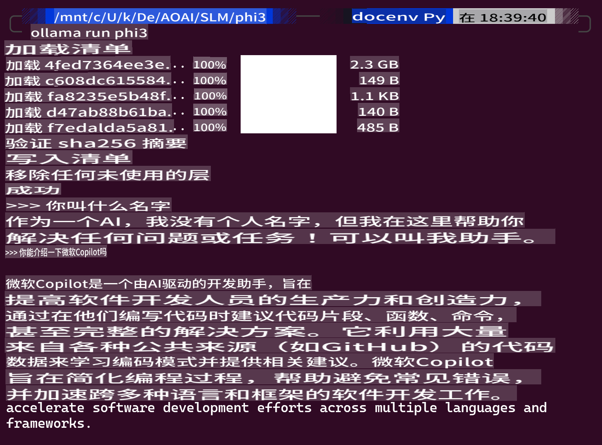
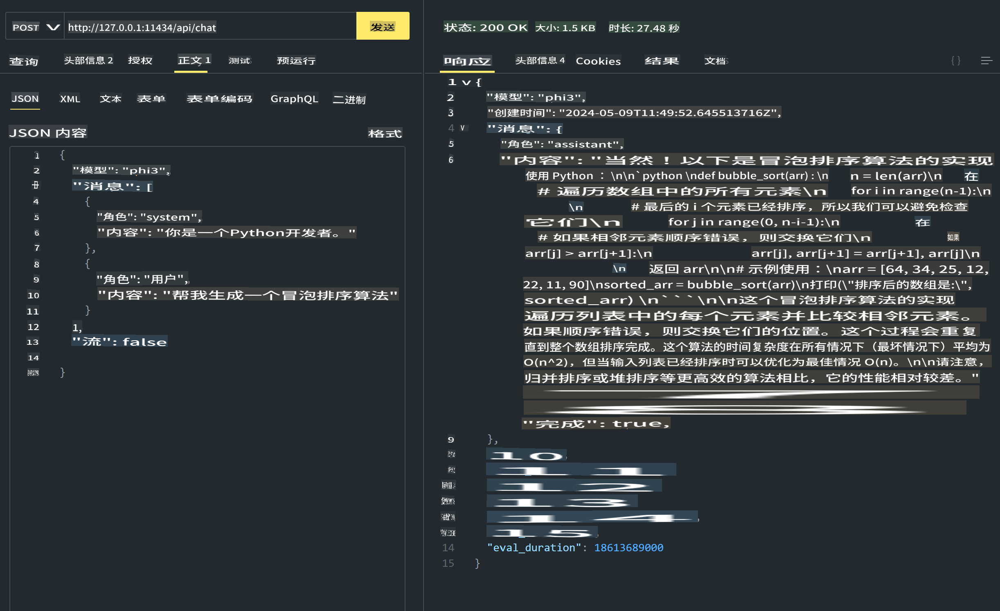
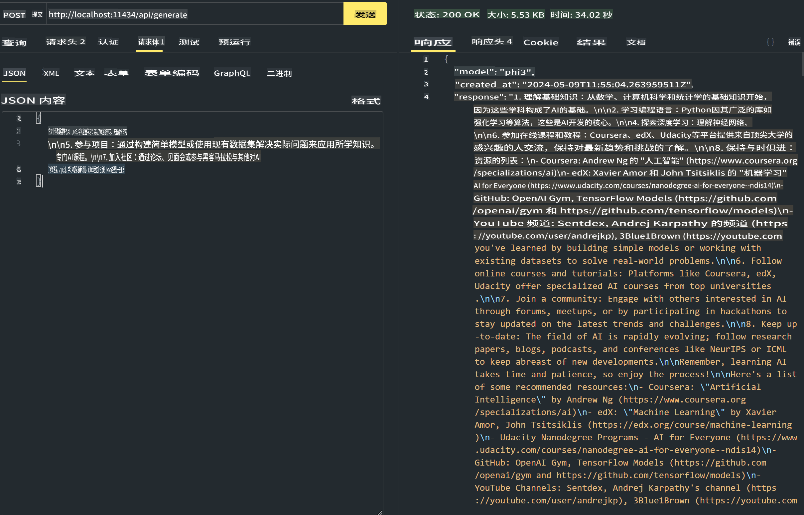

# **在 Ollama 中使用 Phi-3**

[Ollama](https://ollama.com) 通过简单脚本让更多人可以直接部署开源 LLM 或 SLM，还可以构建 API 以帮助本地 Copilot 应用场景。

## **1. 安装**

Ollama 支持在 Windows、macOS 和 Linux 上运行。你可以通过这个链接安装 Ollama ([https://ollama.com/download](https://ollama.com/download))。安装成功后，你可以直接通过终端窗口使用 Ollama 脚本调用 Phi-3。你可以看到所有 [Ollama 中可用的库](https://ollama.com/library)。如果你在 Codespace 中打开这个仓库，它已经安装了 Ollama。

```bash

ollama run phi3

```

> [!NOTE]
> 第一次运行时模型会先下载。当然，你也可以直接指定下载的 Phi-3 模型。我们以 WSL 为例运行命令。模型下载成功后，你可以直接在终端上进行交互。



## **2. 从 Ollama 调用 phi-3 API**

如果你想调用 Ollama 生成的 Phi-3 API，你可以在终端中使用此命令启动 Ollama 服务器。

```bash

ollama serve

```

> [!NOTE]
> 如果运行 MacOS 或 Linux，请注意你可能会遇到以下错误 **"Error: listen tcp 127.0.0.1:11434: bind: address already in use"** 你在运行命令时可能会遇到这个错误。你可以忽略这个错误，因为它通常表示服务器已经在运行，或者你可以停止并重新启动 Ollama：

**macOS**

```bash

brew services restart ollama

```

**Linux**

```bash

sudo systemctl stop ollama

```

Ollama 支持两个 API：generate 和 chat。你可以根据需要调用 Ollama 提供的模型 API，向运行在 11434 端口的本地服务发送请求。

**Chat**

```bash

curl http://127.0.0.1:11434/api/chat -d '{
  "model": "phi3",
  "messages": [
    {
      "role": "system",
      "content": "Your are a python developer."
    },
    {
      "role": "user",
      "content": "Help me generate a bubble algorithm"
    }
  ],
  "stream": false
  
}'


```

这是在 Postman 中的结果



```bash

curl http://127.0.0.1:11434/api/generate -d '{
  "model": "phi3",
  "prompt": "<|system|>Your are my AI assistant.<|end|><|user|>tell me how to learn AI<|end|><|assistant|>",
  "stream": false
}'


```

这是在 Postman 中的结果



## 其他资源

在 [他们的库](https://ollama.com/library) 中查看 Ollama 中可用的模型列表。

使用此命令从 Ollama 服务器拉取你的模型

```bash
ollama pull phi3
```

使用此命令运行模型

```bash
ollama run phi3
```

***注意:*** 访问这个链接 [https://github.com/ollama/ollama/blob/main/docs/api.md](https://github.com/ollama/ollama/blob/main/docs/api.md) 了解更多信息

## 从 Python 调用 Ollama

你可以使用 `requests` or `urllib3` 向上面使用的本地服务器端点发出请求。然而，在 Python 中使用 Ollama 的一种流行方式是通过 [openai](https://pypi.org/project/openai/) SDK，因为 Ollama 提供了兼容 OpenAI 的服务器端点。

这是一个 phi3-mini 的示例：

```python
import openai

client = openai.OpenAI(
    base_url="http://localhost:11434/v1",
    api_key="nokeyneeded",
)

response = client.chat.completions.create(
    model="phi3",
    temperature=0.7,
    n=1,
    messages=[
        {"role": "system", "content": "You are a helpful assistant."},
        {"role": "user", "content": "Write a haiku about a hungry cat"},
    ],
)

print("Response:")
print(response.choices[0].message.content)
```

## 从 JavaScript 调用 Ollama 

```javascript
// Example of Summarize a file with Phi-3
script({
    model: "ollama:phi3",
    title: "Summarize with Phi-3",
    system: ["system"],
})

// Example of summarize
const file = def("FILE", env.files)
$`Summarize ${file} in a single paragraph.`
```

## 从 C# 调用 Ollama

创建一个新的 C# 控制台应用程序并添加以下 NuGet 包：

```bash
dotnet add package Microsoft.SemanticKernel --version 1.13.0
```

然后在 `Program.cs` 文件中替换此代码

```csharp
using Microsoft.SemanticKernel;
using Microsoft.SemanticKernel.ChatCompletion;

// add chat completion service using the local ollama server endpoint
#pragma warning disable SKEXP0001, SKEXP0003, SKEXP0010, SKEXP0011, SKEXP0050, SKEXP0052
builder.AddOpenAIChatCompletion(
    modelId: "phi3.5",
    endpoint: new Uri("http://localhost:11434/"),
    apiKey: "non required");

// invoke a simple prompt to the chat service
string prompt = "Write a joke about kittens";
var response = await kernel.InvokePromptAsync(prompt);
Console.WriteLine(response.GetValue<string>());
```

使用以下命令运行应用程序：

```bash
dotnet run
```

**免责声明**:
本文档已使用基于机器的人工智能翻译服务进行翻译。尽管我们努力确保准确性，但请注意，自动翻译可能包含错误或不准确之处。应将原始文档的母语版本视为权威来源。对于关键信息，建议使用专业人工翻译。对于因使用本翻译而产生的任何误解或误读，我们不承担责任。