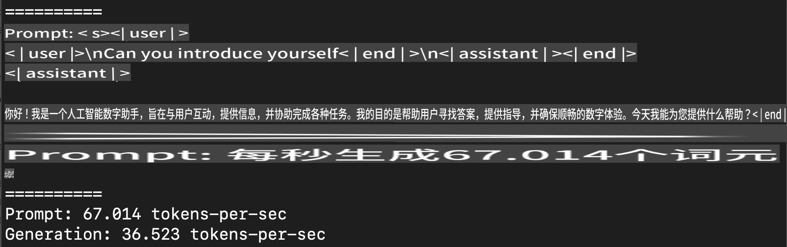
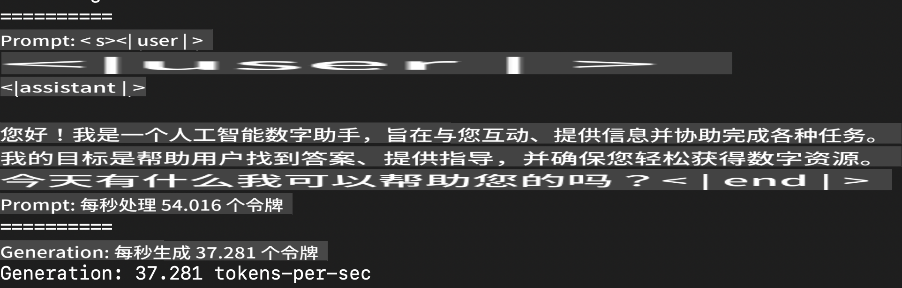
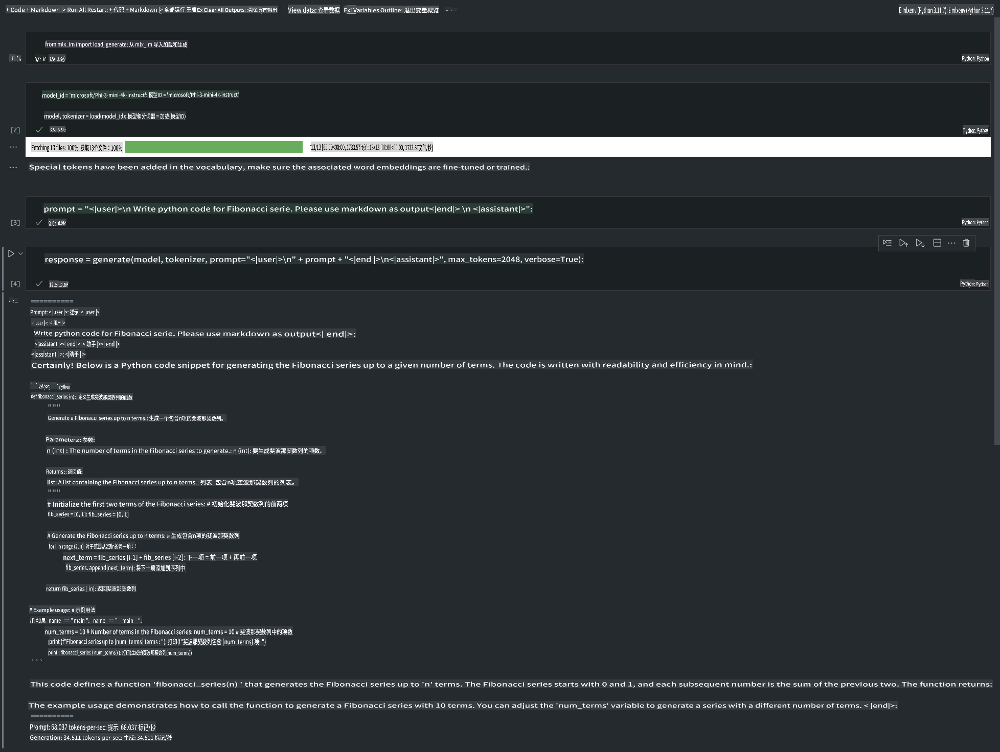

# **使用 Apple MLX 框架推理 Phi-3**

## **什么是 MLX 框架**

MLX 是一个由 Apple 机器学习研究团队推出的专为 Apple 芯片设计的机器学习研究框架。

MLX 是为机器学习研究者设计的，旨在既易于使用又高效地训练和部署模型。框架本身的设计也非常简洁，方便研究者扩展和改进 MLX，从而快速探索新想法。

通过 MLX，可以在 Apple Silicon 设备上加速运行大型语言模型（LLMs），并且能够非常方便地在本地运行模型。

## **使用 MLX 推理 Phi-3-mini**

### **1. 设置 MLX 环境**

1. Python 3.11.x  
2. 安装 MLX 库  

```bash

pip install mlx-lm

```

### **2. 在终端中使用 MLX 运行 Phi-3-mini**

```bash

python -m mlx_lm.generate --model microsoft/Phi-3-mini-4k-instruct --max-token 2048 --prompt  "<|user|>\nCan you introduce yourself<|end|>\n<|assistant|>"

```

运行结果（我的环境是 Apple M1 Max，64GB 内存）如下：



### **3. 在终端中使用 MLX 对 Phi-3-mini 进行量化**

```bash

python -m mlx_lm.convert --hf-path microsoft/Phi-3-mini-4k-instruct

```

***注意：*** 模型可以通过 `mlx_lm.convert` 进行量化，默认的量化方式是 INT4。此示例将 Phi-3-mini 量化为 INT4。

模型通过 `mlx_lm.convert` 进行量化，默认量化为 INT4。本示例将 Phi-3-mini 量化为 INT4。量化后的模型将存储在默认目录 `./mlx_model` 中。

我们可以通过终端测试使用 MLX 量化的模型：

```bash

python -m mlx_lm.generate --model ./mlx_model/ --max-token 2048 --prompt  "<|user|>\nCan you introduce yourself<|end|>\n<|assistant|>"

```

运行结果如下：



### **4. 在 Jupyter Notebook 中运行 Phi-3-mini**



***注意：*** 请参考此示例 [点击此链接](../../../../../code/03.Inference/MLX/MLX_DEMO.ipynb)

## **资源**

1. 了解 Apple MLX 框架 [https://ml-explore.github.io](https://ml-explore.github.io/mlx/build/html/index.html)

2. Apple MLX GitHub 仓库 [https://github.com/ml-explore](https://github.com/ml-explore)

**免责声明**：  
本文件通过基于机器的人工智能翻译服务翻译而成。尽管我们尽力确保准确性，但请注意，自动翻译可能包含错误或不准确之处。应以原始语言的原始文件作为权威来源。对于关键信息，建议使用专业人工翻译。对于因使用本翻译而导致的任何误解或误读，我们概不负责。