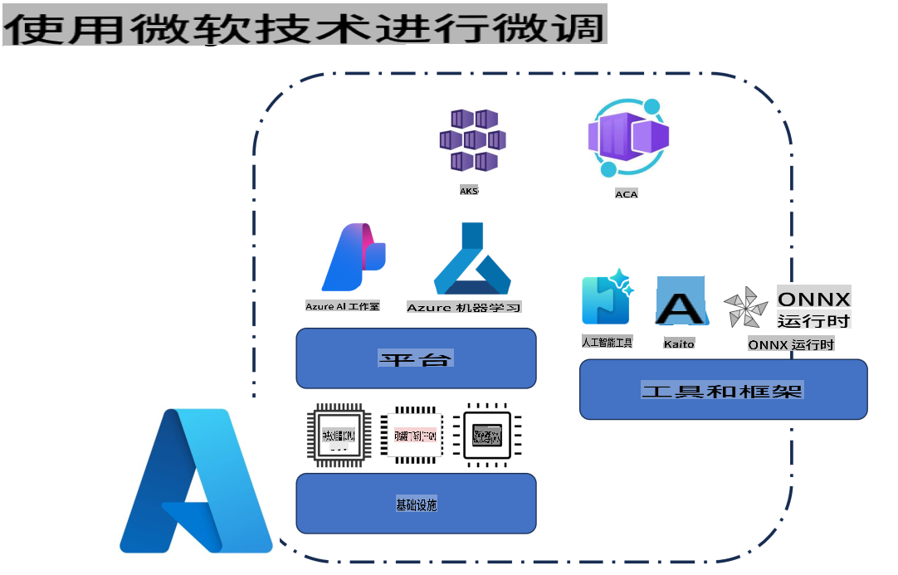
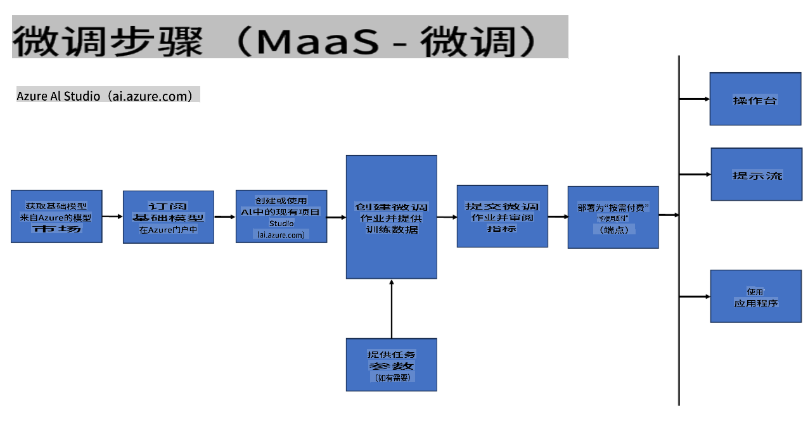
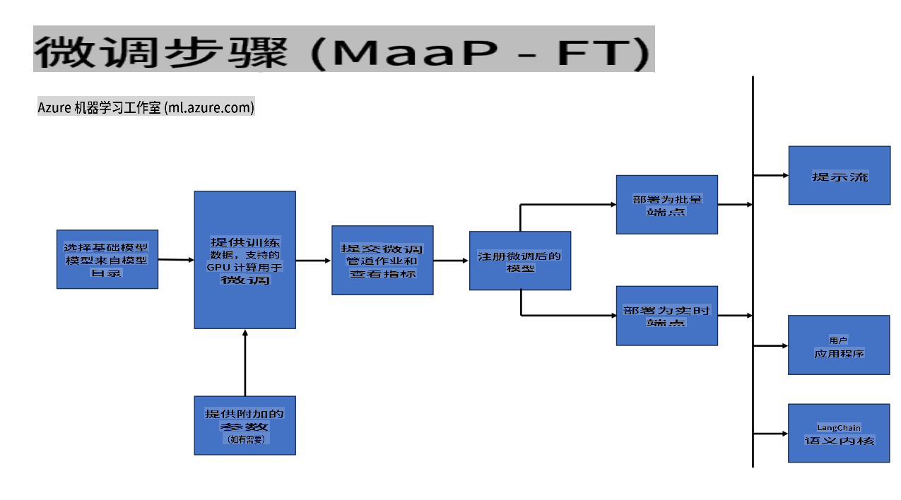
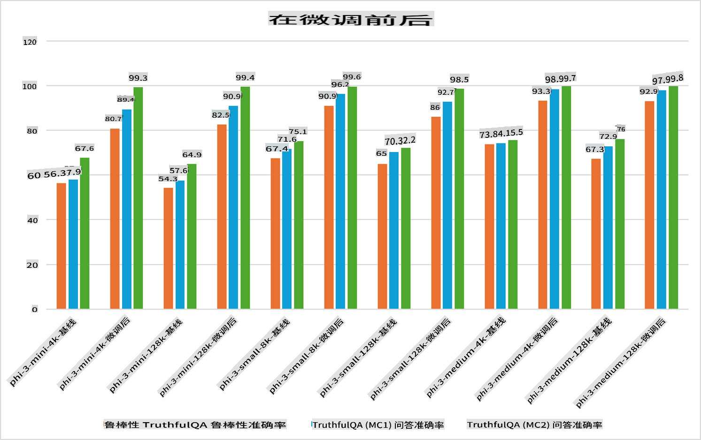

## 微调场景

**平台** 包括各种技术，例如 Azure AI Foundry、Azure Machine Learning、AI Tools、Kaito 和 ONNX Runtime。

**基础设施** 包括 CPU 和 FPGA，这是微调过程中必不可少的组件。让我展示一下这些技术的图标。

**工具与框架** 包括 ONNX Runtime 和 ONNX Runtime。让我展示一下这些技术的图标。  
[插入 ONNX Runtime 和 ONNX Runtime 的图标]

利用微软技术进行微调涉及多个组件和工具。通过理解和使用这些技术，我们可以有效地微调应用程序并创造更优质的解决方案。

## 模型即服务

使用托管微调对模型进行微调，无需创建和管理计算资源。

无服务器微调适用于 Phi-3-mini 和 Phi-3-medium 模型，使开发人员能够快速、轻松地定制模型以适应云端和边缘场景，而无需安排计算资源。我们还宣布 Phi-3-small 现已通过我们的“模型即服务”产品提供，开发人员可以快速、轻松地开始 AI 开发，而无需管理底层基础设施。

## 模型即平台

用户自行管理计算资源以微调模型。

[微调示例](https://github.com/Azure/azureml-examples/blob/main/sdk/python/foundation-models/system/finetune/chat-completion/chat-completion.ipynb)

## 微调场景

| | | | | | | |
|-|-|-|-|-|-|-|
|场景|LoRA|QLoRA|PEFT|DeepSpeed|ZeRO|DORA|
|将预训练的大语言模型（LLM）适配于特定任务或领域|是|是|是|是|是|是|
|针对 NLP 任务（如文本分类、命名实体识别和机器翻译）进行微调|是|是|是|是|是|是|
|针对问答任务进行微调|是|是|是|是|是|是|
|针对聊天机器人生成类似人类的响应进行微调|是|是|是|是|是|是|
|用于生成音乐、艺术或其他形式的创意|是|是|是|是|是|是|
|降低计算和财务成本|是|是|否|是|是|否|
|减少内存使用|否|是|否|是|是|是|
|使用更少的参数进行高效微调|否|是|是|否|否|是|
|一种内存高效的数据并行形式，可访问所有可用 GPU 设备的聚合 GPU 内存|否|否|否|是|是|是|

## 微调性能示例

**免责声明**：  
本文件通过基于机器的人工智能翻译服务进行翻译。尽管我们努力确保翻译的准确性，但请注意，自动翻译可能包含错误或不准确之处。应以原始语言的文件为权威来源。对于关键信息，建议使用专业人工翻译。我们对于因使用此翻译而导致的任何误解或误读概不负责。