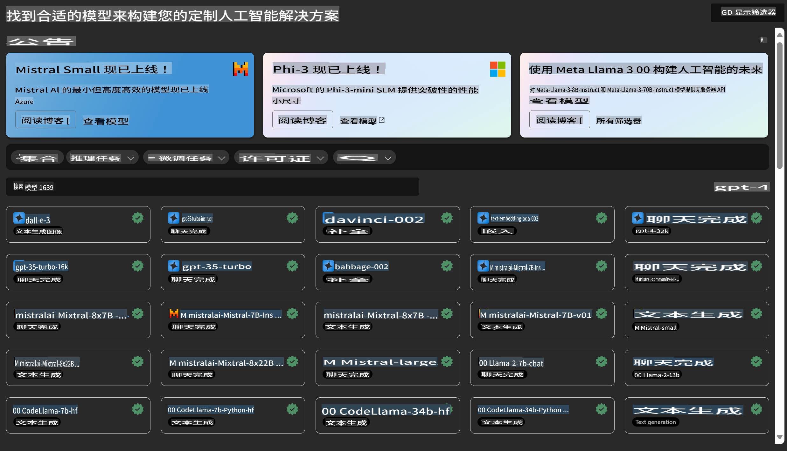
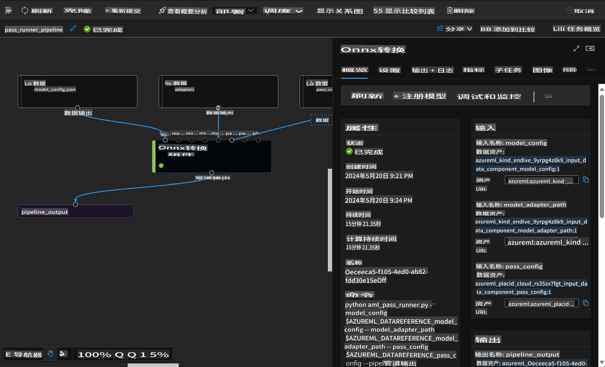

# **介绍 Azure 机器学习服务**

[Azure Machine Learning](https://ml.azure.com?WT.mc_id=aiml-138114-kinfeylo) 是一个云服务，用于加速和管理机器学习（ML）项目的生命周期。

ML 专业人士、数据科学家和工程师可以在日常工作流程中使用它来：

- 训练和部署模型。
- 管理机器学习运维（MLOps）。
- 您可以在 Azure Machine Learning 中创建模型，或者使用来自开源平台（如 PyTorch、TensorFlow 或 scikit-learn）的模型。
- MLOps 工具帮助您监控、重新训练和重新部署模型。

## Azure 机器学习适合谁？

**数据科学家和 ML 工程师**

他们可以使用工具加速和自动化日常工作流程。
Azure ML 提供公平性、可解释性、跟踪和审计功能。

**应用开发者**

他们可以将模型无缝集成到应用程序或服务中。

**平台开发者**

他们可以使用由强大的 Azure Resource Manager API 支持的一套工具。
这些工具可以用来构建先进的 ML 工具。

**企业**

在 Microsoft Azure 云中工作，企业可以从熟悉的安全性和基于角色的访问控制中受益。
设置项目以控制对受保护数据和特定操作的访问。

## 提升团队每个人的生产力

ML 项目通常需要一个拥有多样化技能的团队来构建和维护。

Azure ML 提供工具，帮助您：
- 通过共享笔记本、计算资源、无服务器计算、数据和环境与团队协作。
- 开发具有公平性、可解释性、跟踪和审计功能的模型，以满足数据追踪和审计合规性要求。
- 快速、轻松地大规模部署 ML 模型，并通过 MLOps 高效地管理和治理它们。
- 使用内置的治理、安全性和合规性，在任何地方运行机器学习工作负载。

## 跨平台兼容工具

ML 团队中的任何人都可以使用自己喜欢的工具完成工作。
无论是运行快速实验、超参数调优、构建管道还是管理推理，您都可以使用熟悉的界面，包括：
- Azure Machine Learning Studio
- Python SDK（v2）
- Azure CLI（v2）
- Azure Resource Manager REST APIs

在您优化模型并在整个开发周期中协作时，可以在 Azure Machine Learning Studio 界面中共享和查找资产、资源和指标。

## **Azure ML 中的 LLM/SLM**

Azure ML 添加了许多与 LLM/SLM 相关的功能，结合 LLMOps 和 SLMOps，打造了一个企业级的生成式人工智能技术平台。

### **模型目录**

企业用户可以通过模型目录根据不同的业务场景部署不同的模型，并以模型即服务（Model as Service）的形式为企业开发者或用户提供访问服务。

Azure Machine Learning Studio 中的模型目录是一个中心，用于发现和使用各种模型，帮助您构建生成式 AI 应用程序。模型目录包含来自多个模型提供商的数百种模型，例如 Azure OpenAI 服务、Mistral、Meta、Cohere、Nvidia、Hugging Face，以及微软训练的模型。非微软提供的模型属于非微软产品，依据微软产品条款中的定义，并受模型随附的条款约束。

### **作业管道**

机器学习管道的核心是将完整的机器学习任务分解为多步骤工作流。每个步骤是一个可管理的组件，可以单独开发、优化、配置和自动化。步骤通过定义明确的接口连接。Azure Machine Learning 管道服务会自动协调管道步骤之间的所有依赖关系。

在微调 SLM / LLM 时，我们可以通过管道管理数据、训练和生成过程。

### **Prompt 流程**

使用 Azure Machine Learning Prompt 流程的优势  
Azure Machine Learning Prompt 流程提供了一系列优势，帮助用户从构思到实验，最终开发出可投入生产的基于 LLM 的应用程序：

**Prompt 工程的灵活性**

- 交互式创作体验：Azure Machine Learning Prompt 流程提供了流程结构的可视化表示，用户可以轻松理解和导航项目。同时，它还提供了类似笔记本的编码体验，便于高效开发和调试流程。
- Prompt 调优的多样性：用户可以创建和比较多个 Prompt 版本，方便进行迭代优化。
- 评估：内置的评估流程使用户能够评估 Prompt 和流程的质量与效果。
- 全面的资源支持：Azure Machine Learning Prompt 流程包含一个内置工具、示例和模板库，为开发提供了起点，激发创造力并加速开发过程。

**企业级的 LLM 应用准备**

- 协作：Azure Machine Learning Prompt 流程支持团队协作，允许多个用户共同参与 Prompt 工程项目，共享知识并维护版本控制。
- 一体化平台：Azure Machine Learning Prompt 流程简化了整个 Prompt 工程过程，从开发和评估到部署和监控。用户可以轻松地将流程部署为 Azure Machine Learning 端点，并实时监控其性能，确保最佳运行状态和持续改进。
- Azure Machine Learning 企业级解决方案：Prompt 流程利用了 Azure Machine Learning 的强大企业级解决方案，为流程的开发、实验和部署提供了安全、可扩展和可靠的基础。

通过 Azure Machine Learning Prompt 流程，用户可以释放 Prompt 工程的灵活性、高效协作，并利用企业级解决方案成功开发和部署基于 LLM 的应用程序。

结合 Azure ML 的计算能力、数据和不同组件，企业开发者可以轻松构建自己的人工智能应用程序。

**免责声明**：  
本文件使用基于机器的人工智能翻译服务进行翻译。尽管我们努力确保准确性，但请注意，自动翻译可能包含错误或不准确之处。应以原始语言的文件作为权威来源。对于关键信息，建议使用专业人工翻译。因使用本翻译而导致的任何误解或误读，我们概不负责。