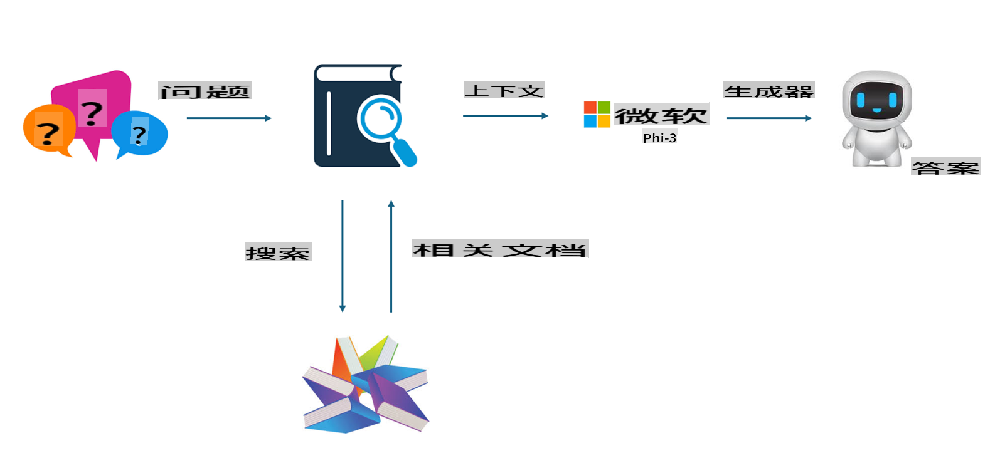
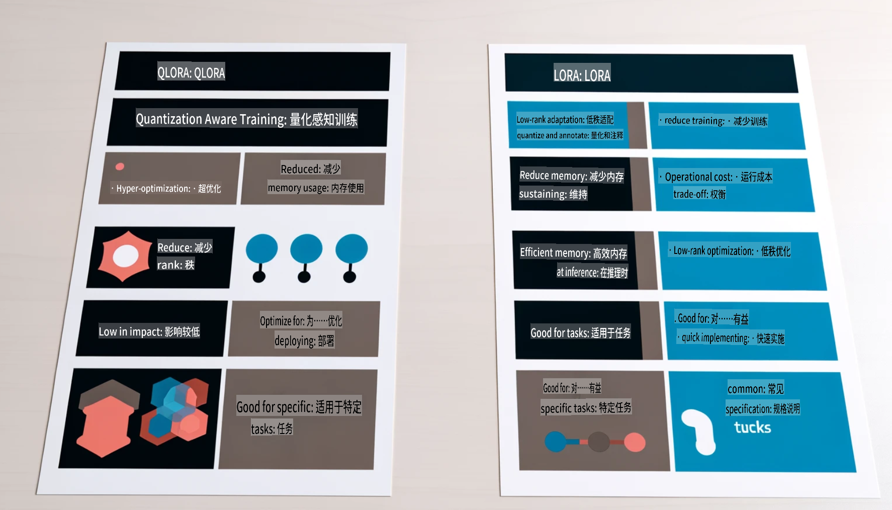

# **让 Phi-3 成为行业专家**

为了将 Phi-3 模型应用到行业中，需要将行业业务数据加入到 Phi-3 模型中。我们有两种不同的选择：第一种是 RAG（检索增强生成），第二种是微调（Fine Tuning）。

## **RAG 与微调的比较**

### **检索增强生成（RAG）**

RAG 是数据检索加文本生成。企业的结构化数据和非结构化数据存储在向量数据库中。当需要搜索相关内容时，找到相关的摘要和内容以形成上下文，并结合 LLM/SLM 的文本生成能力来生成内容。

### **微调（Fine-tuning）**

微调是基于某一模型的改进。不需要从模型算法开始，但需要持续积累数据。如果在行业应用中需要更精准的术语和语言表达，微调是更好的选择。但如果您的数据频繁变化，微调可能会变得复杂。

### **如何选择**

1. 如果我们的答案需要引入外部数据，RAG 是最佳选择。

2. 如果需要输出稳定且精准的行业知识，微调将是一个好的选择。RAG 优先拉取相关内容，但可能无法始终精准把握专业细节。

3. 微调需要高质量的数据集，如果只是小范围的数据，效果不会有太大区别。RAG 更加灵活。

4. 微调是一个“黑箱”，有些神秘，内部机制难以理解。而 RAG 可以更容易找到数据来源，从而有效调整幻觉或内容错误，并提供更好的透明性。

### **应用场景**

1. 垂直行业需要特定的专业词汇和表达，***微调*** 是最佳选择。

2. 问答系统，涉及不同知识点的综合，***RAG*** 是最佳选择。

3. 自动化业务流程的结合，***RAG + 微调*** 是最佳选择。

## **如何使用 RAG**

向量数据库是一种以数学形式存储数据的集合。向量数据库使机器学习模型更容易记住之前的输入，从而支持搜索、推荐和文本生成等用例。数据可以基于相似性度量进行识别，而不是完全匹配，使计算机模型能够理解数据的上下文。

向量数据库是实现 RAG 的关键。我们可以通过如 text-embedding-3、jina-ai-embedding 等向量模型将数据转换为向量存储。

了解更多关于创建 RAG 应用：[https://github.com/microsoft/Phi-3CookBook](https://github.com/microsoft/Phi-3CookBook?WT.mc_id=aiml-138114-kinfeylo)

## **如何使用微调**

微调中常用的算法是 Lora 和 QLora。如何选择？
- [通过这个示例笔记本了解更多](../../../../code/04.Finetuning/Phi_3_Inference_Finetuning.ipynb)
- [Python 微调示例代码](../../../../code/04.Finetuning/FineTrainingScript.py)

### **Lora 和 QLora**

LoRA（低秩适配）和 QLoRA（量化低秩适配）都是用于通过参数高效微调（PEFT）来微调大型语言模型（LLMs）的技术。PEFT 技术旨在比传统方法更高效地训练模型。  
LoRA 是一种独立的微调技术，通过对权重更新矩阵应用低秩近似来减少内存占用。它提供了快速的训练时间，并保持与传统微调方法接近的性能。

QLoRA 是 LoRA 的扩展版本，结合了量化技术以进一步减少内存使用。QLoRA 将预训练 LLM 的权重参数量化为 4 位精度，比 LoRA 更加节省内存。然而，由于额外的量化和反量化步骤，QLoRA 的训练速度比 LoRA 慢约 30%。

QLoRA 使用 LoRA 作为辅助工具来修正量化过程中引入的错误。QLoRA 使得可以在相对较小、广泛可用的 GPU 上微调拥有数十亿参数的大型模型。例如，QLoRA 可以在只需要 2 个 GPU 的情况下微调一个原本需要 36 个 GPU 的 70B 参数模型。

**免责声明**:  
本文件使用基于机器的人工智能翻译服务进行翻译。尽管我们尽力确保翻译的准确性，但请注意，自动翻译可能包含错误或不准确之处。应以原文的母语版本作为权威来源。对于关键信息，建议寻求专业人工翻译服务。因使用本翻译而导致的任何误解或曲解，我们概不负责。