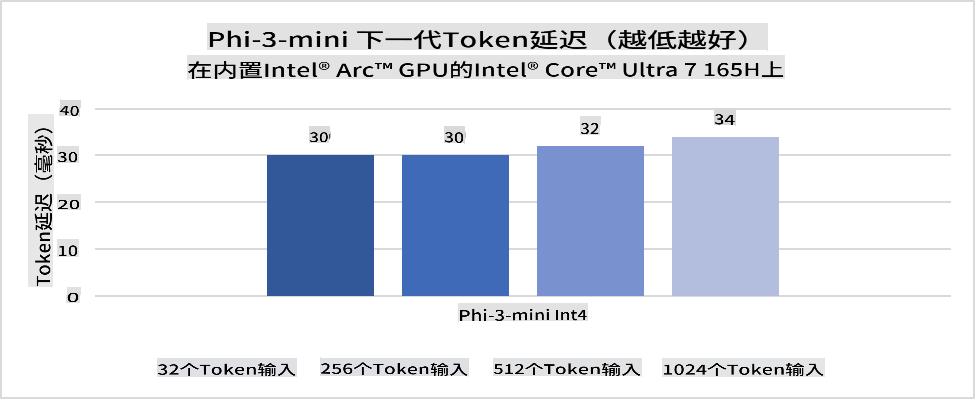
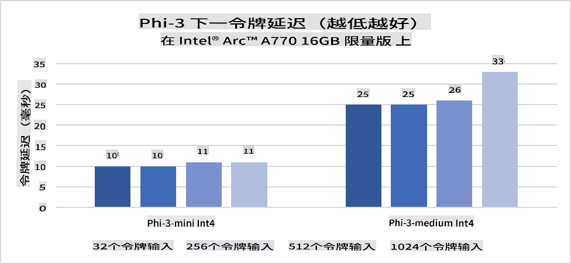
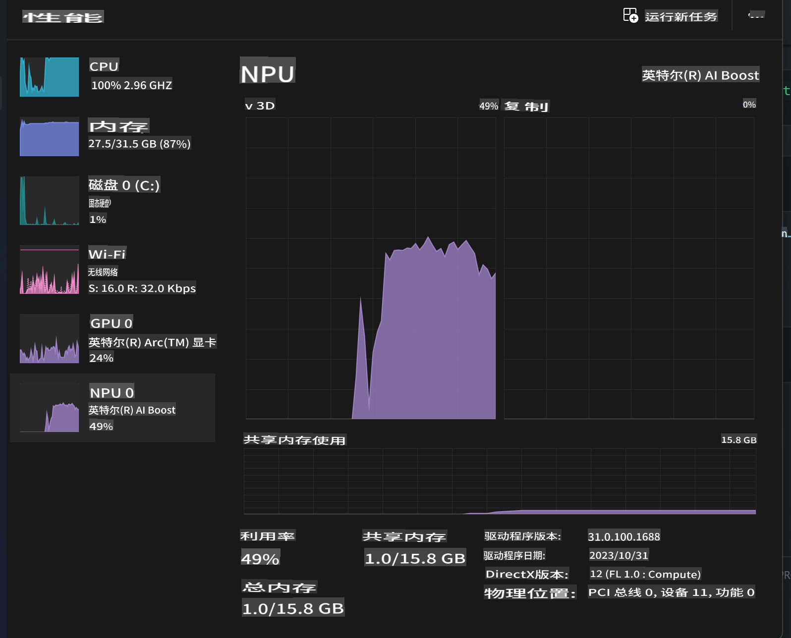
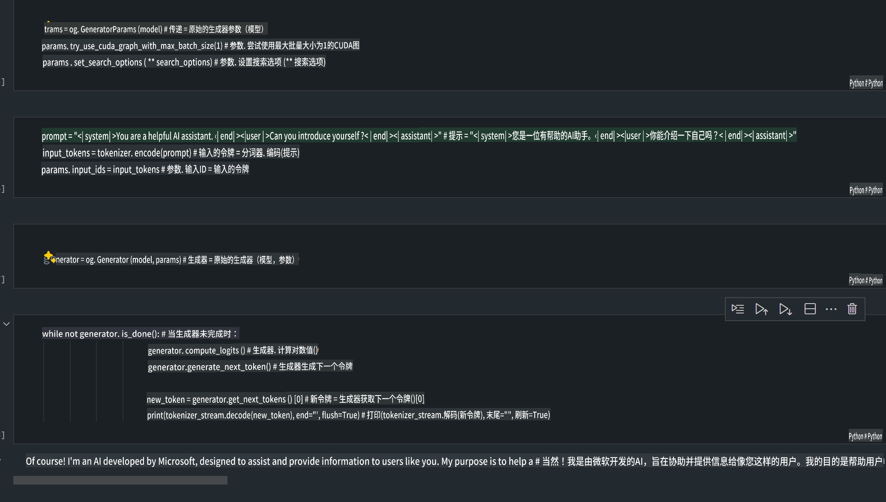
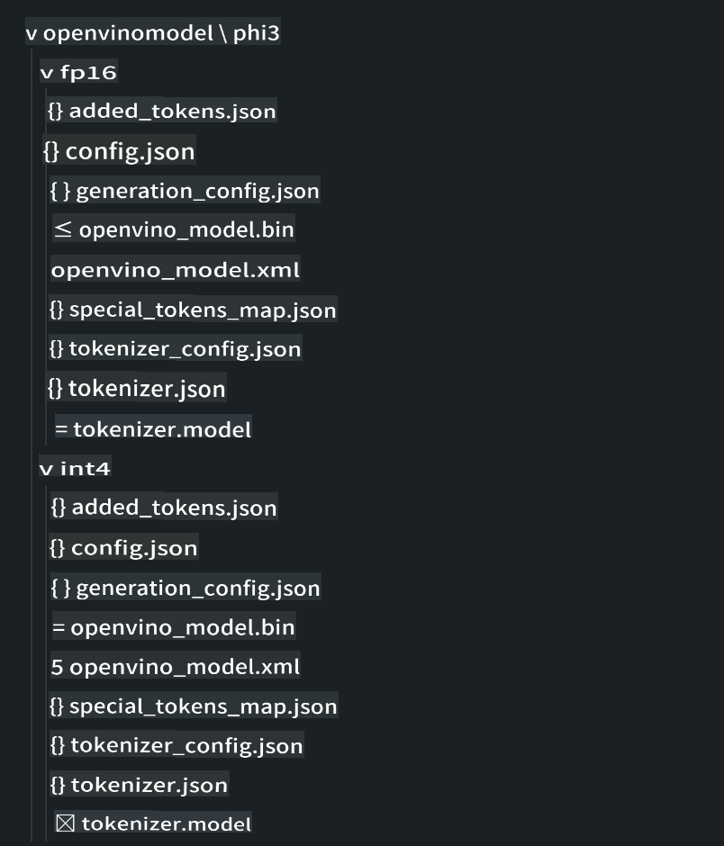
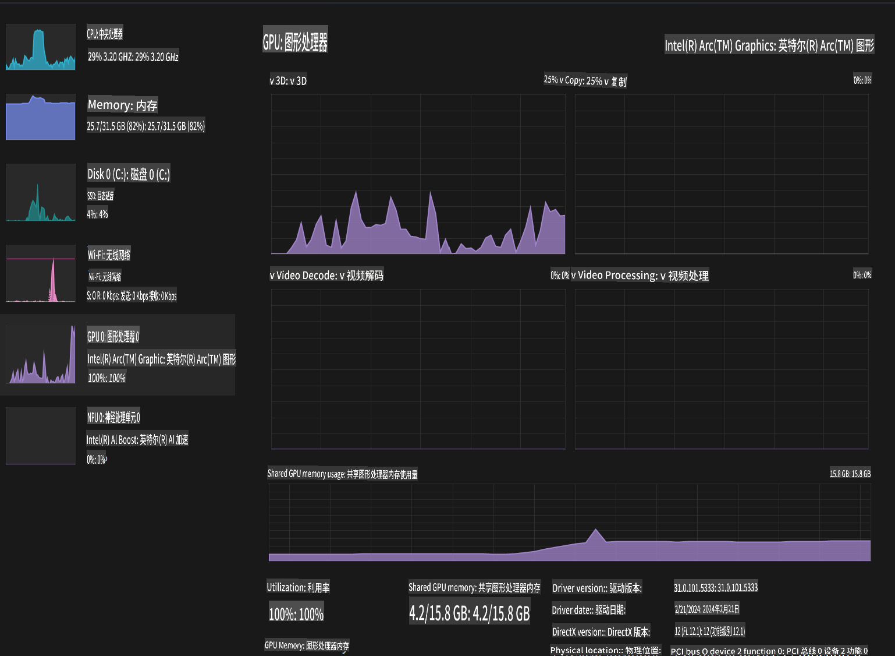

# **在 AI PC 上进行 Phi-3 推理**

随着生成式 AI 的进步和边缘设备硬件能力的提升，越来越多的生成式 AI 模型可以集成到用户的自带设备 (BYOD) 中。AI PC 就是其中之一。从 2024 年开始，Intel、AMD 和 Qualcomm 已与 PC 制造商合作，通过硬件改造推出 AI PC，方便本地生成式 AI 模型的部署。在这篇讨论中，我们将重点介绍 Intel AI PC，并探讨如何在 Intel AI PC 上部署 Phi-3。

### **什么是 NPU**

NPU（神经处理单元）是一个专门用于加速神经网络操作和 AI 任务的处理器或处理单元，通常集成在更大的 SoC 中。与通用 CPU 和 GPU 不同，NPU 针对数据驱动的并行计算进行了优化，使其在处理大量多媒体数据（如视频和图像）以及神经网络数据处理方面非常高效。它们特别擅长处理 AI 相关的任务，如语音识别、视频通话中的背景模糊，以及照片或视频编辑过程中的目标检测。

## **NPU vs GPU** 
虽然许多 AI 和机器学习工作负载运行在 GPU 上，但 GPU 和 NPU 之间有一个关键区别。
GPU 以其并行计算能力而闻名，但并非所有 GPU 在处理图形之外的任务时都同样高效。而 NPU 则专为神经网络操作中的复杂计算而设计，使其在 AI 任务中非常有效。

总之，NPU 是加速 AI 计算的数学天才，它们在 AI PC 时代中扮演着关键角色！

***此示例基于 Intel 最新的 Intel Core Ultra 处理器***

## **1. 使用 NPU 运行 Phi-3 模型**

Intel® NPU 设备是集成在 Intel 客户端 CPU 中的 AI 推理加速器，从 Intel® Core™ Ultra 代 CPU（以前称为 Meteor Lake）开始。它能够高效地执行人工神经网络任务。





**Intel NPU 加速库**

Intel NPU 加速库 [https://github.com/intel/intel-npu-acceleration-library](https://github.com/intel/intel-npu-acceleration-library) 是一个 Python 库，旨在利用 Intel 神经处理单元 (NPU) 的强大计算能力，在兼容硬件上执行高速计算，从而提高应用程序的效率。

以下是基于 Intel® Core™ Ultra 处理器的 AI PC 上运行 Phi-3-mini 的示例。


使用 pip 安装 Python 库

```bash

   pip install intel-npu-acceleration-library

```

***注意*** 项目仍在开发中，但参考模型已经非常完整。

### **使用 Intel NPU 加速库运行 Phi-3**

使用 Intel NPU 加速，该库不会影响传统的编码过程。您只需使用该库对原始 Phi-3 模型进行量化，例如 FP16、INT8、INT4 等

```python

from transformers import AutoTokenizer, pipeline, TextStreamer
import intel_npu_acceleration_library as npu_lib
import warnings

model_id = "microsoft/Phi-3-mini-4k-instruct"

model = npu_lib.NPUModelForCausalLM.from_pretrained(
                                    model_id,
                                    torch_dtype="auto",
                                    dtype=npu_lib.int4,
                                    trust_remote_code=True
                                )

tokenizer = AutoTokenizer.from_pretrained(model_id)

text_streamer = TextStreamer(tokenizer, skip_prompt=True)

```
量化成功后，继续执行以调用 NPU 运行 Phi-3 模型。

```python

generation_args = {
            "max_new_tokens": 1024,
            "return_full_text": False,
            "temperature": 0.3,
            "do_sample": False,
            "streamer": text_streamer,
        }

pipe = pipeline(
            "text-generation",
            model=model,
            tokenizer=tokenizer,
)

query = "<|system|>You are a helpful AI assistant.<|end|><|user|>Can you introduce yourself?<|end|><|assistant|>"

with warnings.catch_warnings():
    warnings.simplefilter("ignore")
    pipe(query, **generation_args)

```

执行代码时，我们可以通过任务管理器查看 NPU 的运行状态



***示例*** : [AIPC_NPU_DEMO.ipynb](../../../../code/03.Inference/AIPC/AIPC_NPU_DEMO.ipynb)

## **2. 使用 DirectML + ONNX Runtime 运行 Phi-3 模型**

### **什么是 DirectML**

[DirectML](https://github.com/microsoft/DirectML) 是一个高性能、硬件加速的 DirectX 12 库，用于机器学习。DirectML 提供了 GPU 加速功能，支持广泛的硬件和驱动程序，包括 AMD、Intel、NVIDIA 和 Qualcomm 的所有 DirectX 12 兼容 GPU。

作为独立使用时，DirectML API 是一个低级别的 DirectX 12 库，适用于高性能、低延迟的应用程序，如框架、游戏和其他实时应用程序。DirectML 与 Direct3D 12 的无缝互操作性以及其低开销和硬件一致性，使 DirectML 成为在需要高性能和结果可靠性及可预测性时加速机器学习的理想选择。

***注意*** : 最新的 DirectML 已支持 NPU(https://devblogs.microsoft.com/directx/introducing-neural-processor-unit-npu-support-in-directml-developer-preview/)

### DirectML 和 CUDA 在能力和性能方面的比较：

**DirectML** 是 Microsoft 开发的机器学习库，旨在加速 Windows 设备（包括桌面、笔记本和边缘设备）上的机器学习工作负载。
- 基于 DX12: DirectML 构建在 DirectX 12 (DX12) 之上，提供了广泛的硬件支持，包括 NVIDIA 和 AMD 的 GPU。
- 更广泛的支持: 由于它利用了 DX12，DirectML 可以与任何支持 DX12 的 GPU 一起工作，甚至包括集成 GPU。
- 图像处理: DirectML 使用神经网络处理图像和其他数据，适用于图像识别、目标检测等任务。
- 易于设置: 设置 DirectML 非常简单，不需要特定的 SDK 或 GPU 制造商的库。
- 性能: 在某些情况下，DirectML 表现良好，尤其是在某些工作负载上可能比 CUDA 更快。
- 限制: 然而，在处理 float16 大批量时，DirectML 可能会较慢。

**CUDA** 是 NVIDIA 的并行计算平台和编程模型。它允许开发人员利用 NVIDIA GPU 的强大计算能力进行通用计算，包括机器学习和科学模拟。
- NVIDIA 专用: CUDA 与 NVIDIA GPU 紧密集成，专为它们设计。
- 高度优化: 它为 GPU 加速任务提供了卓越的性能，特别是在使用 NVIDIA GPU 时。
- 广泛使用: 许多机器学习框架和库（如 TensorFlow 和 PyTorch）都支持 CUDA。
- 自定义: 开发人员可以为特定任务微调 CUDA 设置，从而获得最佳性能。
- 限制: 然而，CUDA 对 NVIDIA 硬件的依赖可能会限制其在不同 GPU 上的兼容性。

### 选择 DirectML 和 CUDA：
选择 DirectML 和 CUDA 取决于您的具体用例、硬件可用性和偏好。
如果您需要更广泛的兼容性和易于设置，DirectML 可能是一个不错的选择。然而，如果您拥有 NVIDIA GPU 并需要高度优化的性能，CUDA 仍然是一个强有力的竞争者。总之，DirectML 和 CUDA 各有优劣，因此在做出决策时，请考虑您的需求和可用硬件。

### **使用 ONNX Runtime 进行生成式 AI**

在 AI 时代，AI 模型的可移植性非常重要。ONNX Runtime 可以轻松将训练好的模型部署到不同设备。开发人员无需关注推理框架，使用统一的 API 即可完成模型推理。在生成式 AI 时代，ONNX Runtime 也进行了代码优化 (https://onnxruntime.ai/docs/genai/)。通过优化后的 ONNX Runtime，可以在不同终端上推理量化的生成式 AI 模型。在使用 ONNX Runtime 进行生成式 AI 时，可以通过 Python、C#、C / C++ 进行模型推理。当然，在 iPhone 上部署可以利用 C++ 的 ONNX Runtime API。

[示例代码](https://github.com/Azure-Samples/Phi-3MiniSamples/tree/main/onnx)

***编译生成式 AI 与 ONNX Runtime 库***

```bash

winget install --id=Kitware.CMake  -e

git clone https://github.com/microsoft/onnxruntime.git

cd .\onnxruntime\

./build.bat --build_shared_lib --skip_tests --parallel --use_dml --config Release

cd ../

git clone https://github.com/microsoft/onnxruntime-genai.git

cd .\onnxruntime-genai\

mkdir ort

cd ort

mkdir include

mkdir lib

copy ..\onnxruntime\include\onnxruntime\core\providers\dml\dml_provider_factory.h ort\include

copy ..\onnxruntime\include\onnxruntime\core\session\onnxruntime_c_api.h ort\include

copy ..\onnxruntime\build\Windows\Release\Release\*.dll ort\lib

copy ..\onnxruntime\build\Windows\Release\Release\onnxruntime.lib ort\lib

python build.py --use_dml

```

**安装库**

```bash

pip install .\onnxruntime_genai_directml-0.3.0.dev0-cp310-cp310-win_amd64.whl

```

这是运行结果



***示例*** : [AIPC_DirectML_DEMO.ipynb](../../../../code/03.Inference/AIPC/AIPC_DirectML_DEMO.ipynb)

## **3. 使用 Intel OpenVino 运行 Phi-3 模型**

### **什么是 OpenVINO**

[OpenVINO](https://github.com/openvinotoolkit/openvino) 是一个开源工具包，用于优化和部署深度学习模型。它为来自 TensorFlow、PyTorch 等流行框架的视觉、音频和语言模型提供了增强的深度学习性能。使用 OpenVINO 可以结合 CPU 和 GPU 运行 Phi-3 模型。

***注意***: 目前，OpenVINO 尚不支持 NPU。

### **安装 OpenVINO 库**

```bash

 pip install git+https://github.com/huggingface/optimum-intel.git

 pip install git+https://github.com/openvinotoolkit/nncf.git

 pip install openvino-nightly

```

### **使用 OpenVINO 运行 Phi-3**

与 NPU 类似，OpenVINO 通过运行量化模型来完成生成式 AI 模型的调用。我们需要先对 Phi-3 模型进行量化，并通过命令行使用 optimum-cli 完成模型量化。

**INT4**

```bash

optimum-cli export openvino --model "microsoft/Phi-3-mini-4k-instruct" --task text-generation-with-past --weight-format int4 --group-size 128 --ratio 0.6  --sym  --trust-remote-code ./openvinomodel/phi3/int4

```

**FP16**

```bash

optimum-cli export openvino --model "microsoft/Phi-3-mini-4k-instruct" --task text-generation-with-past --weight-format fp16 --trust-remote-code ./openvinomodel/phi3/fp16

```

转换后的格式如下



通过 OVModelForCausalLM 加载模型路径 (model_dir)、相关配置 (ov_config = {"PERFORMANCE_HINT": "LATENCY", "NUM_STREAMS": "1", "CACHE_DIR": ""}) 和硬件加速设备 (GPU.0)

```python

ov_model = OVModelForCausalLM.from_pretrained(
     model_dir,
     device='GPU.0',
     ov_config=ov_config,
     config=AutoConfig.from_pretrained(model_dir, trust_remote_code=True),
     trust_remote_code=True,
)

```

执行代码时，我们可以通过任务管理器查看 GPU 的运行状态



***示例*** : [AIPC_OpenVino_Demo.ipynb](../../../../code/03.Inference/AIPC/AIPC_OpenVino_Demo.ipynb)

### ***注意*** : 以上三种方法各有优势，但建议在 AI PC 推理中使用 NPU 加速。

免责声明：此翻译由AI模型从原文翻译而来，可能不完美。请审阅输出并进行必要的修改。