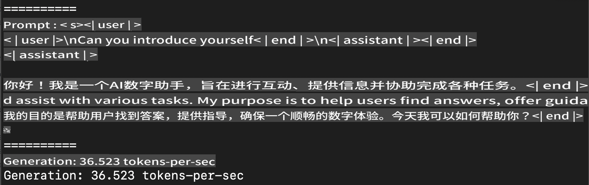
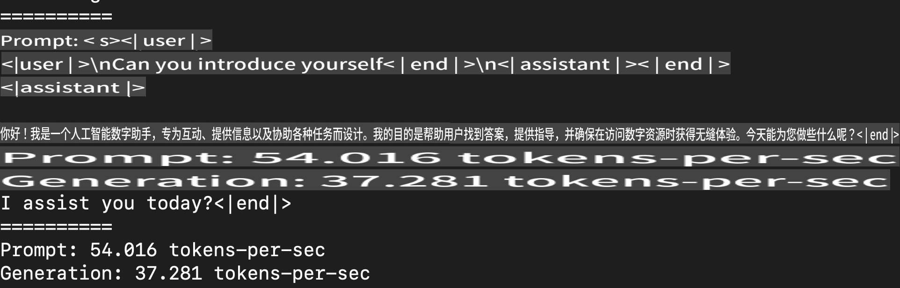
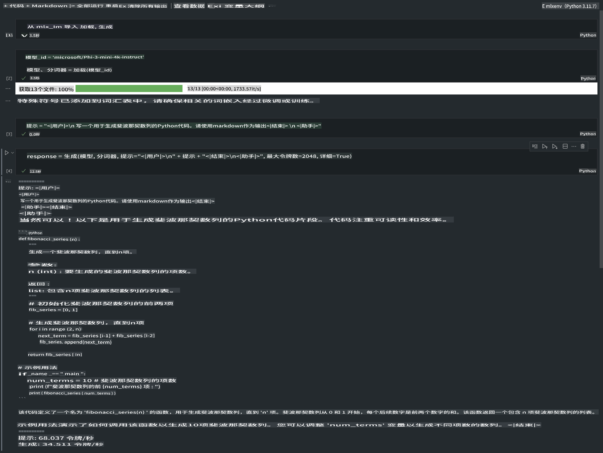

# **使用 Apple MLX 框架进行 Phi-3 推理**

## **什么是 MLX 框架**

MLX 是一个专为 Apple Silicon 设计的机器学习研究框架，由 Apple 机器学习研究团队推出。

MLX 是由机器学习研究人员为机器学习研究人员设计的。这个框架旨在用户友好，但仍然高效地训练和部署模型。框架的设计理念也相对简单。我们希望研究人员能够轻松扩展和改进 MLX，以快速探索新想法为目标。

通过 MLX，可以在 Apple Silicon 设备上加速 LLMs，并且可以非常方便地在本地运行模型。

## **使用 MLX 进行 Phi-3-mini 推理**

### **1. 设置你的 MLX 环境**

1. Python 3.11.x
2. 安装 MLX 库

```bash

pip install mlx-lm

```

### **2. 在终端中使用 MLX 运行 Phi-3-mini**

```bash

python -m mlx_lm.generate --model microsoft/Phi-3-mini-4k-instruct --max-token 2048 --prompt  "<|user|>\nCan you introduce yourself<|end|>\n<|assistant|>"

```

结果（我的环境是 Apple M1 Max，64GB）如下：



### **3. 在终端中使用 MLX 对 Phi-3-mini 进行量化**

```bash

python -m mlx_lm.convert --hf-path microsoft/Phi-3-mini-4k-instruct

```

***Note：*** 模型可以通过 mlx_lm.convert 进行量化，默认的量化方式是 INT4。这个例子将 Phi-3-mini 量化为 INT4。

量化后的模型将存储在默认目录 ./mlx_model 中。

我们可以在终端中测试量化后的模型

```bash

python -m mlx_lm.generate --model ./mlx_model/ --max-token 2048 --prompt  "<|user|>\nCan you introduce yourself<|end|>\n<|assistant|>"

```

结果如下：



### **4. 在 Jupyter Notebook 中使用 MLX 运行 Phi-3-mini**



***Note:*** 请阅读这个示例 [点击此链接](../../../../code/03.Inference/MLX/MLX_DEMO.ipynb)

## **资源**

1. 了解 Apple MLX 框架 [https://ml-explore.github.io](https://ml-explore.github.io/mlx/build/html/index.html)

2. Apple MLX GitHub 仓库 [https://github.com/ml-explore](https://github.com/ml-explore)

免责声明：此翻译由AI模型从原文翻译而来，可能不够完美。请审阅翻译结果并进行必要的修改。