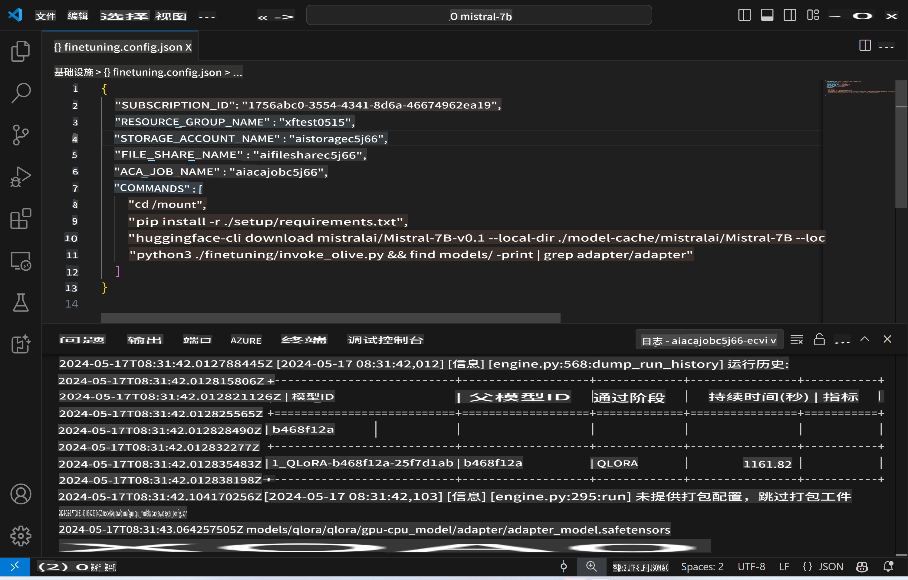
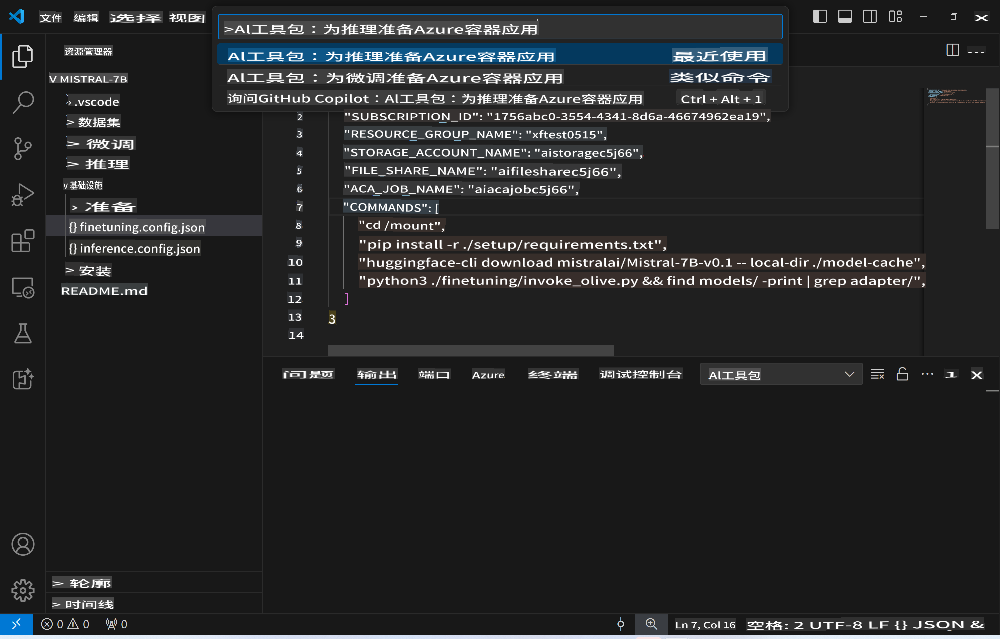
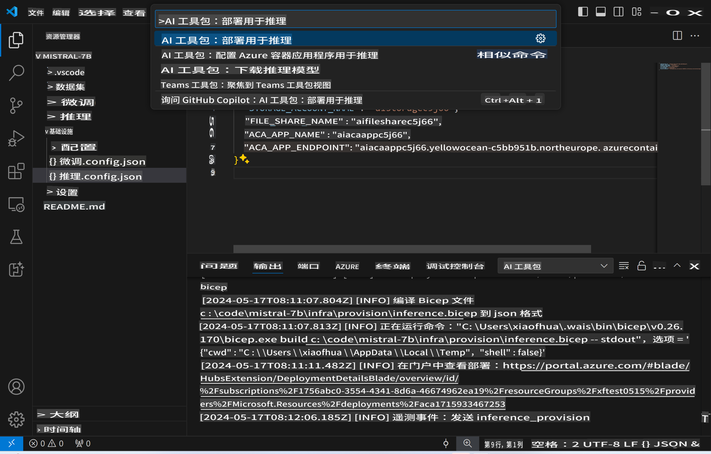
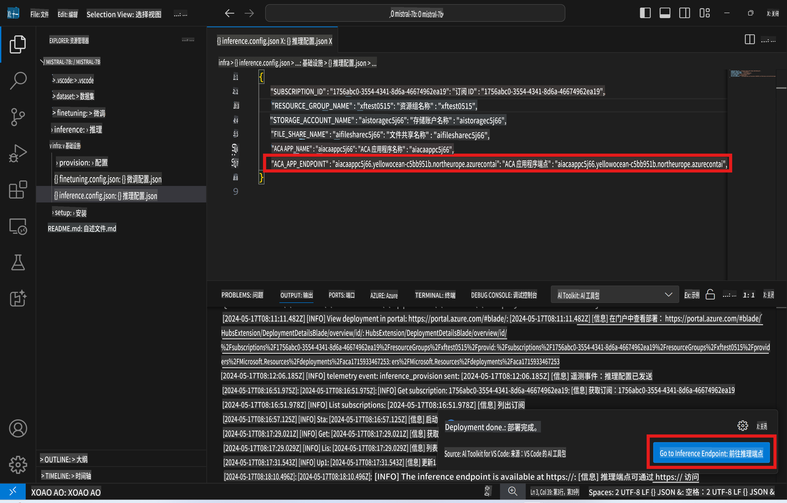

# 使用微调模型进行远程推理

在远程环境中训练好适配器后，可以使用一个简单的Gradio应用与模型进行交互。



### 配置Azure资源
你需要通过命令面板执行 `AI Toolkit: Provision Azure Container Apps for inference` 来设置用于远程推理的Azure资源。在此设置过程中，你将被要求选择你的Azure订阅和资源组。  


默认情况下，推理使用的订阅和资源组应与微调时使用的相同。推理将使用相同的Azure Container App环境，并访问存储在Azure Files中的模型和模型适配器，这些是在微调步骤中生成的。

## 使用AI Toolkit

### 部署推理
如果你希望修改推理代码或重新加载推理模型，请执行 `AI Toolkit: Deploy for inference` 命令。这将同步你最新的代码到ACA并重启副本。



成功完成部署后，模型现在可以使用此端点进行评估。

### 访问推理API

你可以通过点击VSCode通知中显示的“*Go to Inference Endpoint*”按钮来访问推理API。或者，web API端点可以在 `./infra/inference.config.json` 的 `ACA_APP_ENDPOINT` 下找到，并且在输出面板中也能找到。



> **Note:** 推理端点可能需要几分钟才能完全运行。

## 模板中包含的推理组件

| 文件夹 | 内容 |
| ------ |--------- |
| `infra` | 包含所有远程操作所需的配置。 |
| `infra/provision/inference.parameters.json` | 包含bicep模板的参数，用于配置Azure推理资源。 |
| `infra/provision/inference.bicep` | 包含配置Azure推理资源的模板。 |
| `infra/inference.config.json` | 由 `AI Toolkit: Provision Azure Container Apps for inference` 命令生成的配置文件。它作为其他远程命令面板的输入。 |

### 使用AI Toolkit配置Azure资源
配置 [AI Toolkit](https://marketplace.visualstudio.com/items?itemName=ms-windows-ai-studio.windows-ai-studio)

执行 `Provision Azure Container Apps for inference` 命令。

你可以在 `./infra/provision/inference.parameters.json` 文件中找到配置参数。以下是详细信息：
| 参数 | 描述 |
| --------- |------------ |
| `defaultCommands` | 这是启动web API的命令。 |
| `maximumInstanceCount` | 此参数设置GPU实例的最大容量。 |
| `location` | 这是配置Azure资源的位置。默认值与所选资源组的位置相同。 |
| `storageAccountName`, `fileShareName` `acaEnvironmentName`, `acaEnvironmentStorageName`, `acaAppName`,  `acaLogAnalyticsName` | 这些参数用于命名Azure资源。默认情况下，它们将与微调资源名称相同。你可以输入一个新的、未使用的资源名称来创建你自己的自定义资源，或者如果你希望使用现有的Azure资源，可以输入现有资源的名称。详情请参阅 [使用现有Azure资源](../../../../md/03.Inference) 部分。 |

### 使用现有的Azure资源

默认情况下，推理配置使用与微调相同的Azure Container App环境、存储帐户、Azure文件共享和Azure日志分析。专门为推理API创建一个单独的Azure Container App。

如果你在微调步骤中自定义了Azure资源，或者希望在推理中使用你自己的现有Azure资源，请在 `./infra/inference.parameters.json` 文件中指定它们的名称。然后，从命令面板中运行 `AI Toolkit: Provision Azure Container Apps for inference` 命令。这将更新任何指定的资源并创建任何缺失的资源。

例如，如果你有一个现有的Azure容器环境，你的 `./infra/finetuning.parameters.json` 应该如下所示：

```json
{
    "$schema": "https://schema.management.azure.com/schemas/2019-04-01/deploymentParameters.json#",
    "contentVersion": "1.0.0.0",
    "parameters": {
      ...
      "acaEnvironmentName": {
        "value": "<your-aca-env-name>"
      },
      "acaEnvironmentStorageName": {
        "value": null
      },
      ...
    }
  }
```

### 手动配置
如果你更喜欢手动配置Azure资源，可以使用 `./infra/provision` 文件夹中的bicep文件。如果你已经设置并配置了所有Azure资源而没有使用AI Toolkit命令面板，只需在 `inference.config.json` 文件中输入资源名称即可。

例如：

```json
{
  "SUBSCRIPTION_ID": "<your-subscription-id>",
  "RESOURCE_GROUP_NAME": "<your-resource-group-name>",
  "STORAGE_ACCOUNT_NAME": "<your-storage-account-name>",
  "FILE_SHARE_NAME": "<your-file-share-name>",
  "ACA_APP_NAME": "<your-aca-name>",
  "ACA_APP_ENDPOINT": "<your-aca-endpoint>"
}
```

