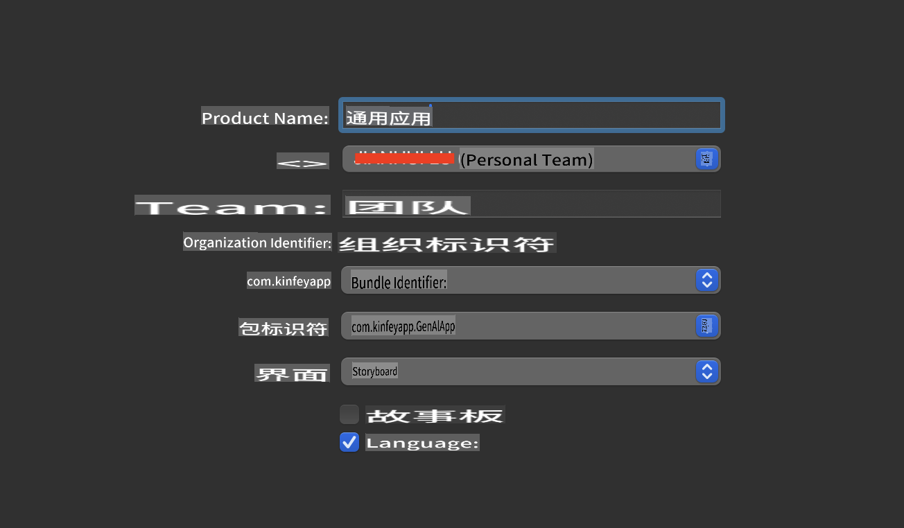
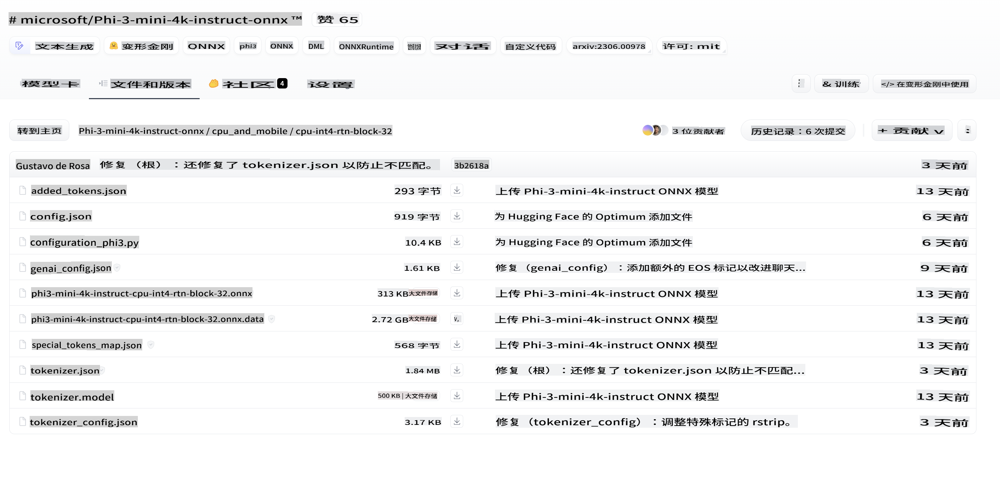
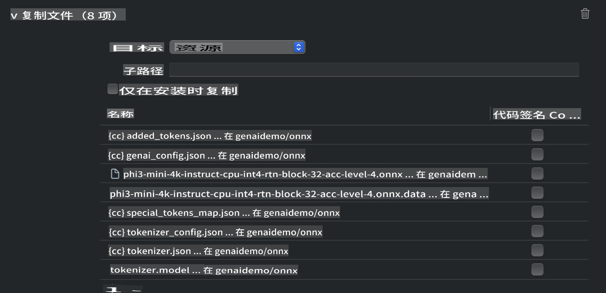
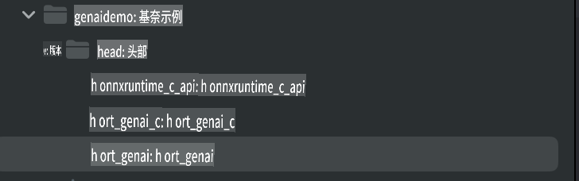
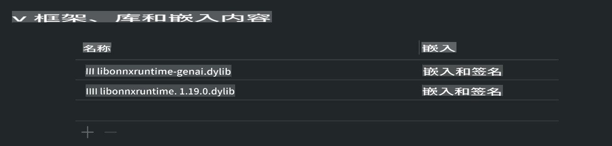

# **在iOS中推理Phi-3**

Phi-3-mini是微软推出的新系列模型，能够在边缘设备和物联网设备上部署大语言模型（LLMs）。Phi-3-mini可用于iOS、Android和边缘设备的部署，使生成型AI能够在BYOD环境中部署。以下示例演示了如何在iOS上部署Phi-3-mini。

## **1. 准备工作**

- **a.** macOS 14+
- **b.** Xcode 15+
- **c.** iOS SDK 17.x (iPhone 14 A16或更高版本)
- **d.** 安装Python 3.10+（推荐使用Conda）
- **e.** 安装Python库：`python-flatbuffers`
- **f.** 安装CMake

### 语义内核和推理

语义内核是一个应用框架，允许你创建兼容Azure OpenAI服务、OpenAI模型，甚至本地模型的应用程序。通过语义内核访问本地服务，可以轻松集成自托管的Phi-3-mini模型服务器。

### 使用Ollama或LlamaEdge调用量化模型

许多用户喜欢使用量化模型在本地运行模型。[Ollama](https://ollama.com)和[LlamaEdge](https://llamaedge.com)允许用户调用不同的量化模型：

#### **Ollama**

你可以直接运行`ollama run phi3`或离线配置它。创建一个Modelfile，路径指向你的`gguf`文件。运行Phi-3-mini量化模型的示例代码：

```gguf
FROM {Add your gguf file path}
TEMPLATE \"\"\"<|user|> .Prompt<|end|> <|assistant|>\"\"\"
PARAMETER stop <|end|>
PARAMETER num_ctx 4096
```

#### **LlamaEdge**

如果你希望在云端和边缘设备上同时使用`gguf`，LlamaEdge是一个不错的选择。

## **2. 为iOS编译ONNX Runtime**

```bash

git clone https://github.com/microsoft/onnxruntime.git

cd onnxruntime

./build.sh --build_shared_lib --ios --skip_tests --parallel --build_dir ./build_ios --ios --apple_sysroot iphoneos --osx_arch arm64 --apple_deploy_target 17.5 --cmake_generator Xcode --config Release

cd ../

```

### **注意事项**

- **a.** 在编译之前，确保Xcode已正确配置，并在终端中将其设置为活动开发者目录：

    ```bash
    sudo xcode-select -switch /Applications/Xcode.app/Contents/Developer
    ```

- **b.** ONNX Runtime需要为不同的平台编译。对于iOS，你可以为`arm64` or `x86_64`编译。

- **c.** 推荐使用最新的iOS SDK进行编译。不过，如果需要兼容以前的SDK，也可以使用旧版本。

## **3. 使用ONNX Runtime为iOS编译生成型AI**

> **注意：** 由于使用ONNX Runtime的生成型AI处于预览阶段，请注意可能的变化。

```bash

git clone https://github.com/microsoft/onnxruntime-genai
 
cd onnxruntime-genai
 
mkdir ort
 
cd ort
 
mkdir include
 
mkdir lib
 
cd ../
 
cp ../onnxruntime/include/onnxruntime/core/session/onnxruntime_c_api.h ort/include
 
cp ../onnxruntime/build_ios/Release/Release-iphoneos/libonnxruntime*.dylib* ort/lib
 
export OPENCV_SKIP_XCODEBUILD_FORCE_TRYCOMPILE_DEBUG=1
 
python3 build.py --parallel --build_dir ./build_ios --ios --ios_sysroot iphoneos --ios_arch arm64 --ios_deployment_target 17.5 --cmake_generator Xcode --cmake_extra_defines CMAKE_XCODE_ATTRIBUTE_CODE_SIGNING_ALLOWED=NO

```

## **4. 在Xcode中创建一个App应用程序**

我选择Objective-C作为App的开发方法，因为使用ONNX Runtime的生成型AI C++ API时，Objective-C兼容性更好。当然，你也可以通过Swift桥接完成相关调用。



## **5. 将ONNX量化的INT4模型复制到App应用程序项目中**

我们需要导入ONNX格式的INT4量化模型，首先需要下载它



下载后，需要将其添加到Xcode项目的Resources目录中。



## **6. 在ViewControllers中添加C++ API**

> **注意：**

- **a.** 将相应的C++头文件添加到项目中。

  

- **b.** 包含`onnxruntime-genai` dynamic library in Xcode.

  

- **c.** Use the C Samples code for testing. You can also add additional features like ChatUI for more functionality.

- **d.** Since you need to use C++ in your project, rename `ViewController.m` to `ViewController.mm`以启用Objective-C++支持。

```objc

    NSString *llmPath = [[NSBundle mainBundle] resourcePath];
    char const *modelPath = llmPath.cString;

    auto model =  OgaModel::Create(modelPath);

    auto tokenizer = OgaTokenizer::Create(*model);

    const char* prompt = "<|system|>You are a helpful AI assistant.<|end|><|user|>Can you introduce yourself?<|end|><|assistant|>";

    auto sequences = OgaSequences::Create();
    tokenizer->Encode(prompt, *sequences);

    auto params = OgaGeneratorParams::Create(*model);
    params->SetSearchOption("max_length", 100);
    params->SetInputSequences(*sequences);

    auto output_sequences = model->Generate(*params);
    const auto output_sequence_length = output_sequences->SequenceCount(0);
    const auto* output_sequence_data = output_sequences->SequenceData(0);
    auto out_string = tokenizer->Decode(output_sequence_data, output_sequence_length);
    
    auto tmp = out_string;

```

## **7. 运行应用程序**

设置完成后，你可以运行应用程序，查看Phi-3-mini模型推理的结果。


有关更多示例代码和详细说明，请访问[Phi-3 Mini Samples repository](https://github.com/Azure-Samples/Phi-3MiniSamples/tree/main/ios)。

**免责声明**:
本文档使用基于机器的AI翻译服务进行翻译。尽管我们努力确保准确性，但请注意，自动翻译可能包含错误或不准确之处。应将原文档的本地语言版本视为权威来源。对于关键信息，建议进行专业人工翻译。我们对使用本翻译所引起的任何误解或误读不承担责任。