# 使用 Azure AI Foundry 微调 Phi-3

让我们探索如何使用 Azure AI Foundry 微调微软的 Phi-3 Mini 语言模型。微调可以使 Phi-3 Mini 适应特定任务，使其更加强大和具备上下文感知能力。

## 考虑事项

- **能力:** 哪些模型可以微调？基础模型可以被微调成什么样？
- **成本:** 微调的定价模式是什么？
**定制性:** 我能在多大程度上修改基础模型？以什么方式修改？
- **便利性:** 微调的实际操作是怎样的？我需要编写自定义代码吗？我需要自带计算资源吗？
- **安全性:** 微调后的模型已知存在安全风险——是否有任何防护措施来防止意外伤害？

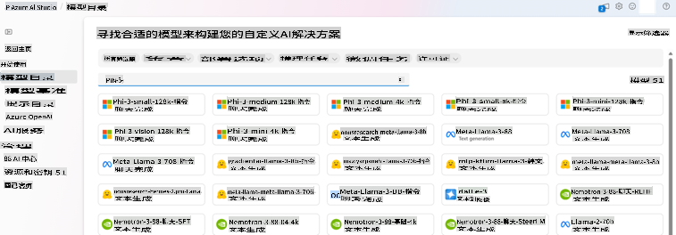

## 微调准备

### 先决条件

> [!NOTE]
> 对于 Phi-3 系列模型，按使用量付费的微调选项仅在 **East US 2** 区域创建的中心可用。

- 一个 Azure 订阅。如果你没有 Azure 订阅，请创建一个 [付费 Azure 账户](https://azure.microsoft.com/pricing/purchase-options/pay-as-you-go) 以开始。

- 一个 [AI Foundry 项目](https://ai.azure.com?WT.mc_id=aiml-138114-kinfeylo)。
- Azure 基于角色的访问控制 (Azure RBAC) 用于授予对 Azure AI Foundry 中操作的访问权限。要执行本文中的步骤，你的用户账户必须在资源组上被分配 __Azure AI Developer 角色__。

### 订阅提供商注册

验证订阅是否注册到 `Microsoft.Network` 资源提供商。

1. 登录到 [Azure 门户](https://portal.azure.com)。
1. 从左侧菜单中选择 **订阅**。
1. 选择你要使用的订阅。
1. 从左侧菜单中选择 **AI 项目设置** > **资源提供商**。
1. 确认 **Microsoft.Network** 是否在资源提供商列表中。否则请添加它。

### 数据准备

准备你的训练和验证数据以微调你的模型。你的训练数据和验证数据集应包括你希望模型如何执行的输入和输出示例。

确保所有的训练示例都符合推理的预期格式。为了有效地微调模型，确保数据集平衡和多样化。

这涉及保持数据平衡，包含各种场景，并定期优化训练数据以符合现实世界的期望，最终导致更准确和平衡的模型响应。

不同类型的模型需要不同格式的训练数据。

### 聊天完成

你使用的训练和验证数据**必须**格式化为 JSON Lines (JSONL) 文档。对于 `Phi-3-mini-128k-instruct`，微调数据集必须格式化为聊天完成 API 使用的对话格式。

### 示例文件格式

```json
    {"messages": [{"role": "system", "content": "You are an Xbox customer support agent whose primary goal is to help users with issues they are experiencing with their Xbox devices. You are friendly and concise. You only provide factual answers to queries, and do not provide answers that are not related to Xbox."}, {"role": "user", "content": "Is Xbox better than PlayStation?"}, {"role": "assistant", "content": "I apologize, but I cannot provide personal opinions. My primary job is to assist you with any issues related to your Xbox device. Do you have any Xbox-related issues that need addressing?"}]}
    {"messages": [{"role": "system", "content": "You are an Xbox customer support agent whose primary goal is to help users with issues they are experiencing with their Xbox devices. You are friendly and concise. You only provide factual answers to queries, and do not provide answers that are not related to Xbox."}, {"role": "user", "content": "Can I play PC games on my Xbox?"}, {"role": "assistant", "content": "While Xbox consoles don't natively support PC games, they can play an array of Xbox games, many of which are also available on PC. Can I assist you with finding games compatible with your Xbox device?"}]}
    {"messages": [{"role": "system", "content": "You are an Xbox customer support agent whose primary goal is to help users with issues they are experiencing with their Xbox devices. You are friendly and concise. You only provide factual answers to queries, and do not provide answers that are not related to Xbox."}, {"role": "user", "content": "I'm having trouble connecting my Xbox to the Wi-Fi."}, {"role": "assistant", "content": "No worries, let's go through the network settings on your Xbox. Can you please tell me what happens when you try to connect it to the Wi-Fi?"}]}
```

支持的文件类型是 JSON Lines。文件将被上传到默认数据存储，并在你的项目中可用。

## 使用 Azure AI Foundry 微调 Phi-3

Azure AI Foundry 允许你通过微调过程将大型语言模型定制到你的个人数据集。微调通过实现特定任务和应用的定制和优化，提供了显著的价值。它可以提升性能、提高成本效率、减少延迟并定制输出。

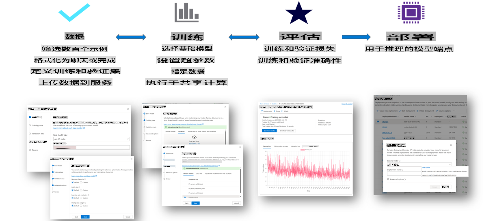

### 创建一个新项目

1. 登录到 [Azure AI Foundry](https://ai.azure.com)。

1. 选择 **+新项目** 以在 Azure AI Foundry 中创建新项目。

    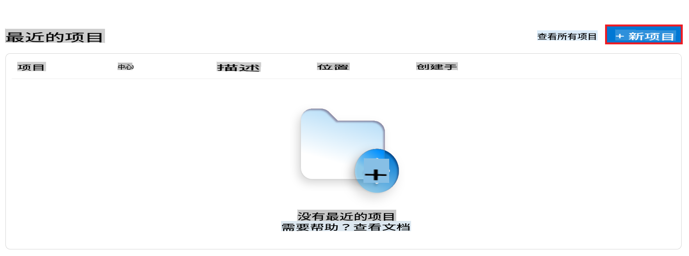

1. 执行以下任务：

    - 项目 **中心名称**。必须是唯一值。
    - 选择要使用的 **中心**（如有需要可创建新的）。

    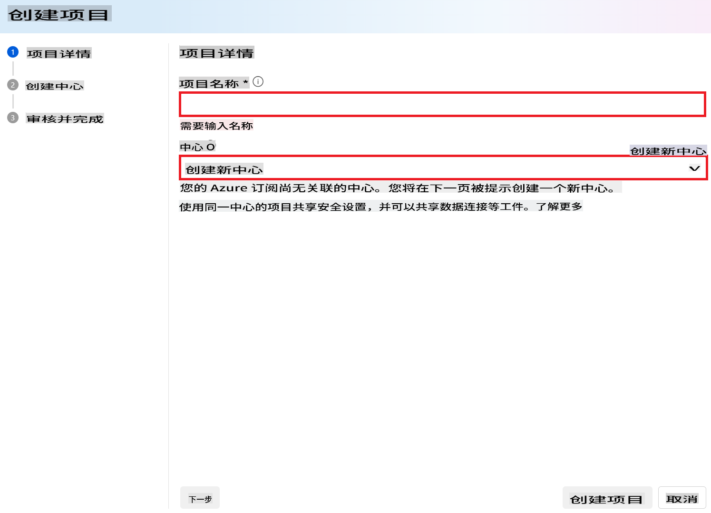

1. 执行以下任务以创建新中心：

    - 输入 **中心名称**。必须是唯一值。
    - 选择你的 Azure **订阅**。
    - 选择要使用的 **资源组**（如有需要可创建新的）。
    - 选择你想使用的 **位置**。
    - 选择要使用的 **连接 Azure AI 服务**（如有需要可创建新的）。
    - 选择 **连接 Azure AI 搜索** 为 **跳过连接**。

    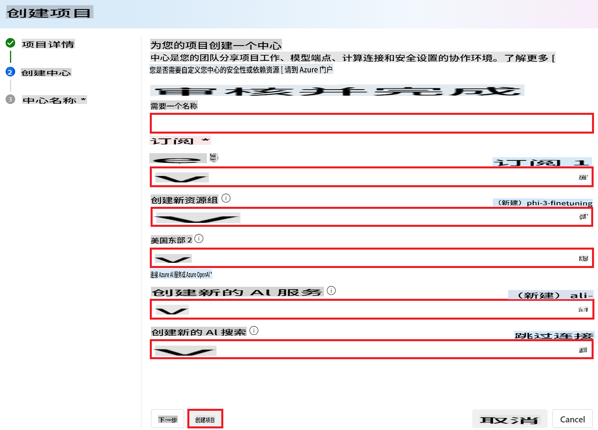

1. 选择 **下一步**。
1. 选择 **创建项目**。

### 数据准备

在微调之前，收集或创建与你任务相关的数据集，如聊天指令、问答对或任何其他相关文本数据。通过去除噪音、处理缺失值和对文本进行标记化来清理和预处理这些数据。

### 在 Azure AI Foundry 中微调 Phi-3 模型

> [!NOTE]
> Phi-3 模型的微调目前支持在 East US 2 区域的项目中进行。

1. 从左侧标签中选择 **模型目录**。

1. 在 **搜索栏** 中输入 *phi-3* 并选择你想使用的 phi-3 模型。

    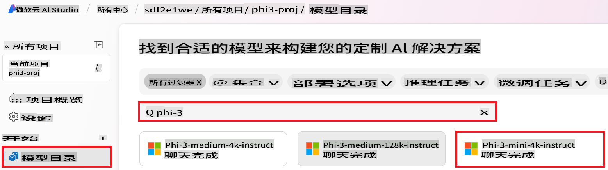

1. 选择 **微调**。

    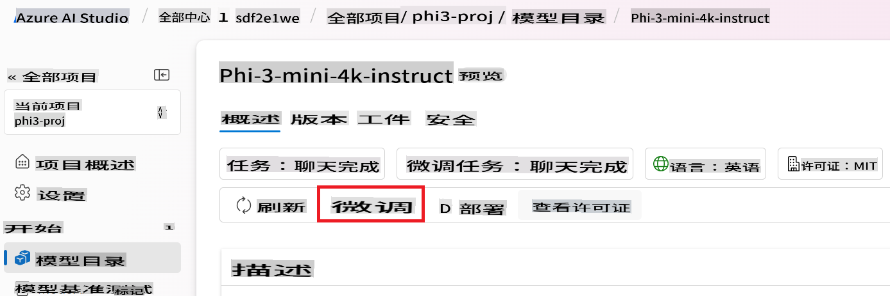

1. 输入 **微调模型名称**。

    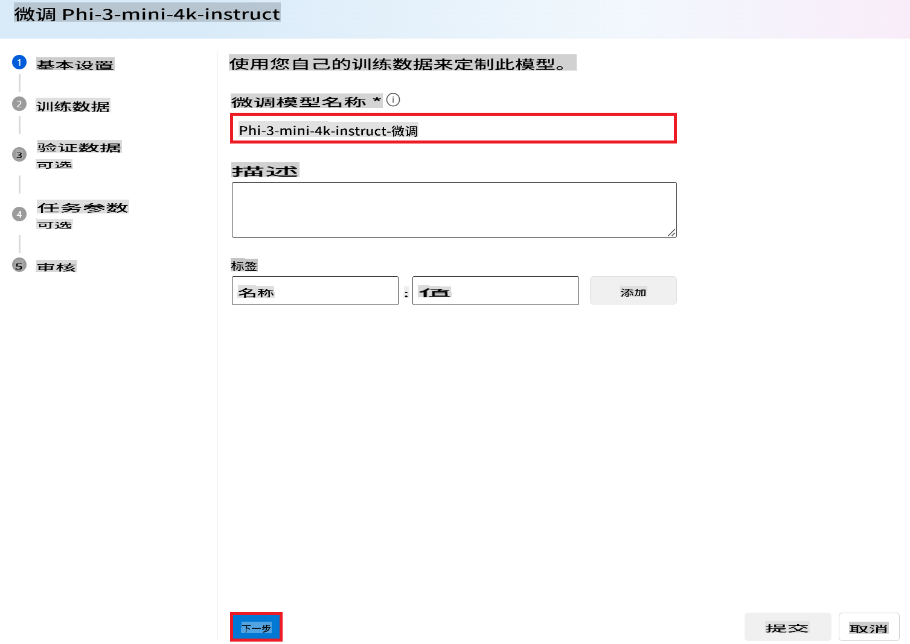

1. 选择 **下一步**。

1. 执行以下任务：

    - 选择 **任务类型** 为 **聊天完成**。
    - 选择你想使用的 **训练数据**。你可以通过 Azure AI Foundry 的数据上传它或从你的本地环境中上传。

    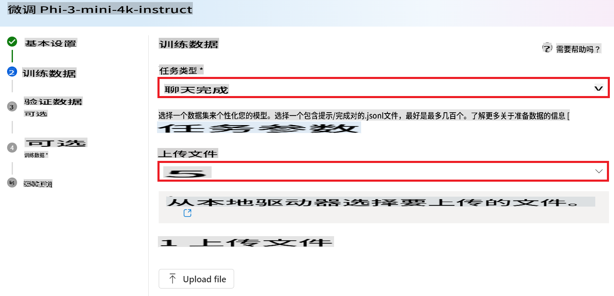

1. 选择 **下一步**。

1. 上传你想使用的 **验证数据**。或者你可以选择 **自动拆分训练数据**。

    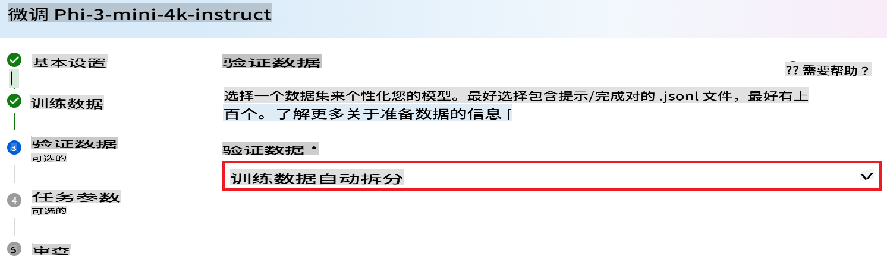

1. 选择 **下一步**。

1. 执行以下任务：

    - 选择你想使用的 **批量大小倍增器**。
    - 选择你想使用的 **学习率**。
    - 选择你想使用的 **训练周期**。

    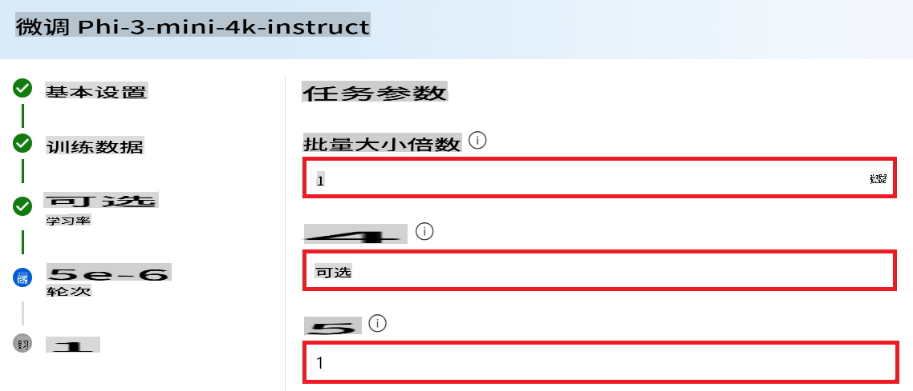

1. 选择 **提交** 以开始微调过程。

    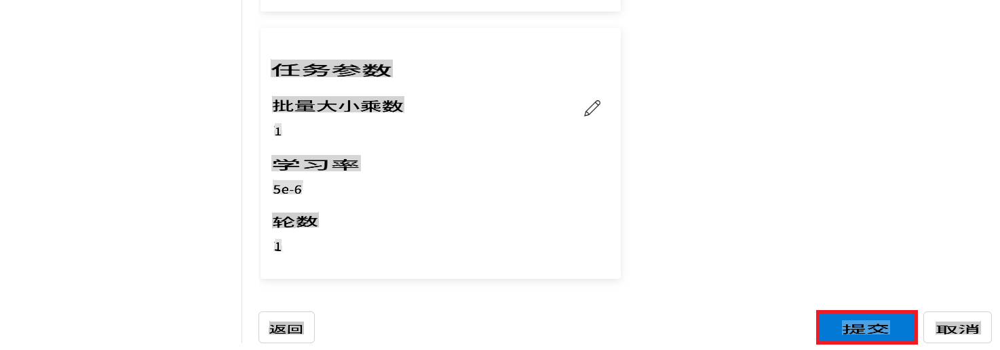


1. 一旦你的模型微调完成，状态将显示为 **已完成**，如下图所示。现在你可以部署模型并在你的应用程序、游乐场或提示流中使用它。有关更多信息，请参见 [如何使用 Azure AI Foundry 部署 Phi-3 系列小型语言模型](https://learn.microsoft.com/azure/ai-studio/how-to/deploy-models-phi-3?tabs=phi-3-5&pivots=programming-language-python)。

    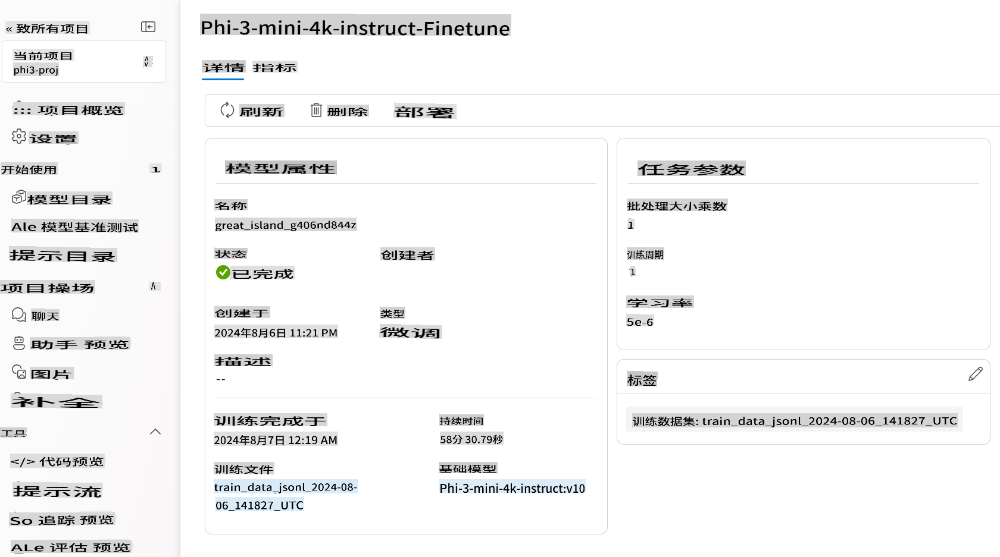

> [!NOTE]
> 有关微调 Phi-3 的更多详细信息，请访问 [在 Azure AI Foundry 中微调 Phi-3 模型](https://learn.microsoft.com/azure/ai-studio/how-to/fine-tune-phi-3?tabs=phi-3-mini)。

## 清理你的微调模型

你可以从 [Azure AI Foundry](https://ai.azure.com) 中的微调模型列表或从模型详细信息页面删除一个微调模型。选择要删除的微调模型，然后选择删除按钮以删除微调模型。

> [!NOTE]
> 如果自定义模型有现有部署，则无法删除自定义模型。你必须先删除模型部署，然后才能删除自定义模型。

## 成本和配额

### 作为服务的 Phi-3 模型微调的成本和配额考虑

作为服务的 Phi 模型由微软提供，并与 Azure AI Foundry 集成使用。你可以在 [部署](https://learn.microsoft.com/azure/ai-studio/how-to/deploy-models-phi-3?tabs=phi-3-5&pivots=programming-language-python) 或微调模型时在部署向导的定价和条款选项卡下找到定价。

## 内容过滤

按使用量付费的服务部署的模型受 Azure AI 内容安全保护。当部署到实时端点时，你可以选择退出此功能。启用 Azure AI 内容安全后，提示和完成都将通过一组分类模型来检测和防止有害内容的输出。内容过滤系统会检测并对输入提示和输出完成中的特定类别的潜在有害内容采取行动。了解更多关于 [Azure AI 内容安全](https://learn.microsoft.com/azure/ai-studio/concepts/content-filtering) 的信息。

**微调配置**

超参数：定义学习率、批量大小和训练周期数等超参数。

**损失函数**

为你的任务选择适当的损失函数（例如，交叉熵）。

**优化器**

选择一个优化器（例如，Adam）用于训练期间的梯度更新。

**微调过程**

- 加载预训练模型：加载 Phi-3 Mini 检查点。
- 添加自定义层：添加任务特定的层（例如，聊天指令的分类头）。

**训练模型**
使用你准备的数据集微调模型。监控训练进度并根据需要调整超参数。

**评估和验证**

验证集：将你的数据分为训练集和验证集。

**评估性能**

使用准确率、F1-分数或困惑度等指标来评估模型性能。

## 保存微调模型

**检查点**
保存微调模型检查点以供将来使用。

## 部署

- 部署为 Web 服务：在 Azure AI Foundry 中将你的微调模型部署为 Web 服务。
- 测试端点：向已部署的端点发送测试查询以验证其功能。

## 迭代和改进

迭代：如果性能不令人满意，通过调整超参数、添加更多数据或微调更多周期来迭代。

## 监控和优化

持续监控模型的行为并根据需要进行优化。

## 定制和扩展

自定义任务：Phi-3 Mini 可以微调用于聊天指令之外的各种任务。探索其他用例！
实验：尝试不同的架构、层组合和技术以提升性能。

> [!NOTE]
> 微调是一个迭代过程。实验、学习并调整你的模型以实现特定任务的最佳结果！

**免责声明**：
本文档是使用机器翻译服务翻译的。虽然我们力求准确，但请注意，自动翻译可能包含错误或不准确之处。应将原文档视为权威来源。对于关键信息，建议进行专业人工翻译。对于因使用此翻译而引起的任何误解或误读，我们不承担任何责任。