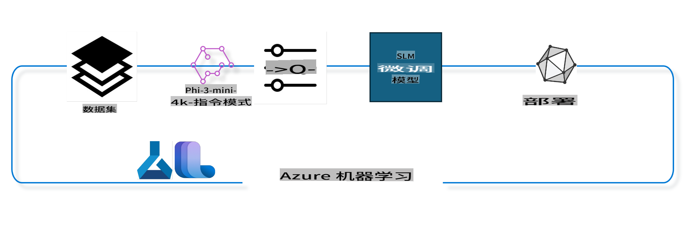

## 如何使用 Azure ML 系统注册表中的聊天完成组件微调模型

在这个示例中，我们将微调 Phi-3-mini-4k-instruct 模型，以完成两个人之间的对话，使用 ultrachat_200k 数据集。



本示例将向您展示如何使用 Azure ML SDK 和 Python 进行微调，然后将微调后的模型部署到在线端点进行实时推理。

### 训练数据

我们将使用 ultrachat_200k 数据集。这是一个经过大量筛选的 UltraChat 数据集版本，并用于训练 Zephyr-7B-β，这是一个先进的 7b 聊天模型。

### 模型

我们将使用 Phi-3-mini-4k-instruct 模型，展示用户如何微调模型以完成聊天任务。如果您是从特定模型卡片打开此笔记本，请记得替换特定的模型名称。

### 任务

- 选择一个模型进行微调。
- 选择并探索训练数据。
- 配置微调任务。
- 运行微调任务。
- 审查训练和评估指标。
- 注册微调后的模型。
- 部署微调后的模型进行实时推理。
- 清理资源。

## 1. 设置前提条件

- 安装依赖项
- 连接到 AzureML 工作区。了解更多关于设置 SDK 认证的信息。替换下面的 <WORKSPACE_NAME>、<RESOURCE_GROUP> 和 <SUBSCRIPTION_ID>。
- 连接到 azureml 系统注册表
- 设置一个可选的实验名称
- 检查或创建计算资源。

> [!NOTE]
> 要求一个单 GPU 节点可以有多个 GPU 卡。例如，在 Standard_NC24rs_v3 的一个节点中，有 4 个 NVIDIA V100 GPU，而在 Standard_NC12s_v3 中，有 2 个 NVIDIA V100 GPU。请参考文档获取这些信息。每个节点的 GPU 卡数量在下面的参数 gpus_per_node 中设置。正确设置此值将确保节点中所有 GPU 的利用。推荐的 GPU 计算 SKU 可以在这里和这里找到。

### Python 库

通过运行下面的单元格来安装依赖项。如果在新环境中运行，这是一个必不可少的步骤。

```bash
pip install azure-ai-ml
pip install azure-identity
pip install datasets==2.9.0
pip install mlflow
pip install azureml-mlflow
```

### 与 Azure ML 交互

1. 这个 Python 脚本用于与 Azure 机器学习（Azure ML）服务进行交互。以下是它的功能分解：

    - 它从 azure.ai.ml、azure.identity 和 azure.ai.ml.entities 包中导入必要的模块。它还导入了 time 模块。

    - 它尝试使用 DefaultAzureCredential() 进行身份验证，这提供了一个简化的身份验证体验，以便快速开始开发在 Azure 云中运行的应用程序。如果失败，它会退回到 InteractiveBrowserCredential()，这提供了一个交互式登录提示。

    - 然后，它尝试使用 from_config 方法创建一个 MLClient 实例，该方法从默认配置文件（config.json）中读取配置。如果失败，它会通过手动提供 subscription_id、resource_group_name 和 workspace_name 来创建一个 MLClient 实例。

    - 它创建了另一个 MLClient 实例，这次是为名为 "azureml" 的 Azure ML 注册表。这个注册表是存储模型、微调管道和环境的地方。

    - 它将 experiment_name 设置为 "chat_completion_Phi-3-mini-4k-instruct"。

    - 它通过将当前时间（自纪元以来的秒数，以浮点数表示）转换为整数然后转换为字符串来生成一个唯一的时间戳。这个时间戳可以用于创建唯一的名称和版本。

    ```python
    # Import necessary modules from Azure ML and Azure Identity
    from azure.ai.ml import MLClient
    from azure.identity import (
        DefaultAzureCredential,
        InteractiveBrowserCredential,
    )
    from azure.ai.ml.entities import AmlCompute
    import time  # Import time module
    
    # Try to authenticate using DefaultAzureCredential
    try:
        credential = DefaultAzureCredential()
        credential.get_token("https://management.azure.com/.default")
    except Exception as ex:  # If DefaultAzureCredential fails, use InteractiveBrowserCredential
        credential = InteractiveBrowserCredential()
    
    # Try to create an MLClient instance using the default config file
    try:
        workspace_ml_client = MLClient.from_config(credential=credential)
    except:  # If that fails, create an MLClient instance by manually providing the details
        workspace_ml_client = MLClient(
            credential,
            subscription_id="<SUBSCRIPTION_ID>",
            resource_group_name="<RESOURCE_GROUP>",
            workspace_name="<WORKSPACE_NAME>",
        )
    
    # Create another MLClient instance for the Azure ML registry named "azureml"
    # This registry is where models, fine-tuning pipelines, and environments are stored
    registry_ml_client = MLClient(credential, registry_name="azureml")
    
    # Set the experiment name
    experiment_name = "chat_completion_Phi-3-mini-4k-instruct"
    
    # Generate a unique timestamp that can be used for names and versions that need to be unique
    timestamp = str(int(time.time()))
    ```

## 2. 选择一个基础模型进行微调

1. Phi-3-mini-4k-instruct 是一个 3.8B 参数的轻量级、先进的开放模型，基于用于 Phi-2 的数据集构建。该模型属于 Phi-3 模型系列，Mini 版本有两个变体 4K 和 128K，这是它可以支持的上下文长度（以 token 计）。我们需要微调模型以用于我们的特定目的。您可以在 AzureML Studio 的模型目录中浏览这些模型，并通过聊天完成任务进行筛选。在这个示例中，我们使用 Phi-3-mini-4k-instruct 模型。如果您是为其他模型打开此笔记本，请相应地替换模型名称和版本。

    > [!NOTE]
    > 模型的 model id 属性。这将作为输入传递给微调任务。这也可以在 AzureML Studio 模型目录中的模型详细信息页面的 Asset ID 字段中找到。

2. 这个 Python 脚本与 Azure 机器学习（Azure ML）服务进行交互。以下是它的功能分解：

    - 它将 model_name 设置为 "Phi-3-mini-4k-instruct"。

    - 它使用 registry_ml_client 对象的 models 属性的 get 方法，从 Azure ML 注册表中检索具有指定名称的模型的最新版本。get 方法有两个参数：模型的名称和一个标签，指定应检索模型的最新版本。

    - 它在控制台中打印一条消息，指示将用于微调的模型的名称、版本和 id。字符串的 format 方法用于将模型的名称、版本和 id 插入消息中。模型的名称、版本和 id 作为 foundation_model 对象的属性访问。

    ```python
    # Set the model name
    model_name = "Phi-3-mini-4k-instruct"
    
    # Get the latest version of the model from the Azure ML registry
    foundation_model = registry_ml_client.models.get(model_name, label="latest")
    
    # Print the model name, version, and id
    # This information is useful for tracking and debugging
    print(
        "\n\nUsing model name: {0}, version: {1}, id: {2} for fine tuning".format(
            foundation_model.name, foundation_model.version, foundation_model.id
        )
    )
    ```

## 3. 创建一个用于任务的计算资源

微调任务只适用于 GPU 计算资源。计算资源的大小取决于模型的大小，在大多数情况下，确定适合任务的计算资源变得棘手。在此单元格中，我们指导用户选择适合任务的计算资源。

> [!NOTE]
> 下面列出的计算资源适用于最优化的配置。对配置的任何更改可能导致 Cuda 内存不足错误。在这种情况下，请尝试升级到更大的计算资源。

> [!NOTE]
> 在选择 compute_cluster_size 时，请确保计算资源在您的资源组中可用。如果特定的计算资源不可用，您可以请求访问这些计算资源。

### 检查模型的微调支持

1. 这个 Python 脚本与 Azure 机器学习（Azure ML）模型进行交互。以下是它的功能分解：

    - 它导入了 ast 模块，该模块提供处理 Python 抽象语法树的函数。

    - 它检查 foundation_model 对象（表示 Azure ML 中的模型）是否有一个名为 finetune_compute_allow_list 的标签。Azure ML 中的标签是键值对，您可以创建并用来过滤和排序模型。

    - 如果存在 finetune_compute_allow_list 标签，它使用 ast.literal_eval 函数安全地将标签的值（一个字符串）解析为 Python 列表。然后将此列表分配给 computes_allow_list 变量。然后它打印一条消息，指示应从列表中创建一个计算资源。

    - 如果不存在 finetune_compute_allow_list 标签，它将 computes_allow_list 设置为 None，并打印一条消息，指示 finetune_compute_allow_list 标签不是模型标签的一部分。

    - 总之，这个脚本正在检查模型元数据中的特定标签，将标签的值转换为列表（如果存在），并相应地向用户提供反馈。

    ```python
    # Import the ast module, which provides functions to process trees of the Python abstract syntax grammar
    import ast
    
    # Check if the 'finetune_compute_allow_list' tag is present in the model's tags
    if "finetune_compute_allow_list" in foundation_model.tags:
        # If the tag is present, use ast.literal_eval to safely parse the tag's value (a string) into a Python list
        computes_allow_list = ast.literal_eval(
            foundation_model.tags["finetune_compute_allow_list"]
        )  # convert string to python list
        # Print a message indicating that a compute should be created from the list
        print(f"Please create a compute from the above list - {computes_allow_list}")
    else:
        # If the tag is not present, set computes_allow_list to None
        computes_allow_list = None
        # Print a message indicating that the 'finetune_compute_allow_list' tag is not part of the model's tags
        print("`finetune_compute_allow_list` is not part of model tags")
    ```

### 检查计算实例

1. 这个 Python 脚本与 Azure 机器学习（Azure ML）服务进行交互，并对计算实例进行多个检查。以下是它的功能分解：

    - 它尝试从 Azure ML 工作区中检索名为 compute_cluster 的计算实例。如果计算实例的配置状态为 "failed"，它会引发 ValueError。

    - 它检查 computes_allow_list 是否不为 None。如果不是，它将列表中的所有计算大小转换为小写，并检查当前计算实例的大小是否在列表中。如果不在，它会引发 ValueError。

    - 如果 computes_allow_list 为 None，它会检查计算实例的大小是否在不支持的 GPU VM 大小列表中。如果在，它会引发 ValueError。

    - 它检索工作区中所有可用计算大小的列表。然后遍历此列表，对于每个计算大小，它检查其名称是否与当前计算实例的大小匹配。如果匹配，它会检索该计算大小的 GPU 数量，并将 gpu_count_found 设置为 True。

    - 如果 gpu_count_found 为 True，它会打印计算实例中的 GPU 数量。如果 gpu_count_found 为 False，它会引发 ValueError。

    - 总之，这个脚本对 Azure ML 工作区中的计算实例进行多个检查，包括检查其配置状态、大小是否在允许列表或拒绝列表中，以及它拥有的 GPU 数量。

    ```python
    # Print the exception message
    print(e)
    # Raise a ValueError if the compute size is not available in the workspace
    raise ValueError(
        f"WARNING! Compute size {compute_cluster_size} not available in workspace"
    )
    
    # Retrieve the compute instance from the Azure ML workspace
    compute = workspace_ml_client.compute.get(compute_cluster)
    # Check if the provisioning state of the compute instance is "failed"
    if compute.provisioning_state.lower() == "failed":
        # Raise a ValueError if the provisioning state is "failed"
        raise ValueError(
            f"Provisioning failed, Compute '{compute_cluster}' is in failed state. "
            f"please try creating a different compute"
        )
    
    # Check if computes_allow_list is not None
    if computes_allow_list is not None:
        # Convert all compute sizes in computes_allow_list to lowercase
        computes_allow_list_lower_case = [x.lower() for x in computes_allow_list]
        # Check if the size of the compute instance is in computes_allow_list_lower_case
        if compute.size.lower() not in computes_allow_list_lower_case:
            # Raise a ValueError if the size of the compute instance is not in computes_allow_list_lower_case
            raise ValueError(
                f"VM size {compute.size} is not in the allow-listed computes for finetuning"
            )
    else:
        # Define a list of unsupported GPU VM sizes
        unsupported_gpu_vm_list = [
            "standard_nc6",
            "standard_nc12",
            "standard_nc24",
            "standard_nc24r",
        ]
        # Check if the size of the compute instance is in unsupported_gpu_vm_list
        if compute.size.lower() in unsupported_gpu_vm_list:
            # Raise a ValueError if the size of the compute instance is in unsupported_gpu_vm_list
            raise ValueError(
                f"VM size {compute.size} is currently not supported for finetuning"
            )
    
    # Initialize a flag to check if the number of GPUs in the compute instance has been found
    gpu_count_found = False
    # Retrieve a list of all available compute sizes in the workspace
    workspace_compute_sku_list = workspace_ml_client.compute.list_sizes()
    available_sku_sizes = []
    # Iterate over the list of available compute sizes
    for compute_sku in workspace_compute_sku_list:
        available_sku_sizes.append(compute_sku.name)
        # Check if the name of the compute size matches the size of the compute instance
        if compute_sku.name.lower() == compute.size.lower():
            # If it does, retrieve the number of GPUs for that compute size and set gpu_count_found to True
            gpus_per_node = compute_sku.gpus
            gpu_count_found = True
    # If gpu_count_found is True, print the number of GPUs in the compute instance
    if gpu_count_found:
        print(f"Number of GPU's in compute {compute.size}: {gpus_per_node}")
    else:
        # If gpu_count_found is False, raise a ValueError
        raise ValueError(
            f"Number of GPU's in compute {compute.size} not found. Available skus are: {available_sku_sizes}."
            f"This should not happen. Please check the selected compute cluster: {compute_cluster} and try again."
        )
    ```

## 4. 选择用于微调模型的数据集

1. 我们使用 ultrachat_200k 数据集。该数据集有四个分割，适合于监督微调（sft）。生成排名（gen）。每个分割的示例如下：

    ```bash
    train_sft test_sft  train_gen  test_gen
    207865  23110  256032  28304
    ```

1. 接下来的几个单元格展示了用于微调的基本数据准备：

### 可视化一些数据行

我们希望这个示例快速运行，因此保存包含 5% 已经修剪过的行的 train_sft 和 test_sft 文件。这意味着微调后的模型将具有较低的准确性，因此不应投入实际使用。
download-dataset.py 用于下载 ultrachat_200k 数据集并将数据集转换为微调管道组件可消费的格式。由于数据集很大，因此我们这里只展示部分数据集。

1. 运行下面的脚本只会下载 5% 的数据。可以通过更改 dataset_split_pc 参数为所需的百分比来增加。

    > [!NOTE]
    > 一些语言模型有不同的语言代码，因此数据集中的列名应反映相同。

1. 这是数据应有的样子示例
聊天完成数据集存储在 parquet 格式中，每个条目使用以下架构：

    - 这是一个 JSON（JavaScript 对象表示法）文档，是一种流行的数据交换格式。它不是可执行代码，而是一种存储和传输数据的方式。以下是其结构的分解：

    - "prompt"：这个键包含一个字符串值，表示向 AI 助手提出的任务或问题。

    - "messages"：这个键包含一个对象数组。每个对象表示用户和 AI 助手之间对话中的一条消息。每个消息对象有两个键：

    - "content"：这个键包含一个字符串值，表示消息的内容。
    - "role"：这个键包含一个字符串值，表示发送消息的实体的角色。它可以是 "user" 或 "assistant"。
    - "prompt_id"：这个键包含一个字符串值，表示提示的唯一标识符。

1. 在这个特定的 JSON 文档中，表示了一个用户要求 AI 助手为一个反乌托邦故事创建主角的对话。助手回应，用户随后要求更多细节。助手同意提供更多细节。整个对话与特定的提示 id 相关联。

    ```python
    {
        // The task or question posed to an AI assistant
        "prompt": "Create a fully-developed protagonist who is challenged to survive within a dystopian society under the rule of a tyrant. ...",
        
        // An array of objects, each representing a message in a conversation between a user and an AI assistant
        "messages":[
            {
                // The content of the user's message
                "content": "Create a fully-developed protagonist who is challenged to survive within a dystopian society under the rule of a tyrant. ...",
                // The role of the entity that sent the message
                "role": "user"
            },
            {
                // The content of the assistant's message
                "content": "Name: Ava\n\n Ava was just 16 years old when the world as she knew it came crashing down. The government had collapsed, leaving behind a chaotic and lawless society. ...",
                // The role of the entity that sent the message
                "role": "assistant"
            },
            {
                // The content of the user's message
                "content": "Wow, Ava's story is so intense and inspiring! Can you provide me with more details.  ...",
                // The role of the entity that sent the message
                "role": "user"
            }, 
            {
                // The content of the assistant's message
                "content": "Certainly! ....",
                // The role of the entity that sent the message
                "role": "assistant"
            }
        ],
        
        // A unique identifier for the prompt
        "prompt_id": "d938b65dfe31f05f80eb8572964c6673eddbd68eff3db6bd234d7f1e3b86c2af"
    }
    ```

### 下载数据

1. 这个 Python 脚本用于使用名为 download-dataset.py 的辅助脚本下载数据集。以下是它的功能分解：

    - 它导入了 os 模块，该模块提供一种便携的方式来使用依赖于操作系统的功能。

    - 它使用 os.system 函数在 shell 中运行 download-dataset.py 脚本，带有特定的命令行参数。这些参数指定要下载的数据集（HuggingFaceH4/ultrachat_200k）、下载到的目录（ultrachat_200k_dataset）和数据集的分割百分比（5）。os.system 函数返回它执行的命令的退出状态；此状态存储在 exit_status 变量中。

    - 它检查 exit_status 是否不为 0。在类 Unix 操作系统中，退出状态为 0 通常表示命令成功，而任何其他数字表示错误。如果 exit_status 不为 0，它会引发一个异常，指示下载数据集时出现错误。

    - 总之，这个脚本正在运行一个命令来使用辅助脚本下载数据集，如果命令失败，它会引发异常。

    ```python
    # Import the os module, which provides a way of using operating system dependent functionality
    import os
    
    # Use the os.system function to run the download-dataset.py script in the shell with specific command-line arguments
    # The arguments specify the dataset to download (HuggingFaceH4/ultrachat_200k), the directory to download it to (ultrachat_200k_dataset), and the percentage of the dataset to split (5)
    # The os.system function returns the exit status of the command it executed; this status is stored in the exit_status variable
    exit_status = os.system(
        "python ./download-dataset.py --dataset HuggingFaceH4/ultrachat_200k --download_dir ultrachat_200k_dataset --dataset_split_pc 5"
    )
    
    # Check if exit_status is not 0
    # In Unix-like operating systems, an exit status of 0 usually indicates that a command has succeeded, while any other number indicates an error
    # If exit_status is not 0, raise an Exception with a message indicating that there was an error downloading the dataset
    if exit_status != 0:
        raise Exception("Error downloading dataset")
    ```

### 将数据加载到 DataFrame

1. 这个 Python 脚本将 JSON Lines 文件加载到 pandas DataFrame 中并显示前 5 行。以下是它的功能分解：

    - 它导入了 pandas 库，这是一个强大的数据操作和分析库。

    - 它将 pandas 的显示选项中的最大列宽设置为 0。这意味着在打印 DataFrame 时，将显示每列的完整文本而不截断。

    - 它使用 pd.read_json 函数将 ultrachat_200k_dataset 目录中的 train_sft.jsonl 文件加载到 DataFrame 中。lines=True 参数指示文件是 JSON Lines 格式，其中每行是一个单独的 JSON 对象。

    - 它使用 head 方法显示 DataFrame 的前 5 行。如果 DataFrame 少于 5 行，它将显示所有行。

    - 总之，这个脚本将 JSON Lines 文件加载到 DataFrame 中并显示前 5 行，显示完整的列文本。

    ```python
    # Import the pandas library, which is a powerful data manipulation and analysis library
    import pandas as pd
    
    # Set the maximum column width for pandas' display options to 0
    # This means that the full text of each column will be displayed without truncation when the DataFrame is printed
    pd.set_option("display.max_colwidth", 0)
    
    # Use the pd.read_json function to load the train_sft.jsonl file from the ultrachat_200k_dataset directory into a DataFrame
    # The lines=True argument indicates that the file is in JSON Lines format, where each line is a separate JSON object
    df = pd.read_json("./ultrachat_200k_dataset/train_sft.jsonl", lines=True)
    
    # Use the head method to display the first 5 rows of the DataFrame
    # If the DataFrame has less than 5 rows, it will display all of them
    df.head()
    ```

## 5. 使用模型和数据作为输入提交微调任务

创建使用聊天完成管道组件的任务。了解更多关于微调支持的所有参数。

### 定义微调参数

1. 微调参数可以分为两类 - 训练参数、优化参数

1. 训练参数定义训练方面，例如：

    - 要使用的优化器、调度器
    - 优化微调的指标
    - 训练步骤数和批处理大小等
    - 优化参数有助于优化 GPU 内存并有效使用计算资源。

1. 下面是属于这一类别的一些参数。优化参数因每个模型而异，并随模型一起打包以处理这些变化。

    - 启用 deepspeed 和 LoRA
    - 启用混合精度训练
    - 启用多节点训练

> [!NOTE]
> 监督微调可能会导致对齐丢失或灾难性遗忘。我们建议在微调后检查这个问题并运行对齐阶段。

### 微调参数

1. 这个 Python 脚本正在设置微调机器学习模型的参数。以下是它的功能分解：

    - 它设置了默认的训练参数，例如训练时期数、训练和评估的批处理大小、学习率和学习率调度类型。

    - 它设置了默认的优化参数，例如是否应用 Layer-wise Relevance Propagation (LoRa) 和 DeepSpeed，以及 DeepSpeed 阶段。

    - 它将训练和优化参数组合成一个名为 finetune_parameters 的字典。

    - 它检查 foundation_model 是否有任何特定于模型的默认参数。如果有，它会打印一个警告消息，并使用这些特定于模型的默认参数更新 finetune_parameters 字典。ast.literal_eval 函数用于将特定于模型的默认参数从字符串转换为 Python 字典。

    - 它打印将用于运行的最终微调参数集。

    - 总之，这个脚本正在设置和显示微调机器学习模型的参数，能够使用特定于模型的参数覆盖默认参数。

    ```python
    # Set up default training parameters such as the number of training epochs, batch sizes for training and evaluation, learning rate, and learning rate scheduler type
    training_parameters = dict(
        num_train_epochs=3,
        per_device_train_batch_size=1,
        per_device_eval_batch_size=1,
        learning_rate=5e-6,
        lr_scheduler_type="cosine",
    )
    
    # Set up default optimization parameters such as whether to apply Layer-wise Relevance Propagation (LoRa) and DeepSpeed, and the DeepSpeed stage
    optimization_parameters = dict(
        apply_lora="true",
        apply_deepspeed="true",
        deepspeed_stage=2,
    )
    
    # Combine the training and optimization parameters into a single dictionary called finetune_parameters
    finetune_parameters = {**training_parameters, **optimization_parameters}
    
    # Check if the foundation_model has any model-specific default parameters
    # If it does, print a warning message and update the finetune_parameters dictionary with these model-specific defaults
    # The ast.literal_eval function is used to convert the model-specific defaults from a string to a Python dictionary
    if "model_specific_defaults" in foundation_model.tags:
        print("Warning! Model specific defaults exist. The defaults could be overridden.")
        finetune_parameters.update(
            ast.literal_eval(  # convert string to python dict
                foundation_model.tags["model_specific_defaults"]
            )
        )
    
    # Print the final set of fine-tuning parameters that will be used for the run
    print(
        f"The following finetune parameters are going to be set for the run: {finetune_parameters}"
    )
    ```

### 训练管道

1. 这个 Python 脚本定义了一个生成机器学习训练管道显示名称的函数，然后调用这个函数生成并打印显示名称。以下是它的功能分解：

1. 定义了 get_pipeline_display_name 函数。这个函数根据与训练管道相关的各种参数生成显示名称。

1. 在函数内部，它通过将每设备批处理大小、梯度累积步骤数、每节点 GPU 数量和用于微调的节点数量相乘来计算总批处理大小。

1. 它检索各种其他参数，例如学习率调度类型、是否应用 DeepSpeed、DeepSpeed 阶段、是否应用 Layer-wise Relevance Propagation (LoRa)、保留的模型检查点数量限制和最大序列长度。

1. 它构建了一个包含所有这些参数的字符串，用连字符分隔。如果应用了 DeepSpeed 或 LoRa，字符串将包含 "ds" 后跟 DeepSpeed 阶段，或 "lora"。如果没有，则包含 "nods" 或 "nolora"。

1. 函数返回这个字符串，作为训练管道的显示名称。

1. 在定义函数后，调用它生成显示名称，然后打印显示名称。

1. 总之，这个脚本正在生成机器学习训练管道的显示名称。
基于各种参数训练流水线，然后打印这个显示名称。```python
    # Define a function to generate a display name for the training pipeline
    def get_pipeline_display_name():
        # Calculate the total batch size by multiplying the per-device batch size, the number of gradient accumulation steps, the number of GPUs per node, and the number of nodes used for fine-tuning
        batch_size = (
            int(finetune_parameters.get("per_device_train_batch_size", 1))
            * int(finetune_parameters.get("gradient_accumulation_steps", 1))
            * int(gpus_per_node)
            * int(finetune_parameters.get("num_nodes_finetune", 1))
        )
        # Retrieve the learning rate scheduler type
        scheduler = finetune_parameters.get("lr_scheduler_type", "linear")
        # Retrieve whether DeepSpeed is applied
        deepspeed = finetune_parameters.get("apply_deepspeed", "false")
        # Retrieve the DeepSpeed stage
        ds_stage = finetune_parameters.get("deepspeed_stage", "2")
        # If DeepSpeed is applied, include "ds" followed by the DeepSpeed stage in the display name; if not, include "nods"
        if deepspeed == "true":
            ds_string = f"ds{ds_stage}"
        else:
            ds_string = "nods"
        # Retrieve whether Layer-wise Relevance Propagation (LoRa) is applied
        lora = finetune_parameters.get("apply_lora", "false")
        # If LoRa is applied, include "lora" in the display name; if not, include "nolora"
        if lora == "true":
            lora_string = "lora"
        else:
            lora_string = "nolora"
        # Retrieve the limit on the number of model checkpoints to keep
        save_limit = finetune_parameters.get("save_total_limit", -1)
        # Retrieve the maximum sequence length
        seq_len = finetune_parameters.get("max_seq_length", -1)
        # Construct the display name by concatenating all these parameters, separated by hyphens
        return (
            model_name
            + "-"
            + "ultrachat"
            + "-"
            + f"bs{batch_size}"
            + "-"
            + f"{scheduler}"
            + "-"
            + ds_string
            + "-"
            + lora_string
            + f"-save_limit{save_limit}"
            + f"-seqlen{seq_len}"
        )
    
    # Call the function to generate the display name
    pipeline_display_name = get_pipeline_display_name()
    # Print the display name
    print(f"Display name used for the run: {pipeline_display_name}")
    ```

### 配置流水线

这个Python脚本使用Azure Machine Learning SDK定义和配置一个机器学习流水线。以下是它的功能分解：

1. 它从Azure AI ML SDK导入必要的模块。
1. 它从注册表中获取名为“chat_completion_pipeline”的流水线组件。
1. 它使用 `@pipeline` decorator and the function `create_pipeline`. The name of the pipeline is set to `pipeline_display_name`.

1. Inside the `create_pipeline` function, it initializes the fetched pipeline component with various parameters, including the model path, compute clusters for different stages, dataset splits for training and testing, the number of GPUs to use for fine-tuning, and other fine-tuning parameters.

1. It maps the output of the fine-tuning job to the output of the pipeline job. This is done so that the fine-tuned model can be easily registered, which is required to deploy the model to an online or batch endpoint.

1. It creates an instance of the pipeline by calling the `create_pipeline` function.

1. It sets the `force_rerun` setting of the pipeline to `True`, meaning that cached results from previous jobs will not be used.

1. It sets the `continue_on_step_failure` setting of the pipeline to `False` 定义了一个流水线作业，这意味着如果任何步骤失败，流水线将停止。
1. 总结来说，这个脚本使用Azure Machine Learning SDK定义和配置了一个用于聊天完成任务的机器学习流水线。

```python
    # Import necessary modules from the Azure AI ML SDK
    from azure.ai.ml.dsl import pipeline
    from azure.ai.ml import Input
    
    # Fetch the pipeline component named "chat_completion_pipeline" from the registry
    pipeline_component_func = registry_ml_client.components.get(
        name="chat_completion_pipeline", label="latest"
    )
    
    # Define the pipeline job using the @pipeline decorator and the function create_pipeline
    # The name of the pipeline is set to pipeline_display_name
    @pipeline(name=pipeline_display_name)
    def create_pipeline():
        # Initialize the fetched pipeline component with various parameters
        # These include the model path, compute clusters for different stages, dataset splits for training and testing, the number of GPUs to use for fine-tuning, and other fine-tuning parameters
        chat_completion_pipeline = pipeline_component_func(
            mlflow_model_path=foundation_model.id,
            compute_model_import=compute_cluster,
            compute_preprocess=compute_cluster,
            compute_finetune=compute_cluster,
            compute_model_evaluation=compute_cluster,
            # Map the dataset splits to parameters
            train_file_path=Input(
                type="uri_file", path="./ultrachat_200k_dataset/train_sft.jsonl"
            ),
            test_file_path=Input(
                type="uri_file", path="./ultrachat_200k_dataset/test_sft.jsonl"
            ),
            # Training settings
            number_of_gpu_to_use_finetuning=gpus_per_node,  # Set to the number of GPUs available in the compute
            **finetune_parameters
        )
        return {
            # Map the output of the fine tuning job to the output of pipeline job
            # This is done so that we can easily register the fine tuned model
            # Registering the model is required to deploy the model to an online or batch endpoint
            "trained_model": chat_completion_pipeline.outputs.mlflow_model_folder
        }
    
    # Create an instance of the pipeline by calling the create_pipeline function
    pipeline_object = create_pipeline()
    
    # Don't use cached results from previous jobs
    pipeline_object.settings.force_rerun = True
    
    # Set continue on step failure to False
    # This means that the pipeline will stop if any step fails
    pipeline_object.settings.continue_on_step_failure = False
    ```

### 提交作业

1. 这个Python脚本向Azure Machine Learning工作区提交一个机器学习流水线作业，然后等待作业完成。以下是它的功能分解：

    - 它调用工作区客户端中的jobs对象的create_or_update方法提交流水线作业。要运行的流水线由pipeline_object指定，作业运行的实验由experiment_name指定。
    
    - 然后它调用工作区客户端中的jobs对象的stream方法，等待流水线作业完成。要等待的作业由pipeline_job对象的name属性指定。
    
    - 总结来说，这个脚本向Azure Machine Learning工作区提交一个机器学习流水线作业，然后等待作业完成。

```python
    # Submit the pipeline job to the Azure Machine Learning workspace
    # The pipeline to be run is specified by pipeline_object
    # The experiment under which the job is run is specified by experiment_name
    pipeline_job = workspace_ml_client.jobs.create_or_update(
        pipeline_object, experiment_name=experiment_name
    )
    
    # Wait for the pipeline job to complete
    # The job to wait for is specified by the name attribute of the pipeline_job object
    workspace_ml_client.jobs.stream(pipeline_job.name)
    ```

## 6. 将微调后的模型注册到工作区

我们将从微调作业的输出中注册模型。这将跟踪微调模型与微调作业之间的谱系。进一步来说，微调作业将跟踪基础模型、数据和训练代码的谱系。

### 注册机器学习模型

1. 这个Python脚本正在注册在Azure Machine Learning流水线中训练的机器学习模型。以下是它的功能分解：

    - 它从Azure AI ML SDK导入必要的模块。
    
    - 它通过调用工作区客户端中的jobs对象的get方法并访问其outputs属性，检查是否有来自流水线作业的trained_model输出。
    
    - 它通过格式化一个字符串，构建一个指向训练模型的路径，其中包含流水线作业的名称和输出名称（“trained_model”）。
    
    - 它通过在原始模型名称后附加“-ultrachat-200k”并将任何斜杠替换为连字符，定义微调模型的名称。
    
    - 它通过创建一个Model对象，准备注册模型，其中包含指向模型的路径、模型的类型（MLflow模型）、模型的名称和版本以及模型的描述等各种参数。
    
    - 它通过调用工作区客户端中的models对象的create_or_update方法，并将Model对象作为参数，注册模型。
    
    - 它打印已注册的模型。
    
    - 总结来说，这个脚本正在注册在Azure Machine Learning流水线中训练的机器学习模型。

```python
    # Import necessary modules from the Azure AI ML SDK
    from azure.ai.ml.entities import Model
    from azure.ai.ml.constants import AssetTypes
    
    # Check if the `trained_model` output is available from the pipeline job
    print("pipeline job outputs: ", workspace_ml_client.jobs.get(pipeline_job.name).outputs)
    
    # Construct a path to the trained model by formatting a string with the name of the pipeline job and the name of the output ("trained_model")
    model_path_from_job = "azureml://jobs/{0}/outputs/{1}".format(
        pipeline_job.name, "trained_model"
    )
    
    # Define a name for the fine-tuned model by appending "-ultrachat-200k" to the original model name and replacing any slashes with hyphens
    finetuned_model_name = model_name + "-ultrachat-200k"
    finetuned_model_name = finetuned_model_name.replace("/", "-")
    
    print("path to register model: ", model_path_from_job)
    
    # Prepare to register the model by creating a Model object with various parameters
    # These include the path to the model, the type of the model (MLflow model), the name and version of the model, and a description of the model
    prepare_to_register_model = Model(
        path=model_path_from_job,
        type=AssetTypes.MLFLOW_MODEL,
        name=finetuned_model_name,
        version=timestamp,  # Use timestamp as version to avoid version conflict
        description=model_name + " fine tuned model for ultrachat 200k chat-completion",
    )
    
    print("prepare to register model: \n", prepare_to_register_model)
    
    # Register the model by calling the create_or_update method of the models object in the workspace_ml_client with the Model object as the argument
    registered_model = workspace_ml_client.models.create_or_update(
        prepare_to_register_model
    )
    
    # Print the registered model
    print("registered model: \n", registered_model)
    ```

## 7. 将微调后的模型部署到在线端点

在线端点提供了一个持久的REST API，可以用于集成需要使用模型的应用程序。

### 管理端点

1. 这个Python脚本正在为注册的模型在Azure Machine Learning中创建一个托管的在线端点。以下是它的功能分解：

    - 它从Azure AI ML SDK导入必要的模块。
    
    - 它通过在字符串“ultrachat-completion-”后附加时间戳，定义了一个唯一的在线端点名称。
    
    - 它通过创建一个ManagedOnlineEndpoint对象，准备创建在线端点，其中包含端点的名称、端点的描述和身份验证模式（“key”）等各种参数。
    
    - 它通过调用工作区客户端中的begin_create_or_update方法，并将ManagedOnlineEndpoint对象作为参数，创建在线端点。然后通过调用wait方法等待创建操作完成。
    
    - 总结来说，这个脚本正在为注册的模型在Azure Machine Learning中创建一个托管的在线端点。

```python
    # Import necessary modules from the Azure AI ML SDK
    from azure.ai.ml.entities import (
        ManagedOnlineEndpoint,
        ManagedOnlineDeployment,
        ProbeSettings,
        OnlineRequestSettings,
    )
    
    # Define a unique name for the online endpoint by appending a timestamp to the string "ultrachat-completion-"
    online_endpoint_name = "ultrachat-completion-" + timestamp
    
    # Prepare to create the online endpoint by creating a ManagedOnlineEndpoint object with various parameters
    # These include the name of the endpoint, a description of the endpoint, and the authentication mode ("key")
    endpoint = ManagedOnlineEndpoint(
        name=online_endpoint_name,
        description="Online endpoint for "
        + registered_model.name
        + ", fine tuned model for ultrachat-200k-chat-completion",
        auth_mode="key",
    )
    
    # Create the online endpoint by calling the begin_create_or_update method of the workspace_ml_client with the ManagedOnlineEndpoint object as the argument
    # Then wait for the creation operation to complete by calling the wait method
    workspace_ml_client.begin_create_or_update(endpoint).wait()
    ```

> [!NOTE]
> 您可以在此处找到支持部署的SKU列表 - [Managed online endpoints SKU list](https://learn.microsoft.com/azure/machine-learning/reference-managed-online-endpoints-vm-sku-list)

### 部署机器学习模型

1. 这个Python脚本正在将注册的机器学习模型部署到Azure Machine Learning中的托管在线端点。以下是它的功能分解：

    - 它导入了ast模块，该模块提供处理Python抽象语法树的函数。
    
    - 它将部署的实例类型设置为“Standard_NC6s_v3”。
    
    - 它检查基础模型中是否存在inference_compute_allow_list标签。如果存在，它将标签值从字符串转换为Python列表并分配给inference_computes_allow_list。如果不存在，则将inference_computes_allow_list设置为None。
    
    - 它检查指定的实例类型是否在允许列表中。如果不在，它会打印一条消息，要求用户从允许列表中选择一个实例类型。
    
    - 它通过创建一个ManagedOnlineDeployment对象，准备创建部署，其中包含部署的名称、端点的名称、模型的ID、实例类型和数量、存活探针设置以及请求设置等各种参数。
    
    - 它通过调用工作区客户端中的begin_create_or_update方法，并将ManagedOnlineDeployment对象作为参数，创建部署。然后通过调用wait方法等待创建操作完成。
    
    - 它将端点的流量设置为将100%的流量引导到“demo”部署。
    
    - 它通过调用工作区客户端中的begin_create_or_update方法，并将端点对象作为参数，更新端点。然后通过调用result方法等待更新操作完成。
    
    - 总结来说，这个脚本正在将注册的机器学习模型部署到Azure Machine Learning中的托管在线端点。

    ```python
    # Import the ast module, which provides functions to process trees of the Python abstract syntax grammar
    import ast
    
    # Set the instance type for the deployment
    instance_type = "Standard_NC6s_v3"
    
    # Check if the `inference_compute_allow_list` tag is present in the foundation model
    if "inference_compute_allow_list" in foundation_model.tags:
        # If it is, convert the tag value from a string to a Python list and assign it to `inference_computes_allow_list`
        inference_computes_allow_list = ast.literal_eval(
            foundation_model.tags["inference_compute_allow_list"]
        )
        print(f"Please create a compute from the above list - {computes_allow_list}")
    else:
        # If it's not, set `inference_computes_allow_list` to `None`
        inference_computes_allow_list = None
        print("`inference_compute_allow_list` is not part of model tags")
    
    # Check if the specified instance type is in the allow list
    if (
        inference_computes_allow_list is not None
        and instance_type not in inference_computes_allow_list
    ):
        print(
            f"`instance_type` is not in the allow listed compute. Please select a value from {inference_computes_allow_list}"
        )
    
    # Prepare to create the deployment by creating a `ManagedOnlineDeployment` object with various parameters
    demo_deployment = ManagedOnlineDeployment(
        name="demo",
        endpoint_name=online_endpoint_name,
        model=registered_model.id,
        instance_type=instance_type,
        instance_count=1,
        liveness_probe=ProbeSettings(initial_delay=600),
        request_settings=OnlineRequestSettings(request_timeout_ms=90000),
    )
    
    # Create the deployment by calling the `begin_create_or_update` method of the `workspace_ml_client` with the `ManagedOnlineDeployment` object as the argument
    # Then wait for the creation operation to complete by calling the `wait` method
    workspace_ml_client.online_deployments.begin_create_or_update(demo_deployment).wait()
    
    # Set the traffic of the endpoint to direct 100% of the traffic to the "demo" deployment
    endpoint.traffic = {"demo": 100}
    
    # Update the endpoint by calling the `begin_create_or_update` method of the `workspace_ml_client` with the `endpoint` object as the argument
    # Then wait for the update operation to complete by calling the `result` method
    workspace_ml_client.begin_create_or_update(endpoint).result()
    ```

## 8. 使用样本数据测试端点

我们将从测试数据集中获取一些样本数据并提交给在线端点进行推理。然后我们将显示评分标签与真实标签的对比。

### 读取结果

1. 这个Python脚本正在将一个JSON Lines文件读取到一个pandas DataFrame中，获取一个随机样本，并重置索引。以下是它的功能分解：

    - 它将文件./ultrachat_200k_dataset/test_gen.jsonl读取到一个pandas DataFrame中。由于文件是JSON Lines格式，每行是一个单独的JSON对象，因此使用了read_json函数和lines=True参数。
    
    - 它从DataFrame中随机抽取1行样本。使用sample函数和n=1参数来指定要选择的随机行数。
    
    - 它重置DataFrame的索引。使用reset_index函数和drop=True参数来删除原始索引并用默认的整数值新索引替换。
    
    - 它使用head函数和参数2显示DataFrame的前2行。然而，由于抽样后DataFrame只有一行，这将只显示那一行。
    
    - 总结来说，这个脚本正在将一个JSON Lines文件读取到一个pandas DataFrame中，获取1行随机样本，重置索引，并显示第一行。

    ```python
    # Import pandas library
    import pandas as pd
    
    # Read the JSON Lines file './ultrachat_200k_dataset/test_gen.jsonl' into a pandas DataFrame
    # The 'lines=True' argument indicates that the file is in JSON Lines format, where each line is a separate JSON object
    test_df = pd.read_json("./ultrachat_200k_dataset/test_gen.jsonl", lines=True)
    
    # Take a random sample of 1 row from the DataFrame
    # The 'n=1' argument specifies the number of random rows to select
    test_df = test_df.sample(n=1)
    
    # Reset the index of the DataFrame
    # The 'drop=True' argument indicates that the original index should be dropped and replaced with a new index of default integer values
    # The 'inplace=True' argument indicates that the DataFrame should be modified in place (without creating a new object)
    test_df.reset_index(drop=True, inplace=True)
    
    # Display the first 2 rows of the DataFrame
    # However, since the DataFrame only contains one row after the sampling, this will only display that one row
    test_df.head(2)
    ```

### 创建JSON对象

1. 这个Python脚本正在创建一个具有特定参数的JSON对象并将其保存到文件中。以下是它的功能分解：

    - 它导入了json模块，该模块提供处理JSON数据的函数。
    
    - 它创建了一个包含参数键值对的字典parameters。键是“temperature”、“top_p”、“do_sample”和“max_new_tokens”，对应的值分别是0.6、0.9、True和200。
    
    - 它创建了另一个字典test_json，包含两个键：“input_data”和“params”。“input_data”的值是另一个字典，包含键“input_string”和“parameters”。“input_string”的值是一个包含来自test_df DataFrame的第一条消息的列表。“parameters”的值是之前创建的parameters字典。“params”的值是一个空字典。
    
    - 它打开一个名为sample_score.json的文件
    
    ```python
    # Import the json module, which provides functions to work with JSON data
    import json
    
    # Create a dictionary `parameters` with keys and values that represent parameters for a machine learning model
    # The keys are "temperature", "top_p", "do_sample", and "max_new_tokens", and their corresponding values are 0.6, 0.9, True, and 200 respectively
    parameters = {
        "temperature": 0.6,
        "top_p": 0.9,
        "do_sample": True,
        "max_new_tokens": 200,
    }
    
    # Create another dictionary `test_json` with two keys: "input_data" and "params"
    # The value of "input_data" is another dictionary with keys "input_string" and "parameters"
    # The value of "input_string" is a list containing the first message from the `test_df` DataFrame
    # The value of "parameters" is the `parameters` dictionary created earlier
    # The value of "params" is an empty dictionary
    test_json = {
        "input_data": {
            "input_string": [test_df["messages"][0]],
            "parameters": parameters,
        },
        "params": {},
    }
    
    # Open a file named `sample_score.json` in the `./ultrachat_200k_dataset` directory in write mode
    with open("./ultrachat_200k_dataset/sample_score.json", "w") as f:
        # Write the `test_json` dictionary to the file in JSON format using the `json.dump` function
        json.dump(test_json, f)
    ```

### 调用端点

1. 这个Python脚本正在调用Azure Machine Learning中的一个在线端点来评分一个JSON文件。以下是它的功能分解：

    - 它调用workspace_ml_client对象的online_endpoints属性的invoke方法。此方法用于向在线端点发送请求并获取响应。
    
    - 它使用endpoint_name和deployment_name参数指定端点和部署的名称。在这种情况下，端点名称存储在online_endpoint_name变量中，部署名称为“demo”。
    
    - 它使用request_file参数指定要评分的JSON文件的路径。在这种情况下，文件是./ultrachat_200k_dataset/sample_score.json。
    
    - 它将端点的响应存储在response变量中。
    
    - 它打印原始响应。
    
    - 总结来说，这个脚本正在调用Azure Machine Learning中的一个在线端点来评分一个JSON文件并打印响应。

    ```python
    # Invoke the online endpoint in Azure Machine Learning to score the `sample_score.json` file
    # The `invoke` method of the `online_endpoints` property of the `workspace_ml_client` object is used to send a request to an online endpoint and get a response
    # The `endpoint_name` argument specifies the name of the endpoint, which is stored in the `online_endpoint_name` variable
    # The `deployment_name` argument specifies the name of the deployment, which is "demo"
    # The `request_file` argument specifies the path to the JSON file to be scored, which is `./ultrachat_200k_dataset/sample_score.json`
    response = workspace_ml_client.online_endpoints.invoke(
        endpoint_name=online_endpoint_name,
        deployment_name="demo",
        request_file="./ultrachat_200k_dataset/sample_score.json",
    )
    
    # Print the raw response from the endpoint
    print("raw response: \n", response, "\n")
    ```

## 9. 删除在线端点

1. 别忘了删除在线端点，否则你会因为端点使用的计算资源而继续计费。这个Python代码行正在删除Azure Machine Learning中的一个在线端点。以下是它的功能分解：

    - 它调用workspace_ml_client对象的online_endpoints属性的begin_delete方法。此方法用于开始删除在线端点。
    
    - 它使用name参数指定要删除的端点名称。在这种情况下，端点名称存储在online_endpoint_name变量中。
    
    - 它调用wait方法等待删除操作完成。这是一个阻塞操作，意味着它将阻止脚本继续运行，直到删除完成。
    
    - 总结来说，这行代码正在开始删除Azure Machine Learning中的一个在线端点并等待操作完成。

    ```python
    # Delete the online endpoint in Azure Machine Learning
    # The `begin_delete` method of the `online_endpoints` property of the `workspace_ml_client` object is used to start the deletion of an online endpoint
    # The `name` argument specifies the name of the endpoint to be deleted, which is stored in the `online_endpoint_name` variable
    # The `wait` method is called to wait for the deletion operation to complete. This is a blocking operation, meaning that it will prevent the script from continuing until the deletion is finished
    workspace_ml_client.online_endpoints.begin_delete(name=online_endpoint_name).wait()
    ```

**免责声明**：
本文件已使用机器翻译服务进行翻译。虽然我们力求准确，但请注意，自动翻译可能包含错误或不准确之处。应将原始语言的文件视为权威来源。对于关键信息，建议使用专业的人类翻译。对于因使用本翻译而产生的任何误解或误读，我们不承担任何责任。