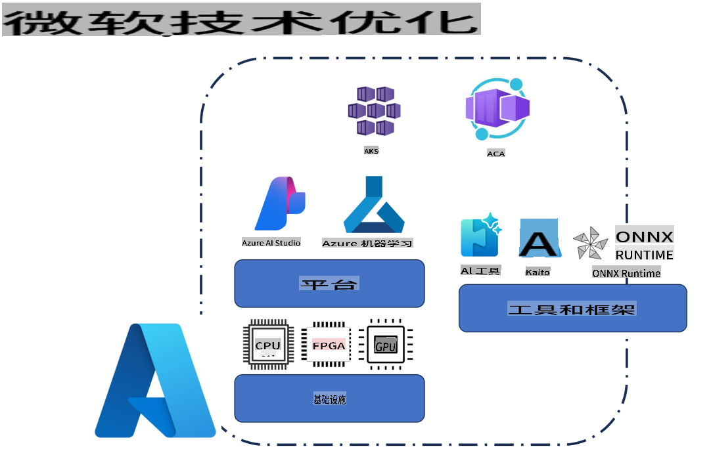
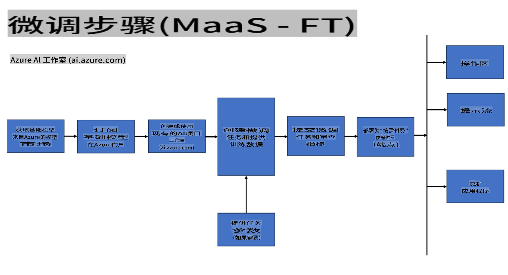
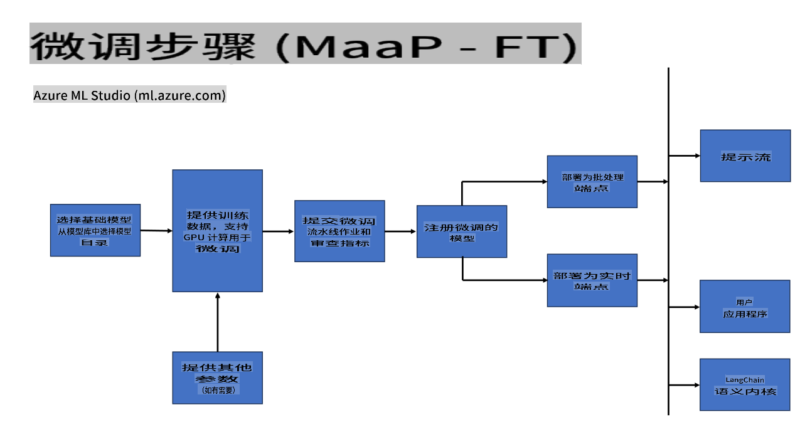
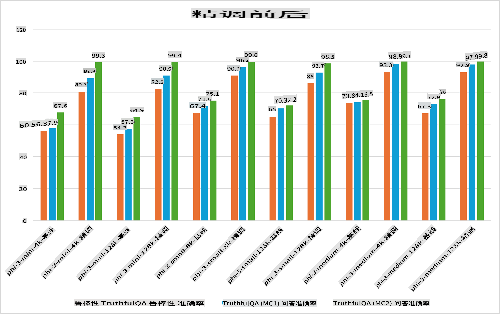

## 微调场景

**平台** 包括各种技术，如Azure AI Studio、Azure Machine Learning、AI Tools、Kaito和ONNX Runtime。

**基础设施** 包括CPU和FPGA，它们是微调过程中的关键部分。让我展示一下每种技术的图标。

**工具和框架** 包括ONNX Runtime和ONNX Runtime。让我展示一下每种技术的图标。
[插入ONNX Runtime和ONNX Runtime的图标]

使用微软技术进行微调涉及各种组件和工具。通过了解和利用这些技术，我们可以有效地微调我们的应用程序并创造更好的解决方案。

## 模型即服务

使用托管微调对模型进行微调，无需创建和管理计算资源。

无服务器微调适用于Phi-3-mini和Phi-3-medium模型，使开发者能够快速、轻松地为云和边缘场景定制模型，而无需安排计算资源。我们还宣布，Phi-3-small模型现在通过我们的模型即服务（Models-as-a-Service）提供，开发者可以快速、轻松地开始AI开发，而无需管理底层基础设施。

[微调示例](https://github.com/microsoft/Phi-3CookBook/blob/main/md/04.Fine-tuning/FineTuning_AIStudio.md)
## 模型即平台

用户管理自己的计算资源以微调他们的模型。

[微调示例](https://github.com/Azure/azureml-examples/blob/main/sdk/python/foundation-models/system/finetune/chat-completion/chat-completion.ipynb)

## 微调场景

| | | | | | | |
|-|-|-|-|-|-|-|
|场景|LoRA|QLoRA|PEFT|DeepSpeed|ZeRO|DORA|
|将预训练的LLM适应于特定任务或领域|是|是|是|是|是|是|
|用于NLP任务的微调，如文本分类、命名实体识别和机器翻译|是|是|是|是|是|是|
|用于QA任务的微调|是|是|是|是|是|是|
|用于生成聊天机器人中的人类对话的微调|是|是|是|是|是|是|
|用于生成音乐、艺术或其他形式创意的微调|是|是|是|是|是|是|
|减少计算和财务成本|是|是|否|是|是|否|
|减少内存使用|否|是|否|是|是|是|
|使用更少的参数进行高效微调|否|是|是|否|否|是|
|一种高效的内存数据并行形式，可以利用所有GPU设备的总GPU内存|否|否|否|是|是|是|

## 微调性能示例

免责声明：该翻译是由AI模型从原文翻译而来的，可能不够完美。请审阅输出并进行必要的修改。