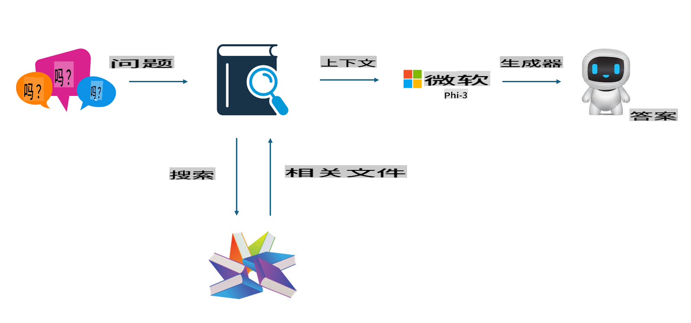

## 微调 vs RAG

## 检索增强生成

RAG 是数据检索加文本生成。企业的结构化数据和非结构化数据存储在向量数据库中。在搜索相关内容时，找到相关的摘要和内容形成上下文，并结合LLM/SLM的文本补全能力生成内容。

## RAG 过程

## 微调
微调是基于某个模型的改进。它不需要从模型算法开始，但需要不断积累数据。如果你希望在行业应用中有更精准的术语和语言表达，微调是更好的选择。但如果你的数据频繁变化，微调可能会变得复杂。

## 如何选择
如果我们的回答需要引入外部数据，RAG 是最佳选择。

如果你需要输出稳定且精准的行业知识，微调将是一个好选择。RAG 优先拉取相关内容，但可能无法始终把握住专业细微差别。

微调需要高质量的数据集，如果只是小范围的数据，效果不会有太大差异。RAG 更加灵活。
微调是一个黑箱，像玄学一样，内部机制难以理解。但 RAG 可以更容易找到数据来源，从而有效调整幻觉或内容错误，并提供更好的透明度。

**免责声明**：
本文档是使用基于机器的AI翻译服务翻译的。尽管我们努力确保准确性，但请注意，自动翻译可能包含错误或不准确之处。应将原始文档的本地语言版本视为权威来源。对于关键信息，建议进行专业的人类翻译。对于因使用此翻译而产生的任何误解或误释，我们不承担责任。