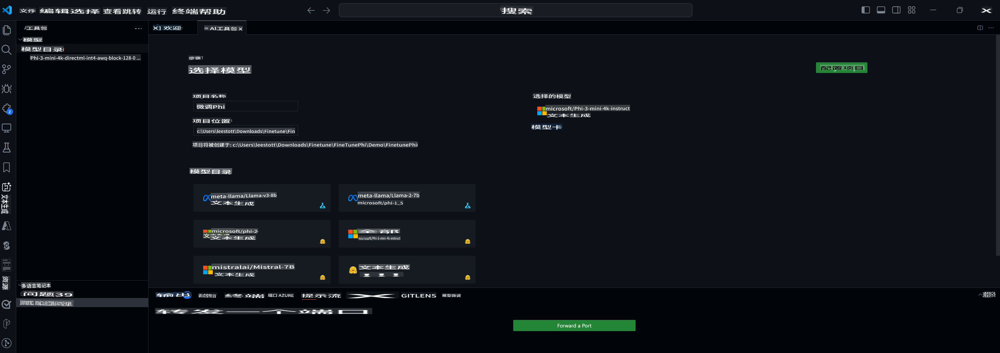

## 欢迎使用 VS Code 的 AI 工具包

[AI 工具包](https://github.com/microsoft/vscode-ai-toolkit/tree/main) 将来自 Azure AI Studio Catalog 和 Hugging Face 等目录的各种模型汇集在一起。该工具包通过以下方式简化了使用生成性 AI 工具和模型构建 AI 应用程序的常见开发任务：
- 开始使用模型发现和游乐场。
- 使用本地计算资源进行模型微调和推理。
- 使用 Azure 资源进行远程微调和推理。

[安装 AI 工具包](https://marketplace.visualstudio.com/items?itemName=ms-windows-ai-studio.windows-ai-studio)



**[私密预览]** 一键配置 Azure 容器应用以在云中运行模型微调和推理。

现在让我们开始您的 AI 应用开发：

- [本地开发](../../../../md/04.Fine-tuning)
    - [准备工作](../../../../md/04.Fine-tuning)
    - [激活 Conda](../../../../md/04.Fine-tuning)
    - [仅进行基础模型微调](../../../../md/04.Fine-tuning)
    - [模型微调和推理](../../../../md/04.Fine-tuning)
- [**[私密预览]** 远程开发](../../../../md/04.Fine-tuning)
    - [先决条件](../../../../md/04.Fine-tuning)
    - [设置远程开发项目](../../../../md/04.Fine-tuning)
    - [配置 Azure 资源](../../../../md/04.Fine-tuning)
    - [[可选] 向 Azure 容器应用密钥添加 Huggingface 令牌](../../../../md/04.Fine-tuning)
    - [运行微调](../../../../md/04.Fine-tuning)
    - [配置推理端点](../../../../md/04.Fine-tuning)
    - [部署推理端点](../../../../md/04.Fine-tuning)
    - [高级用法](../../../../md/04.Fine-tuning)

## 本地开发
### 准备工作

1. 确保在主机上安装了 NVIDIA 驱动程序。
2. 如果您使用 HF 进行数据集利用，请运行 `huggingface-cli login`。
3. `Olive` 键设置解释任何修改内存使用的内容。

### 激活 Conda
由于我们使用的是 WSL 环境并且是共享的，您需要手动激活 conda 环境。在此步骤之后，您可以运行微调或推理。

```bash
conda activate [conda-env-name] 
```

### 仅进行基础模型微调
如果只想尝试基础模型而不进行微调，可以在激活 conda 后运行此命令。

```bash
cd inference

# Web browser interface allows to adjust a few parameters like max new token length, temperature and so on.
# User has to manually open the link (e.g. http://0.0.0.0:7860) in a browser after gradio initiates the connections.
python gradio_chat.py --baseonly
```

### 模型微调和推理

一旦工作区在开发容器中打开，请打开终端（默认路径是项目根目录），然后运行以下命令在选定的数据集上微调 LLM。

```bash
python finetuning/invoke_olive.py 
```

检查点和最终模型将保存在 `models` folder.

Next run inferencing with the fune-tuned model through chats in a `console`, `web browser` or `prompt flow`。

```bash
cd inference

# Console interface.
python console_chat.py

# Web browser interface allows to adjust a few parameters like max new token length, temperature and so on.
# User has to manually open the link (e.g. http://127.0.0.1:7860) in a browser after gradio initiates the connections.
python gradio_chat.py
```

要使用 `prompt flow` in VS Code, please refer to this [Quick Start](https://microsoft.github.io/promptflow/how-to-guides/quick-start.html).

### Model Fine-tuning

Next, download the following model depending on the availability of a GPU on your device.

To initiate the local fine-tuning session using QLoRA, select a model you want to fine-tune from our catalog.
| Platform(s) | GPU available | Model name | Size (GB) |
|---------|---------|--------|--------|
| Windows | Yes | Phi-3-mini-4k-**directml**-int4-awq-block-128-onnx | 2.13GB |
| Linux | Yes | Phi-3-mini-4k-**cuda**-int4-onnx | 2.30GB |
| Windows<br>Linux | No | Phi-3-mini-4k-**cpu**-int4-rtn-block-32-acc-level-4-onnx | 2.72GB |

**_Note_** You do not need an Azure Account to download the models

The Phi3-mini (int4) model is approximately 2GB-3GB in size. Depending on your network speed, it could take a few minutes to download.

Start by selecting a project name and location.
Next, select a model from the model catalog. You will be prompted to download the project template. You can then click "Configure Project" to adjust various settings.

### Microsoft Olive 

We use [Olive](https://microsoft.github.io/Olive/why-olive.html) to run QLoRA fine-tuning on a PyTorch model from our catalog. All of the settings are preset with the default values to optimize to run the fine-tuning process locally with optimized use of memory, but it can be adjusted for your scenario.

### Fine Tuning Samples and Resoures

- [Fine tuning Getting Started Guide](https://learn.microsoft.com/windows/ai/toolkit/toolkit-fine-tune)
- [Fine tuning with a HuggingFace Dataset](https://github.com/microsoft/vscode-ai-toolkit/blob/main/archive/walkthrough-hf-dataset.md)
- [Fine tuning with Simple DataSet](https://github.com/microsoft/vscode-ai-toolkit/blob/main/archive/walkthrough-simple-dataset.md)

## **[Private Preview]** Remote Development

### Prerequisites

1. To run the model fine-tuning in your remote Azure Container App Environment, make sure your subscription has enough GPU capacity. Submit a [support ticket](https://azure.microsoft.com/support/create-ticket/) to request the required capacity for your application. [Get More Info about GPU capacity](https://learn.microsoft.com/azure/container-apps/workload-profiles-overview)
2. If you are using private dataset on HuggingFace, make sure you have a [HuggingFace account](https://huggingface.co/) and [generate an access token](https://huggingface.co/docs/hub/security-tokens)
3. Enable Remote Fine-tuning and Inference feature flag in the AI Toolkit for VS Code
   1. Open the VS Code Settings by selecting *File -> Preferences -> Settings*.
   2. Navigate to *Extensions* and select *AI Toolkit*.
   3. Select the *"Enable Remote Fine-tuning And Inference"* option.
   4. Reload VS Code to take effect.

- [Remote Fine tuning](https://github.com/microsoft/vscode-ai-toolkit/blob/main/archive/remote-finetuning.md)

### Setting Up a Remote Development Project
1. Execute the command palette `AI Toolkit: Focus on Resource View`.
2. Navigate to *Model Fine-tuning* to access the model catalog. Assign a name to your project and select its location on your machine. Then, hit the *"Configure Project"* button.
3. Project Configuration
    1. Avoid enabling the *"Fine-tune locally"* option.
    2. The Olive configuration settings will appear with pre-set default values. Please adjust and fill in these configurations as required.
    3. Move on to *Generate Project*. This stage leverages WSL and involves setting up a new Conda environment, preparing for future updates that include Dev Containers.
4. Click on *"Relaunch Window In Workspace"* to open your remote development project.

> **Note:** The project currently works either locally or remotely within the AI Toolkit for VS Code. If you choose *"Fine-tune locally"* during project creation, it will operate exclusively in WSL without remote development capabilities. On the other hand, if you forego enabling *"Fine-tune locally"*, the project will be restricted to the remote Azure Container App environment.

### Provision Azure Resources
To get started, you need to provision the Azure Resource for remote fine-tuning. Do this by running the `AI Toolkit: Provision Azure Container Apps job for fine-tuning` from the command palette.

Monitor the progress of the provision through the link displayed in the output channel.

### [Optional] Add Huggingface Token to the Azure Container App Secret
If you're using private HuggingFace dataset, set your HuggingFace token as an environment variable to avoid the need for manual login on the Hugging Face Hub.
You can do this using the `AI Toolkit: Add Azure Container Apps Job secret for fine-tuning command`. With this command, you can set the secret name as [`HF_TOKEN`](https://huggingface.co/docs/huggingface_hub/package_reference/environment_variables#hftoken) and use your Hugging Face token as the secret value.

### Run Fine-tuning
To start the remote fine-tuning job, execute the `AI Toolkit: Run fine-tuning` command.

To view the system and console logs, you can visit the Azure portal using the link in the output panel (more steps at [View and Query Logs on Azure](https://aka.ms/ai-toolkit/remote-provision#view-and-query-logs-on-azure)). Or, you can view the console logs directly in the VSCode output panel by running the command `AI Toolkit: Show the running fine-tuning job streaming logs`. 
> **Note:** The job might be queued due to insufficient resources. If the log is not displayed, execute the `AI Toolkit: Show the running fine-tuning job streaming logs` command, wait for a while and then execute the command again to re-connect to the streaming log.

During this process, QLoRA will be used for fine-tuning, and will create LoRA adapters for the model to use during inference.
The results of the fine-tuning will be stored in the Azure Files.

### Provision Inference Endpoint
After the adapters are trained in the remote environment, use a simple Gradio application to interact with the model.
Similar to the fine-tuning process, you need to set up the Azure Resources for remote inference by executing the `AI Toolkit: Provision Azure Container Apps for inference` from the command palette.

By default, the subscription and the resource group for inference should match those used for fine-tuning. The inference will use the same Azure Container App Environment and access the model and model adapter stored in Azure Files, which were generated during the fine-tuning step. 


### Deploy the Inference Endpoint
If you wish to revise the inference code or reload the inference model, please execute the `AI Toolkit: Deploy for inference` command. This will synchronize your latest code with Azure Container App and restart the replica.  

Once deployment is successfully completed, you can access the inference API by clicking on the "*Go to Inference Endpoint*" button displayed in the VSCode notification. Or, the web API endpoint can be found under `ACA_APP_ENDPOINT` in `./infra/inference.config.json` 和输出面板中。您现在可以使用此端点评估模型。

### 高级用法
有关使用 AI 工具包进行远程开发的更多信息，请参阅 [远程微调模型](https://aka.ms/ai-toolkit/remote-provision) 和 [使用微调模型进行推理](https://aka.ms/ai-toolkit/remote-inference) 文档。

**免责声明**:
本文件使用基于机器的AI翻译服务进行翻译。尽管我们力求准确，但请注意，自动翻译可能包含错误或不准确之处。应将原始语言的文件视为权威来源。对于关键信息，建议使用专业人工翻译。对于因使用本翻译而产生的任何误解或误读，我们概不负责。