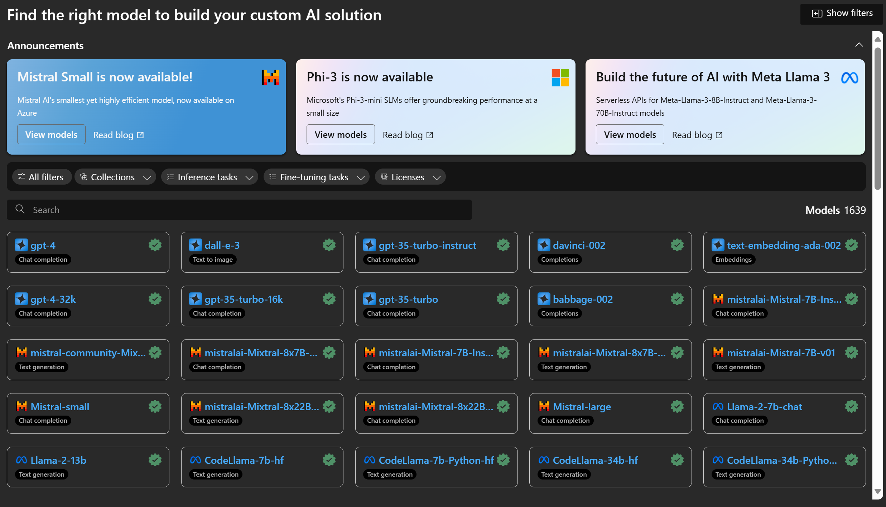
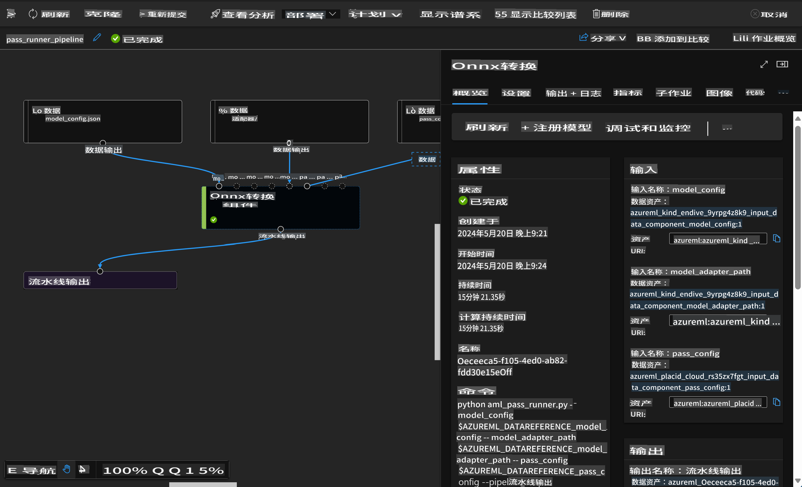

# **介绍 Azure 机器学习服务**

[Azure 机器学习](https://ml.azure.com?WT.mc_id=aiml-138114-kinfeylo) 是一个加速和管理机器学习 (ML) 项目生命周期的云服务。

ML 专业人士、数据科学家和工程师可以在日常工作流程中使用它来：

- 训练和部署模型。
管理机器学习操作 (MLOps)。
- 你可以在 Azure 机器学习中创建模型，或使用从开源平台（如 PyTorch、TensorFlow 或 scikit-learn）构建的模型。
- MLOps 工具帮助你监控、重新训练和重新部署模型。

## Azure 机器学习适合谁？

**数据科学家和 ML 工程师**

他们可以使用工具来加速和自动化日常工作流程。
Azure ML 提供了公平性、可解释性、跟踪和可审计性的功能。
应用开发者：
他们可以无缝地将模型集成到应用程序或服务中。

**平台开发者**

他们可以访问由持久的 Azure 资源管理器 API 支持的一整套强大工具。
这些工具允许构建高级 ML 工具。

**企业**

在 Microsoft Azure 云中工作，企业受益于熟悉的安全性和基于角色的访问控制。
设置项目以控制对受保护数据和特定操作的访问。

## 提高团队每个人的生产力
ML 项目通常需要一个具有各种技能的团队来构建和维护。

Azure ML 提供的工具使你能够：
- 通过共享笔记本、计算资源、无服务器计算、数据和环境与团队协作。
- 开发具有公平性、可解释性、跟踪和可审计性的模型，以满足谱系和审计合规要求。
- 快速轻松地大规模部署 ML 模型，并使用 MLOps 高效地管理和治理它们。
- 通过内置的治理、安全性和合规性在任何地方运行机器学习工作负载。

## 跨平台兼容的工具

ML 团队中的任何人都可以使用他们喜欢的工具来完成工作。
无论你是在进行快速实验、超参数调优、构建流水线还是管理推理，你都可以使用熟悉的界面，包括：
- Azure 机器学习工作室
- Python SDK (v2)
- Azure CLI (v2)
- Azure 资源管理器 REST API

在你精炼模型并在开发周期中协作时，可以在 Azure 机器学习工作室 UI 中共享和查找资产、资源和指标。

## **Azure ML 中的 LLM/SLM**

Azure ML 添加了许多与 LLM/SLM 相关的功能，结合 LLMOps 和 SLMOps 创建了一个企业级生成性人工智能技术平台。

### **模型目录**

企业用户可以通过模型目录根据不同的业务场景部署不同的模型，并作为模型即服务为企业开发者或用户提供访问服务。

Azure 机器学习工作室中的模型目录是发现和使用各种模型的中心，能够帮助你构建生成性 AI 应用程序。模型目录包含数百个模型，涵盖 Azure OpenAI 服务、Mistral、Meta、Cohere、Nvidia、Hugging Face 等模型提供商的模型，包括微软训练的模型。非微软提供商的模型被定义为微软产品条款中的非微软产品，并受模型附带条款的约束。

### **作业流水线**

机器学习流水线的核心是将一个完整的机器学习任务分解为多步骤工作流。每个步骤是一个可管理的组件，可以单独开发、优化、配置和自动化。步骤通过定义良好的接口连接。Azure 机器学习流水线服务自动协调流水线步骤之间的所有依赖关系。

在微调 SLM / LLM 时，我们可以通过流水线管理数据、训练和生成过程。

### **提示流**

使用 Azure 机器学习提示流的好处
Azure 机器学习提示流提供了一系列好处，帮助用户从构想到实验，再到最终的生产就绪 LLM 应用程序：

**提示工程的灵活性**

交互式创作体验：Azure 机器学习提示流提供了流结构的可视化表示，使用户可以轻松理解和导航他们的项目。它还提供了类似笔记本的编码体验，以便高效地开发和调试流。
提示调优的变体：用户可以创建和比较多个提示变体，促进迭代优化过程。

评估：内置的评估流程使用户能够评估提示和流的质量和效果。

全面的资源：Azure 机器学习提示流包含一个内置工具、示例和模板库，为开发提供了起点，激发创造力并加速过程。

**LLM 应用程序的企业就绪性**

协作：Azure 机器学习提示流支持团队协作，允许多个用户共同参与提示工程项目，分享知识并维护版本控制。

一体化平台：Azure 机器学习提示流简化了整个提示工程过程，从开发和评估到部署和监控。用户可以轻松地将他们的流部署为 Azure 机器学习端点，并实时监控其性能，确保最佳操作和持续改进。

Azure 机器学习企业就绪解决方案：提示流利用 Azure 机器学习的强大企业就绪解决方案，提供一个安全、可扩展和可靠的基础，用于流的开发、实验和部署。

通过 Azure 机器学习提示流，用户可以释放他们的提示工程灵活性，有效协作，并利用企业级解决方案成功开发和部署基于 LLM 的应用程序。

结合 Azure ML 的计算能力、数据和不同组件，企业开发者可以轻松构建自己的人工智能应用程序。

**免责声明**:
本文档使用基于机器的人工智能翻译服务进行翻译。尽管我们力求准确，但请注意，自动翻译可能包含错误或不准确之处。应将原文档的本国语言版本视为权威来源。对于关键信息，建议使用专业人工翻译。对于因使用本翻译而产生的任何误解或误读，我们不承担责任。