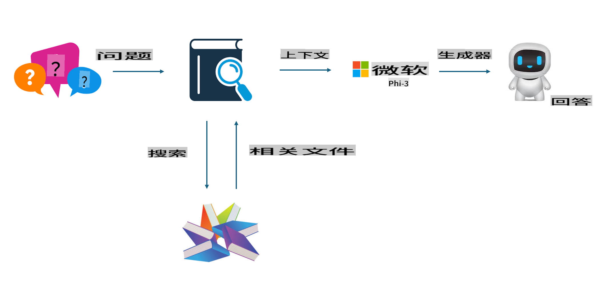
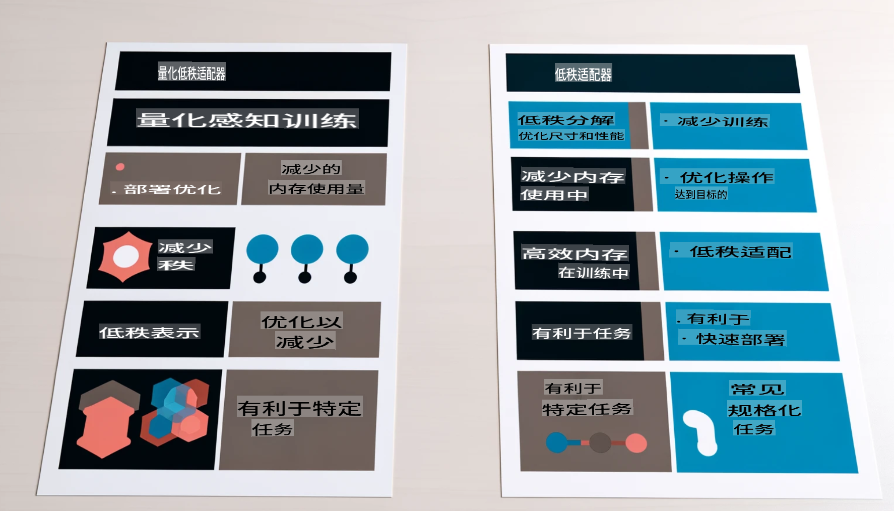

# **让Phi-3成为行业专家**

要将Phi-3模型应用于行业中，需要将行业业务数据添加到Phi-3模型中。我们有两种不同的选择，第一种是RAG（检索增强生成），第二种是微调。

## **RAG vs 微调**

### **检索增强生成**

RAG是数据检索+文本生成。企业的结构化数据和非结构化数据存储在向量数据库中。当搜索相关内容时，会找到相关的摘要和内容形成上下文，并结合LLM/SLM的文本补全能力生成内容。

### **微调**

微调是基于某个模型的改进。它不需要从模型算法开始，但需要不断积累数据。如果你在行业应用中需要更精确的术语和语言表达，微调是更好的选择。但如果你的数据频繁变化，微调可能会变得复杂。

### **如何选择**

1. 如果我们的答案需要引入外部数据，RAG是最佳选择

2. 如果你需要输出稳定且精确的行业知识，微调将是一个不错的选择。RAG优先拉取相关内容，但可能无法始终把握专业细微差别。

3. 微调需要高质量的数据集，如果只是小范围的数据，不会有太大差别。RAG更灵活

4. 微调是一个黑箱，是一种玄学，很难理解其内部机制。但RAG可以更容易找到数据来源，从而有效调整幻觉或内容错误，提供更好的透明度。

### **应用场景**

1. 垂直行业需要特定的专业词汇和表达，***微调*** 将是最佳选择

2. 问答系统，涉及不同知识点的综合，***RAG*** 将是最佳选择

3. 自动化业务流程的结合 ***RAG + 微调*** 是最佳选择

## **如何使用RAG**

向量数据库是以数学形式存储的数据集合。向量数据库使机器学习模型更容易记住之前的输入，使机器学习能够用于支持搜索、推荐和文本生成等用例。数据可以基于相似性指标而非精确匹配进行识别，从而使计算机模型能够理解数据的上下文。

向量数据库是实现RAG的关键。我们可以通过诸如text-embedding-3、jina-ai-embedding等向量模型将数据转换为向量存储。

了解更多关于创建RAG应用程序的信息 [https://github.com/microsoft/Phi-3CookBook](https://github.com/microsoft/Phi-3CookBook?WT.mc_id=aiml-138114-kinfeylo)

## **如何使用微调**

微调中常用的算法是Lora和QLora。如何选择？
- [通过此示例笔记本了解更多](../../../../code/04.Finetuning/Phi_3_Inference_Finetuning.ipynb)
- [Python微调示例](../../../../code/04.Finetuning/FineTrainingScript.py)

### **Lora 和 QLora**

LoRA（低秩适应）和QLoRA（量化低秩适应）都是使用参数高效微调（PEFT）来微调大语言模型（LLMs）的技术。PEFT技术旨在比传统方法更高效地训练模型。LoRA是一种独立的微调技术，通过对权重更新矩阵应用低秩近似来减少内存占用。它提供快速的训练时间，并保持接近传统微调方法的性能。

QLoRA是LoRA的扩展版本，结合了量化技术以进一步减少内存使用。QLoRA将预训练LLM的权重参数量化为4位精度，比LoRA更节省内存。然而，由于额外的量化和反量化步骤，QLoRA的训练速度比LoRA慢约30%。

QLoRA使用LoRA作为辅助工具来修正量化过程中引入的错误。QLoRA使得可以在相对较小且高度可用的GPU上微调具有数十亿参数的庞大模型。例如，QLoRA可以在只需要2个GPU的情况下微调需要36个GPU的70B参数模型。

免责声明：此翻译由AI模型从原文翻译而来，可能并不完美。请审核输出并进行必要的修改。