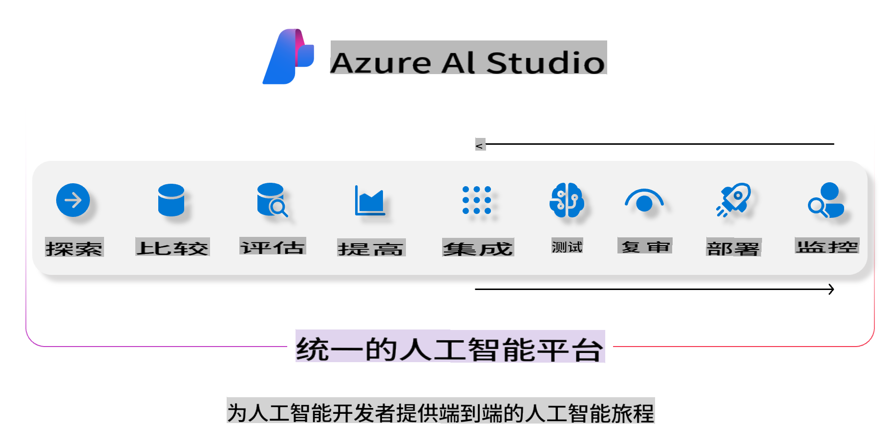
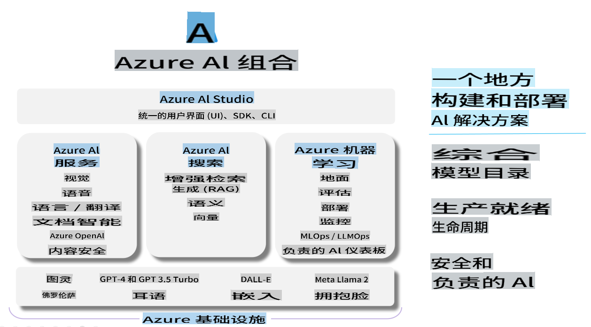

# **使用 Azure AI Foundry 进行评估**

如何使用 [Azure AI Foundry](https://ai.azure.com?WT.mc_id=aiml-138114-kinfeylo) 评估你的生成式 AI 应用程序。无论你是在评估单轮还是多轮对话，Azure AI Foundry 都提供了评估模型性能和安全性的工具。

## 如何使用 Azure AI Foundry 评估生成式 AI 应用程序
更多详细说明请参阅 [Azure AI Foundry 文档](https://learn.microsoft.com/azure/ai-studio/how-to/evaluate-generative-ai-app?WT.mc_id=aiml-138114-kinfeylo)

以下是开始的步骤：

## 在 Azure AI Foundry 中评估生成式 AI 模型

**先决条件**

- 一个 CSV 或 JSON 格式的测试数据集。
- 部署好的生成式 AI 模型（如 Phi-3, GPT 3.5, GPT 4 或 Davinci 模型）。
- 一个具有计算实例的运行时环境以运行评估。

## 内置评估指标

Azure AI Foundry 允许你评估单轮和复杂的多轮对话。
对于基于特定数据的检索增强生成 (RAG) 场景，可以使用内置评估指标来评估性能。
此外，你还可以评估一般的单轮问答场景（非 RAG）。

## 创建评估运行

从 Azure AI Foundry 界面，导航到评估页面或提示流页面。
按照评估创建向导设置评估运行。可以为你的评估提供一个可选的名称。
选择与你的应用程序目标一致的场景。
选择一个或多个评估指标来评估模型的输出。

## 自定义评估流程（可选）

为了更大的灵活性，你可以建立一个自定义评估流程。根据你的具体需求定制评估过程。

## 查看结果

在运行评估后，可以在 Azure AI Foundry 中记录、查看和分析详细的评估指标。深入了解你的应用程序的能力和局限性。

**Note** Azure AI Foundry 目前处于公开预览阶段，因此可用于实验和开发目的。对于生产工作负载，请考虑其他选项。探索官方的 [AI Foundry 文档](https://learn.microsoft.com/azure/ai-studio/?WT.mc_id=aiml-138114-kinfeylo) 以获取更多详细信息和分步说明。

**免责声明**：
本文件使用基于机器的AI翻译服务进行翻译。尽管我们努力确保准确性，但请注意，自动翻译可能包含错误或不准确之处。应将原始语言的文件视为权威来源。对于关键信息，建议进行专业的人类翻译。对于因使用本翻译而引起的任何误解或误读，我们不承担责任。